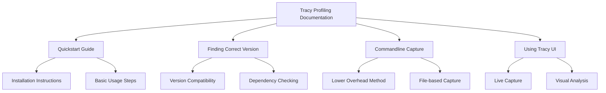

+++
title = "#21565 Improve Tracy profiling docs (quickstart, split into sections)"
date = "2025-10-16T00:00:00"
draft = false
template = "pull_request_page.html"
in_search_index = true

[taxonomies]
list_display = ["show"]

[extra]
current_language = "en"
available_languages = {"en" = { name = "English", url = "/pull_request/bevy/2025-10/pr-21565-en-20251016" }, "zh-cn" = { name = "中文", url = "/pull_request/bevy/2025-10/pr-21565-zh-cn-20251016" }}
labels = ["C-Docs", "A-Diagnostics", "D-Straightforward"]
+++

# Improve Tracy profiling docs (quickstart, split into sections)

## Basic Information
- **Title**: Improve Tracy profiling docs (quickstart, split into sections)
- **PR Link**: https://github.com/bevyengine/bevy/pull/21565
- **Author**: laundmo
- **Status**: MERGED
- **Labels**: C-Docs, S-Ready-For-Final-Review, A-Diagnostics, X-Uncontroversial, D-Straightforward
- **Created**: 2025-10-16T21:08:37Z
- **Merged**: 2025-10-16T22:14:15Z
- **Merged By**: mockersf

## Description Translation
# Objective

The Tracy profiling docs were confusing and overwhelming to some for a number of reasons:
- only mentioning that you can capture through the UI in a single sentence quite a bit down
- interspersed installation, version-matching and usage instructions
- lack of clear steps
- lack of separation between topics

## Solution

I've added a Quickstart which guides people through using the Tracy UI to capture, including some more installation instructions for various platforms (unofficial macos/linux binary builds, link to repology packages list).

Additionally, I've created the following sub-titles (sub-headers?)
- `Finding the correct tracy version`
- `Commandline capture (less overhead)`, which is where most of the previous instructions ended up
- `Using the Tracy UI`, for the basic usage guide with screenshots

Rendered version: https://github.com/laundmo/bevy/blob/improve-tracy-profiling-docs/docs/profiling.md#tracy-profiler

## The Story of This Pull Request

This pull request addresses a common documentation problem in technical projects: when documentation becomes a dense wall of text with mixed concerns, it becomes difficult for new users to get started quickly. The existing Tracy profiling documentation had several structural issues that made it challenging for developers to understand and use the profiling tools effectively.

The core problem was that installation instructions, version management, and usage patterns were all interleaved without clear separation. Users had to read through multiple paragraphs to understand basic setup, and the most straightforward workflow - using the Tracy UI for live capture - was buried deep in the documentation. This created unnecessary friction for developers trying to profile their Bevy applications.

The solution approach was straightforward but effective: restructure the documentation with clear section boundaries and add a quickstart guide. The author identified that most users need immediate guidance on getting started, followed by more detailed information about advanced use cases. The new structure separates concerns logically:

1. **Quickstart** for immediate setup and basic usage
2. **Version matching** for compatibility concerns  
3. **Commandline capture** for advanced users needing lower overhead
4. **UI usage** for the standard workflow

The implementation focuses on practical improvements that directly address the identified pain points. The quickstart section provides step-by-step instructions with platform-specific installation guidance, including links to both official Windows binaries and third-party builds for macOS and Linux. This immediately solves the problem of users not knowing where to get the right Tracy version for their system.

Key technical decisions in this restructuring include:

- Placing the quickstart first, since most users want to get profiling quickly
- Separating version matching into its own section to handle compatibility concerns explicitly
- Distinguishing between commandline capture (lower overhead) and UI capture (more interactive)
- Maintaining all existing technical content while reorganizing it for better flow

The documentation improvements also include practical engineering advice, such as recommending `--release` builds for profiling since profiling unoptimized code provides limited value. The author also clarifies the trade-off with memory tracking features - while useful, they come with increased runtime overhead.

One notable improvement is the clarification of executable names across platforms. The original documentation had platform-specific executable names (`capture-release` on Linux, `tracy` on macOS, `capture.exe` on Windows), which could be confusing. The updated documentation standardizes on `tracy-capture` as the default executable name for prebuilt binaries, while noting that this may vary by installation method.

The impact of these changes is significant for developer experience. By providing clear, step-by-step instructions and separating concerns, the documentation now serves both beginners who need quick setup and advanced users who require detailed information about specific workflows. The rendered version shows a much more approachable and usable documentation structure that will help developers integrate profiling into their workflow more effectively.

## Visual Representation



## Key Files Changed

### `docs/profiling.md` (+27/-10)

This file received a comprehensive restructuring of the Tracy profiling section. The changes transform a dense, mixed-content section into a well-organized guide with clear separation of concerns.

**Key structural changes:**
- Added new section headers for better organization
- Created a quickstart guide for immediate usability
- Separated version matching instructions from usage instructions
- Clarified the difference between commandline and UI capture methods

**Before the changes, the Tracy section was structured as:**
```markdown
## Tracy profiler

There are binaries available for Windows, and installation / build instructions for other operating systems can be found in the [Tracy documentation PDF](https://github.com/wolfpld/tracy/releases/latest/download/tracy.pdf).

To determine which Tracy version to install

1. Run `cargo tree --features bevy/trace_tracy | grep tracy` in your Bevy workspace root to see which tracy dep versions are used
2. Cross reference the tracy dep versions with the [Version Support Table](https://github.com/nagisa/rust_tracy_client?tab=readme-ov-file#version-support-table)

It has a command line capture tool that can record the execution of graphical applications...
```

**After the changes, the structure is:**
```markdown
## Tracy profiler
- [Tracy Quickstart](#tracy-quickstart)
- [Finding the correct Tracy version](#finding-the-correct-tracy-version)  
- [Commandline capture](#commandline-capture-less-overhead)
- [Using the Tracy UI](#using-the-tracy-ui)

#### Tracy Quickstart

1. Install the [correct Tracy version](#finding-the-correct-tracy-version) (0.12.2 for Bevy 0.17)
    - [Windows binaries (official)](https://github.com/wolfpld/tracy/releases)
    - [Macos and Linux binaries (third-party builds)](https://github.com/tracy-builds/tracy-builds/releases)
    - [Packages](https://repology.org/project/tracy/versions)
2. Start the Tracy UI (called `tracy-profiler` in prebuilt binaries)
3. In the Tracy UI, click `connect` to wait for a connection.
   - Starting the Tracy UI first and letting it wait for connection ensures it doesn't have to catch up
4. Run your bevy app with `--features bevy/trace_tracy --release`
   - `--release` as theres little point to profiling unoptimized code
   - You can capture memory usage as well with `--features bevy/trace_tracy_memory`, at the cost of increased overhead.

#### Finding the correct Tracy version
[Version matching instructions...]

#### Commandline capture (less overhead)
[Commandline capture instructions...]

#### Using the Tracy UI
[UI usage instructions with screenshot...]
```

The changes maintain all existing technical content while making it more accessible through better organization and the addition of practical installation resources for different platforms.

## Further Reading

- [Tracy Profiler Official Documentation](https://github.com/wolfpld/tracy) - The main Tracy repository with detailed technical documentation
- [rust_tracy_client Version Support Table](https://github.com/nagisa/rust_tracy_client?tab=readme-ov-file#version-support-table) - Compatibility information between Rust client and Tracy versions
- [Repology Tracy Packages](https://repology.org/project/tracy/versions) - Useful for finding Tracy packages across different Linux distributions
- [Bevy Profiling Documentation](https://bevyengine.org/learn/advanced-topics/profiling/) - General profiling concepts in Bevy engine