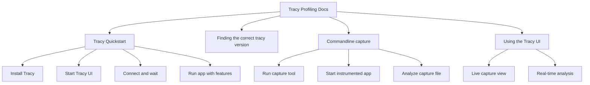

+++
title = "#21565 Improve Tracy profiling docs (quickstart, split into sections)"
date = "2025-10-16T00:00:00"
draft = false
template = "pull_request_page.html"
in_search_index = false

[extra]
current_language = "zh-cn"
available_languages = {"en" = { name = "English", url = "/pull_request/bevy/2025-10/pr-21565-en-20251016" }, "zh-cn" = { name = "中文", url = "/pull_request/bevy/2025-10/pr-21565-zh-cn-20251016" }}
labels = ["C-Docs", "A-Diagnostics", "D-Straightforward"]
+++

# Improve Tracy profiling docs (quickstart, split into sections)

## Basic Information
- **Title**: Improve Tracy profiling docs (quickstart, split into sections)
- **PR Link**: https://github.com/bevyengine/bevy/pull/21565
- **Author**: laundmo
- **Status**: MERGED
- **Labels**: C-Docs, S-Ready-For-Final-Review, A-Diagnostics, X-Uncontroversial, D-Straightforward
- **Created**: 2025-10-16T21:08:37Z
- **Merged**: 2025-10-16T22:14:15Z
- **Merged By**: mockersf

## Description Translation
# 目标

Tracy性能分析文档由于以下几个原因对某些用户来说显得混乱和令人不知所措：
- 仅在文档较下方用一句话提到可以通过UI进行捕获
- 安装、版本匹配和使用说明混杂在一起
- 缺乏清晰的步骤说明
- 主题之间缺乏明确区分

## 解决方案

我添加了一个快速开始指南，指导用户使用Tracy UI进行捕获，包括为各种平台提供更多安装说明（非官方的macos/linux二进制构建，链接到repology软件包列表）。

此外，我创建了以下子标题：
- `找到正确的tracy版本`
- `命令行捕获（较低开销）`，这里包含了之前的大部分说明
- `使用Tracy UI`，包含带截图的基本使用指南

渲染版本：https://github.com/laundmo/bevy/blob/improve-tracy-profiling-docs/docs/profiling.md#tracy-profiler

## The Story of This Pull Request

这个PR解决了一个典型的文档可读性问题。原来的Tracy性能分析文档将所有信息混杂在一起，导致新用户难以快速上手。开发者laundmo识别出几个关键问题：缺乏清晰的入门指引、安装和使用说明混杂、步骤不明确，以及不同主题之间没有清晰的划分。

**问题分析**

原来的文档结构存在明显的可用性问题。用户需要阅读大量文本才能找到关键的操作步骤，特别是对于想要快速开始使用Tracy UI进行实时性能分析的用户。文档中关于UI捕获的重要信息被埋没在大量技术细节中，这违反了文档设计的"渐进式披露"原则。

**解决方案架构**

开发者采用了系统性的文档重构方法，将内容重新组织为逻辑清晰的结构：

首先，新增了"Tracy Quickstart"部分，提供直接的入门指导。这个部分遵循了标准的用户流程：安装→启动→连接→运行应用。这种结构化的步骤减少了用户的认知负担。

其次，文档被重新组织为三个明确的子部分：
- "Finding the correct tracy version" - 专注于版本匹配的技术细节
- "Commandline capture (less overhead)" - 针对需要精确测量的高级用户
- "Using the Tracy UI" - 为大多数用户提供直观的实时分析指导

**技术实现细节**

文档重构体现了几个重要的技术文档原则：

1. **任务导向设计**：快速开始部分直接回答"我该如何开始使用Tracy"这个最常见的问题。

2. **渐进式复杂度**：从最简单的UI使用开始，逐步深入到更复杂的命令行捕获方法。

3. **平台兼容性考虑**：提供了Windows官方二进制文件、macOS/Linux第三方构建以及各种软件包管理器的链接，覆盖了不同用户的环境。

4. **性能指导**：明确建议在release模式下进行分析（"`--release` as theres little point to profiling unoptimized code"），这是性能分析的重要最佳实践。

**关键改进点**

文档现在明确区分了两种使用模式：
- 实时UI捕获：适合交互式分析和调试
- 命令行捕获：适合需要最小开销的精确性能测量

这种区分很重要，因为两种方法有不同的适用场景和性能特征。命令行捕获减少了图形应用程序之间的竞争，提供更准确的结果，而UI捕获提供了实时反馈。

**工程影响**

虽然这只是文档改进，但它显著降低了用户使用Tracy进行性能分析的门槛。清晰的文档结构意味着：
- 新用户可以更快开始性能分析工作
- 减少了用户在社区中寻求帮助的需求
- 提高了Bevy性能分析工具的整体可用性

这种改进体现了良好的开发者体验(Developer Experience)设计原则，通过优化文档来提升整个工具链的使用效率。

## Visual Representation



## Key Files Changed

**docs/profiling.md** (+27/-10)

这个文件包含了所有的文档改进。主要变化包括：

1. **新增快速开始部分**：提供了直接的入门指导
```markdown
#### Tracy Quickstart

1. Install the [correct Tracy version](#finding-the-correct-tracy-version) (0.12.2 for Bevy 0.17)
    - [Windows binaries (official)](https://github.com/wolfpld/tracy/releases)
    - [Macos and Linux binaries (third-party builds)](https://github.com/tracy-builds/tracy-builds/releases)
    - [Packages](https://repology.org/project/tracy/versions)
2. Start the Tracy UI (called `tracy-profiler` in prebuilt binaries)
3. In the Tracy UI, click `connect` to wait for a connection.
   - Starting the Tracy UI first and letting it wait for connection ensures it doesn't have to catch up
4. Run your bevy app with `--features bevy/trace_tracy --release`
   - `--release` as theres little point to profiling unoptimized code
   - You can capture memory usage as well with `--features bevy/trace_tracy_memory`, at the cost of increased overhead.
```

2. **重新组织现有内容**：将原来的混杂内容分解到清晰的子章节中
```markdown
#### Finding the correct Tracy version

To determine which Tracy version to install

1. Run `cargo tree --features bevy/trace_tracy | grep tracy` in your Bevy workspace root to see which tracy dep versions are used
2. Cross reference the tracy dep versions with the [Version Support Table](https://github.com/nagisa/rust_tracy_client?tab=readme-ov-file#version-support-table)

#### Commandline capture (less overhead)

Tracy has a command line capture tool that can record the execution of graphical applications, saving it as a profile file. This reduces potential inaccuracies, as running the live capture on the same machine will be a competing graphical application. Pre-recording the profile data through the CLI tool, while other applications are closed, is recommended for more accurate traces.
```

3. **改进命令行工具说明**：统一了不同平台的可执行文件名称
```markdown
> [!NOTE]
> The name and location of the Tracy command line tool will vary depending on how you installed it - the default executable name for the prebuilt binaries is `tracy-capture`.

In a terminal, run:
`./tracy-capture -o my_capture.tracy`
```

这些变化共同创建了一个更清晰、更有组织的文档结构，使用户能够根据他们的具体需求快速找到相关信息。

## Further Reading

- [Tracy Profiler Official Documentation](https://github.com/wolfpld/tracy) - Tracy项目的官方GitHub仓库和文档
- [rust_tracy_client Version Support Table](https://github.com/nagisa/rust_tracy_client?tab=readme-ov-file#version-support-table) - Rust Tracy客户端版本兼容性信息
- [Repology Tracy Packages](https://repology.org/project/tracy/versions) - 各种Linux发行版中Tracy的软件包信息
- [Bevy Performance Profiling Guide](https://bevy-cheatbook.github.io/performance/profiling.html) - Bevy性能分析的综合指南