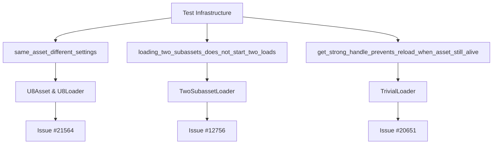

+++
title = "#21566 Add tests to document three separate asset issues."
date = "2025-10-17T00:00:00"
draft = false
template = "pull_request_page.html"
in_search_index = true

[taxonomies]
list_display = ["show"]

[extra]
current_language = "en"
available_languages = {"en" = { name = "English", url = "/pull_request/bevy/2025-10/pr-21566-en-20251017" }, "zh-cn" = { name = "中文", url = "/pull_request/bevy/2025-10/pr-21566-zh-cn-20251017" }}
labels = ["A-Assets", "C-Testing", "D-Straightforward"]
+++

# Title
Add tests to document three separate asset issues

## Basic Information
- **Title**: Add tests to document three separate asset issues.
- **PR Link**: https://github.com/bevyengine/bevy/pull/21566
- **Author**: andriyDev
- **Status**: MERGED
- **Labels**: A-Assets, S-Ready-For-Final-Review, C-Testing, D-Straightforward
- **Created**: 2025-10-16T21:11:01Z
- **Merged**: 2025-10-17T00:41:17Z
- **Merged By**: alice-i-cecile

## Description Translation
# Objective

- Add tests "showing off" the problems with #20651, #12756, and #21564.

## Solution

- Added some tests!

## Testing

- Yes

## The Story of This Pull Request

This PR addresses a common problem in software development: documenting known bugs with failing tests. Rather than fixing the underlying issues, the developer created three comprehensive test cases that reproduce specific asset system problems, serving as both documentation and validation targets for future fixes.

The developer identified three distinct asset-related issues that needed proper test coverage:

1. **Issue #21564**: The asset system fails to distinguish between the same asset loaded with different loader settings
2. **Issue #12756**: Loading multiple subassets from the same source file triggers duplicate load operations
3. **Issue #20651**: Asset reloading occurs even when strong handles keep assets alive

Each test follows a similar pattern: create a minimal reproduction scenario, implement custom asset loaders with specific behaviors, and assert the current broken behavior while documenting what the correct behavior should be. This approach ensures that when the underlying issues are fixed, the tests will fail and can be updated to verify the correct implementation.

The implementation demonstrates several key engineering practices. Each test is self-contained with custom asset types and loaders, avoiding dependencies on existing asset types. The tests use the existing test infrastructure like `MemoryAssetReader` and `Dir` to simulate file systems without actual I/O operations. Most importantly, the tests include detailed comments explaining both the current broken behavior and the expected correct behavior, making them valuable documentation.

For the first test, `same_asset_different_settings`, the developer created a `U8Asset` that stores a single byte value derived from loader settings. This simple design clearly demonstrates the problem: when loading the same asset file with different settings (values 1 and 2), the system should produce two distinct assets but currently produces identical ones.

The second test, `loading_two_subassets_does_not_start_two_loads`, uses a loader that creates two labeled subassets from a single file. The test verifies that only one load operation should be initiated, but currently two occur due to the bug.

The third test, `get_strong_handle_prevents_reload_when_asset_still_alive`, demonstrates that creating a strong handle should prevent asset reloading when the original handle is dropped, but currently the system incorrectly initiates a new load.

These tests serve multiple purposes: they document the exact conditions under which the bugs occur, provide reproducible test cases for developers working on fixes, and will automatically validate when the underlying issues are resolved. The approach of writing tests that expect broken behavior with clear comments about the intended behavior is a practical strategy for tracking known issues in a codebase.

## Visual Representation



## Key Files Changed

### `crates/bevy_asset/src/lib.rs` (+227/-0)

This file contains all three new test cases added to document the asset system issues.

**Test 1: Same Asset with Different Settings**
```rust
#[test]
fn same_asset_different_settings() {
    // Test loading the same asset twice with different settings. This should
    // produce two distinct assets.

    #[derive(Asset, TypePath)]
    struct U8Asset(u8);

    #[derive(Serialize, Deserialize, Default)]
    struct U8LoaderSettings(u8);

    struct U8Loader;

    impl AssetLoader for U8Loader {
        type Asset = U8Asset;
        type Settings = U8LoaderSettings;
        type Error = crate::loader::LoadDirectError;

        async fn load(
            &self,
            _: &mut dyn Reader,
            settings: &Self::Settings,
            _: &mut LoadContext<'_>,
        ) -> Result<Self::Asset, Self::Error> {
            Ok(U8Asset(settings.0))
        }

        fn extensions(&self) -> &[&str] {
            &["u8"]
        }
    }

    // ... test setup and assertions
}
```

**Test 2: Multiple Subassets Loading**
```rust
#[test]
fn loading_two_subassets_does_not_start_two_loads() {
    struct TwoSubassetLoader;

    impl AssetLoader for TwoSubassetLoader {
        type Asset = TestAsset;
        type Settings = ();
        type Error = std::io::Error;

        async fn load(
            &self,
            _reader: &mut dyn Reader,
            _settings: &Self::Settings,
            load_context: &mut LoadContext<'_>,
        ) -> Result<Self::Asset, Self::Error> {
            load_context.add_labeled_asset("A".into(), TestAsset);
            load_context.add_labeled_asset("B".into(), TestAsset);
            Ok(TestAsset)
        }

        fn extensions(&self) -> &[&str] {
            &["txt"]
        }
    }

    // ... test setup and assertions
}
```

**Test 3: Strong Handle Prevention**
```rust
#[test]
fn get_strong_handle_prevents_reload_when_asset_still_alive() {
    struct TrivialLoader;

    impl AssetLoader for TrivialLoader {
        type Asset = TestAsset;
        type Settings = ();
        type Error = std::io::Error;

        async fn load(
            &self,
            _reader: &mut dyn Reader,
            _settings: &Self::Settings,
            _load_context: &mut LoadContext<'_>,
        ) -> Result<Self::Asset, Self::Error> {
            Ok(TestAsset)
        }

        fn extensions(&self) -> &[&str] {
            &["txt"]
        }
    }

    // ... test setup and assertions
}
```

## Further Reading

- [Bevy Asset System Documentation](https://bevyengine.org/learn/book/assets/)
- [Rust Testing Guide](https://doc.rust-lang.org/book/ch11-00-testing.html)
- [Test-Driven Development (TDD) Principles](https://en.wikipedia.org/wiki/Test-driven_development)
- [Bevy ECS and Asset Management](https://bevyengine.org/learn/book/features/ecs/)

# Full Code Diff
diff --git a/crates/bevy_asset/src/lib.rs b/crates/bevy_asset/src/lib.rs
index 2a185c50f5a15..92ff7a9b22941 100644
--- a/crates/bevy_asset/src/lib.rs
+++ b/crates/bevy_asset/src/lib.rs
@@ -3258,4 +3258,231 @@ mod tests {
         // This assertion exists to "prove" that this problem exists.
         assert!(processed_dir.get_asset(gltfx_path).is_none());
     }
+
+    #[test]
+    fn same_asset_different_settings() {
+        // Test loading the same asset twice with different settings. This should
+        // produce two distinct assets.
+
+        // First, implement an asset that's a single u8, whose value is copied from
+        // the loader settings.
+
+        #[derive(Asset, TypePath)]
+        struct U8Asset(u8);
+
+        #[derive(Serialize, Deserialize, Default)]
+        struct U8LoaderSettings(u8);
+
+        struct U8Loader;
+
+        impl AssetLoader for U8Loader {
+            type Asset = U8Asset;
+            type Settings = U8LoaderSettings;
+            type Error = crate::loader::LoadDirectError;
+
+            async fn load(
+                &self,
+                _: &mut dyn Reader,
+                settings: &Self::Settings,
+                _: &mut LoadContext<'_>,
+            ) -> Result<Self::Asset, Self::Error> {
+                Ok(U8Asset(settings.0))
+            }
+
+            fn extensions(&self) -> &[&str] {
+                &["u8"]
+            }
+        }
+
+        // Create a test asset.
+
+        let dir = Dir::default();
+        dir.insert_asset(Path::new("test.u8"), &[]);
+
+        let asset_source = AssetSource::build()
+            .with_reader(move || Box::new(MemoryAssetReader { root: dir.clone() }));
+
+        // Set up the app.
+
+        let mut app = App::new();
+
+        app.register_asset_source(AssetSourceId::Default, asset_source)
+            .add_plugins((TaskPoolPlugin::default(), AssetPlugin::default()))
+            .init_asset::<U8Asset>()
+            .register_asset_loader(U8Loader);
+
+        let asset_server = app.world().resource::<AssetServer>();
+
+        // Load the test asset twice but with different settings.
+
+        fn load(asset_server: &AssetServer, path: &'static str, value: u8) -> Handle<U8Asset> {
+            asset_server.load_with_settings::<U8Asset, U8LoaderSettings>(
+                path,
+                move |s: &mut U8LoaderSettings| s.0 = value,
+            )
+        }
+
+        let handle_1 = load(asset_server, "test.u8", 1);
+        let handle_2 = load(asset_server, "test.u8", 2);
+
+        // Handles should be different.
+
+        // These handles should be different, but due to
+        // https://github.com/bevyengine/bevy/pull/21564, they are not. Once 21564 is fixed, we
+        // should replace these expects.
+        //
+        // assert_ne!(handle_1, handle_2);
+        assert_eq!(handle_1, handle_2);
+
+        run_app_until(&mut app, |world| {
+            let (Some(asset_1), Some(asset_2)) = (
+                world.resource::<Assets<U8Asset>>().get(&handle_1),
+                world.resource::<Assets<U8Asset>>().get(&handle_2),
+            ) else {
+                return None;
+            };
+
+            // Values should match the settings.
+
+            // These values should be different, but due to
+            // https://github.com/bevyengine/bevy/pull/21564, they are not. Once 21564 is fixed, we
+            // should replace these expects.
+            //
+            // assert_eq!(asset_1.0, 1);
+            // assert_eq!(asset_2.0, 2);
+            assert_eq!(asset_1.0, asset_2.0);
+
+            Some(())
+        });
+    }
+
+    #[test]
+    fn loading_two_subassets_does_not_start_two_loads() {
+        let mut app = App::new();
+
+        let dir = Dir::default();
+        dir.insert_asset(Path::new("test.txt"), &[]);
+
+        let asset_source = AssetSource::build()
+            .with_reader(move || Box::new(MemoryAssetReader { root: dir.clone() }));
+
+        app.register_asset_source(AssetSourceId::Default, asset_source)
+            .add_plugins((TaskPoolPlugin::default(), AssetPlugin::default()))
+            .init_asset::<TestAsset>();
+
+        struct TwoSubassetLoader;
+
+        impl AssetLoader for TwoSubassetLoader {
+            type Asset = TestAsset;
+            type Settings = ();
+            type Error = std::io::Error;
+
+            async fn load(
+                &self,
+                _reader: &mut dyn Reader,
+                _settings: &Self::Settings,
+                load_context: &mut LoadContext<'_>,
+            ) -> Result<Self::Asset, Self::Error> {
+                load_context.add_labeled_asset("A".into(), TestAsset);
+                load_context.add_labeled_asset("B".into(), TestAsset);
+                Ok(TestAsset)
+            }
+
+            fn extensions(&self) -> &[&str] {
+                &["txt"]
+            }
+        }
+
+        app.register_asset_loader(TwoSubassetLoader);
+
+        let asset_server = app.world().resource::<AssetServer>().clone();
+        let _subasset_1: Handle<TestAsset> = asset_server.load("test.txt#A");
+        let _subasset_2: Handle<TestAsset> = asset_server.load("test.txt#B");
+
+        app.update();
+
+        // Due to https://github.com/bevyengine/bevy/issues/12756, this expectation fails. Once
+        // #12756 is fixed, we should swap these asserts.
+        //
+        // assert_eq!(get_started_load_count(app.world()), 1);
+        assert_eq!(get_started_load_count(app.world()), 2);
+    }
+
+    #[test]
+    fn get_strong_handle_prevents_reload_when_asset_still_alive() {
+        let mut app = App::new();
+
+        let dir = Dir::default();
+        dir.insert_asset(Path::new("test.txt"), &[]);
+
+        let asset_source = AssetSource::build()
+            .with_reader(move || Box::new(MemoryAssetReader { root: dir.clone() }));
+
+        app.register_asset_source(AssetSourceId::Default, asset_source)
+            .add_plugins((TaskPoolPlugin::default(), AssetPlugin::default()))
+            .init_asset::<TestAsset>();
+
+        struct TrivialLoader;
+
+        impl AssetLoader for TrivialLoader {
+            type Asset = TestAsset;
+            type Settings = ();
+            type Error = std::io::Error;
+
+            async fn load(
+                &self,
+                _reader: &mut dyn Reader,
+                _settings: &Self::Settings,
+                _load_context: &mut LoadContext<'_>,
+            ) -> Result<Self::Asset, Self::Error> {
+                Ok(TestAsset)
+            }
+
+            fn extensions(&self) -> &[&str] {
+                &["txt"]
+            }
+        }
+
+        app.register_asset_loader(TrivialLoader);
+
+        let asset_server = app.world().resource::<AssetServer>().clone();
+        let original_handle: Handle<TestAsset> = asset_server.load("test.txt");
+
+        // Wait for the asset to load.
+        run_app_until(&mut app, |world| {
+            world
+                .resource::<Assets<TestAsset>>()
+                .get(&original_handle)
+                .map(|_| ())
+        });
+
+        assert_eq!(get_started_load_count(app.world()), 1);
+
+        // Get a new strong handle from the original handle's ID.
+        let new_handle = app
+            .world_mut()
+            .resource_mut::<Assets<TestAsset>>()
+            .get_strong_handle(original_handle.id())
+            .unwrap();
+
+        // Drop the original handle. This should still leave the asset alive.
+        drop(original_handle);
+
+        app.update();
+        assert!(app
+            .world()
+            .resource::<Assets<TestAsset>>()
+            .get(&new_handle)
+            .is_some());
+
+        let _other_handle: Handle<TestAsset> = asset_server.load("test.txt");
+        app.update();
+        // The asset server should **not** have started a new load, since the asset is still alive.
+
+        // Due to https://github.com/bevyengine/bevy/issues/20651, we do get a second load. Once
+        // #20651 is fixed, we should swap these asserts.
+        //
+        // assert_eq!(get_started_load_count(app.world()), 1);
+        assert_eq!(get_started_load_count(app.world()), 2);
+    }
 }