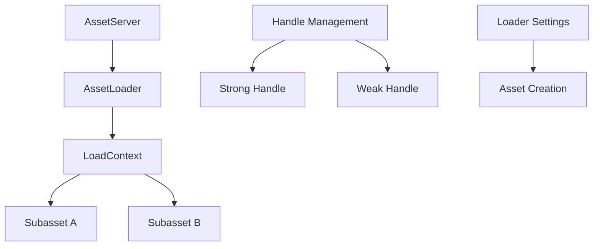

+++
title = "#21566 Add tests to document three separate asset issues."
date = "2025-10-17T00:00:00"
draft = false
template = "pull_request_page.html"
in_search_index = false

[extra]
current_language = "zh-cn"
available_languages = {"en" = { name = "English", url = "/pull_request/bevy/2025-10/pr-21566-en-20251017" }, "zh-cn" = { name = "中文", url = "/pull_request/bevy/2025-10/pr-21566-zh-cn-20251017" }}
+++

# Add tests to document three separate asset issues

## 基本信息
- **标题**: Add tests to document three separate asset issues.
- **PR链接**: https://github.com/bevyengine/bevy/pull/21566
- **作者**: andriyDev
- **状态**: 已合并
- **标签**: A-Assets, S-Ready-For-Final-Review, C-Testing, D-Straightforward
- **创建时间**: 2025-10-16T21:11:01Z
- **合并时间**: 2025-10-17T00:41:17Z
- **合并者**: alice-i-cecile

## 描述翻译
# 目标

- 添加测试来"展示" #20651、#12756 和 #21564 的问题。

## 解决方案

- 添加了一些测试！

## 测试

- 是的

## 这个Pull Request的故事

这个Pull Request的核心目的是通过编写测试用例来记录和验证三个独立的资产系统问题。在软件开发中，当发现bug时，编写重现问题的测试是修复过程的关键第一步。

**问题背景与测试策略**

开发者面临三个不同的资产系统问题，这些问题分别由不同的GitHub issue跟踪：
- #21564: 相同资产使用不同设置加载时产生相同句柄
- #12756: 加载两个子资产时意外启动两次加载过程
- #20651: 当资产仍然存活时，获取强句柄无法防止重新加载

开发者采用了直接有效的测试策略：为每个问题编写独立的测试用例，这些测试暂时断言当前错误的行为，并包含注释说明在相应问题修复后应该如何更新断言。

**测试实现细节**

第一个测试 `same_asset_different_settings` 验证资产加载器设置功能。它创建了一个自定义的 `U8Asset` 和 `U8Loader`，其中资产值直接从加载器设置中复制：

```rust
async fn load(
    &self,
    _: &mut dyn Reader,
    settings: &Self::Settings,
    _: &mut LoadContext<'_>,
) -> Result<Self::Asset, Self::Error> {
    Ok(U8Asset(settings.0))
}
```

测试使用相同路径但不同设置值(1和2)加载资产两次。理想情况下，这应该产生两个不同的句柄和不同的资产值，但由于#21564的问题，目前产生相同的句柄和值。

第二个测试 `loading_two_subassets_does_not_start_two_loads` 验证子资产加载行为。它创建了一个加载器，在单个加载操作中注册两个带标签的子资产：

```rust
load_context.add_labeled_asset("A".into(), TestAsset);
load_context.add_labeled_asset("B".into(), TestAsset);
```

测试然后分别加载两个子资产 `test.txt#A` 和 `test.txt#B`。在正常情况下，这应该只启动一次加载操作，但由于#12756的问题，目前会启动两次加载。

第三个测试 `get_strong_handle_prevents_reload_when_asset_still_alive` 验证强句柄的生命周期管理。测试首先加载一个资产，然后通过 `get_strong_handle` 获取新的强句柄：

```rust
let new_handle = app
    .world_mut()
    .resource_mut::<Assets<TestAsset>>()
    .get_strong_handle(original_handle.id())
    .unwrap();
```

在丢弃原始句柄后，资产应该仍然存活，因为新句柄保持引用。当再次尝试加载相同资产时，系统应该重用现有资产而不是启动新加载。但由于#20651的问题，目前会启动第二次加载。

**工程价值与模式**

这种测试方法体现了几个重要的工程实践：
1. **问题隔离**: 每个测试专注于一个特定问题，便于理解和调试
2. **临时断言**: 测试当前断言错误行为，但包含清晰的注释说明预期的正确行为
3. **回归防护**: 为未来的修复提供验证基础，确保修复不会引入回归

测试使用了Bevy资产系统的核心组件，包括 `AssetLoader` trait、`AssetServer`、`LoadContext` 和句柄管理，展示了资产加载管道的实际使用模式。

## 可视化表示



## 关键文件更改

**crates/bevy_asset/src/lib.rs** (+227/-0)

这个文件添加了三个新的测试函数来验证资产系统的三个不同问题：

1. `same_asset_different_settings` - 测试资产加载器设置功能
```rust
#[test]
fn same_asset_different_settings() {
    // 测试使用不同设置加载相同资产两次
    // 这应该产生两个不同的资产
    // ... 测试实现细节
}
```

2. `loading_two_subassets_does_not_start_two_loads` - 测试子资产加载行为
```rust
#[test] 
fn loading_two_subassets_does_not_start_two_loads() {
    // 测试加载两个子资产不应该启动两次加载
    // ... 测试实现细节
}
```

3. `get_strong_handle_prevents_reload_when_asset_still_alive` - 测试强句柄生命周期管理
```rust
#[test]
fn get_strong_handle_prevents_reload_when_asset_still_alive() {
    // 测试当资产仍然存活时，获取强句柄应该防止重新加载
    // ... 测试实现细节
}
```

每个测试都包含：
- 自定义资产加载器实现
- 内存资产源设置
- 应用初始化和资产注册
- 当前错误行为的断言，附带修复后的预期行为注释

## 进一步阅读

建议阅读以下资源来深入了解相关概念：

1. [Bevy资产系统文档](https://bevyengine.org/learn/books/assets/) - Bevy官方资产系统指南
2. [Rust测试框架](https://doc.rust-lang.org/book/ch11-00-testing.html) - Rust标准测试方法
3. [GitHub Issue #21564](https://github.com/bevyengine/bevy/pull/21564) - 资产设置处理问题
4. [GitHub Issue #12756](https://github.com/bevyengine/bevy/issues/12756) - 子资产加载问题  
5. [GitHub Issue #20651](https://github.com/bevyengine/bevy/issues/20651) - 强句柄生命周期管理问题

## 完整代码差异
```diff
diff --git a/crates/bevy_asset/src/lib.rs b/crates/bevy_asset/src/lib.rs
index 2a185c50f5a15..92ff7a9b22941 100644
--- a/crates/bevy_asset/src/lib.rs
+++ b/crates/bevy_asset/src/lib.rs
@@ -3258,4 +3258,231 @@ mod tests {
         // This assertion exists to "prove" that this problem exists.
         assert!(processed_dir.get_asset(gltfx_path).is_none());
     }
+
+    #[test]
+    fn same_asset_different_settings() {
+        // Test loading the same asset twice with different settings. This should
+        // produce two distinct assets.
+
+        // First, implement an asset that's a single u8, whose value is copied from
+        // the loader settings.
+
+        #[derive(Asset, TypePath)]
+        struct U8Asset(u8);
+
+        #[derive(Serialize, Deserialize, Default)]
+        struct U8LoaderSettings(u8);
+
+        struct U8Loader;
+
+        impl AssetLoader for U8Loader {
+            type Asset = U8Asset;
+            type Settings = U8LoaderSettings;
+            type Error = crate::loader::LoadDirectError;
+
+            async fn load(
+                &self,
+                _: &mut dyn Reader,
+                settings: &Self::Settings,
+                _: &mut LoadContext<'_>,
+            ) -> Result<Self::Asset, Self::Error> {
+                Ok(U8Asset(settings.0))
+            }
+
+            fn extensions(&self) -> &[&str] {
+                &["u8"]
+            }
+        }
+
+        // Create a test asset.
+
+        let dir = Dir::default();
+        dir.insert_asset(Path::new("test.u8"), &[]);
+
+        let asset_source = AssetSource::build()
+            .with_reader(move || Box::new(MemoryAssetReader { root: dir.clone() }));
+
+        // Set up the app.
+
+        let mut app = App::new();
+
+        app.register_asset_source(AssetSourceId::Default, asset_source)
+            .add_plugins((TaskPoolPlugin::default(), AssetPlugin::default()))
+            .init_asset::<U8Asset>()
+            .register_asset_loader(U8Loader);
+
+        let asset_server = app.world().resource::<AssetServer>();
+
+        // Load the test asset twice but with different settings.
+
+        fn load(asset_server: &AssetServer, path: &'static str, value: u8) -> Handle<U8Asset> {
+            asset_server.load_with_settings::<U8Asset, U8LoaderSettings>(
+                path,
+                move |s: &mut U8LoaderSettings| s.0 = value,
+            )
+        }
+
+        let handle_1 = load(asset_server, "test.u8", 1);
+        let handle_2 = load(asset_server, "test.u8", 2);
+
+        // Handles should be different.
+
+        // These handles should be different, but due to
+        // https://github.com/bevyengine/bevy/pull/21564, they are not. Once 21564 is fixed, we
+        // should replace these expects.
+        //
+        // assert_ne!(handle_1, handle_2);
+        assert_eq!(handle_1, handle_2);
+
+        run_app_until(&mut app, |world| {
+            let (Some(asset_1), Some(asset_2)) = (
+                world.resource::<Assets<U8Asset>>().get(&handle_1),
+                world.resource::<Assets<U8Asset>>().get(&handle_2),
+            ) else {
+                return None;
+            };
+
+            // Values should match the settings.
+
+            // These values should be different, but due to
+            // https://github.com/bevyengine/bevy/pull/21564, they are not. Once 21564 is fixed, we
+            // should replace these expects.
+            //
+            // assert_eq!(asset_1.0, 1);
+            // assert_eq!(asset_2.0, 2);
+            assert_eq!(asset_1.0, asset_2.0);
+
+            Some(())
+        });
+    }
+
+    #[test]
+    fn loading_two_subassets_does_not_start_two_loads() {
+        let mut app = App::new();
+
+        let dir = Dir::default();
+        dir.insert_asset(Path::new("test.txt"), &[]);
+
+        let asset_source = AssetSource::build()
+            .with_reader(move || Box::new(MemoryAssetReader { root: dir.clone() }));
+
+        app.register_asset_source(AssetSourceId::Default, asset_source)
+            .add_plugins((TaskPoolPlugin::default(), AssetPlugin::default()))
+            .init_asset::<TestAsset>();
+
+        struct TwoSubassetLoader;
+
+        impl AssetLoader for TwoSubassetLoader {
+            type Asset = TestAsset;
+            type Settings = ();
+            type Error = std::io::Error;
+
+            async fn load(
+                &self,
+                _reader: &mut dyn Reader,
+                _settings: &Self::Settings,
+                load_context: &mut LoadContext<'_>,
+            ) -> Result<Self::Asset, Self::Error> {
+                load_context.add_labeled_asset("A".into(), TestAsset);
+                load_context.add_labeled_asset("B".into(), TestAsset);
+                Ok(TestAsset)
+            }
+
+            fn extensions(&self) -> &[&str] {
+                &["txt"]
+            }
+        }
+
+        app.register_asset_loader(TwoSubassetLoader);
+
+        let asset_server = app.world().resource::<AssetServer>().clone();
+        let _subasset_1: Handle<TestAsset> = asset_server.load("test.txt#A");
+        let _subasset_2: Handle<TestAsset> = asset_server.load("test.txt#B");
+
+        app.update();
+
+        // Due to https://github.com/bevyengine/bevy/issues/12756, this expectation fails. Once
+        // #12756 is fixed, we should swap these asserts.
+        //
+        // assert_eq!(get_started_load_count(app.world()), 1);
+        assert_eq!(get_started_load_count(app.world()), 2);
+    }
+
+    #[test]
+    fn get_strong_handle_prevents_reload_when_asset_still_alive() {
+        let mut app = App::new();
+
+        let dir = Dir::default();
+        dir.insert_asset(Path::new("test.txt"), &[]);
+
+        let asset_source = AssetSource::build()
+            .with_reader(move || Box::new(MemoryAssetReader { root: dir.clone() }));
+
+        app.register_asset_source(AssetSourceId::Default, asset_source)
+            .add_plugins((TaskPoolPlugin::default(), AssetPlugin::default()))
+            .init_asset::<TestAsset>();
+
+        struct TrivialLoader;
+
+        impl AssetLoader for TrivialLoader {
+            type Asset = TestAsset;
+            type Settings = ();
+            type Error = std::io::Error;
+
+            async fn load(
+                &self,
+                _reader: &mut dyn Reader,
+                _settings: &Self::Settings,
+                _load_context: &mut LoadContext<'_>,
+            ) -> Result<Self::Asset, Self::Error> {
+                Ok(TestAsset)
+            }
+
+            fn extensions(&self) -> &[&str] {
+                &["txt"]
+            }
+        }
+
+        app.register_asset_loader(TrivialLoader);
+
+        let asset_server = app.world().resource::<AssetServer>().clone();
+        let original_handle: Handle<TestAsset> = asset_server.load("test.txt");
+
+        // Wait for the asset to load.
+        run_app_until(&mut app, |world| {
+            world
+                .resource::<Assets<TestAsset>>()
+                .get(&original_handle)
+                .map(|_| ())
+        });
+
+        assert_eq!(get_started_load_count(app.world()), 1);
+
+        // Get a new strong handle from the original handle's ID.
+        let new_handle = app
+            .world_mut()
+            .resource_mut::<Assets<TestAsset>>()
+            .get_strong_handle(original_handle.id())
+            .unwrap();
+
+        // Drop the original handle. This should still leave the asset alive.
+        drop(original_handle);
+
+        app.update();
+        assert!(app
+            .world()
+            .resource::<Assets<TestAsset>>()
+            .get(&new_handle)
+            .is_some());
+
+        let _other_handle: Handle<TestAsset> = asset_server.load("test.txt");
+        app.update();
+        // The asset server should **not** have started a new load, since the asset is still alive.
+
+        // Due to https://github.com/bevyengine/bevy/issues/20651, we do get a second load. Once
+        // #20651 is fixed, we should swap these asserts.
+        //
+        // assert_eq!(get_started_load_count(app.world()), 1);
+        assert_eq!(get_started_load_count(app.world()), 2);
+    }
 }
```