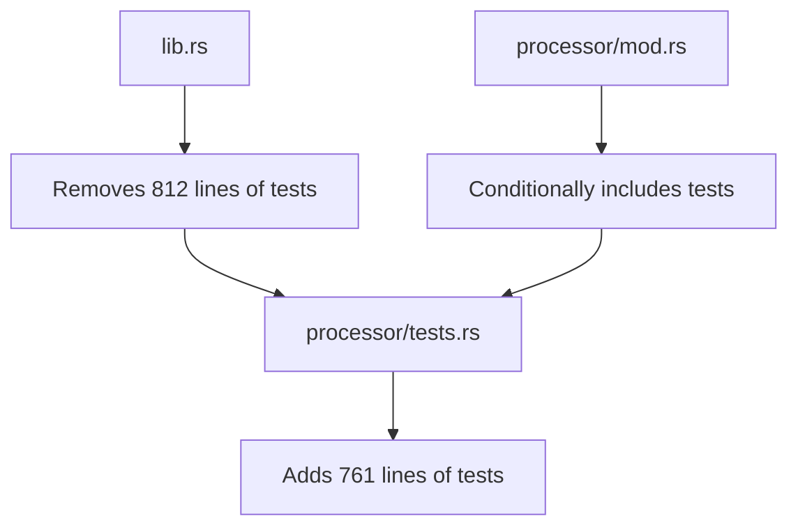

+++
title = "#21567 Move asset processing tests to their own file."
date = "2025-10-21T00:00:00"
draft = false
template = "pull_request_page.html"
in_search_index = true

[taxonomies]
list_display = ["show"]

[extra]
current_language = "en"
available_languages = {"en" = { name = "English", url = "/pull_request/bevy/2025-10/pr-21567-en-20251021" }, "zh-cn" = { name = "中文", url = "/pull_request/bevy/2025-10/pr-21567-zh-cn-20251021" }}
labels = ["D-Trivial", "A-Assets", "C-Code-Quality", "C-Testing"]
+++

# Title

## Basic Information
- **Title**: Move asset processing tests to their own file.
- **PR Link**: https://github.com/bevyengine/bevy/pull/21567
- **Author**: andriyDev
- **Status**: MERGED
- **Labels**: D-Trivial, A-Assets, C-Code-Quality, S-Ready-For-Final-Review, C-Testing
- **Created**: 2025-10-16T22:17:50Z
- **Merged**: 2025-10-21T18:13:23Z
- **Merged By**: alice-i-cecile

## Description Translation
# Objective

- Address [this comment](https://github.com/bevyengine/bevy/pull/21566#issuecomment-3412927603).

## Solution

- Move all the asset processor tests into their own file.

## Testing

- Ran the tests in single threaded and multi threaded mode.

## The Story of This Pull Request

The primary issue this PR addresses is code organization within the Bevy asset system. The asset processor tests had grown significantly and were becoming difficult to maintain within the main `lib.rs` file. This was creating several practical problems for developers working on the codebase.

**The Problem and Context**
The asset processor tests were originally located in `crates/bevy_asset/src/lib.rs`, which had grown to over 800 lines of test code. This made the main library file difficult to navigate and understand. The tests were also conditionally compiled behind the `multi_threaded` feature flag, which added complexity to the main test module. As the asset system evolved, maintaining these tests in the primary library file became increasingly cumbersome.

**The Solution Approach**
The straightforward solution was to extract all asset processor-related tests into a dedicated test file. This follows standard Rust conventions for organizing test code and aligns with Bevy's existing code organization patterns. The approach maintains all existing test functionality while improving code readability and maintainability.

**The Implementation**
The implementation involved three key changes:

1. Removing the test code from `lib.rs` (-812 lines)
2. Creating a new `tests.rs` file in the processor module (+761 lines)  
3. Adding a module declaration to include the tests conditionally

The tests were moved verbatim without functional changes, ensuring that all existing test coverage was preserved. The conditional compilation logic was maintained, with the tests only being compiled when both the `multi_threaded` feature and test configuration are active.

**Technical Insights**
This refactoring demonstrates several important software engineering principles:

- **Separation of Concerns**: By separating test code from library code, both become easier to understand and maintain
- **Module Organization**: Following Rust's convention of placing tests in dedicated files improves code navigation
- **Conditional Compilation**: The implementation properly handles the `multi_threaded` feature requirement for asset processor tests

The move also revealed some technical debt in the form of duplicate type definitions and test utilities that were previously scattered throughout the main test module.

**The Impact**
The primary impact is improved code maintainability. Developers can now:
- More easily locate and understand asset processor tests
- Work on asset processor functionality without navigating through unrelated test code
- Add new tests without contributing to file size bloat in the main library

The change also sets a precedent for future test organization as the asset system continues to evolve.

## Visual Representation



## Key Files Changed

### `crates/bevy_asset/src/lib.rs` (+10/-812)

This file saw the most significant reduction in size, with the removal of all asset processor test code. The changes included:

1. Removal of test-only imports and type definitions
2. Extraction of the `AppWithProcessor` test utility structure
3. Removal of all individual asset processor test functions

```rust
// Before: Extensive test code in lib.rs
#[cfg(feature = "multi_threaded")]
#[test]
fn asset_processor_transforms_asset_default_processor() {
    // ... 50+ lines of test implementation
}

// After: Cleaner lib.rs with only non-processor tests
#[test]
fn same_asset_different_settings() {
    // Remaining non-processor tests stay
}
```

### `crates/bevy_asset/src/processor/tests.rs` (+761/-0)

This new file contains all the extracted asset processor tests, organized with proper imports and maintaining the same test structure:

```rust
// New file with dedicated test organization
use alloc::{boxed::Box, collections::BTreeMap, /* ... */};
use bevy_reflect::TypePath;
// ... other imports

struct AppWithProcessor {
    app: App,
    source_dir: Dir,
    processed_dir: Dir,
}

#[test]
fn no_meta_or_default_processor_copies_asset() {
    // Test implementation moved from lib.rs
}
```

### `crates/bevy_asset/src/processor/mod.rs` (+5/-0)

This file was modified to conditionally include the new test module:

```rust
// Added to processor/mod.rs
// The asset processor currently requires multi_threaded.
#[cfg(feature = "multi_threaded")]
#[cfg(test)]
mod tests;
```

## Further Reading

- [Rust Testing Guide](https://doc.rust-lang.org/book/ch11-00-testing.html)
- [Bevy Asset System Documentation](https://bevyengine.org/learn/quick-start/assets/)
- [Module System in Rust](https://doc.rust-lang.org/book/ch07-02-defining-modules-to-control-scope-and-privacy.html)