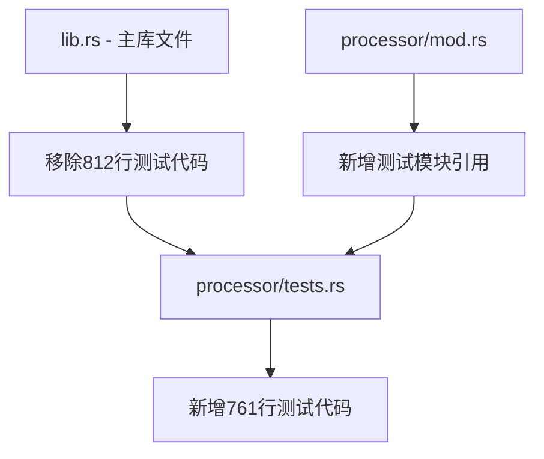

+++
title = "#21567 Move asset processing tests to their own file."
date = "2025-10-21T00:00:00"
draft = false
template = "pull_request_page.html"
in_search_index = false

[extra]
current_language = "zh-cn"
available_languages = {"en" = { name = "English", url = "/pull_request/bevy/2025-10/pr-21567-en-20251021" }, "zh-cn" = { name = "中文", url = "/pull_request/bevy/2025-10/pr-21567-zh-cn-20251021" }}
labels = ["D-Trivial", "A-Assets", "C-Code-Quality", "C-Testing"]
+++

# Move asset processing tests to their own file

## Basic Information
- **Title**: Move asset processing tests to their own file.
- **PR Link**: https://github.com/bevyengine/bevy/pull/21567
- **Author**: andriyDev
- **Status**: MERGED
- **Labels**: D-Trivial, A-Assets, C-Code-Quality, S-Ready-For-Final-Review, C-Testing
- **Created**: 2025-10-16T22:17:50Z
- **Merged**: 2025-10-21T18:13:23Z
- **Merged By**: alice-i-cecile

## Description Translation
# Objective

- 解决[这个评论](https://github.com/bevyengine/bevy/pull/21566#issuecomment-3412927603)中提到的问题。

## Solution

- 将所有资产处理器测试移动到它们自己的文件中。

## Testing

- 在单线程和多线程模式下运行了测试。

## The Story of This Pull Request

这个PR是一个典型的代码重构任务，目的是解决测试代码组织问题。在之前的代码结构中，资产处理器的测试代码直接放在主库文件`lib.rs`中，这导致了几个问题。

**问题背景**：在Bevy引擎的资产系统中，资产处理器（Asset Processor）的测试代码占据了`lib.rs`文件的大量空间。这些测试代码大约有800多行，与核心业务逻辑混合在一起，使得主文件变得冗长且难以维护。特别是当开发者需要查看核心资产系统功能时，不得不翻阅大量测试代码，这影响了代码的可读性和维护性。

**解决方案选择**：开发者采用了最直接有效的重构方法 - 将测试代码提取到独立的模块文件中。这种方法遵循了Rust项目的常见实践，即将大型测试套件分离到专门的测试文件中。这种重构不需要改变任何测试逻辑，只是物理位置的移动，因此风险极低。

**实现过程**：重构过程分为三个关键步骤。首先，在`crates/bevy_asset/src/processor/`目录下创建新的`tests.rs`文件，将所有资产处理器相关的测试代码移动到这个文件中。其次，修改`processor/mod.rs`文件，通过条件编译指令引入新的测试模块：

```rust
// The asset processor currently requires multi_threaded.
#[cfg(feature = "multi_threaded")]
#[cfg(test)]
mod tests;
```

最后，清理主`lib.rs`文件，移除所有被移动的测试代码，同时保留其他非处理器相关的测试。在这个过程中，开发者还修复了一些导入路径问题，确保移动后的测试代码能够正确访问所需的类型和函数。

**技术洞察**：这个重构展示了几个重要的软件工程原则。首先是关注点分离（Separation of Concerns），将测试代码与生产代码分离使得代码库更加清晰。其次是模块化设计，通过将相关测试组织在一起，提高了代码的可维护性。值得注意的是，所有测试都使用了条件编译`#[cfg(feature = "multi_threaded")]`，这表明资产处理器功能依赖于多线程特性。

**影响分析**：这次重构带来了显著的代码质量改进。主`lib.rs`文件减少了812行代码，变得更加专注和易读。新的测试文件结构使得资产处理器的测试更加集中，便于开发和维护。从工程实践角度看，这种重构为后续的测试扩展和维护奠定了更好的基础，同时也为其他模块的类似重构提供了参考模式。

## Visual Representation



## Key Files Changed

### `crates/bevy_asset/src/lib.rs` (+10/-812)
**变化描述**：这是主要的清理文件，移除了所有资产处理器相关的测试代码，使主库文件更加精简和专注。

**关键修改**：
```rust
// 移除了大量的测试代码，包括：
// - AppWithProcessor 结构体和相关函数
// - 各种资产处理器测试（no_meta_or_default_processor_copies_asset等）
// - 测试专用的资产加载器、转换器、保存器实现
// - 相关的导入和类型定义

// 保留了其他非处理器相关的测试代码
```

### `crates/bevy_asset/src/processor/tests.rs` (+761/-0)
**变化描述**：新创建的测试文件，包含了所有从主文件移动过来的资产处理器测试代码。

**关键代码示例**：
```rust
// 包含了完整的测试套件，如：
#[test]
fn no_meta_or_default_processor_copies_asset() {
    // 测试逻辑...
}

#[test] 
fn asset_processor_transforms_asset_default_processor() {
    // 测试逻辑...
}

// 以及测试专用的辅助结构体和实现
struct AppWithProcessor { /* ... */ }
struct CoolTextSaver { /* ... */ }
// 等等...
```

### `crates/bevy_asset/src/processor/mod.rs` (+5/-0)
**变化描述**：添加了对新测试模块的引用，确保测试代码能被正确编译和执行。

**关键修改**：
```rust
// 在文件末尾添加：
// The asset processor currently requires multi_threaded.
#[cfg(feature = "multi_threaded")]
#[cfg(test)]
mod tests;
```

## Further Reading

- [Rust测试组织最佳实践](https://doc.rust-lang.org/book/ch11-03-test-organization.html)
- [Bevy资产系统文档](https://bevyengine.org/learn/books/assets/)
- [模块化代码设计原则](https://en.wikipedia.org/wiki/Modular_programming)
- [软件重构技术](https://refactoring.com/)