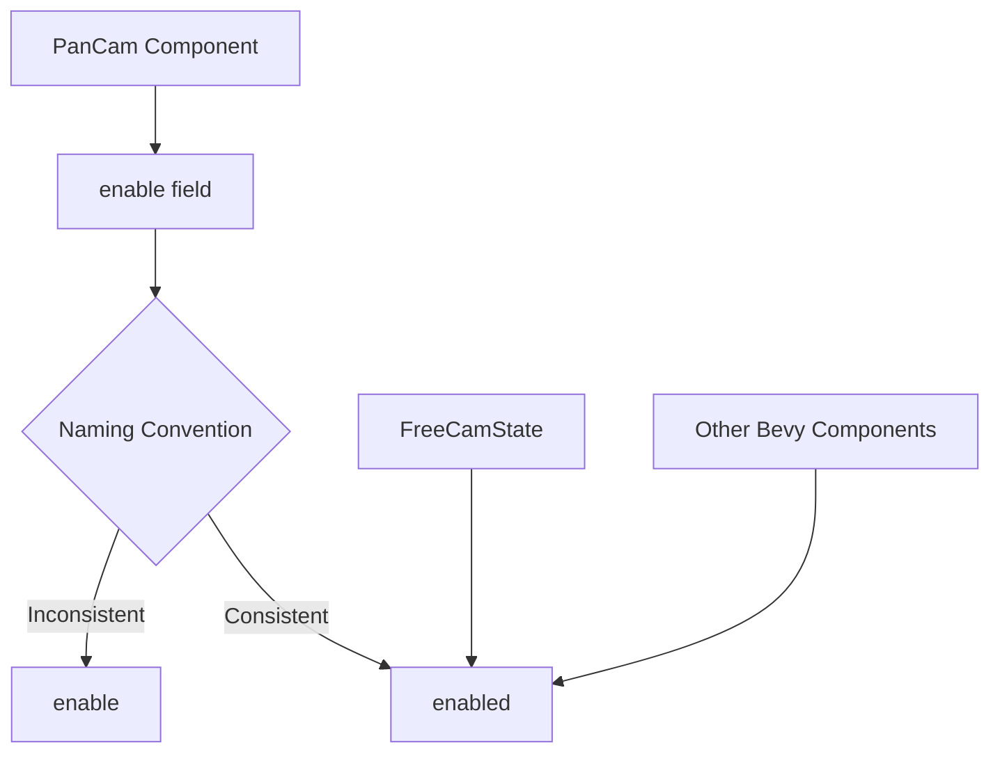

+++
title = "#21568 Rename PanCam.enable to enabled"
date = "2025-10-17T00:00:00"
draft = false
template = "pull_request_page.html"
in_search_index = true

[taxonomies]
list_display = ["show"]

[extra]
current_language = "en"
available_languages = {"en" = { name = "English", url = "/pull_request/bevy/2025-10/pr-21568-en-20251017" }, "zh-cn" = { name = "中文", url = "/pull_request/bevy/2025-10/pr-21568-zh-cn-20251017" }}
labels = ["D-Trivial", "C-Code-Quality", "C-Usability", "A-Camera"]
+++

# Title

## Basic Information
- **Title**: Rename PanCam.enable to enabled
- **PR Link**: https://github.com/bevyengine/bevy/pull/21568
- **Author**: mgi388
- **Status**: MERGED
- **Labels**: D-Trivial, C-Code-Quality, C-Usability, S-Ready-For-Final-Review, A-Camera
- **Created**: 2025-10-16T23:22:32Z
- **Merged**: 2025-10-17T00:29:39Z
- **Merged By**: alice-i-cecile

## Description Translation
I noticed in https://github.com/bevyengine/bevy/pull/21520 that it used `enable` but `FreeCamState` uses `enabled` (as does all other Bevy code).

**Testing**

CI

## The Story of This Pull Request

This pull request addresses a naming inconsistency in the Bevy engine's camera controller system. The developer noticed that while working on a previous PR (#21520), the `PanCam` component used a field named `enable`, which didn't follow the established naming convention in the codebase.

The core issue was straightforward: the `PanCam` struct had a boolean field named `enable` that controlled whether the camera controller was active, but most other components in Bevy, including `FreeCamState`, used the past participle `enabled` for similar boolean flags. This inconsistency created cognitive overhead for developers working across different parts of the camera system and violated the principle of least surprise.

The solution approach was direct and minimal - simply rename the field from `enable` to `enabled` to align with existing conventions. This type of change is typical in mature codebases where consistency improves maintainability and reduces mental context switching for developers.

Looking at the implementation, the changes were minimal but impactful:

1. The struct definition was updated to use `enabled` instead of `enable`
2. The default implementation was updated to initialize the new field name
3. The system logic that checks this flag was updated to use the new field name

The technical insight here is about maintaining consistent naming conventions across a large codebase. Using `enabled` as a past participle adjective is more idiomatic for boolean fields that represent state, whereas `enable` is typically used as a verb for methods that change state. This distinction helps developers quickly understand whether they're reading state (enabled) versus invoking behavior (enable).

The impact of this change is primarily on code quality and developer experience. While functionally identical, the renamed field now follows established patterns, making the API more predictable. This reduces the likelihood of bugs where developers might incorrectly assume the field name based on patterns they've seen elsewhere in the codebase.

## Visual Representation



## Key Files Changed

### `crates/bevy_camera_controller/src/pan_cam.rs` (+3/-3)

This file contains the `PanCam` component and its associated systems. The changes align the field naming with Bevy's established conventions.

**Key changes:**

```rust
// File: crates/bevy_camera_controller/src/pan_cam.rs

// Before:
#[derive(Component)]
pub struct PanCam {
    /// Enables this [`PanCam`] when `true`.
    pub enable: bool,
    // ... other fields
}

impl Default for PanCam {
    fn default() -> Self {
        Self {
            enable: true,
            // ... other fields
        }
    }
}

fn run_pancam_controller(
    // ... parameters
) {
    if !controller.enable {
        return;
    }
    // ... rest of function
}

// After:
#[derive(Component)]
pub struct PanCam {
    /// Enables this [`PanCam`] when `true`.
    pub enabled: bool,
    // ... other fields
}

impl Default for PanCam {
    fn default() -> Self {
        Self {
            enabled: true,
            // ... other fields
        }
    }
}

fn run_pancam_controller(
    // ... parameters
) {
    if !controller.enabled {
        return;
    }
    // ... rest of function
}
```

The changes are minimal but important for consistency:
1. The struct field name changed from `enable` to `enabled`
2. The default value initialization updated accordingly
3. The system logic that checks this flag was updated

## Further Reading

- [Rust API Guidelines - Naming](https://rust-lang.github.io/api-guidelines/naming.html)
- [Bevy Engine Documentation](https://bevyengine.org/learn/)
- [Boolean Field Naming Conventions](https://stackoverflow.com/questions/18736272/boolean-field-naming-conventions)