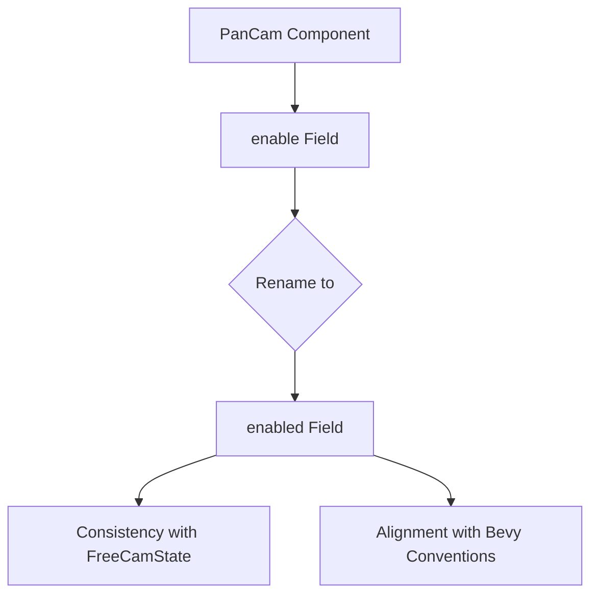

+++
title = "#21568 Rename PanCam.enable to enabled"
date = "2025-10-17T00:00:00"
draft = false
template = "pull_request_page.html"
in_search_index = false

[extra]
current_language = "zh-cn"
available_languages = {"en" = { name = "English", url = "/pull_request/bevy/2025-10/pr-21568-en-20251017" }, "zh-cn" = { name = "中文", url = "/pull_request/bevy/2025-10/pr-21568-zh-cn-20251017" }}
labels = ["D-Trivial", "C-Code-Quality", "C-Usability", "A-Camera"]
+++

# Title

## Basic Information
- **Title**: Rename PanCam.enable to enabled
- **PR Link**: https://github.com/bevyengine/bevy/pull/21568
- **Author**: mgi388
- **Status**: MERGED
- **Labels**: D-Trivial, C-Code-Quality, C-Usability, S-Ready-For-Final-Review, A-Camera
- **Created**: 2025-10-16T23:22:32Z
- **Merged**: 2025-10-17T00:29:39Z
- **Merged By**: alice-i-cecile

## Description Translation
我在 https://github.com/bevyengine/bevy/pull/21520 中注意到它使用了 `enable`，但 `FreeCamState` 使用了 `enabled`（所有其他 Bevy 代码也是如此）。

**测试**

CI

## The Story of This Pull Request

这个PR解决了一个看似简单但重要的代码一致性问题。在开发过程中，作者在另一个PR中发现 `PanCam` 组件的启用标志使用了 `enable` 字段名，这与Bevy引擎中其他组件使用的 `enabled` 命名约定不一致。

问题的核心在于代码库中的命名一致性。在大型项目中，保持一致的命名约定对于代码的可维护性和开发者体验至关重要。当开发者使用不同的组件时，他们期望相似的属性具有相似的名称。`FreeCamState` 和其他Bevy组件都使用 `enabled` 作为启用标志，这使得 `PanCam` 的 `enable` 字段成为一个异常。

这个不一致性可能会导致几个实际问题：
1. 开发者在切换使用不同相机组件时容易混淆
2. 代码自动补全和文档查找效率降低
3. 可能引入错误的假设，认为这是有意设计的不同行为

解决方案非常直接：将 `PanCam` 结构体中的 `enable` 字段重命名为 `enabled`。这个改动涉及三个地方的修改：
- 结构体字段定义
- Default trait 实现中的默认值设置
- 在控制器系统中检查启用状态的逻辑

从技术实现角度看，这个改动展示了良好的软件工程实践。作者不仅修改了字段定义，还确保所有使用该字段的地方都同步更新。在 `run_pancam_controller` 系统中，检查逻辑从 `!controller.enable` 改为 `!controller.enabled`，保持了功能的一致性。

这个PR的合并过程很快，从创建到合并只用了约1小时，表明这是一个被广泛认可的重要改进。标签中的 C-Code-Quality 和 C-Usability 准确地反映了这个改动的性质：它提升了代码质量和用户体验，而没有改变任何功能行为。

## Visual Representation



## Key Files Changed

### `crates/bevy_camera_controller/src/pan_cam.rs` (+3/-3)

这个文件包含了所有的修改，主要目的是将 `PanCam` 组件的启用标志字段名从 `enable` 改为 `enabled` 以保持代码一致性。

**关键修改：**

```rust
// 结构体字段定义修改
// Before:
pub struct PanCam {
    /// Enables this [`PanCam`] when `true`.
    pub enable: bool,
    // ... 其他字段
}

// After:
pub struct PanCam {
    /// Enables this [`PanCam`] when `true`.
    pub enabled: bool,
    // ... 其他字段
}
```

```rust
// Default trait 实现修改
// Before:
fn default() -> Self {
    Self {
        enable: true,
        // ... 其他字段默认值
    }
}

// After:
fn default() -> Self {
    Self {
        enabled: true,
        // ... 其他字段默认值
    }
}
```

```rust
// 控制器系统逻辑修改
// Before:
if !controller.enable {
    return;
}

// After:
if !controller.enabled {
    return;
}
```

## Further Reading

- [Bevy Engine GitHub Repository](https://github.com/bevyengine/bevy)
- [Rust API Guidelines - Naming](https://rust-lang.github.io/api-guidelines/naming.html)
- [Bevy Component Documentation](https://docs.rs/bevy/latest/bevy/ecs/component/trait.Component.html)