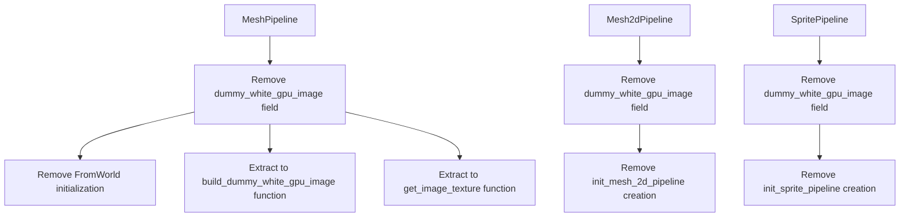

+++
title = "#21572 Remove `dummy_white_gpu_image`"
date = "2025-10-17T00:00:00"
draft = false
template = "pull_request_page.html"
in_search_index = true

[taxonomies]
list_display = ["show"]

[extra]
current_language = "en"
available_languages = {"en" = { name = "English", url = "/pull_request/bevy/2025-10/pr-21572-en-20251017" }, "zh-cn" = { name = "中文", url = "/pull_request/bevy/2025-10/pr-21572-zh-cn-20251017" }}
labels = ["D-Trivial", "A-Rendering", "C-Code-Quality"]
+++

# Remove `dummy_white_gpu_image`

## Basic Information
- **Title**: Remove `dummy_white_gpu_image`
- **PR Link**: https://github.com/bevyengine/bevy/pull/21572
- **Author**: Zeophlite
- **Status**: MERGED
- **Labels**: D-Trivial, A-Rendering, C-Code-Quality, S-Ready-For-Final-Review
- **Created**: 2025-10-17T03:18:22Z
- **Merged**: 2025-10-17T17:53:26Z
- **Merged By**: alice-i-cecile

## Description Translation
# Objective

- `MeshPipeline`, `Mesh2dPipeline` and `SpritePipeline` have `dummy_white_gpu_image`, which is only used by `get_image_texture()`, which is unused

## Solution

- Remove unused

## Testing

- CI

## The Story of This Pull Request

This PR addresses a straightforward case of dead code elimination across three rendering pipelines in the Bevy engine. The core issue was that multiple pipeline structs contained a `dummy_white_gpu_image` field that served as a fallback texture, but the associated `get_image_texture()` method that used it was no longer being called anywhere in the codebase.

The problem originated from what appears to be leftover infrastructure from earlier rendering implementations. The `dummy_white_gpu_image` was designed to provide a default white texture when optional material textures weren't specified. However, as the rendering system evolved, this fallback mechanism became obsolete, leaving behind unused GPU resources and associated code.

The solution approach was direct and surgical: remove the unused field and method from all three pipeline types. For `MeshPipeline`, the implementation went a step further by extracting the dummy image creation logic into a standalone function `build_dummy_white_gpu_image()` and keeping the texture lookup logic in `get_image_texture()` as public functions. This preserves the functionality for any future use cases while cleaning up the pipeline structs.

The implementation changes follow a consistent pattern across all three affected pipelines. Each pipeline struct lost its `dummy_white_gpu_image` field, and the initialization code that created this GPU resource was removed. This cleanup reduces memory usage and simplifies the pipeline initialization process by eliminating unnecessary resource creation.

From a technical perspective, this change demonstrates good code hygiene practices. The removed code was creating actual GPU resources - textures, texture views, and samplers - that were consuming VRAM without providing any functional benefit. By removing these, the PR reduces the engine's memory footprint and eliminates potential confusion for developers who might have wondered about the purpose of these unused fields.

The impact of these changes is purely positive: reduced code complexity, smaller memory footprint, and cleaner API surfaces. The migration guide was appropriately added to document these removals for users who might have been relying on these fields or methods in their own code.

## Visual Representation



## Key Files Changed

### `crates/bevy_pbr/src/render/mesh.rs` (+56/-58)

This file underwent the most significant changes, removing the `dummy_white_gpu_image` from `MeshPipeline` but preserving the functionality as standalone functions.

**Key changes:**
- Removed `dummy_white_gpu_image` field from `MeshPipeline` struct
- Removed initialization code from `FromWorld` implementation
- Extracted functionality into public functions `build_dummy_white_gpu_image()` and `get_image_texture()`

```rust
// Before:
pub struct MeshPipeline {
    pub view_layouts: MeshPipelineViewLayouts,
    pub dummy_white_gpu_image: GpuImage,
    // ...
}

// After:
pub struct MeshPipeline {
    pub view_layouts: MeshPipelineViewLayouts,
    // ... (no dummy_white_gpu_image)
}

// New functions:
pub fn build_dummy_white_gpu_image(
    render_device: Res<RenderDevice>,
    default_sampler: Res<DefaultImageSampler>,
    render_queue: Res<RenderQueue>,
) -> GpuImage {
    // Implementation preserved from original
}

pub fn get_image_texture<'a>(
    dummy_white_gpu_image: &'a GpuImage,
    gpu_images: &'a RenderAssets<GpuImage>,
    handle_option: &Option<Handle<Image>>,
) -> Option<(&'a TextureView, &'a Sampler)> {
    // Implementation preserved from original
}
```

### `crates/bevy_sprite_render/src/mesh2d/mesh.rs` (+3/-59)

Removed the `dummy_white_gpu_image` field and associated initialization code from the 2D mesh pipeline.

```rust
// Before:
pub struct Mesh2dPipeline {
    pub view_layout: BindGroupLayoutDescriptor,
    pub mesh_layout: BindGroupLayoutDescriptor,
    pub shader: Handle<Shader>,
    pub dummy_white_gpu_image: GpuImage,
    // ...
}

// After:
pub struct Mesh2dPipeline {
    pub view_layout: BindGroupLayoutDescriptor,
    pub mesh_layout: BindGroupLayoutDescriptor,
    pub shader: Handle<Shader>,
    // ... (no dummy_white_gpu_image)
}
```

### `crates/bevy_sprite_render/src/render/mod.rs` (+3/-43)

Removed the `dummy_white_gpu_image` from the sprite pipeline with similar cleanup.

```rust
// Before:
pub struct SpritePipeline {
    view_layout: BindGroupLayoutDescriptor,
    material_layout: BindGroupLayoutDescriptor,
    shader: Handle<Shader>,
    pub dummy_white_gpu_image: GpuImage,
}

// After:
pub struct SpritePipeline {
    view_layout: BindGroupLayoutDescriptor,
    material_layout: BindGroupLayoutDescriptor,
    shader: Handle<Shader>,
}
```

### `release-content/migration-guides/remove-dummy-white-gpu-image.md` (+10/-0)

Added migration guide documenting the changes for users.

```markdown
---
title: "Removed `dummy_white_gpu_image`"
pull_requests: [21572]
---

`MeshPipeline`, `Mesh2dPipeline` and `SpritePipeline` no longer have `dummy_white_gpu_image`.

`MeshPipeline` and `Mesh2dPipeline` no longer have `get_image_texture()` in their `impl`.

The method `build_dummy_white_gpu_image()` and `get_image_texture()` can be used if needed.
```

## Further Reading

- [Bevy Engine Rendering Architecture](https://bevyengine.org/learn/quick-start/getting-started/systems/)
- [WGPU Texture Creation](https://wgpu.rs/guide/textures)
- [Rust Dead Code Elimination](https://doc.rust-lang.org/rustc/command-line-arguments.html#dead-code-lints)