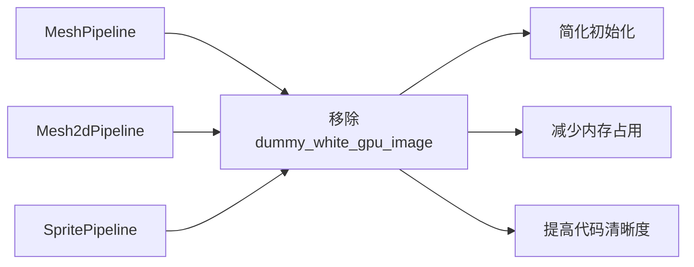

+++
title = "#21572 Remove `dummy_white_gpu_image`"
date = "2025-10-17T00:00:00"
draft = false
template = "pull_request_page.html"
in_search_index = false

[extra]
current_language = "zh-cn"
available_languages = {"en" = { name = "English", url = "/pull_request/bevy/2025-10/pr-21572-en-20251017" }, "zh-cn" = { name = "中文", url = "/pull_request/bevy/2025-10/pr-21572-zh-cn-20251017" }}
labels = ["D-Trivial", "A-Rendering", "C-Code-Quality"]
+++

# Remove `dummy_white_gpu_image`

## Basic Information
- **Title**: Remove `dummy_white_gpu_image`
- **PR Link**: https://github.com/bevyengine/bevy/pull/21572
- **Author**: Zeophlite
- **Status**: MERGED
- **Labels**: D-Trivial, A-Rendering, C-Code-Quality, S-Ready-For-Final-Review
- **Created**: 2025-10-17T03:18:22Z
- **Merged**: 2025-10-17T17:53:26Z
- **Merged By**: alice-i-cecile

## Description Translation
# 目标

- `MeshPipeline`, `Mesh2dPipeline` 和 `SpritePipeline` 都有 `dummy_white_gpu_image`，它只被 `get_image_texture()` 使用，而该方法未被使用

## 解决方案

- 移除未使用的代码

## 测试

- CI

## The Story of This Pull Request

这个PR解决了一个典型的代码质量问题：移除不再使用的代码。在Bevy渲染系统中，三个主要的渲染管线（`MeshPipeline`、`Mesh2dPipeline` 和 `SpritePipeline`）都维护了一个名为 `dummy_white_gpu_image` 的字段，这是一个1x1的白色纹理，用于在可选纹理未提供时作为默认值。

问题的核心在于，这个字段只被 `get_image_texture()` 方法使用，而该方法本身在代码库中已经不再被调用。这意味着整个 `dummy_white_gpu_image` 的创建和维护逻辑都是死代码，占用了不必要的内存和初始化时间。

开发者采用了直接的解决方案：完全移除这些未使用的字段和方法。对于 `MeshPipeline`，为了保持向后兼容性，将创建逻辑提取为独立的函数 `build_dummy_white_gpu_image()`，并提供了新的 `get_image_texture()` 函数。这样，如果将来有代码需要这些功能，仍然可以使用相同的逻辑，但不需要在每个管线实例中都维护这个资源。

从实现角度来看，这个变更主要涉及：
1. 从三个管线结构体中移除 `dummy_white_gpu_image` 字段
2. 移除对应的 `get_image_texture()` 方法
3. 简化管线初始化函数，移除不再需要的依赖
4. 对于 `MeshPipeline`，将逻辑重构为独立的工具函数

这个清理工作带来了几个直接的好处：
- 减少了内存占用，每个管线实例不再需要存储 `GpuImage` 资源
- 简化了管线初始化过程，移除了纹理创建和上传的开销
- 提高了代码可维护性，移除了未使用的代码路径

从架构角度看，这个变更体现了良好的代码卫生习惯。未使用的代码应该及时清理，因为它们不仅增加了维护负担，还可能误导其他开发者认为这些功能仍在被使用。

## Visual Representation



## Key Files Changed

### `crates/bevy_pbr/src/render/mesh.rs` (+56/-58)

这个文件对 `MeshPipeline` 进行了重构，移除了未使用的字段和方法，同时将相关逻辑提取为独立函数。

**主要变更：**

```rust
// 从结构体中移除字段
pub struct MeshPipeline {
    pub view_layouts: MeshPipelineViewLayouts,
    // 移除了：pub dummy_white_gpu_image: GpuImage,
    pub clustered_forward_buffer_binding_type: BufferBindingType,
    pub mesh_layouts: MeshLayouts,
    pub shader: Handle<Shader>,
    pub per_object_buffer_batch_size: Option<u32>,
}

// 移除了 get_image_texture 方法
// 之前：
// impl MeshPipeline {
//     pub fn get_image_texture<'a>(...) -> Option<(&'a TextureView, &'a Sampler)> { ... }
// }

// 新增独立函数
pub fn build_dummy_white_gpu_image(
    render_device: Res<RenderDevice>,
    default_sampler: Res<DefaultImageSampler>,
    render_queue: Res<RenderQueue>,
) -> GpuImage {
    // 创建默认白色纹理的逻辑
}

pub fn get_image_texture<'a>(
    dummy_white_gpu_image: &'a GpuImage,
    gpu_images: &'a RenderAssets<GpuImage>,
    handle_option: &Option<Handle<Image>>,
) -> Option<(&'a TextureView, &'a Sampler)> {
    // 获取纹理的逻辑
}
```

### `crates/bevy_sprite_render/src/mesh2d/mesh.rs` (+3/-59)

移除了 `Mesh2dPipeline` 中的未使用代码，简化了初始化过程。

**主要变更：**

```rust
// 结构体移除字段
pub struct Mesh2dPipeline {
    pub view_layout: BindGroupLayoutDescriptor,
    pub mesh_layout: BindGroupLayoutDescriptor,
    pub shader: Handle<Shader>,
    // 移除了：pub dummy_white_gpu_image: GpuImage,
    pub per_object_buffer_batch_size: Option<u32>,
}

// 初始化函数简化，移除了纹理创建逻辑
pub fn init_mesh_2d_pipeline(
    mut commands: Commands,
    render_device: Res<RenderDevice>,
    // 移除了：render_queue: Res<RenderQueue>,
    // 移除了：default_sampler: Res<DefaultImageSampler>,
    asset_server: Res<AssetServer>,
) {
    // 简化的初始化逻辑
}
```

### `crates/bevy_sprite_render/src/render/mod.rs` (+3/-43)

移除了 `SpritePipeline` 中的未使用代码，大大简化了初始化函数。

**主要变更：**

```rust
// 结构体移除字段
pub struct SpritePipeline {
    view_layout: BindGroupLayoutDescriptor,
    material_layout: BindGroupLayoutDescriptor,
    shader: Handle<Shader>,
    // 移除了：pub dummy_white_gpu_image: GpuImage,
}

// 初始化函数极大简化
pub fn init_sprite_pipeline(mut commands: Commands, asset_server: Res<AssetServer>) {
    // 移除了所有纹理创建和资源依赖
}
```

### `release-content/migration-guides/remove-dummy-white-gpu-image.md` (+10/-0)

新增迁移指南，说明变更内容。

```markdown
---
title: "Removed `dummy_white_gpu_image`"
pull_requests: [21572]
---

`MeshPipeline`, `Mesh2dPipeline` and `SpritePipeline`  no longer have `dummy_white_gpu_image`.

`MeshPipeline` and `Mesh2dPipeline` no longer have `get_image_texture()` in their `impl`.

The method `build_dummy_white_gpu_image()` and `get_image_texture()` can be used if needed.
```

## Further Reading

- [Bevy Render Pipeline Documentation](https://bevyengine.org/learn/quick-start/rendering/)
- [WGSL Shader Language Specification](https://www.w3.org/TR/WGSL/)
- [Rust Code Cleanup Best Practices](https://doc.rust-lang.org/book/ch03-01-variables-and-mutability.html)