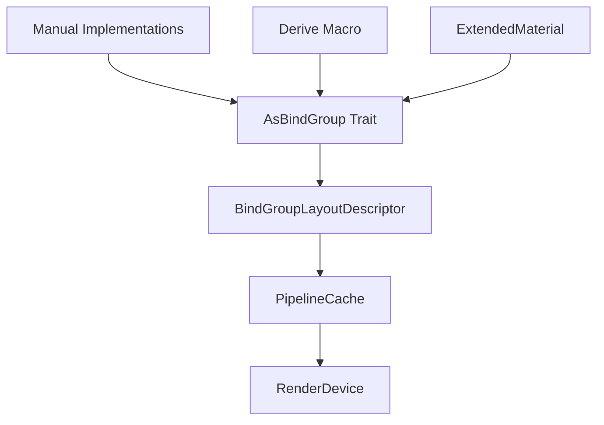

+++
title = "#21573 Make BindGroupLayout label non-optional"
date = "2025-10-17T00:00:00"
draft = false
template = "pull_request_page.html"
in_search_index = true

[taxonomies]
list_display = ["show"]

[extra]
current_language = "en"
available_languages = {"en" = { name = "English", url = "/pull_request/bevy/2025-10/pr-21573-en-20251017" }, "zh-cn" = { name = "中文", url = "/pull_request/bevy/2025-10/pr-21573-zh-cn-20251017" }}
labels = ["A-Rendering", "C-Code-Quality"]
+++

# Make BindGroupLayout label non-optional

## Basic Information
- **Title**: Make BindGroupLayout label non-optional
- **PR Link**: https://github.com/bevyengine/bevy/pull/21573
- **Author**: atlv24
- **Status**: MERGED
- **Labels**: A-Rendering, C-Code-Quality, S-Ready-For-Final-Review, X-Uncontroversial
- **Created**: 2025-10-17T04:38:56Z
- **Merged**: 2025-10-17T17:00:53Z
- **Merged By**: alice-i-cecile

## Description Translation

# Objective

- Always have labels on bindgroups

## Solution

- Make it not Option

## Testing

- ci

## The Story of This Pull Request

This PR addresses a code quality issue in Bevy's rendering system by making bind group layout labels mandatory rather than optional. The change simplifies the API and ensures consistent debugging information across the graphics pipeline.

The problem stemmed from the `BindGroupLayoutDescriptor` struct having an optional label field. In graphics programming, labels are crucial for debugging - they appear in GPU debuggers and performance profilers, helping developers identify resources during runtime. When labels were optional, some bind groups could end up without proper identification, making debugging more difficult.

The solution approach was straightforward: remove the `Option` wrapper from the label field and update all implementations to provide a label. This required changes across multiple areas of the codebase:

1. The core `BindGroupLayoutDescriptor` struct now requires a label
2. The `AsBindGroup` trait's `label()` method now returns `&'static str` instead of `Option<&'static str>`
3. All manual implementations of `AsBindGroup` must now provide a label
4. The derive macro for `AsBindGroup` was updated to generate the new signature

The implementation demonstrates good software engineering practices. By making labels mandatory, the API becomes more consistent and eliminates potential edge cases where developers might forget to provide labels. The change also simplifies the code by removing numerous `Option` checks and unwraps.

Here's the key change in the `AsBindGroup` trait:

```rust
// Before:
fn label() -> Option<&'static str> {
    None
}

// After:
fn label() -> &'static str;
```

The technical insight here is that bind group labels serve an important diagnostic purpose in graphics applications. During development and profiling, being able to identify specific bind groups in GPU debuggers is essential for optimizing performance and debugging rendering issues. Making labels mandatory ensures this diagnostic information is always available.

The impact of this change is primarily on code quality and developer experience. While it introduces a breaking change for manual `AsBindGroup` implementations, the migration is straightforward - developers simply need to implement the `label()` method with an appropriate string. The PR includes a comprehensive migration guide to assist with this transition.

One notable aspect of the implementation is how it handles the `ExtendedMaterial` type, which needed to delegate the label to its extension component:

```rust
fn label() -> &'static str {
    E::label()
}
```

This demonstrates proper composition patterns where the extended material inherits behavior from its extension component.

## Visual Representation



## Key Files Changed

### `crates/bevy_render/src/render_resource/bind_group.rs` (+2/-5)

This file contains the core `AsBindGroup` trait definition. The key change was making the `label()` method return a mandatory string instead of an optional:

```rust
// Before:
fn label() -> Option<&'static str> {
    None
}

// After:
fn label() -> &'static str;
```

### `crates/bevy_render/src/render_resource/pipeline.rs` (+4/-4)

The `BindGroupLayoutDescriptor` struct was updated to require a label:

```rust
// Before:
pub struct BindGroupLayoutDescriptor {
    pub label: Option<Cow<'static, str>>,
    // ...
}

// After:
pub struct BindGroupLayoutDescriptor {
    pub label: Cow<'static, str>,
    // ...
}
```

### `crates/bevy_render/macros/src/as_bind_group.rs` (+2/-2)

The derive macro for `AsBindGroup` was updated to generate the new method signature:

```rust
// Before:
fn label() -> Option<&'static str> {
    Some(#struct_name_literal)
}

// After:
fn label() -> &'static str {
    #struct_name_literal
}
```

### `crates/bevy_pbr/src/material_bind_groups.rs` (+8/-8)

This file contains material bind group allocators that needed updates to handle the mandatory labels:

```rust
// Multiple changes from Option<&'static str> to &'static str
// For example:
pub struct MaterialBindGroupBindlessAllocator {
    label: &'static str,  // Was Option<&'static str>
    // ...
}
```

### `examples/3d/manual_material.rs` (+7/-1)

The example was updated to provide a label for the material allocator:

```rust
// Before:
MaterialBindGroupAllocator::new(&render_device, None, None, bind_group_layout, None)

// After:
MaterialBindGroupAllocator::new(
    &render_device,
    "image_material_allocator",
    None,
    bind_group_layout,
    None,
)
```

### `release-content/migration-guides/bindgroup-labels-mandatory.md` (+14/-0)

A new migration guide was added to help developers update their code:

```markdown
In previous versions of Bevy, the `label` of a `BindGroupLayout` was optional. This practically only applies when implementing `AsBindGroup` manually without the `AsBindGroup` derive.

If you were previously omitting the `label` implementation from a `impl AsBindGroup`, you now must implement it:

```rust
fn label() -> &'static str {
    "my label"
}
```
```

## Further Reading

- [Bevy AsBindGroup Documentation](https://docs.rs/bevy/latest/bevy/render/render_resource/trait.AsBindGroup.html)
- [WGSL Bind Groups Specification](https://gpuweb.github.io/gpuweb/wgsl/#bind-groups)
- [Bevy Migration Guides](https://bevyengine.org/learn/migration-guides/)