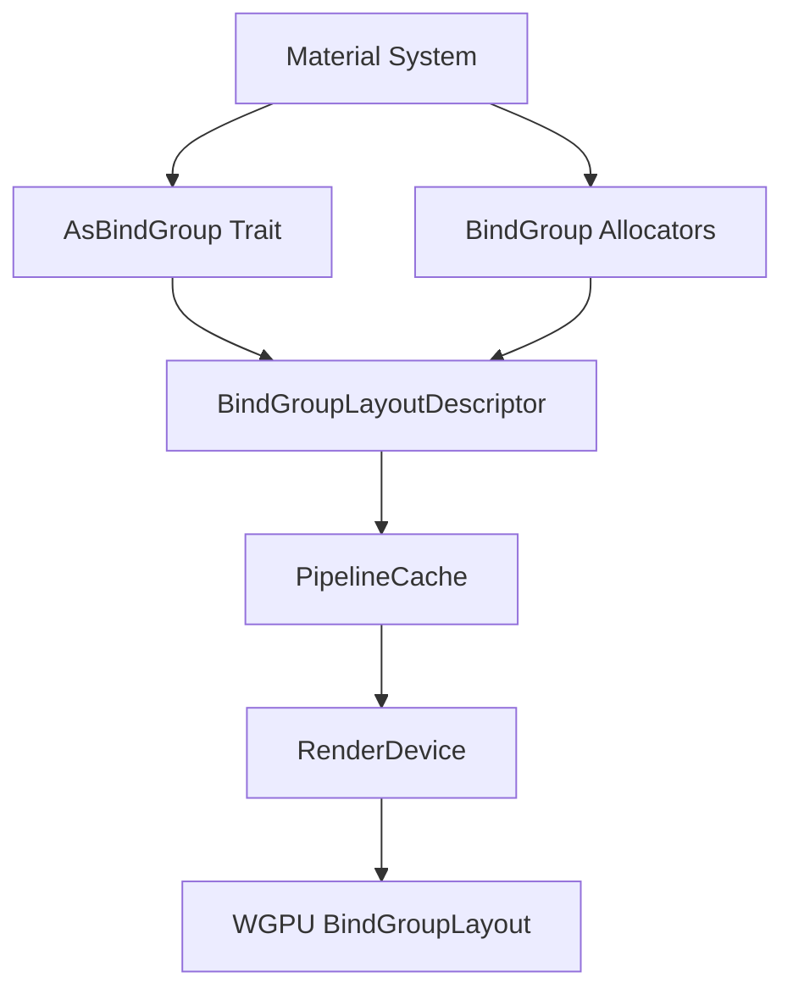

+++
title = "#21573 Make BindGroupLayout label non-optional"
date = "2025-10-17T00:00:00"
draft = false
template = "pull_request_page.html"
in_search_index = false

[extra]
current_language = "zh-cn"
available_languages = {"en" = { name = "English", url = "/pull_request/bevy/2025-10/pr-21573-en-20251017" }, "zh-cn" = { name = "中文", url = "/pull_request/bevy/2025-10/pr-21573-zh-cn-20251017" }}
labels = ["A-Rendering", "C-Code-Quality"]
+++

# Make BindGroupLayout label non-optional

## Basic Information
- **Title**: Make BindGroupLayout label non-optional
- **PR Link**: https://github.com/bevyengine/bevy/pull/21573
- **Author**: atlv24
- **Status**: MERGED
- **Labels**: A-Rendering, C-Code-Quality, S-Ready-For-Final-Review, X-Uncontroversial
- **Created**: 2025-10-17T04:38:56Z
- **Merged**: 2025-10-17T17:00:53Z
- **Merged By**: alice-i-cecile

## Description Translation
**目标**
- 始终在绑定组上设置标签

**解决方案**
- 使其不再是可选项

**测试**
- CI

## The Story of This Pull Request

这个PR解决了一个在Bevy渲染系统中关于绑定组布局标签一致性的问题。问题的核心在于`BindGroupLayout`的标签字段被定义为`Option<Cow<'static, str>>`类型，这意味着标签是可选的，这导致了在调试和分析渲染问题时难以追踪特定的绑定组布局。

问题的根源在于`AsBindGroup` trait中的`label()`方法返回`Option<&'static str>`，这使得实现者可以选择不提供标签。在复杂的渲染管线中，缺少标签会显著增加调试难度，特别是在处理多个材质和着色器时。

开发者采取的解决方案是强制要求所有绑定组布局都必须有标签。这个改变涉及多个层面的修改：

首先，`AsBindGroup` trait的签名被修改，`label()`方法现在返回`&'static str`而不是`Option<&'static str>`：

```rust
// Before:
fn label() -> Option<&'static str> {
    None
}

// After:  
fn label() -> &'static str;
```

这个改变是破坏性的，因为它要求所有实现`AsBindGroup`的类型都必须提供标签。为了简化迁移，`AsBindGroup`派生宏被更新为自动生成标签实现，使用结构体的名称作为默认标签。

相应的，`BindGroupLayoutDescriptor`结构体中的`label`字段类型也从`Option<Cow<'static, str>>`改为`Cow<'static, str>`：

```rust
// Before:
pub struct BindGroupLayoutDescriptor {
    pub label: Option<Cow<'static, str>>,
    // ...
}

// After:
pub struct BindGroupLayoutDescriptor {
    pub label: Cow<'static, str>,
    // ...
}
```

在实现层面，这个改变简化了代码逻辑，因为不再需要处理标签为`None`的情况。例如，在`pipeline_cache.rs`中，创建绑定组布局的代码变得更加简洁：

```rust
// Before:
render_device.create_bind_group_layout(
    descriptor.label.as_ref().map(Cow::as_ref),
    &descriptor.entries,
)

// After:
render_device.create_bind_group_layout(
    descriptor.label.as_ref(), 
    &descriptor.entries,
)
```

在材质系统中，`MaterialBindGroupAllocator`和相关组件的构造函数签名也被更新，要求传入具体的标签字符串而不是`Option`。这确保了在整个材质管线中标签的一致性。

这个改变的技术优势在于：
1. 提高了调试能力 - 现在所有绑定组布局在图形调试器中都有可识别的标签
2. 移除了潜在的错误路径 - 不再需要处理标签缺失的情况
3. 强制了最佳实践 - 鼓励开发者为资源提供有意义的标识符

对于现有代码的迁移，PR包含了详细的迁移指南，指导开发者如何更新手动实现的`AsBindGroup` trait。如果之前省略了`label`实现，现在必须提供：

```rust
fn label() -> &'static str {
    "my_label"
}
```

这个PR体现了API设计中的一个重要原则：通过强制要求合理的默认行为来简化使用体验，同时通过明确的错误信息指导开发者正确使用API。

## Visual Representation



## Key Files Changed

### `crates/bevy_render/src/render_resource/bind_group.rs` (+2/-5)
这个文件包含了`AsBindGroup` trait的定义，是核心变更所在：
```rust
// 关键变更:
// Before:
fn label() -> Option<&'static str> {
    None
}

// After:
fn label() -> &'static str;
```

### `crates/bevy_render/macros/src/as_bind_group.rs` (+2/-2)
更新了派生宏以生成新的标签实现：
```rust
// Before:
fn label() -> Option<&'static str> {
    Some(#struct_name_literal)
}

// After:
fn label() -> &'static str {
    #struct_name_literal
}
```

### `crates/bevy_render/src/render_resource/pipeline.rs` (+2/-2)
修改了`BindGroupLayoutDescriptor`结构体：
```rust
// Before:
pub label: Option<Cow<'static, str>>,

// After:  
pub label: Cow<'static, str>,
```

### `crates/bevy_pbr/src/material_bind_groups.rs` (+8/-8)
更新了材质绑定组分配器的接口：
```rust
// 多个方法签名从 Option<&'static str> 改为 &'static str
pub fn new(
    render_device: &RenderDevice,
    label: &'static str,  // 之前是 Option<&'static str>
    // ...
)
```

### `examples/3d/manual_material.rs` (+7/-1)
更新了示例代码以使用新的API：
```rust
// Before:
MaterialBindGroupAllocator::new(&render_device, None, None, bind_group_layout, None)

// After:
MaterialBindGroupAllocator::new(
    &render_device,
    "image_material_allocator",  // 现在必须提供标签
    None,
    bind_group_layout,
    None,
)
```

### `release-content/migration-guides/bindgroup-labels-mandatory.md` (+14/-0)
新增了迁移指南，帮助开发者适应这个破坏性变更。

## Further Reading

- [Bevy AsBindGroup Documentation](https://docs.rs/bevy/latest/bevy/render/render_resource/trait.AsBindGroup.html)
- [WGPU Bind Groups](https://wgpu.rs/explainer/bind_groups.html)
- [Rust Trait Design Guidelines](https://rust-lang.github.io/api-guidelines/)
- [Bevy Migration Guides](https://bevyengine.org/learn/migration-guides/)