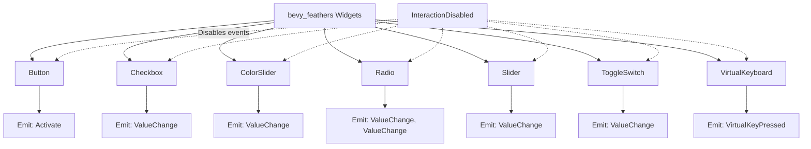

+++
title = "#21578 Add emitted events to feathers widgets' documentation"
date = "2025-10-17T00:00:00"
draft = false
template = "pull_request_page.html"
in_search_index = true

[taxonomies]
list_display = ["show"]

[extra]
current_language = "en"
available_languages = {"en" = { name = "English", url = "/pull_request/bevy/2025-10/pr-21578-en-20251017" }, "zh-cn" = { name = "中文", url = "/pull_request/bevy/2025-10/pr-21578-zh-cn-20251017" }}
labels = ["C-Docs", "A-UI"]
+++

# Title
Add emitted events to feathers widgets' documentation

## Basic Information
- **Title**: Add emitted events to feathers widgets' documentation
- **PR Link**: https://github.com/bevyengine/bevy/pull/21578
- **Author**: pine-free
- **Status**: MERGED
- **Labels**: C-Docs, A-UI, S-Ready-For-Final-Review
- **Created**: 2025-10-17T12:28:21Z
- **Merged**: 2025-10-17T18:11:25Z
- **Merged By**: alice-i-cecile

## Description Translation
**Objective**

Fixes #21515

**Solution**

Added documentation to all bevy_feathers widgets functions,
detailing which events they emit under which circumstances

**Testing**

Since this is a documentation change there isn't much to test, but if someone with more knowledge
goes over this one and makes sure i didn't miss anything i'd be grateful

## The Story of This Pull Request

This PR addresses a documentation gap in the Bevy engine's UI system. The bevy_feathers module provides various UI widgets, but developers using these widgets lacked clear documentation about what events each widget emits and under what conditions. This made it difficult for developers to properly handle user interactions with UI elements.

The core problem was straightforward: when developers use widgets like buttons, sliders, or checkboxes, they need to know what events to listen for and when those events are triggered. Without this information, developers would have to either read the source code or experiment to understand the widget behavior.

The solution approach was systematic and comprehensive. The author went through each major widget type in the bevy_feathers controls module and added consistent documentation about emitted events. Each widget function now includes an "# Emitted events" section in its doc comments that clearly lists:

- Which event types are emitted
- The specific conditions that trigger each event
- How to disable event emission using the `InteractionDisabled` component

For example, the button widget documentation now specifies that it emits `Activate` events when the pointer is released while hovering, or when ENTER/SPACE keys are pressed while focused. Similarly, value-based widgets like sliders and checkboxes document their `ValueChange` events with the appropriate type parameters.

The implementation follows a consistent pattern across all widgets. Each function now includes a standardized documentation section that makes the event behavior explicit and discoverable. This consistency is important because it establishes a clear pattern that developers can rely on when working with different widget types.

One notable aspect is the attention to detail in documenting the generic types for events. For instance, the radio button documentation specifies that it emits both `ValueChange<bool>` for individual button state and `ValueChange<Entity>` for group selection changes, showing careful consideration of the widget's complete behavior.

The impact of these changes is significant for developer experience. Now, when developers use these widgets, they can easily understand what events to handle without digging into the implementation details. This reduces the learning curve and makes the UI system more approachable.

## Visual Representation



## Key Files Changed

**crates/bevy_feathers/src/controls/button.rs** (+7/-0)
- Added documentation for button event emissions
- Documents `Activate` events from pointer release and keyboard interactions

```rust
// File: crates/bevy_feathers/src/controls/button.rs
// After:
/// # Emitted events
/// * [`bevy_ui_widgets::Activate`] when any of the following happens:
///     * the pointer is released while hovering over the button.
///     * the ENTER or SPACE key is pressed while the button has keyboard focus.
///
///  These events can be disabled by adding an [`bevy_ui::InteractionDisabled`] component to the entity
```

**crates/bevy_feathers/src/controls/checkbox.rs** (+5/-0)
- Added documentation for checkbox value change events
- Documents `ValueChange<bool>` events when state changes

```rust
// File: crates/bevy_feathers/src/controls/checkbox.rs
// After:
/// # Emitted events
/// * [`bevy_ui_widgets::ValueChange<bool>`] with the new value when the checkbox changes state.
///
///  These events can be disabled by adding an [`bevy_ui::InteractionDisabled`] component to the entity
```

**crates/bevy_feathers/src/controls/color_slider.rs** (+6/-0)
- Added documentation for color slider value change events
- Documents `ValueChange<f32>` events when value changes

```rust
// File: crates/bevy_feathers/src/controls/color_slider.rs
// After:
/// # Emitted events
///
/// * [`bevy_ui_widgets::ValueChange<f32>`] when the slider value is changed.
///
///  These events can be disabled by adding an [`bevy_ui::InteractionDisabled`] component to the entity
```

**crates/bevy_feathers/src/controls/radio.rs** (+6/-0)
- Added comprehensive documentation for radio button events
- Documents both individual state changes and group selection changes

```rust
// File: crates/bevy_feathers/src/controls/radio.rs
// After:
/// # Emitted events
/// * [`bevy_ui_widgets::ValueChange<bool>`] with the value true when it becomes checked.
/// * [`bevy_ui_widgets::ValueChange<Entity>`] with the selected entity's id when a new radio button is selected.
///
///  These events can be disabled by adding an [`bevy_ui::InteractionDisabled`] component to the entity
```

**crates/bevy_feathers/src/controls/slider.rs** (+6/-0)
- Added documentation for slider value change events
- Documents `ValueChange<f32>` events when slider value changes

```rust
// File: crates/bevy_feathers/src/controls/slider.rs
// After:
/// # Emitted events
///
/// * [`bevy_ui_widgets::ValueChange<f32>`] when the slider value is changed.
///
///  These events can be disabled by adding an [`bevy_ui::InteractionDisabled`] component to the entity
```

**crates/bevy_feathers/src/controls/toggle_switch.rs** (+5/-0)
- Added documentation for toggle switch value change events
- Documents `ValueChange<bool>` events when state changes

```rust
// File: crates/bevy_feathers/src/controls/toggle_switch.rs
// After:
/// # Emitted events
/// * [`bevy_ui_widgets::ValueChange<bool>`] with the new value when the toggle switch changes state.
///
/// These events can be disabled by adding an [`bevy_ui::InteractionDisabled`] component to the bundle
```

**crates/bevy_feathers/src/controls/virtual_keyboard.rs** (+5/-0)
- Added documentation for virtual keyboard key press events
- Documents `VirtualKeyPressed<T>` events on key release

```rust
// File: crates/bevy_feathers/src/controls/virtual_keyboard.rs
// After:
/// # Emitted events
/// * [`crate::controls::VirtualKeyPressed<T>`] when a virtual key on the keyboard is un-pressed.
///
///  These events can be disabled by adding an [`bevy_ui::InteractionDisabled`] component to the entity
```

## Further Reading

- [Bevy UI Documentation](https://bevyengine.org/learn/quick-start/ui/)
- [Bevy Events System](https://bevyengine.org/learn/quick-start/events/)
- [Rust Documentation Comments](https://doc.rust-lang.org/rust-by-example/meta/doc.html)
- [Bevy UI Widgets Source Code](https://github.com/bevyengine/bevy/tree/main/crates/bevy_ui_widgets)