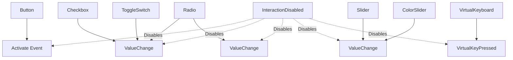

+++
title = "#21578 Add emitted events to feathers widgets' documentation"
date = "2025-10-17T00:00:00"
draft = false
template = "pull_request_page.html"
in_search_index = false

[extra]
current_language = "zh-cn"
available_languages = {"en" = { name = "English", url = "/pull_request/bevy/2025-10/pr-21578-en-20251017" }, "zh-cn" = { name = "中文", url = "/pull_request/bevy/2025-10/pr-21578-zh-cn-20251017" }}
labels = ["C-Docs", "A-UI"]
+++

# Add emitted events to feathers widgets' documentation

## Basic Information
- **Title**: Add emitted events to feathers widgets' documentation
- **PR Link**: https://github.com/bevyengine/bevy/pull/21578
- **Author**: pine-free
- **Status**: MERGED
- **Labels**: C-Docs, A-UI, S-Ready-For-Final-Review
- **Created**: 2025-10-17T12:28:21Z
- **Merged**: 2025-10-17T18:11:25Z
- **Merged By**: alice-i-cecile

## Description Translation
**目标 (Objective)**
修复 #21515

**解决方案 (Solution)**
为所有 bevy_feathers 控件函数添加了文档，详细说明了它们在什么情况下会发出哪些事件。

**测试 (Testing)**
由于这是一个文档变更，没有太多需要测试的内容，但如果有人有更多知识能够检查一下确保我没有遗漏任何内容，我将不胜感激。

## The Story of This Pull Request

这个PR解决了一个直接的文档问题：Bevy引擎的feathers UI控件缺少关于它们发出哪些事件的关键信息。当开发者使用这些UI控件时，他们需要知道用户交互会触发什么事件，以便能够正确处理用户输入和构建响应式界面。

问题背景是issue #21515，它指出了feathers控件的文档中缺少事件发射信息的缺陷。在UI开发中，事件系统是核心交互机制，开发者需要确切知道每个控件在什么条件下会发出什么事件，以及这些事件的数据结构。

开发者pine-free采用了系统性的方法来解决这个问题，遍历了bevy_feathers模块中的所有主要控件函数，为每个函数添加了标准化的"# Emitted events"文档部分。这种一致性很重要，因为它让开发者能够以相同的方式查找所有控件的事件信息。

从技术实现角度看，这个PR展示了良好的文档实践。每个控件的事件文档都遵循相同的模式：首先列出会发出的事件类型，然后说明触发条件，最后统一说明如何禁用这些事件。这种一致性提高了代码的可维护性和开发者的使用体验。

特别值得注意的是文档中提到的`bevy_ui::InteractionDisabled`组件。这个信息很有价值，因为它告诉开发者有一个统一的方式来禁用所有控件的事件发射，而不需要针对每个控件使用不同的方法。

对于radio控件，文档特别详细，说明了它会发出两种不同类型的事件：`ValueChange<bool>`和`ValueChange<Entity>`。这反映了radio控件的特殊性，它既需要表示自身的选中状态，又需要在单选组中协调选择。

virtual_keyboard控件的事件文档略有不同，因为它使用的是模块内定义的事件类型`VirtualKeyPressed<T>`，而不是通用的UI事件。这表明了特殊控件的定制化需求。

从工程角度看，这个PR虽然只涉及文档变更，但对项目的可用性有显著影响。良好的API文档是任何成功开源项目的关键组成部分，特别是对于像Bevy这样面向游戏开发的引擎，UI交互的清晰文档尤为重要。

## Visual Representation



## Key Files Changed

这个PR修改了7个控件文件，为每个控件的构造函数添加了事件发射文档：

### `crates/bevy_feathers/src/controls/button.rs` (+7/-0)
为按钮控件添加了事件文档，说明在指针悬停时释放或具有键盘焦点时按下ENTER/SPACE键会发出`Activate`事件。

```rust
// File: crates/bevy_feathers/src/controls/button.rs
// After:
/// # Emitted events
/// * [`bevy_ui_widgets::Activate`] when any of the following happens:
///     * the pointer is released while hovering over the button.
///     * the ENTER or SPACE key is pressed while the button has keyboard focus.
///
///  These events can be disabled by adding an [`bevy_ui::InteractionDisabled`] component to the entity
```

### `crates/bevy_feathers/src/controls/checkbox.rs` (+5/-0)
为复选框控件添加了状态变化时发出`ValueChange<bool>`事件的文档。

```rust
// File: crates/bevy_feathers/src/controls/checkbox.rs
// After:
/// # Emitted events
/// * [`bevy_ui_widgets::ValueChange<bool>`] with the new value when the checkbox changes state.
///
///  These events can be disabled by adding an [`bevy_ui::InteractionDisabled`] component to the entity
```

### `crates/bevy_feathers/src/controls/color_slider.rs` (+6/-0)
为颜色滑块控件添加了值变化时发出`ValueChange<f32>`事件的文档。

```rust
// File: crates/bevy_feathers/src/controls/color_slider.rs
// After:
/// # Emitted events
///
/// * [`bevy_ui_widgets::ValueChange<f32>`] when the slider value is changed.
///
///  These events can be disabled by adding an [`bevy_ui::InteractionDisabled`] component to the entity
```

### `crates/bevy_feathers/src/controls/radio.rs` (+6/-0)
为单选按钮控件添加了文档，说明选中时会发出`ValueChange<bool>`和`ValueChange<Entity>`两种事件。

```rust
// File: crates/bevy_feathers/src/controls/radio.rs
// After:
/// # Emitted events
/// * [`bevy_ui_widgets::ValueChange<bool>`] with the value true when it becomes checked.
/// * [`bevy_ui_widgets::ValueChange<Entity>`] with the selected entity's id when a new radio button is selected.
///
///  These events can be disabled by adding an [`bevy_ui::InteractionDisabled`] component to the entity
```

### `crates/bevy_feathers/src/controls/slider.rs` (+6/-0)
为普通滑块控件添加了值变化时发出`ValueChange<f32>`事件的文档。

```rust
// File: crates/bevy_feathers/src/controls/slider.rs
// After:
/// # Emitted events
///
/// * [`bevy_ui_widgets::ValueChange<f32>`] when the slider value is changed.
///
///  These events can be disabled by adding an [`bevy_ui::InteractionDisabled`] component to the entity
```

### `crates/bevy_feathers/src/controls/toggle_switch.rs` (+5/-0)
为切换开关控件添加了状态变化时发出`ValueChange<bool>`事件的文档。

```rust
// File: crates/bevy_feathers/src/controls/toggle_switch.rs
// After:
/// # Emitted events
/// * [`bevy_ui_widgets::ValueChange<bool>`] with the new value when the toggle switch changes state.
///
/// These events can be disabled by adding an [`bevy_ui::InteractionDisabled`] component to the bundle
```

### `crates/bevy_feathers/src/controls/virtual_keyboard.rs` (+5/-0)
为虚拟键盘控件添加了按键释放时发出`VirtualKeyPressed<T>`事件的文档。

```rust
// File: crates/bevy_feathers/src/controls/virtual_keyboard.rs
// After:
/// # Emitted events
/// * [`crate::controls::VirtualKeyPressed<T>`] when a virtual key on the keyboard is un-pressed.
///
///  These events can be disabled by adding an [`bevy_ui::InteractionDisabled`] component to the entity
```

## Further Reading

- [Bevy UI Documentation](https://docs.rs/bevy_ui/latest/bevy_ui/) - Bevy UI系统的官方文档
- [Bevy Events System](https://bevy-cheatbook.github.io/programming/events.html) - Bevy事件系统的工作原理
- [Rust Documentation Guidelines](https://rust-lang.github.io/rfcs/1574-more-api-documentation-conventions.html) - Rust API文档编写指南
- [Bevy Feathers Module](https://github.com/bevyengine/bevy/tree/main/crates/bevy_feathers) - Feathers UI模块的源代码