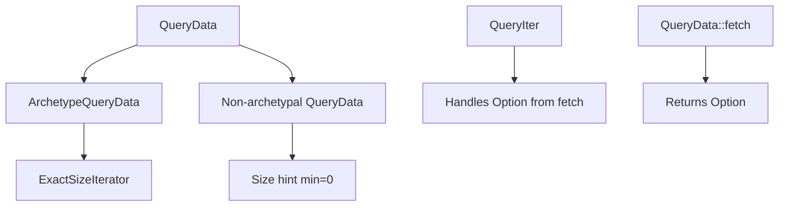

+++
title = "#21581 Support non-archetypal `QueryData`"
date = "2025-10-29T00:00:00"
draft = false
template = "pull_request_page.html"
in_search_index = true

[taxonomies]
list_display = ["show"]

[extra]
current_language = "en"
available_languages = {"en" = { name = "English", url = "/pull_request/bevy/2025-10/pr-21581-en-20251029" }, "zh-cn" = { name = "中文", url = "/pull_request/bevy/2025-10/pr-21581-zh-cn-20251029" }}
labels = ["C-Feature", "A-ECS", "M-Migration-Guide"]
+++

# Support non-archetypal `QueryData`

## Basic Information
- **Title**: Support non-archetypal `QueryData`
- **PR Link**: https://github.com/bevyengine/bevy/pull/21581
- **Author**: chescock
- **Status**: MERGED
- **Labels**: C-Feature, A-ECS, S-Ready-For-Final-Review, M-Migration-Guide
- **Created**: 2025-10-17T14:34:14Z
- **Merged**: 2025-10-29T19:31:42Z
- **Merged By**: alice-i-cecile

## Description Translation

# Objective

For #17647, we want to create a `QueryData` that can follow a relation and query data from an entity's parent.  If the parent does not have the queried data, the child entity should be skipped in the query.  However, there is no way to tell from the child's archetype whether the parent will match!  So, we need to support *non-archetypal* `QueryData`, just as we support non-archetypal `QueryFilter`s for `Added` and `Changed`.  

That is, if `Query<Parent<&T>>` yields `&T`, and we do:

```rust
let parent1 = world.spawn(T).id();
let child1 = world.spawn(ChildOf(parent1));
let parent2 = world.spawn(()).id();
let child2 = world.spawn(ChildOf(parent2));

let query = world.query::<Parent<&T>>();
```

then `query` must yield a row for `child1` but not for `child2`, even though they have the same archetype.  

## Solution

Change `QueryData::fetch` to return `Option` so that entities can be filtered during fetching by returning `None`.  

To support `ExactSizeIterator`, introduce an `ArchetypeQueryData` trait and an `QueryData::IS_ARCHETYPAL` associated constant, similar to `ArchetypeFilter` and `QueryFilter::IS_ARCHETYPAL`.  Implement this trait on existing `QueryData` types.  Modify `ExactSizeIterator` implementations to require `D: ArchetypeQueryData`, and the `size_hint()` methods to return a minimum size of `0` if `!D::IS_ARCHETYPAL`.  

## Alternatives

We could do nothing here, and have `Query<Parent<&T>>` yield `Option<&T>`.  That makes the API less convenient, though.  Note that if one *wants* to query for `Option`, they can use either `Query<Option<Parent<&T>>` or `Query<Parent<Option<&T>>`, depending on whether they want to include entities with no parent.  

Another option is to re-use the `ArchetypeFilter` trait instead of introducing a new one.  There are no places where we want to abstract over both, however, and it would require writing bounds like `D: QueryData + ArchetypeFilter, F: QueryFilter + ArchetypeFilter` instead of simply `D: ArchetypeQueryData, F: ArchetypeFilter`.  

## The Story of This Pull Request

This PR addresses a fundamental limitation in Bevy's ECS query system by introducing support for non-archetypal query data. The core problem was that some queries need to filter entities based on conditions that cannot be determined from archetype information alone.

The traditional ECS query model relies on archetypes to quickly determine which entities match a query. However, certain use cases - particularly when working with entity relations - require runtime evaluation that goes beyond archetype checks. For example, when querying a parent component through a child entity, the child's archetype doesn't reveal whether the parent has the required component.

The solution modifies the `QueryData::fetch` method to return `Option<Self::Item>` instead of `Self::Item`. This allows query implementations to return `None` for entities that don't match the query conditions, even if they have the correct archetype. This change enables queries to perform runtime filtering that can't be handled at the archetype level.

To maintain performance optimizations for archetype-only queries, the PR introduces an `ArchetypeQueryData` marker trait and a `QueryData::IS_ARCHETYPAL` associated constant. Queries that only rely on archetype information can implement this trait, which allows iterators to provide exact size information and other optimizations.

The implementation required changes throughout the ECS query system. The `fetch` method signature was updated across all query data types, and iterator implementations were modified to handle the optional nature of query results. The derive macros for `QueryData` were updated to automatically handle the new `IS_ARCHETYPAL` constant and generate appropriate trait implementations.

One key insight in this implementation is how it maintains backward compatibility while enabling new functionality. Existing queries continue to work unchanged because they now return `Some(item)` where they previously returned `item`. The `ArchetypeQueryData` trait is automatically implemented for all existing query data types through the derive macros.

The changes also required careful handling of iterator size hints. For non-archetypal queries, the minimum size hint is now 0, since we can't determine the exact count without iterating through all entities. This preserves correctness while allowing performance optimizations for archetypal queries.

## Visual Representation



## Key Files Changed

### `crates/bevy_ecs/src/query/fetch.rs` (+155/-48)

This file contains the core `QueryData` trait and its implementations. The key changes include:

- Added `IS_ARCHETYPAL` constant to `QueryData` trait
- Modified `fetch` method to return `Option<Self::Item>`
- Introduced `ArchetypeQueryData` marker trait
- Updated all existing `QueryData` implementations to return `Some`

```rust
// Before:
unsafe fn fetch<'w>(
    state: &Self::State,
    fetch: &mut Self::Fetch<'w>,
    entity: Entity,
    table_row: TableRow,
) -> Self::Item<'w, 's> {
    entity
}

// After:
unsafe fn fetch<'w>(
    state: &Self::State,
    fetch: &mut Self::Fetch<'w>,
    entity: Entity,
    table_row: TableRow,
) -> Option<Self::Item<'w, 's>> {
    Some(entity)
}
```

### `crates/bevy_ecs/src/query/iter.rs` (+112/-78)

This file handles query iteration logic. The changes ensure iterators properly handle the new optional fetch results:

- Modified iteration to skip entities where `fetch` returns `None`
- Updated size hint calculations for non-archetypal queries
- Restricted `ExactSizeIterator` to archetypal query data

```rust
// Key change in iteration logic:
if let Some(item) = D::fetch(
    &self.query_state.fetch_state,
    &mut self.cursor.fetch,
    *entity,
    row,
) {
    accum = func(accum, item);
}
```

### `crates/bevy_ecs/src/system/query.rs` (+33/-15)

This file contains the `Query` system parameter implementation. The changes optimize query operations:

- Updated `count()` and `is_empty()` to handle non-archetypal queries efficiently
- Modified `contains()` to work with both archetypal and non-archetypal queries

```rust
// Optimized count implementation:
pub fn count(&self) -> usize {
    if !D::IS_ARCHETYPAL {
        self.into_iter().count()
    } else if !F::IS_ARCHETYPAL {
        self.as_nop().into_iter().count()
    } else {
        self.as_nop().into_iter().size_hint().0
    }
}
```

### `crates/bevy_ecs/macros/src/query_data.rs` (+22/-8)

This file contains the derive macro for `QueryData`. The updates ensure generated code works with the new system:

- Added `IS_ARCHETYPAL` constant generation
- Modified generated `fetch` method to return `Option` and use `?` operator
- Added automatic `ArchetypeQueryData` implementation

```rust
// Generated code changes:
const IS_ARCHETYPAL: bool = true #(&& <#field_types as #path::query::QueryData>::IS_ARCHETYPAL)*;

unsafe fn fetch(...) -> Option<Self::Item<'w, 's>> {
    Some(Self::Item {
        #(#field_idents: <#field_types>::fetch(...)?,)*
    })
}
```

### `release-content/migration-guides/archetype_query_data.md` (+27/-0)

This new migration guide explains the changes and provides upgrade instructions:

- Explains the new `ArchetypeQueryData` trait
- Shows how to update code that requires `ExactSizeIterator`
- Documents the new `IS_ARCHETYPAL` constant for manual implementations

## Further Reading

- [Bevy ECS Query Documentation](https://docs.rs/bevy_ecs/latest/bevy_ecs/query/index.html)
- [Entity Component System Architecture](https://en.wikipedia.org/wiki/Entity_component_system)
- [Rust Option Type](https://doc.rust-lang.org/std/option/enum.Option.html)