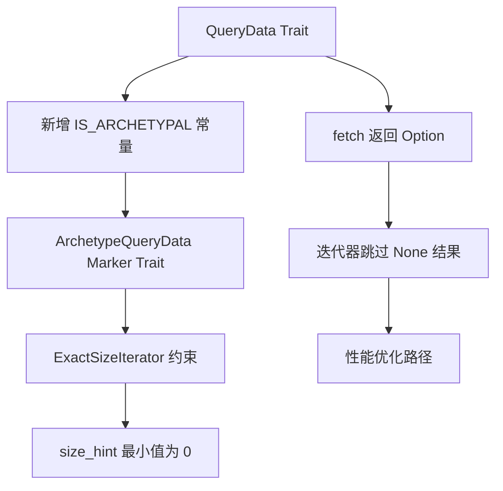

+++
title = "#21581 Support non-archetypal `QueryData`"
date = "2025-10-29T00:00:00"
draft = false
template = "pull_request_page.html"
in_search_index = false

[extra]
current_language = "zh-cn"
available_languages = {"en" = { name = "English", url = "/pull_request/bevy/2025-10/pr-21581-en-20251029" }, "zh-cn" = { name = "中文", url = "/pull_request/bevy/2025-10/pr-21581-zh-cn-20251029" }}
labels = ["C-Feature", "A-ECS", "M-Migration-Guide"]
+++

# Title
Support non-archetypal `QueryData`

## Basic Information
- **Title**: Support non-archetypal `QueryData`
- **PR Link**: https://github.com/bevyengine/bevy/pull/21581
- **Author**: chescock
- **Status**: MERGED
- **Labels**: C-Feature, A-ECS, S-Ready-For-Final-Review, M-Migration-Guide
- **Created**: 2025-10-17T14:34:14Z
- **Merged**: 2025-10-29T19:31:42Z
- **Merged By**: alice-i-cecile

## Description Translation
### 目标

对于 #17647，我们想要创建一个 `QueryData`，它可以跟随关系并查询实体父级的数据。如果父级没有查询的数据，则子实体应该在查询中被跳过。然而，从子实体的原型（archetype）无法判断父级是否会匹配！因此，我们需要支持*非原型*的 `QueryData`，就像我们为 `Added` 和 `Changed` 支持非原型的 `QueryFilter` 一样。

也就是说，如果 `Query<Parent<&T>>` 返回 `&T`，并且我们执行：

```rust
let parent1 = world.spawn(T).id();
let child1 = world.spawn(ChildOf(parent1));
let parent2 = world.spawn(()).id();
let child2 = world.spawn(ChildOf(parent2));

let query = world.query::<Parent<&T>>();
```

那么 `query` 必须为 `child1` 返回一行，而不为 `child2` 返回，即使它们具有相同的原型。

### 解决方案

修改 `QueryData::fetch` 以返回 `Option`，这样实体可以在获取过程中通过返回 `None` 被过滤掉。

为了支持 `ExactSizeIterator`，引入一个 `ArchetypeQueryData` trait 和一个 `QueryData::IS_ARCHETYPAL` 关联常量，类似于 `ArchetypeFilter` 和 `QueryFilter::IS_ARCHETYPAL`。在现有的 `QueryData` 类型上实现这个 trait。修改 `ExactSizeIterator` 的实现，要求 `D: ArchetypeQueryData`，并且如果 `!D::IS_ARCHETYPAL`，则 `size_hint()` 方法返回的最小大小为 `0`。

### 替代方案

我们可以什么都不做，让 `Query<Parent<&T>>` 返回 `Option<&T>`。但这会让 API 不太方便。注意，如果确实需要查询 `Option`，可以使用 `Query<Option<Parent<&T>>>` 或 `Query<Parent<Option<&T>>>`，具体取决于是否要包含没有父级的实体。

另一个选择是重新使用 `ArchetypeFilter` trait 而不是引入一个新的。但是，没有地方需要同时抽象两者，并且需要编写像 `D: QueryData + ArchetypeFilter, F: QueryFilter + ArchetypeFilter` 这样的约束，而不是简单的 `D: ArchetypeQueryData, F: ArchetypeFilter`。

## The Story of This Pull Request

### 问题背景与约束

在 Bevy ECS 中，查询系统（Query System）是核心组件之一，它允许开发者高效地遍历和操作符合特定条件的实体。传统的 `QueryData` 实现依赖于原型（archetype）级别的过滤 - 这意味着实体是否匹配查询完全由其实体类型决定。然而，这种设计存在一个关键限制：无法支持基于运行时条件或跨实体关系的过滤。

具体的问题场景出现在 #17647 中，开发者需要实现父子关系查询。考虑这样一个用例：查询具有父组件且父实体拥有特定组件的子实体。在这种情况下，子实体的原型无法告诉我们其父实体是否拥有所需组件，因为父子关系是动态建立的，且父实体可能属于不同的原型。

```rust
let parent1 = world.spawn(T).id();        // 有组件T的父实体
let child1 = world.spawn(ChildOf(parent1)); // 应该匹配查询
let parent2 = world.spawn(()).id();       // 没有组件T的父实体  
let child2 = world.spawn(ChildOf(parent2)); // 不应该匹配查询
```

即使 `child1` 和 `child2` 具有相同的原型，查询 `Query<Parent<&T>>` 也应该只返回 `child1`。这就是非原型查询数据的需求所在。

### 解决方案架构

PR 的核心思路是将 `QueryData::fetch` 方法的返回类型从直接的值改为 `Option`。这样，在数据获取阶段就可以通过返回 `None` 来过滤掉不匹配的实体。这种设计保持了 API 的简洁性 - 用户仍然可以直接获得 `&T` 而不是 `Option<&T>`。

为了维护迭代器性能特性，特别是 `ExactSizeIterator`，引入了新的 `ArchetypeQueryData` trait 和 `QueryData::IS_ARCHETYPAL` 关联常量。原型查询数据保证 `fetch` 总是返回 `Some`，因此可以精确计算迭代器大小；而非原型查询数据则只能提供大小范围估计。

```rust
// 新的 QueryData trait 定义
pub unsafe trait QueryData: WorldQuery {
    const IS_ARCHETYPAL: bool;
    // ...
    unsafe fn fetch<'w, 's>(
        state: &'s Self::State,
        fetch: &mut Self::Fetch<'w>,
        entity: Entity,
        table_row: TableRow,
    ) -> Option<Self::Item<'w, 's>>;
}
```

### 实现细节与技术决策

**核心修改**主要集中在三个层面：

1. **QueryData trait 扩展**：为所有内置的查询数据类型添加 `IS_ARCHETYPAL = true` 并实现 `ArchetypeQueryData` trait。这包括 `Entity`、`&T`、`&mut T`、`Ref<T>` 等基础类型。

2. **迭代器逻辑重构**：所有查询迭代器现在都需要检查 `fetch` 的返回值，并在遇到 `None` 时跳过当前实体。这影响了 `QueryIter`、`QuerySortedIter` 等多个迭代器实现。

```rust
// 修改后的迭代逻辑 - 在 crates/bevy_ecs/src/query/iter.rs
if let Some(item) = D::fetch(
    &self.query_state.fetch_state,
    &mut self.cursor.fetch,
    *entity,
    row,
) {
    accum = func(accum, item);
}
```

3. **性能优化考虑**：对于原型查询，仍然可以利用现有的优化路径。例如在 `Query::count()` 方法中，如果是原型查询，可以直接通过原型计数来获得精确结果，避免实体级别的迭代。

```rust
// 在 crates/bevy_ecs/src/system/query.rs 中的优化
if D::IS_ARCHETYPAL {
    self.as_nop().iter().next().is_none()
} else {
    self.iter().next().is_none()
}
```

**工程权衡**方面，开发者考虑了多个替代方案：
- 让所有查询都返回 `Option` 会破坏现有 API 的简洁性
- 重用 `ArchetypeFilter` trait 会导致更复杂的类型约束
- 最终选择引入专门的 `ArchetypeQueryData` trait 保持了接口的清晰性

### 宏系统适配

派生宏 `derive_query_data_impl` 需要自动生成 `IS_ARCHETYPAL` 常量和 `ArchetypeQueryData` 实现。对于复合查询类型（如元组），其 `IS_ARCHETYPAL` 是所有字段的 `IS_ARCHETYPAL` 的逻辑与。

```rust
// 在 crates/bevy_ecs/macros/src/query_data.rs 中的修改
const IS_ARCHETYPAL: bool = true #(&& <#field_types as #path::query::QueryData>::IS_ARCHETYPAL)*;
```

对于 `Option<T>` 类型，无论 `T` 是否为原型查询，`Option<T>` 本身都是原型查询，因为它匹配所有实体。

### 边界情况处理

PR 还处理了几个重要的边界情况：

1. **Or 过滤器的优化**：当使用 `Or` 过滤器且查询是原型级别时，可以跳过某些初始化步骤。

2. **AnyOf 查询的兼容性**：确保 `AnyOf` 查询在非原型场景下正确工作。

3. **迁移指南**：为手动实现 `QueryData` 的代码提供了明确的迁移指导。

### 影响与意义

这个改动为 Bevy ECS 开启了新的可能性：
- **关系查询**：支持基于实体间关系的复杂查询模式
- **动态过滤**：允许在运行时基于任意条件过滤实体
- **API 扩展性**：为未来更复杂的查询需求提供了基础架构

同时保持了向后兼容性 - 所有现有的查询数据默认都是原型查询，因此现有代码无需修改。

## Visual Representation



## Key Files Changed

### `crates/bevy_ecs/src/query/fetch.rs` (+155/-48)
核心 trait 定义修改，为所有内置查询数据类型添加原型查询支持。

**关键修改：**
```rust
// 之前：
unsafe fn fetch<'w, 's>(
    state: &'s Self::State,
    fetch: &mut Self::Fetch<'w>,
    entity: Entity,
    table_row: TableRow,
) -> Self::Item<'w, 's>;

// 之后：
unsafe fn fetch<'w, 's>(
    state: &'s Self::State,
    fetch: &mut Self::Fetch<'w>,
    entity: Entity,
    table_row: TableRow,
) -> Option<Self::Item<'w, 's>>;
```

**新增 trait：**
```rust
pub trait ArchetypeQueryData: QueryData {}
```

### `crates/bevy_ecs/src/query/iter.rs` (+112/-78)
迭代器逻辑重构，支持跳过返回 `None` 的实体。

**关键修改：**
```rust
// 之前直接使用 fetch 结果：
let item = D::fetch(...);
accum = func(accum, item);

// 现在检查 Option：
if let Some(item) = D::fetch(...) {
    accum = func(accum, item);
}
```

**size_hint 逻辑更新：**
```rust
let archetype_query = D::IS_ARCHETYPAL && F::IS_ARCHETYPAL;
let min_size = if archetype_query { max_size } else { 0 };
```

### `crates/bevy_ecs/src/system/query.rs` (+33/-15)
查询工具方法优化，利用原型查询特性提高性能。

**count() 方法优化：**
```rust
pub fn count(&self) -> usize {
    if !D::IS_ARCHETYPAL {
        self.into_iter().count()
    } else if !F::IS_ARCHETYPAL {
        self.as_nop().into_iter().count()
    } else {
        self.as_nop().into_iter().size_hint().0
    }
}
```

### `crates/bevy_ecs/macros/src/query_data.rs` (+22/-8)
派生宏更新，自动生成 `IS_ARCHETYPAL` 和 `ArchetypeQueryData` 实现。

**宏生成代码：**
```rust
const IS_ARCHETYPAL: bool = true #(&& <#field_types as #path::query::QueryData>::IS_ARCHETYPAL)*;

// 自动为复合类型实现 ArchetypeQueryData
impl #user_impl_generics #path::query::ArchetypeQueryData
for #struct_name #user_ty_generics #user_where_clauses
where #(for<'__a> #field_types: #path::query::ArchetypeQueryData,)* {}
```

### `release-content/migration-guides/archetype_query_data.md` (+27/-0)
新增迁移指南，说明如何适配新的 `ArchetypeQueryData` trait。

## Further Reading

- [Bevy ECS Query Documentation](https://docs.rs/bevy_ecs/latest/bevy_ecs/query/index.html)
- [Rust Iterator Traits](https://doc.rust-lang.org/std/iter/trait.Iterator.html)
- [Option Type in Rust](https://doc.rust-lang.org/std/option/enum.Option.html)
- [Bevy Relations RFC #17647](https://github.com/bevyengine/bevy/issues/17647)