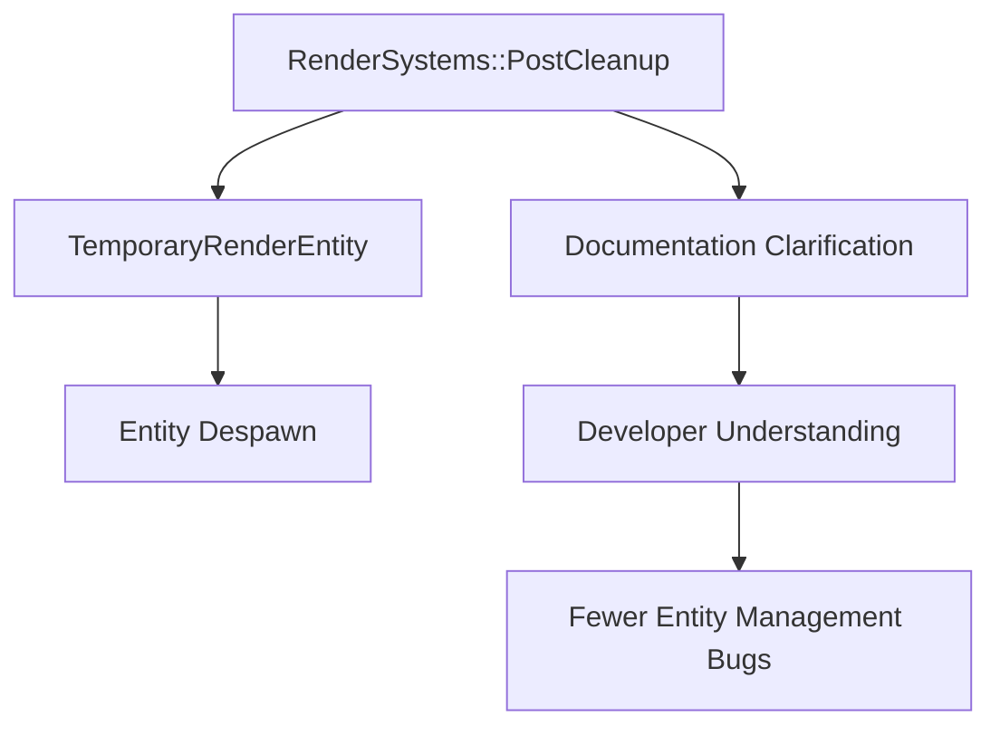

+++
title = "#21586 Updated docs for bevy::render::RenderSystems"
date = "2025-10-19T00:00:00"
draft = false
template = "pull_request_page.html"
in_search_index = true

[taxonomies]
list_display = ["show"]

[extra]
current_language = "en"
available_languages = {"en" = { name = "English", url = "/pull_request/bevy/2025-10/pr-21586-en-20251019" }, "zh-cn" = { name = "中文", url = "/pull_request/bevy/2025-10/pr-21586-zh-cn-20251019" }}
labels = ["C-Docs", "D-Trivial", "A-Rendering"]
+++

# Updated docs for bevy::render::RenderSystems

## Basic Information
- **Title**: Updated docs for bevy::render::RenderSystems
- **PR Link**: https://github.com/bevyengine/bevy/pull/21586
- **Author**: Saphereye
- **Status**: MERGED
- **Labels**: C-Docs, D-Trivial, A-Rendering, S-Ready-For-Final-Review
- **Created**: 2025-10-17T19:53:40Z
- **Merged**: 2025-10-19T19:11:02Z
- **Merged By**: alice-i-cecile

## Description Translation
# Objective

- Fixes #16654 

## Solution

- Updated the doc string and linked to TemporaryRenderEntity.

## Testing

- Built the documentation locally and verified that the links render and navigate correctly.

## The Story of This Pull Request

This PR addresses a documentation issue in the Bevy render system where incorrect information was causing confusion for developers. The problem was straightforward but important - the documentation for the `RenderSystems::PostCleanup` variant contained misleading information about entity cleanup behavior.

The issue originated from documentation that stated "all entities will be despawned" during the PostCleanup phase, which was inaccurate. In reality, only entities marked with the `TemporaryRenderEntity` component are despawned during this phase. This discrepancy could lead developers to incorrect assumptions about entity lifecycle management in the render system.

The solution implemented a precise documentation update that clarifies the actual behavior while adding a helpful cross-reference. The change transforms the documentation from a broad, incorrect statement to a specific, accurate description:

```rust
// Before:
/// Final cleanup occurs: all entities will be despawned.

// After:
/// Final cleanup occurs: any entities with
/// [`TemporaryRenderEntity`](sync_world::TemporaryRenderEntity) will be despawned.
```

This change demonstrates several good documentation practices. First, it corrects factual inaccuracy - a critical issue since incorrect documentation can be worse than no documentation at all. Second, it adds a direct link to the relevant type (`TemporaryRenderEntity`), making it easier for developers to understand the complete picture and find related functionality.

The technical approach here is minimal but effective. By updating the docstring and adding a proper Rustdoc link, the change improves developer experience without modifying any runtime behavior. The link uses the standard Rustdoc syntax `[Type](path::to::Type)` which generates proper intra-doc links in the final documentation.

From an architectural perspective, this change reinforces the pattern that Bevy uses for temporary render entities. The `TemporaryRenderEntity` component serves as a marker that indicates which entities should be automatically cleaned up after rendering completes, rather than having a blanket cleanup of all entities. This pattern allows for more controlled entity lifecycle management and prevents accidental cleanup of entities that should persist across frames.

The impact of this change is primarily on developer understanding and code maintainability. Developers working with Bevy's render system now have accurate information about when and how entities are cleaned up, which helps prevent bugs related to entity persistence and cleanup timing. The added cross-reference also improves documentation navigation, making it easier to discover related components and systems.

## Visual Representation



## Key Files Changed

**File: `crates/bevy_render/src/lib.rs`** (+2/-1)

This file contains the core render system definitions for Bevy. The change modifies the documentation for the `RenderSystems` enum, specifically the `PostCleanup` variant.

**Key Changes:**
```rust
// Before:
/// Final cleanup occurs: all entities will be despawned.
///
/// Runs after [`Cleanup`](RenderSystems::Cleanup).

// After:
/// Final cleanup occurs: any entities with
/// [`TemporaryRenderEntity`](sync_world::TemporaryRenderEntity) will be despawned.
///
/// Runs after [`Cleanup`](RenderSystems::Cleanup).
```

The modification:
1. Corrects the inaccurate statement about "all entities" being despawned
2. Specifies that only entities with `TemporaryRenderEntity` are affected
3. Adds a direct link to the `TemporaryRenderEntity` type for easy reference
4. Maintains the existing information about execution order

## Further Reading

- [Bevy Documentation Guide](https://github.com/bevyengine/bevy/blob/main/docs/plugins_guidelines.md#document-everything)
- [Rustdoc Documentation](https://doc.rust-lang.org/rustdoc/how-to-write-documentation.html)
- [Entity Component System Pattern](https://en.wikipedia.org/wiki/Entity_component_system)
- [Bevy Render System Architecture](https://bevyengine.org/learn/book/getting-started/rendering/)