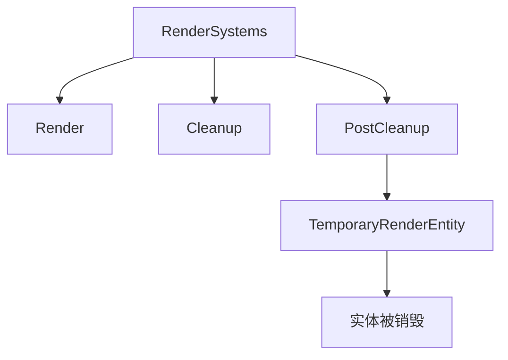

+++
title = "#21586 Updated docs for bevy::render::RenderSystems"
date = "2025-10-19T00:00:00"
draft = false
template = "pull_request_page.html"
in_search_index = false

[extra]
current_language = "zh-cn"
available_languages = {"en" = { name = "English", url = "/pull_request/bevy/2025-10/pr-21586-en-20251019" }, "zh-cn" = { name = "中文", url = "/pull_request/bevy/2025-10/pr-21586-zh-cn-20251019" }}
+++

# Updated docs for bevy::render::RenderSystems

## 基本信息
- **标题**: Updated docs for bevy::render::RenderSystems
- **PR链接**: https://github.com/bevyengine/bevy/pull/21586
- **作者**: Saphereye
- **状态**: 已合并
- **标签**: C-Docs, D-Trivial, A-Rendering, S-Ready-For-Final-Review
- **创建时间**: 2025-10-17T19:53:40Z
- **合并时间**: 2025-10-19T19:11:02Z
- **合并者**: alice-i-cecile

## 描述翻译
# Objective

- 修复 #16654

## Solution

- 更新了文档字符串并链接到 TemporaryRenderEntity。

## Testing

- 在本地构建了文档并验证链接渲染和导航正确。

## 这个Pull Request的故事

这个PR解决了一个文档清晰度的问题。在Bevy渲染系统的架构中，`RenderSystems::PostCleanup`阶段的文档描述不够准确，可能导致开发者对这个系统阶段的行为产生误解。

问题的核心在于原始文档描述"Final cleanup occurs: all entities will be despawned"（最终清理发生：所有实体将被销毁），这个说法过于宽泛，容易让人误以为场景中的所有实体都会在这个阶段被销毁。实际上，这个阶段只处理特定的临时渲染实体。

开发者采用了直接而有效的解决方案：更新文档字符串，明确指出只有带有`TemporaryRenderEntity`组件的实体才会被销毁，并添加了到该组件的链接。这种修改方式体现了良好的文档实践——既提供了准确的信息，又通过链接让开发者能够快速访问相关组件的详细文档。

从技术角度看，这个修改涉及到渲染系统的生命周期管理。Bevy的渲染系统按照特定的阶段顺序执行：
1. `Render`阶段 - 执行实际的渲染逻辑
2. `Cleanup`阶段 - 清理渲染资源
3. `PostCleanup`阶段 - 最终清理，专门处理临时渲染实体

`TemporaryRenderEntity`组件的作用是标记那些仅在渲染过程中需要的临时实体。这些实体在渲染完成后就不再需要，因此在`PostCleanup`阶段被自动销毁，避免内存泄漏和资源浪费。

这个修改虽然简单，但对于理解渲染系统的行为很重要。不准确的文档可能导致开发者错误地假设系统行为，进而编写出有问题的代码。通过明确指定只有标记的实体会被销毁，开发者能够更好地理解系统边界和预期行为。

## 视觉表示



## 关键文件变更

**crates/bevy_render/src/lib.rs** (+2/-1)

这个文件包含了渲染系统的主要定义。修改集中在`RenderSystems`枚举的文档注释上。

```rust
// 文件: crates/bevy_render/src/lib.rs
// 修改前:
/// Final cleanup occurs: all entities will be despawned.
///
/// Runs after [`Cleanup`](RenderSystems::Cleanup).
PostCleanup,

// 修改后:
/// Final cleanup occurs: any entities with
/// [`TemporaryRenderEntity`](sync_world::TemporaryRenderEntity) will be despawned.
///
/// Runs after [`Cleanup`](RenderSystems::Cleanup).
PostCleanup,
```

这个修改通过以下方式提升了文档质量：
1. 准确描述了`PostCleanup`阶段的实际行为
2. 提供了到相关组件`TemporaryRenderEntity`的直接链接
3. 消除了可能引起混淆的宽泛描述

## 进一步阅读

- [Bevy渲染系统文档](https://docs.rs/bevy_render/latest/bevy_render/)
- [实体组件系统(ECS)模式](https://en.wikipedia.org/wiki/Entity_component_system)
- [Rust文档注释最佳实践](https://doc.rust-lang.org/rustdoc/how-to-write-documentation.html)

# 完整代码差异
diff --git a/crates/bevy_render/src/lib.rs b/crates/bevy_render/src/lib.rs
index 92336e21e7b89..7dc8dddb655a7 100644
--- a/crates/bevy_render/src/lib.rs
+++ b/crates/bevy_render/src/lib.rs
@@ -186,7 +186,8 @@ pub enum RenderSystems {
     Render,
     /// Cleanup render resources here.
     Cleanup,
-    /// Final cleanup occurs: all entities will be despawned.
+    /// Final cleanup occurs: any entities with
+    /// [`TemporaryRenderEntity`](sync_world::TemporaryRenderEntity) will be despawned.
     ///
     /// Runs after [`Cleanup`](RenderSystems::Cleanup).
     PostCleanup,