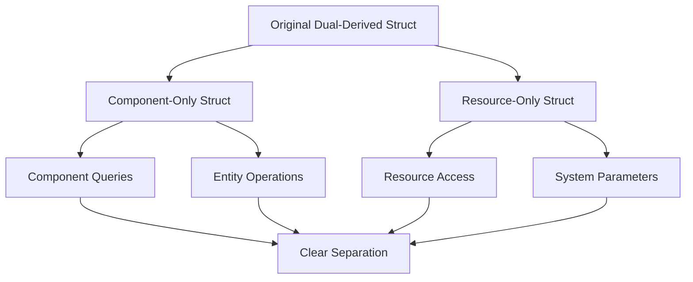

+++
title = "#21589 Remove `#[derive(Resource, Component)]` from tests"
date = "2025-10-19T00:00:00"
draft = false
template = "pull_request_page.html"
in_search_index = true

[taxonomies]
list_display = ["show"]

[extra]
current_language = "en"
available_languages = {"en" = { name = "English", url = "/pull_request/bevy/2025-10/pr-21589-en-20251019" }, "zh-cn" = { name = "中文", url = "/pull_request/bevy/2025-10/pr-21589-zh-cn-20251019" }}
labels = ["D-Trivial", "A-ECS", "C-Code-Quality", "C-Testing"]
+++

# Remove `#[derive(Resource, Component)]` from tests

## Basic Information
- **Title**: Remove `#[derive(Resource, Component)]` from tests
- **PR Link**: https://github.com/bevyengine/bevy/pull/21589
- **Author**: Trashtalk217
- **Status**: MERGED
- **Labels**: D-Trivial, A-ECS, C-Code-Quality, S-Ready-For-Final-Review, C-Testing
- **Created**: 2025-10-18T14:07:25Z
- **Merged**: 2025-10-19T20:04:52Z
- **Merged By**: alice-i-cecile

## Description Translation
# Objective

Multiple tests derive both `Resource` and `Component` on a single struct. In the current resources-for-components plan (#19731), this leads to a conflict. 

## Solution

```rust
#[derive(Resource, Component)]
struct A;
```

Becomes

```rust
#[derive(Component)]
struct A;

#[derive(Resource)]
struct ResA;
```

and the tests are changed accordingly.

There was one test that had to be removed as it specifically tested that a query could both query a resource and a component with the same name. That test doesn't make any sense anymore, so I removed it.

## Testing

I tested the changes by adding code into `Resource` derive macro, that also derives `Component`, so any conflicts showed up by running `cargo build`.

## Future work

`AmbientLight` in `bevy_light` still derives both, but since that requires a little more work, I'm saving it for later.

## The Story of This Pull Request

This PR addresses a fundamental architectural conflict in Bevy's Entity Component System (ECS) that was revealed by the ongoing resources-for-components initiative (#19731). The core issue was that multiple test structs were deriving both `Resource` and `Component` traits, which creates ambiguity in a system where resources and components should have distinct identities.

The problem manifested in test code where structs like `A`, `B`, `C`, etc., were declared with both derivations:
```rust
#[derive(Component, Resource)]
struct A;
```

This approach worked in the short term but created a conflict for the planned architectural changes. When a type implements both `Resource` and `Component`, the ECS system cannot reliably distinguish between resource access and component access, leading to potential system conflicts and ambiguity in queries.

The solution was straightforward but required careful refactoring across the codebase. For each dual-derived struct, the PR splits it into two separate structs - one for components and one for resources. The naming convention maintains clarity by prefixing resource types with "Res":

```rust
#[derive(Component)]
struct A;

#[derive(Resource)]
struct ResA;
```

This separation ensures that resources and components remain distinct types in the type system, preventing any ambiguity in system parameter resolution and query construction.

One significant test had to be completely removed - `shared_resource_mut_component` in `schedule/mod.rs`. This test specifically validated that a resource and component with the same type could coexist without system conflicts. With the architectural direction moving away from this pattern, the test became obsolete and was removed entirely.

The implementation approach demonstrates good engineering practices. The author used a systematic method to detect conflicts by temporarily modifying the `Resource` derive macro to also derive `Component`, then running `cargo build` to surface any remaining dual-derived types. This proactive testing strategy ensured comprehensive coverage of the changes.

The changes span multiple areas of the ECS system:
- Benchmark tests were updated to use separate resource and component types
- Core ECS tests were refactored to maintain test coverage with proper type separation
- Command system tests were updated to handle the new resource types
- System tests were modified to use distinct resource and component types

Notably, the PR leaves `AmbientLight` in `bevy_light` untouched since it requires more extensive work, demonstrating good judgment about scope and prioritization.

## Visual Representation



## Key Files Changed

### `crates/bevy_ecs/src/schedule/mod.rs` (+0/-18)
This file contained the test that specifically validated dual-derived types, which became obsolete with the architectural changes.

**Key Change:**
```rust
// Before:
#[derive(Resource, Component)]
struct RC;

#[test]
fn shared_resource_mut_component() {
    let mut world = World::new();
    world.insert_resource(RC);
    
    let mut schedule = Schedule::default();
    schedule.add_systems((|_: ResMut<RC>| {}, |_: Query<&mut RC>| {}));
    
    let _ = schedule.initialize(&mut world);
    assert_eq!(schedule.graph().conflicting_systems().len(), 0);
}

// After:
// Entire test removed as it no longer makes sense in the new architecture
```

### `crates/bevy_ecs/src/system/mod.rs` (+44/-27)
This file contains the core system tests and required extensive refactoring to separate resource and component types.

**Key Changes:**
```rust
// Before:
#[derive(Component, Resource, Debug, Eq, PartialEq, Default)]
struct A;
#[derive(Component, Resource)]
struct B;

// After:
#[derive(Component, Debug, Eq, PartialEq, Default)]
struct A;
#[derive(Component)]
struct B;

#[derive(Resource)]
struct ResA;
#[derive(Resource)]
struct ResB;
```

System parameter updates:
```rust
// Before:
fn sys_x(_: Res<A>, _: Res<B>, _: Query<(&C, &D)>) {}

// After:
fn sys_x(_: Res<ResA>, _: Res<ResB>, _: Query<(&C, &D)>) {}
```

### `crates/bevy_ecs/src/system/commands/mod.rs` (+17/-14)
Command system tests were updated to handle the new resource types.

**Key Changes:**
```rust
// Before:
#[derive(Component, Resource)]
struct W<T>(T);

impl FromWorld for W<String> {
    fn from_world(world: &mut World) -> Self {
        let v = world.resource::<W<usize>>();
        Self("*".repeat(v.0))
    }
}

// After:
#[derive(Component)]
struct W<T>(T);

#[derive(Resource)]
struct V<T>(T);

impl FromWorld for W<String> {
    fn from_world(world: &mut World) -> Self {
        let v = world.resource::<V<usize>>();
        Self("*".repeat(v.0))
    }
}
```

### `crates/bevy_ecs/src/lib.rs` (+14/-12)
Core ECS tests were updated with proper type separation.

**Key Changes:**
```rust
// Before:
#[derive(Component, Resource, Debug, PartialEq, Eq, Hash, Clone, Copy)]
struct A(usize);

// After:
#[derive(Component, Debug, PartialEq, Eq, Hash, Clone, Copy)]
struct A(usize);
#[derive(Resource, Debug, PartialEq, Eq)]
struct ResA(usize);
```

### `benches/bevy_ecs/scheduling/run_condition.rs` (+5/-4)
Benchmarks were updated to use separate types for resources and components.

**Key Changes:**
```rust
// Before:
#[derive(Component, Resource)]
struct TestBool(pub bool);

pub fn run_condition_yes_with_resource(criterion: &mut Criterion) {
    let mut world = World::new();
    world.insert_resource(TestBool(true));
    fn yes_with_resource(res: Res<TestBool>) -> bool {
        res.0
    }
}

// After:
#[derive(Component)]
struct TestBool(pub bool);

#[derive(Resource)]
struct TestResource(pub bool);

pub fn run_condition_yes_with_resource(criterion: &mut Criterion) {
    let mut world = World::new();
    world.insert_resource(TestResource(true));
    fn yes_with_resource(res: Res<TestResource>) -> bool {
        res.0
    }
}
```

## Further Reading

- [Bevy ECS Documentation](https://docs.rs/bevy_ecs/latest/bevy_ecs/) - Comprehensive guide to Bevy's Entity Component System
- [Resources and Components in Bevy](https://bevy-cheatbook.github.io/programming/resources.html) - Explanation of the distinction between resources and components
- [System Parameters in Bevy](https://bevy-cheatbook.github.io/programming/system-param.html) - How systems access data through parameters
- [PR #19731: Resources for Components](https://github.com/bevyengine/bevy/pull/19731) - The larger initiative that motivated these changes