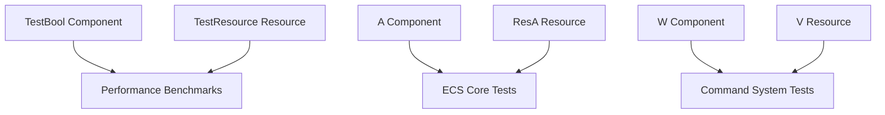

+++
title = "#21589 Remove `#[derive(Resource, Component)]` from tests"
date = "2025-10-19T00:00:00"
draft = false
template = "pull_request_page.html"
in_search_index = false

[extra]
current_language = "zh-cn"
available_languages = {"en" = { name = "English", url = "/pull_request/bevy/2025-10/pr-21589-en-20251019" }, "zh-cn" = { name = "中文", url = "/pull_request/bevy/2025-10/pr-21589-zh-cn-20251019" }}
labels = ["D-Trivial", "A-ECS", "C-Code-Quality", "C-Testing"]
+++

# Remove `#[derive(Resource, Component)]` from tests

## Basic Information
- **Title**: Remove `#[derive(Resource, Component)]` from tests
- **PR Link**: https://github.com/bevyengine/bevy/pull/21589
- **Author**: Trashtalk217
- **Status**: MERGED
- **Labels**: D-Trivial, A-ECS, C-Code-Quality, S-Ready-For-Final-Review, C-Testing
- **Created**: 2025-10-18T14:07:25Z
- **Merged**: 2025-10-19T20:04:52Z
- **Merged By**: alice-i-cecile

## Description Translation
# Objective

多个测试在单个结构体上同时派生 `Resource` 和 `Component`。在当前的资源即组件计划 (#19731) 中，这会导致冲突。

## Solution

```rust
#[derive(Resource, Component)]
struct A;
```

变为

```rust
#[derive(Component)]
struct A;

#[derive(Resource)]
struct ResA;
```

并且相应地修改测试。

有一个测试必须被移除，因为它专门测试了同一个查询可以同时查询同名的资源和组件。这个测试现在不再有意义，所以我移除了它。

## Testing

我通过在 `Resource` 派生宏中添加代码来测试这些更改，该代码也会派生 `Component`，因此任何冲突都会在运行 `cargo build` 时显示出来。

## Future work

`bevy_light` 中的 `AmbientLight` 仍然同时派生两者，但由于这需要更多工作，我将其留到以后处理。

## The Story of This Pull Request

这个PR解决了一个即将到来的架构冲突问题。在Bevy引擎的ECS（Entity Component System）中，资源和组件是两个核心概念，但随着#19731计划的推进，同一个类型同时作为资源和组件使用会产生冲突。

问题的核心在于测试代码中的便利性写法。开发者为了测试方便，经常在同一个结构体上同时派生`Resource`和`Component`特性。这在当前版本中工作正常，但在新的"资源即组件"架构下，这种模式会导致类型冲突，因为系统无法区分一个类型应该被视为资源还是组件。

解决方案是进行类型分离。对于每个原来同时作为资源和组件的类型，现在创建两个独立的类型：一个专门作为组件，另一个专门作为资源。命名约定通常是保持组件名称不变，而资源类型加上`Res`前缀。

```rust
// 之前：
#[derive(Resource, Component)]
struct A;

// 之后：
#[derive(Component)]
struct A;

#[derive(Resource)]
struct ResA;
```

这种修改不仅解决了类型冲突问题，还使代码意图更加明确。在系统参数中，`Res<A>`和`Query<&A>`现在引用的是完全不同的类型，避免了潜在的混淆。

一个值得注意的修改是移除了专门测试同名资源和组件查询的测试用例。这个测试在旧的架构下验证了系统能够正确处理同名的资源和组件，但在新的分离架构下，这个测试已经失去了意义，因为现在资源和组件必须是不同的类型。

测试策略也很实用：通过在`Resource`派生宏中添加临时代码来强制检测冲突。这种方法有效地验证了所有修改都正确解决了类型冲突问题。

## Visual Representation



## Key Files Changed

### `crates/bevy_ecs/src/lib.rs` (+14/-12)
这是ECS核心模块的测试文件，包含了最广泛的修改。主要变化是将原来同时作为组件和资源的类型分离。

```rust
// Before:
#[derive(Component, Resource, Debug, PartialEq, Eq, Hash, Clone, Copy)]
struct A(usize);

// After:
#[derive(Component, Debug, PartialEq, Eq, Hash, Clone, Copy)]
struct A(usize);
#[derive(Resource, Debug, PartialEq, Eq)]
struct ResA(usize);
```

### `crates/bevy_ecs/src/schedule/mod.rs` (+0/-18)
移除了一个不再相关的测试用例，这个测试专门验证同名资源和组件不冲突的行为。

```rust
// Removed test:
#[test]
fn shared_resource_mut_component() {
    let mut world = World::new();
    world.insert_resource(RC);

    let mut schedule = Schedule::default();
    schedule.add_systems((|_: ResMut<RC>| {}, |_: Query<&mut RC>| {}));

    let _ = schedule.initialize(&mut world);

    assert_eq!(schedule.graph().conflicting_systems().len(), 0);
}
```

### `crates/bevy_ecs/src/system/commands/mod.rs` (+17/-14)
命令系统的测试更新，反映了资源和组件类型的分离。

```rust
// Before:
#[derive(Component, Resource)]
struct W<T>(T);

// After:
#[derive(Component)]
struct W<T>(T);

#[derive(Resource)]
struct V<T>(T);
```

### `crates/bevy_ecs/src/system/mod.rs` (+44/-27)
系统模块的测试进行了大规模重构，为每个原来的复合类型创建了独立的资源和组件类型。

```rust
// Before components:
#[derive(Component, Resource, Debug, Eq, PartialEq, Default)]
struct A;

// After components:
#[derive(Component, Debug, Eq, PartialEq, Default)]
struct A;

// New resources:
#[derive(Resource)]
struct ResA;
```

### `benches/benches/bevy_ecs/scheduling/run_condition.rs` (+4/-2)
性能基准测试也相应更新，确保测试场景仍然有效。

```rust
// Before:
#[derive(Component, Resource)]
struct TestBool(pub bool);

// After:
#[derive(Component)]
struct TestBool(pub bool);

#[derive(Resource)]
struct TestResource(pub bool);
```

## Further Reading

- [Bevy ECS Guide](https://bevyengine.org/learn/book/ecs/) - Bevy官方ECS文档
- [Rust Derive Macros](https://doc.rust-lang.org/reference/procedural-macros.html#derive-macros) - Rust派生宏的官方文档
- [Component vs Resource in ECS](https://github.com/bevyengine/bevy/discussions/19731) - Bevy中组件与资源的讨论

# Full Code Diff
diff --git a/benches/benches/bevy_ecs/scheduling/run_condition.rs b/benches/benches/bevy_ecs/scheduling/run_condition.rs
index 9c40cf396e047..083ed177d2f7a 100644
--- a/benches/benches/bevy_ecs/scheduling/run_condition.rs
+++ b/benches/benches/bevy_ecs/scheduling/run_condition.rs
@@ -55,7 +55,7 @@ pub fn run_condition_no(criterion: &mut Criterion) {
     group.finish();
 }
 
-#[derive(Component, Resource)]
+#[derive(Component)]
 struct TestBool(pub bool);
 
 pub fn run_condition_yes_with_query(criterion: &mut Criterion) {
@@ -86,14 +86,17 @@ pub fn run_condition_yes_with_query(criterion: &mut Criterion) {
     group.finish();
 }
 
+#[derive(Resource)]
+struct TestResource(pub bool);
+
 pub fn run_condition_yes_with_resource(criterion: &mut Criterion) {
     let mut world = World::new();
-    world.insert_resource(TestBool(true));
+    world.insert_resource(TestResource(true));
     let mut group = criterion.benchmark_group("run_condition/yes_using_resource");
     group.warm_up_time(core::time::Duration::from_millis(500));
     group.measurement_time(core::time::Duration::from_secs(3));
     fn empty() {}
-    fn yes_with_resource(res: Res<TestBool>) -> bool {
+    fn yes_with_resource(res: Res<TestResource>) -> bool {
         res.0
     }
     for amount in [10, 100, 1_000] {
diff --git a/crates/bevy_ecs/src/lib.rs b/crates/bevy_ecs/src/lib.rs
index 2e9174bf2404c..d2f59ac29f83d 100644
--- a/crates/bevy_ecs/src/lib.rs
+++ b/crates/bevy_ecs/src/lib.rs
@@ -178,8 +178,10 @@ mod tests {
     };
     use std::sync::Mutex;
 
-    #[derive(Component, Resource, Debug, PartialEq, Eq, Hash, Clone, Copy)]
+    #[derive(Component, Debug, PartialEq, Eq, Hash, Clone, Copy)]
     struct A(usize);
+    #[derive(Resource, Debug, PartialEq, Eq)]
+    struct ResA(usize);
     #[derive(Component, Debug, PartialEq, Eq, Hash, Clone, Copy)]
     struct B(usize);
     #[derive(Component, Debug, PartialEq, Eq, Clone, Copy)]
@@ -1421,10 +1423,10 @@ mod tests {
     #[test]
     fn non_send_resource_points_to_distinct_data() {
         let mut world = World::default();
-        world.insert_resource(A(123));
-        world.insert_non_send_resource(A(456));
-        assert_eq!(*world.resource::<A>(), A(123));
-        assert_eq!(*world.non_send_resource::<A>(), A(456));
+        world.insert_resource(ResA(123));
+        world.insert_non_send_resource(ResA(456));
+        assert_eq!(*world.resource::<ResA>(), ResA(123));
+        assert_eq!(*world.non_send_resource::<ResA>(), ResA(456));
     }
 
     #[test]
@@ -1570,13 +1572,13 @@ mod tests {
     #[test]
     fn resource_scope() {
         let mut world = World::default();
-        assert!(world.try_resource_scope::<A, _>(|_, _| {}).is_none());
-        world.insert_resource(A(0));
-        world.resource_scope(|world: &mut World, mut value: Mut<A>| {
+        assert!(world.try_resource_scope::<ResA, _>(|_, _| {}).is_none());
+        world.insert_resource(ResA(0));
+        world.resource_scope(|world: &mut World, mut value: Mut<ResA>| {
             value.0 += 1;
-            assert!(!world.contains_resource::<A>());
+            assert!(!world.contains_resource::<ResA>());
         });
-        assert_eq!(world.resource::<A>().0, 1);
+        assert_eq!(world.resource::<ResA>().0, 1);
     }
 
     #[test]
@@ -1636,7 +1638,7 @@ mod tests {
     fn clear_entities() {
         let mut world = World::default();
 
-        world.insert_resource(A(0));
+        world.insert_resource(ResA(0));
         world.spawn(A(1));
         world.spawn(SparseStored(1));
 
@@ -1666,7 +1668,7 @@ mod tests {
             "world should not have any entities"
         );
         assert_eq!(
-            world.resource::<A>().0,
+            world.resource::<ResA>().0,
             0,
             "world should still contain resources"
         );
diff --git a/crates/bevy_ecs/src/schedule/mod.rs b/crates/bevy_ecs/src/schedule/mod.rs
index a03825f9eda56..2d935d32d1b63 100644
--- a/crates/bevy_ecs/src/schedule/mod.rs
+++ b/crates/bevy_ecs/src/schedule/mod.rs
@@ -795,9 +795,6 @@ mod tests {
         #[derive(Message)]
         struct E;
 
-        #[derive(Resource, Component)]
-        struct RC;
-
         fn empty_system() {}
         fn res_system(_res: Res<R>) {}
         fn resmut_system(_res: ResMut<R>) {}
@@ -957,21 +954,6 @@ mod tests {
             assert_eq!(schedule.graph().conflicting_systems().len(), 3);
         }
 
-        /// Test that when a struct is both a Resource and a Component, they do not
-        /// conflict with each other.
-        #[test]
-        fn shared_resource_mut_component() {
-            let mut world = World::new();
-            world.insert_resource(RC);
-
-            let mut schedule = Schedule::default();
-            schedule.add_systems((|_: ResMut<RC>| {}, |_: Query<&mut RC>| {}));
-
-            let _ = schedule.initialize(&mut world);
-
-            assert_eq!(schedule.graph().conflicting_systems().len(), 0);
-        }
-
         #[test]
         fn resource_mut_and_entity_ref() {
             let mut world = World::new();
diff --git a/crates/bevy_ecs/src/system/commands/mod.rs b/crates/bevy_ecs/src/system/commands/mod.rs
index 35afc7a96a3ac..1385061bc2f7e 100644
--- a/crates/bevy_ecs/src/system/commands/mod.rs
+++ b/crates/bevy_ecs/src/system/commands/mod.rs
@@ -2477,16 +2477,19 @@ mod tests {
         }
     }
 
-    #[derive(Component, Resource)]
+    #[derive(Component)]
     struct W<T>(T);
 
+    #[derive(Resource)]
+    struct V<T>(T);
+
     fn simple_command(world: &mut World) {
         world.spawn((W(0u32), W(42u64)));
     }
 
     impl FromWorld for W<String> {
         fn from_world(world: &mut World) -> Self {
-            let v = world.resource::<W<usize>>();
+            let v = world.resource::<V<usize>>();
             Self("*".repeat(v.0))
         }
     }
@@ -2527,7 +2530,7 @@ mod tests {
             .or_insert(W(42));
         queue.apply(&mut world);
         assert_eq!(42, world.get::<W<u64>>(entity).unwrap().0);
-        world.insert_resource(W(5_usize));
+        world.insert_resource(V(5_usize));
         let mut commands = Commands::new(&mut queue, &world);
         commands.entity(entity).entry::<W<String>>().or_from_world();
         queue.apply(&mut world);
@@ -2744,22 +2747,22 @@ mod tests {
         let mut queue = CommandQueue::default();
         {
             let mut commands = Commands::new(&mut queue, &world);
-            commands.insert_resource(W(123i32));
-            commands.insert_resource(W(456.0f64));
+            commands.insert_resource(V(123i32));
+            commands.insert_resource(V(456.0f64));
         }
 
         queue.apply(&mut world);
-        assert!(world.contains_resource::<W<i32>>());
-        assert!(world.contains_resource::<W<f64>>());
+        assert!(world.contains_resource::<V<i32>>());
+        assert!(world.contains_resource::<V<f64>>());
 
         {
             let mut commands = Commands::new(&mut queue, &world);
             // test resource removal
-            commands.remove_resource::<W<i32>>();
+            commands.remove_resource::<V<i32>>();
         }
         queue.apply(&mut world);
-        assert!(!world.contains_resource::<W<i32>>());
-        assert!(world.contains_resource::<W<f64>>());
+        assert!(!world.contains_resource::<V<i32>>());
+        assert!(world.contains_resource::<V<f64>>());
     }
 
     #[test]
@@ -2832,17 +2835,17 @@ mod tests {
         let mut queue_1 = CommandQueue::default();
         {
             let mut commands = Commands::new(&mut queue_1, &world);
-            commands.insert_resource(W(123i32));
+            commands.insert_resource(V(123i32));
         }
         let mut queue_2 = CommandQueue::default();
         {
             let mut commands = Commands::new(&mut queue_2, &world);
-            commands.insert_resource(W(456.0f64));
+            commands.insert_resource(V(456.0f64));
         }
         queue_1.append(&mut queue_2);
         queue_1.apply(&mut world);
-        assert!(world.contains_resource::<W<i32>>());
-        assert!(world.contains_resource::<W<f64>>());
+        assert!(world.contains_resource::<V<i32>>());
+        assert!(world.contains_resource::<V<f64>>());
     }
 
     #[test]
diff --git a/crates/bevy_ecs/src/system/mod.rs b/crates/bevy_ecs/src/system/mod.rs
index 22b6db8e4e936..2b9fe4319b973 100644
--- a/crates/bevy_ecs/src/system/mod.rs
+++ b/crates/bevy_ecs/src/system/mod.rs
@@ -432,19 +432,32 @@ mod tests {
         No,
     }
 
-    #[derive(Component, Resource, Debug, Eq, PartialEq, Default)]
+    #[derive(Component, Debug, Eq, PartialEq, Default)]
     struct A;
-    #[derive(Component, Resource)]
+    #[derive(Component)]
     struct B;
-    #[derive(Component, Resource)]
+    #[derive(Component)]
     struct C;
-    #[derive(Component, Resource)]
+    #[derive(Component)]
     struct D;
-    #[derive(Component, Resource)]
+    #[derive(Component)]
     struct E;
-    #[derive(Component, Resource)]
+    #[derive(Component)]
     struct F;
 
+    #[derive(Resource)]
+    struct ResA;
+    #[derive(Resource)]
+    struct ResB;
+    #[derive(Resource)]
+    struct ResC;
+    #[derive(Resource)]
+    struct ResD;
+    #[derive(Resource)]
+    struct ResE;
+    #[derive(Resource)]
+    struct ResF;
+
     #[derive(Component, Debug)]
     struct W<T>(T);
 
@@ -913,8 +926,8 @@ mod tests {
     fn test_for_conflicting_resources<Marker, S: IntoSystem<(), (), Marker>>(sys: S) {
         let mut world = World::default();
         world.insert_resource(BufferRes::default());
-        world.insert_resource(A);
-        world.insert_resource(B);
+        world.insert_resource(ResA);
+        world.insert_resource(ResB);
         run_system(&mut world, sys);
     }
 
@@ -941,7 +954,7 @@ mod tests {
 
     #[test]
     fn nonconflicting_system_resources() {
-        fn sys(_: Local<BufferRes>, _: ResMut<BufferRes>, _: Local<A>, _: ResMut<A>) {}
+        fn sys(_: Local<BufferRes>, _: ResMut<BufferRes>, _: Local<A>, _: ResMut<ResA>) {}
         test_for_conflicting_resources(sys);
     }
 
@@ -1156,9 +1169,9 @@ mod tests {
 
     #[test]
     fn get_system_conflicts() {
-        fn sys_x(_: Res<A>, _: Res<B>, _: Query<(&C, &D)>) {}
+        fn sys_x(_: Res<ResA>, _: Res<ResB>, _: Query<(&C, &D)>) {}
 
-        fn sys_y(_: Res<A>, _: ResMut<B>, _: Query<(&C, &mut D)>) {}
+        fn sys_y(_: Res<ResA>, _: ResMut<ResB>, _: Query<(&C, &mut D)>) {}
 
         let mut world = World::default();
         let mut x = IntoSystem::into_system(sys_x);
@@ -1169,7 +1182,7 @@ mod tests {
         let conflicts = x_access.get_conflicts(&y_access);
         let b_id = world
             .components()
-            .get_resource_id(TypeId::of::<B>())
+            .get_resource_id(TypeId::of::<ResB>())
             .unwrap();
         let d_id = world.components().get_id(TypeId::of::<D>()).unwrap();
         assert_eq!(conflicts, vec![b_id, d_id].into());
@@ -1202,12 +1215,12 @@ mod tests {
     #[test]
     fn can_have_16_parameters() {
         fn sys_x(
-            _: Res<A>,
-            _: Res<B>,
-            _: Res<C>,
-            _: Res<D>,
-            _: Res<E>,
-            _: Res<F>,
+            _: Res<ResA>,
+            _: Res<ResB>,
+            _: Res<ResC>,
+            _: Res<ResD>,
+            _: Res<ResE>,
+            _: Res<ResF>,
             _: Query<&A>,
             _: Query<&B>,
             _: Query<&C>,
@@ -1221,12 +1234,12 @@ mod tests {
         }
         fn sys_y(
             _: (
-                Res<A>,
-                Res<B>,
-                Res<C>,
-                Res<D>,
-                Res<E>,
-                Res<F>,
+                Res<ResA>,
+                Res<ResB>,
+                Res<ResC>,
+                Res<ResD>,
+                Res<ResE>,
+                Res<ResF>,
                 Query<&A>,
                 Query<&B>,
                 Query<&C>,
@@ -1392,19 +1405,23 @@ mod tests {
         reason = "This test exists to show that read-only world-only queries can return data that lives as long as `'world`."
     )]
     fn long_life_test() {
+        struct ResourceHolder<'w> {
+            value: &'w ResA,
+        }
+
         struct Holder<'w> {
             value: &'w A,
         }
 
         struct State {
-            state: SystemState<Res<'static, A>>,
+            state: SystemState<Res<'static, ResA>>,
             state_q: SystemState<Query<'static, 'static, &'static A>>,
         }
 
         impl State {
-            fn hold_res<'w>(&mut self, world: &'w World) -> Holder<'w> {
+            fn hold_res<'w>(&mut self, world: &'w World) -> ResourceHolder<'w> {
                 let a = self.state.get(world);
-                Holder {
+                ResourceHolder {
                     value: a.into_inner(),
                 }
             }
diff --git a/crates/bevy_ecs/src/system/system.rs b/crates/bevy_ecs/src/system/system.rs
index 8986ec812a462..456e9522bdcad 100644
--- a/crates/bevy_ecs/src/system/system.rs
+++ b/crates/bevy_ecs/src/system/system.rs
@@ -459,10 +459,9 @@ mod tests {
 
     #[test]
     fn run_system_once() {
+        #[derive(Resource)]
         struct T(usize);
 
-        impl Resource for T {}
-
         fn system(In(n): In<usize>, mut commands: Commands) -> usize {
             commands.insert_resource(T(n));
             n + 1
@@ -522,8 +521,9 @@ mod tests {
 
     #[test]
     fn run_system_once_invalid_params() {
+        #[derive(Resource)]
         struct T;
-        impl Resource for T {}
+
         fn system(_: Res<T>) {}
 
         let mut world = World::default();
diff --git a/crates/bevy_ecs/src/system/system_registry.rs b/crates/bevy_ecs/src/system/system_registry.rs
index 576773bb70b6e..9719fb4311981 100644
--- a/crates/bevy_ecs/src/system/system_registry.rs
+++ b/crates/bevy_ecs/src/system/system_registry.rs
@@ -995,8 +995,9 @@ mod tests {
         use crate::system::RegisteredSystemError;
         use alloc::string::ToString;
 
+        #[derive(Resource)]
         struct T;
-        impl Resource for T {}
+
         fn system(_: Res<T>) {}
 
         let mut world = World::new();
diff --git a/crates/bevy_ecs/src/world/mod.rs b/crates/bevy_ecs/src/world/mod.rs
index 024c127aab8b2..6bee7953b13a3 100644
--- a/crates/bevy_ecs/src/world/mod.rs
+++ b/crates/bevy_ecs/src/world/mod.rs
@@ -3735,7 +3735,7 @@ mod tests {
         Drop(ID),
     }
 
-    #[derive(Resource, Component)]
+    #[derive(Component)]
     struct MayPanicInDrop {
         drop_log: Arc<Mutex<Vec<DropLogItem>>>,
         expected_panic_flag: Arc<AtomicBool>,
diff --git a/crates/bevy_scene/src/dynamic_scene_builder.rs b/crates/bevy_scene/src/dynamic_scene_builder.rs
index feddacfdfb091..3acef88a1c8bb 100644
--- a/crates/bevy_scene/src/dynamic_scene_builder.rs
+++ b/crates/bevy_scene/src/dynamic_scene_builder.rs
@@ -703,19 +703,24 @@ mod tests {
 
     #[test]
     fn should_use_from_reflect() {
-        #[derive(Resource, Component, Reflect)]
-        #[reflect(Resource, Component)]
+        #[derive(Component, Reflect)]
+        #[reflect(Component)]
         struct SomeType(i32);
 
+        #[derive(Resource, Reflect)]
+        #[reflect(Resource)]
+        struct SomeResource(i32);
+
         let mut world = World::default();
         let atr = AppTypeRegistry::default();
         {
             let mut register = atr.write();
             register.register::<SomeType>();
+            register.register::<SomeResource>();
         }
         world.insert_resource(atr);
 
-        world.insert_resource(SomeType(123));
+        world.insert_resource(SomeResource(123));
         let entity = world.spawn(SomeType(123)).id();
 
         let scene = DynamicSceneBuilder::from_world(&world)
@@ -733,6 +738,6 @@ mod tests {
         assert!(resource
             .try_as_reflect()
             .expect("resource should be concrete due to `FromReflect`")
-            .is::<SomeType>());
+            .is::<SomeResource>());
     }
 }
```