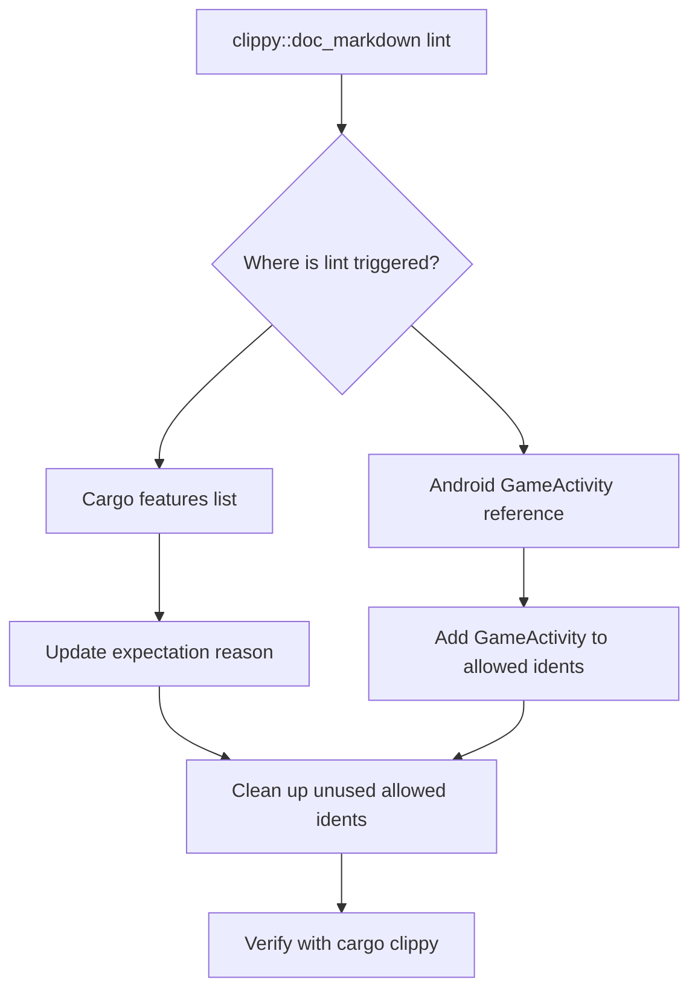

+++
title = "#21590 Rewrite the reason for the `clippy::doc_markdown` expectation in the `bevy` main crate to be more accurate"
date = "2025-10-19T00:00:00"
draft = false
template = "pull_request_page.html"
in_search_index = true

[taxonomies]
list_display = ["show"]

[extra]
current_language = "en"
available_languages = {"en" = { name = "English", url = "/pull_request/bevy/2025-10/pr-21590-en-20251019" }, "zh-cn" = { name = "中文", url = "/pull_request/bevy/2025-10/pr-21590-zh-cn-20251019" }}
labels = ["A-Build-System", "C-Code-Quality"]
+++

# Title

## Basic Information
- **Title**: Rewrite the reason for the `clippy::doc_markdown` expectation in the `bevy` main crate to be more accurate
- **PR Link**: https://github.com/bevyengine/bevy/pull/21590
- **Author**: LikeLakers2
- **Status**: MERGED
- **Labels**: A-Build-System, C-Code-Quality, S-Ready-For-Final-Review
- **Created**: 2025-10-18T15:45:07Z
- **Merged**: 2025-10-19T19:13:55Z
- **Merged By**: alice-i-cecile

## Description Translation
# Objective
The `bevy` main crate's `lib.rs` file contains an expectation for the `clippy::doc_markdown` lint. However, it only references one of the many times that `clippy::doc_markdown` lints on that file. Many of the other `clippy::doc_markdown` instances are within the cargo features list.

## Solution
Rewrite the reason for this expectation to be more clear. Additionally, mark `GameActivity` as an allowed doc ident for Clippy.

## Testing
`cargo clippy` returned no errors.

## The Story of This Pull Request

This PR addresses a documentation quality issue in the Bevy engine's main crate. The problem was centered around the `clippy::doc_markdown` lint, which flags un-backticked identifiers in documentation comments. The existing expectation in `src/lib.rs` had a misleading reason that only covered a specific case while ignoring the broader context where this lint was triggered.

The original expectation comment specifically mentioned "Android GameActivity does not need to be code-formatted," but this was inaccurate because the lint was actually being triggered in multiple places throughout the file, particularly within the cargo features list where various feature names and platform identifiers appear. This narrow justification didn't reflect the actual scope of why the lint expectation was needed.

The solution involved two key changes. First, the expectation reason was updated to accurately describe that the lint was being suppressed because Clippy was flagging identifiers within the cargo features list, where backticks aren't appropriate. Second, `GameActivity` was added to the list of allowed documentation identifiers in `clippy.toml`, which tells Clippy that this specific identifier should not trigger the `doc_markdown` lint.

The technical approach here demonstrates good practice in managing Clippy configurations. By updating the `doc-valid-idents` list in `clippy.toml`, the team is explicitly telling the linter which identifiers are valid and shouldn't require backticks in documentation. This is more maintainable than having scattered `allow` attributes throughout the codebase.

The implementation also shows attention to detail in code quality tooling. The PR author removed several identifiers (`macOS`, `sRGB`, `WebGL2`, `WebGPU`) from the allowed list, suggesting these were either no longer used in documentation or should properly be formatted with backticks. This cleanup indicates a thoughtful review of which identifiers truly need special treatment versus which should follow standard documentation formatting rules.

The testing approach was straightforward and effective - running `cargo clippy` to verify that the changes resolved the lint issues without introducing new warnings. This demonstrates the practical nature of the fix: it's a configuration adjustment that directly addresses tooling behavior without affecting runtime functionality.

## Visual Representation



## Key Files Changed

### `src/lib.rs` (+1/-1)
This file contains the main crate documentation and feature definitions. The change updates the reason for expecting the `clippy::doc_markdown` lint to be more accurate.

```rust
// File: src/lib.rs
// Before:
#![expect(
    clippy::doc_markdown,
    reason = "Android GameActivity does not need to be code-formatted."
)]

// After:
#![expect(
    clippy::doc_markdown,
    reason = "Clippy lints for un-backticked identifiers within the cargo features list, which we don't want."
)]
```

### `clippy.toml` (+1/-4)
This configuration file controls Clippy's behavior. The changes update the list of valid documentation identifiers that shouldn't trigger the `doc_markdown` lint.

```toml
// File: clippy.toml
// Before:
doc-valid-idents = [
  "GilRs",
  "glTF",
  "macOS",
  "NVidia",
  "OpenXR",
  "sRGB",
  "VSync",
  "WebGL2",
  "WebGPU",
  "..",
]

// After:
doc-valid-idents = [
  "GameActivity",
  "GilRs",
  "glTF",
  "NVidia",
  "OpenXR",
  "VSync",
  "..",
]
```

## Further Reading

- [Clippy Documentation Lints](https://rust-lang.github.io/rust-clippy/master/index.html#doc_markdown) - Official documentation for Clippy's documentation-related lints
- [Rust Documentation Comments](https://doc.rust-lang.org/rustdoc/how-to-write-documentation.html) - Guide to writing effective documentation in Rust
- [Cargo Features Documentation](https://doc.rust-lang.org/cargo/reference/features.html) - Understanding cargo features and how to document them
- [Bevy Engine Documentation Standards](https://github.com/bevyengine/bevy/blob/main/CONTRIBUTING.md#documentation-standards) - Bevy's contribution guidelines for documentation