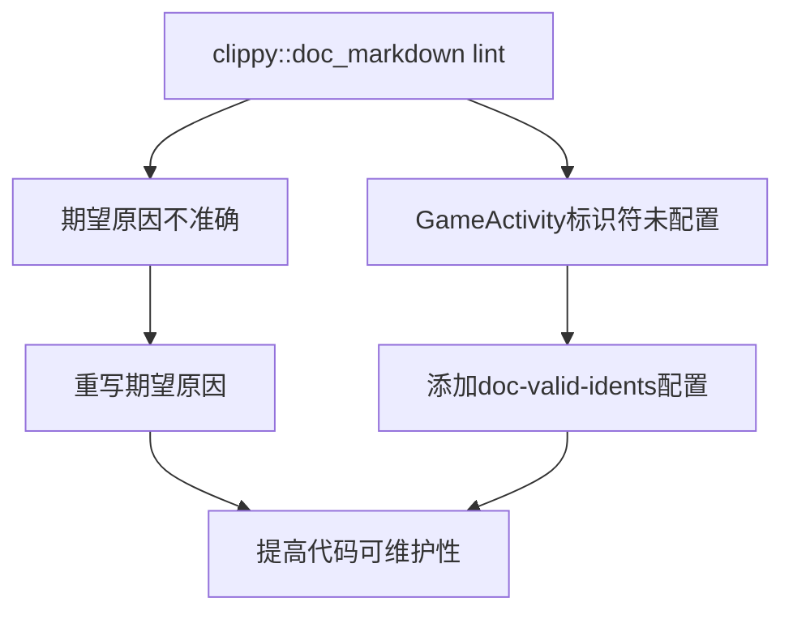

+++
title = "#21590 Rewrite the reason for the `clippy::doc_markdown` expectation in the `bevy` main crate to be more accurate"
date = "2025-10-19T00:00:00"
draft = false
template = "pull_request_page.html"
in_search_index = false

[extra]
current_language = "zh-cn"
available_languages = {"en" = { name = "English", url = "/pull_request/bevy/2025-10/pr-21590-en-20251019" }, "zh-cn" = { name = "中文", url = "/pull_request/bevy/2025-10/pr-21590-zh-cn-20251019" }}
+++

# Rewrite the reason for the `clippy::doc_markdown` expectation in the `bevy` main crate to be more accurate

## 基本信息
- **标题**: Rewrite the reason for the `clippy::doc_markdown` expectation in the `bevy` main crate to be more accurate
- **PR链接**: https://github.com/bevyengine/bevy/pull/21590
- **作者**: LikeLakers2
- **状态**: 已合并
- **标签**: A-Build-System, C-Code-Quality, S-Ready-For-Final-Review
- **创建时间**: 2025-10-18T15:45:07Z
- **合并时间**: 2025-10-19T19:13:55Z
- **合并者**: alice-i-cecile

## 描述翻译
# 目标
`bevy` 主crate的`lib.rs`文件包含对`clippy::doc_markdown`lint的期望。然而，它只引用了该文件中`clippy::doc_markdown`lint触发的众多情况之一。许多其他`clippy::doc_markdown`实例出现在cargo特性列表中。

## 解决方案
重写此期望的原因，使其更加清晰。此外，将`GameActivity`标记为Clippy允许的文档标识符。

## 测试
`cargo clippy`没有返回错误。

## 本次Pull Request的故事

这个PR源于对代码质量工具配置的精确化需求。开发者在维护Bevy项目时发现，现有的`clippy::doc_markdown`lint期望描述不够准确，这可能会给其他贡献者带来困惑。

**问题根源**在于`src/lib.rs`文件中的lint期望注释。原来的注释"Android GameActivity does not need to be code-formatted."只解释了lint触发的其中一个具体场景，但实际上`clippy::doc_markdown`在cargo特性列表等多个地方都会触发。这种不准确的描述可能导致开发者误解lint的真正意图，或者在未来修改代码时做出错误的判断。

**解决方案**采用了双重策略。首先，通过重写期望原因来提供更准确的上下文说明。新的描述"Clippy lints for un-backticked identifiers within the cargo features list, which we don't want."明确指出了lint在cargo特性列表中的行为，这更全面地反映了实际情况。

同时，开发者意识到需要处理`GameActivity`标识符的特殊情况。虽然原来的注释提到了这个标识符，但配置文件中并没有相应的例外设置。通过在`clippy.toml`中添加`GameActivity`到`doc-valid-idents`列表，确保了该标识符不会触发不必要的lint警告。

**技术实现**方面，这个PR展示了如何正确配置Clippy的文档标记检查。`clippy::doc_markdown`lint专门检查文档注释中的markdown格式，特别是要求代码标识符应该用反引号括起来。但在某些情况下，比如特性名称或特定术语，我们可能不希望这种格式化。

从代码质量的角度看，这个修改体现了良好的工程实践。准确的注释和配置不仅减少了lint误报，还提高了代码的可维护性。其他开发者现在可以清楚地理解为什么需要这个lint期望，而不需要去猜测或深入研究具体的触发场景。

**测试验证**通过运行`cargo clippy`确认修改有效，没有引入新的lint错误，这确保了代码质量标准的连续性。

## 可视化表示



## 关键文件更改

### 1. `clippy.toml`

- **更改描述**: 更新了允许的文档标识符列表，添加了`GameActivity`并移除了几个不再需要的标识符
- **代码更改**:
```diff
 doc-valid-idents = [
+  "GameActivity",
   "GilRs",
   "glTF",
-  "macOS",
   "NVidia",
   "OpenXR",
-  "sRGB",
   "VSync",
-  "WebGL2",
-  "WebGPU",
   "..",
 ]
```

### 2. `src/lib.rs`

- **更改描述**: 重写了`clippy::doc_markdown`期望的原因，使其更准确地反映lint在cargo特性列表中的行为
- **代码更改**:
```diff
 #![expect(
     clippy::doc_markdown,
-    reason = "Android GameActivity does not need to be code-formatted."
+    reason = "Clippy lints for un-backticked identifiers within the cargo features list, which we don't want."
 )]
```

## 进一步阅读

- [Rust Clippy Documentation](https://doc.rust-lang.org/clippy/) - 了解Clippy lint工具的全部功能
- [Rustdoc Markdown Guide](https://doc.rust-lang.org/rustdoc/how-to-write-documentation.html) - Rust文档注释的markdown格式指南
- [Bevy Contribution Guidelines](https://github.com/bevyengine/bevy/blob/main/CONTRIBUTING.md) - Bevy项目的贡献指南，包含代码质量标准

# 完整代码差异
```diff
diff --git a/clippy.toml b/clippy.toml
index 372ffbaf0beae..50b4a46fe3b82 100644
--- a/clippy.toml
+++ b/clippy.toml
@@ -1,13 +1,10 @@
 doc-valid-idents = [
+  "GameActivity",
   "GilRs",
   "glTF",
-  "macOS",
   "NVidia",
   "OpenXR",
-  "sRGB",
   "VSync",
-  "WebGL2",
-  "WebGPU",
   "..",
 ]
 
diff --git a/src/lib.rs b/src/lib.rs
index 775baac22b06a..79fd8c0a70165 100644
--- a/src/lib.rs
+++ b/src/lib.rs
@@ -1,7 +1,7 @@
 #![cfg_attr(docsrs, feature(doc_cfg))]
 #![expect(
     clippy::doc_markdown,
-    reason = "Android GameActivity does not need to be code-formatted."
+    reason = "Clippy lints for un-backticked identifiers within the cargo features list, which we don't want."
 )]
 //! [](https://bevy.org)
 //!
```