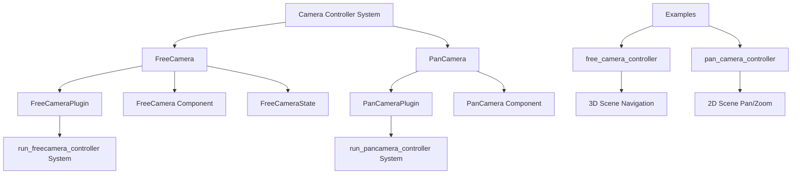

+++
title = "#21592 Update `PanCam` and `FreeCam` to use full term `Camera`"
date = "2025-10-20T00:00:00"
draft = false
template = "pull_request_page.html"
in_search_index = true

[taxonomies]
list_display = ["show"]

[extra]
current_language = "en"
available_languages = {"en" = { name = "English", url = "/pull_request/bevy/2025-10/pr-21592-en-20251020" }, "zh-cn" = { name = "中文", url = "/pull_request/bevy/2025-10/pr-21592-zh-cn-20251020" }}
labels = ["C-Usability", "A-Camera"]
+++

# Title

## Basic Information
- **Title**: Update `PanCam` and `FreeCam` to use full term `Camera`
- **PR Link**: https://github.com/bevyengine/bevy/pull/21592
- **Author**: syszery
- **Status**: MERGED
- **Labels**: C-Usability, S-Ready-For-Final-Review, A-Camera
- **Created**: 2025-10-18T18:03:27Z
- **Merged**: 2025-10-20T22:14:02Z
- **Merged By**: alice-i-cecile

## Description Translation
# Objective

This PR fixes #21569, which proposes renaming the newly introduced camera controller modules `FreeCam` and `PanCam` to use the full term `Camera`. 

## Solution

* Renamed the `PanCam` controller, `PanCamPlugin`, and related methods to use the full term `Camera` instead of the abbreviation `Cam`.
* Renamed the module from `pan_cam` to `pan_camera` for consistency with naming conventions.
* Updated the example `pan_camera_controller` and adjusted usage of the renamed controller and plugin.
* Updated documentation and release notes accordingly.


## Follow-up Work

I see two options from here:

1. **Use this PR as a reference** for renaming `FreeCam`. The process is similar and could be a great first issue for someone looking to contribute to the new camera modules or Bevy in general. Most of the changes follow the same pattern, although `FreeCam` has more examples that need updating. One could find them using `grep` (e.g., `grep FreeCam`) or by reviewing the diff from the PR that introduced `FreeCam`: #20215 

2. **I can continue and update this PR** to also handle the `FreeCam` renaming, if you'd prefer to resolve the entire issue in one go.


## The Story of This Pull Request

This PR addresses a naming consistency issue in Bevy's camera controller system. The problem was straightforward: newly introduced camera controller modules used the abbreviated term "Cam" instead of the full word "Camera", which created inconsistency with the rest of the codebase and reduced clarity for developers.

The core issue was identified in GitHub issue #21569, which proposed standardizing the naming to use "Camera" throughout. This type of naming consistency is important in large codebases because it improves discoverability and reduces cognitive load for developers trying to understand the API.

The solution approach was systematic and followed established patterns in the Bevy codebase. The developer identified all instances where "Cam" was used in camera controller names and method names, then replaced them with "Camera". This included:

1. Renaming structs and components from `FreeCam` to `FreeCamera` and `PanCam` to `PanCamera`
2. Renaming plugins from `FreeCamPlugin` to `FreeCameraPlugin` and `PanCamPlugin` to `PanCameraPlugin`
3. Updating module names from `free_cam` to `free_camera` and `pan_cam` to `pan_camera`
4. Modifying associated systems and functions to use the new naming
5. Updating all examples, documentation, and feature flags to reflect the changes

The implementation required changes across multiple areas of the codebase. In the camera controller crate, the main structural changes included:

```rust
// Before:
pub struct FreeCamPlugin;
pub struct FreeCam { ... }
pub struct FreeCamState { ... }
pub fn run_freecam_controller(...)

// After:
pub struct FreeCameraPlugin;
pub struct FreeCamera { ... }
pub struct FreeCameraState { ... }
pub fn run_freecamera_controller(...)
```

Similar changes were applied to the pan camera controller. The renaming wasn't just cosmetic - it also improved documentation clarity by consistently using the full term "Camera" in comments and descriptions.

One technical consideration was ensuring that all feature flags and example configurations were updated correctly. The developer had to modify Cargo.toml files to update feature names from `free_cam` to `free_camera` and `pan_cam` to `pan_camera`, which required updating the required features for multiple examples.

The impact of these changes is primarily on API clarity and consistency. While this is a breaking change for anyone using the camera controllers, it aligns with Bevy's commitment to clear, self-documenting APIs. The changes make the codebase more approachable for new contributors and maintain consistency with other camera-related components in the engine.

The implementation demonstrates good software engineering practices by:
- Maintaining backward compatibility through comprehensive updates
- Following the project's naming conventions consistently
- Updating all affected documentation and examples
- Using systematic search and replace to ensure no instances were missed

This PR serves as a good example of how to perform systematic refactoring in a large codebase while maintaining consistency and minimizing disruption.

## Visual Representation



## Key Files Changed

### `crates/bevy_camera_controller/src/free_camera.rs` (+60/-61)
This file was renamed from `free_cam.rs` to `free_camera.rs` and contains the core implementation of the free camera controller. The changes include:

- Renaming all structs from `FreeCam*` to `FreeCamera*`
- Updating documentation to use full "Camera" terminology
- Maintaining the same functionality with improved naming

```rust
// Before:
pub struct FreeCam {
    pub sensitivity: f32,
    pub key_forward: KeyCode,
    // ... other fields
}

// After:
pub struct FreeCamera {
    pub sensitivity: f32,
    pub key_forward: KeyCode,
    // ... same fields with updated names
}
```

### `examples/camera/free_camera_controller.rs` (+33/-30)
This example file was renamed from `free_cam_controller.rs` and updated to use the new naming:

```rust
// Before:
use bevy::camera_controller::free_cam::{FreeCam, FreeCamPlugin, FreeCamState};
// ...
commands.spawn((Camera3d::default(), FreeCam::default()));

// After:
use bevy::camera_controller::free_camera::{FreeCamera, FreeCameraPlugin, FreeCameraState};
// ...
commands.spawn((Camera3d::default(), FreeCamera::default()));
```

### `crates/bevy_camera_controller/src/pan_camera.rs` (+28/-28)
Similar to the free camera, this file was renamed and updated:

```rust
// Before:
pub struct PanCamPlugin;
pub struct PanCam { ... }

// After:
pub struct PanCameraPlugin;
pub struct PanCamera { ... }
```

### `Cargo.toml` (+22/-22)
Updated feature flags and example configurations:

```toml
# Before:
free_cam = ["bevy_internal/free_cam"]
pan_cam = ["bevy_internal/pan_cam"]

# After:
free_camera = ["bevy_internal/free_camera"]
pan_camera = ["bevy_internal/pan_camera"]
```

### `release-content/release-notes/camera_controllers.md` (+10/-10)
Updated documentation to reflect the new naming:

```markdown
# Before:
### `FreeCam`
### `PanCam`

# After:
### `FreeCamera`
### `PanCamera`
```

## Further Reading

- [Bevy Camera System Documentation](https://bevyengine.org/learn/books/introduction/3d-camera/)
- [Bevy Component System](https://bevyengine.org/learn/books/introduction/ec/)
- [Rust Naming Conventions](https://rust-lang.github.io/api-guidelines/naming.html)
- [Bevy Contribution Guide](https://github.com/bevyengine/bevy/blob/main/CONTRIBUTING.md)