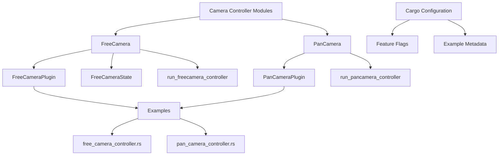

+++
title = "#21592 Update `PanCam` and `FreeCam` to use full term `Camera`"
date = "2025-10-20T00:00:00"
draft = false
template = "pull_request_page.html"
in_search_index = false

[extra]
current_language = "zh-cn"
available_languages = {"en" = { name = "English", url = "/pull_request/bevy/2025-10/pr-21592-en-20251020" }, "zh-cn" = { name = "中文", url = "/pull_request/bevy/2025-10/pr-21592-zh-cn-20251020" }}
labels = ["C-Usability", "A-Camera"]
+++

# Update `PanCam` and `FreeCam` to use full term `Camera`

## Basic Information
- **Title**: Update `PanCam` and `FreeCam` to use full term `Camera`
- **PR Link**: https://github.com/bevyengine/bevy/pull/21592
- **Author**: syszery
- **Status**: MERGED
- **Labels**: C-Usability, S-Ready-For-Final-Review, A-Camera
- **Created**: 2025-10-18T18:03:27Z
- **Merged**: 2025-10-20T22:14:02Z
- **Merged By**: alice-i-cecile

## Description Translation
# Objective

这个PR修复了#21569，该问题提议将新引入的相机控制器模块`FreeCam`和`PanCam`重命名为使用完整术语`Camera`。

## Solution

* 将`PanCam`控制器、`PanCamPlugin`及相关方法重命名为使用完整术语`Camera`，而不是缩写`Cam`。
* 将模块从`pan_cam`重命名为`pan_camera`以符合命名约定。
* 更新了示例`pan_camera_controller`并调整了重命名后的控制器和插件的使用。
* 相应地更新了文档和发布说明。

## Follow-up Work

从这里我看到两个选项：

1. **使用这个PR作为参考**来重命名`FreeCam`。这个过程类似，对于想要为新的相机模块或Bevy做贡献的人来说可能是一个很好的第一个问题。大多数更改遵循相同的模式，尽管`FreeCam`有更多需要更新的示例。可以使用`grep`（例如`grep FreeCam`）或通过查看引入`FreeCam`的PR的差异来找到它们：#20215

2. **我可以继续更新这个PR**以同时处理`FreeCam`的重命名，如果你希望一次性解决整个问题。

## The Story of This Pull Request

这个PR源于一个简单的命名一致性需求。在Bevy引擎中，相机控制器模块使用了缩写`Cam`而不是完整术语`Camera`，这与其他模块的命名模式不一致。开发者syszery识别到这个问题并提出了解决方案。

问题的核心在于新引入的相机控制器模块使用了不一致的命名。`FreeCam`和`PanCam`使用了缩写形式，而Bevy代码库中的其他组件倾向于使用完整术语。这种不一致性会影响代码的可读性和维护性，特别是对于新贡献者来说。

开发者采取了系统性的方法来解决这个问题。首先，他们处理了`PanCam`相关的重命名，这包括：

- 将`PanCam`结构体重命名为`PanCamera`
- 将`PanCamPlugin`重命名为`PanCameraPlugin`  
- 将模块从`pan_cam`重命名为`pan_camera`
- 更新相关的示例和文档

技术实现上，这个重命名过程涉及多个层面的更改。在Cargo.toml文件中，需要更新特性标志：

```toml
# Before:
free_cam = ["bevy_internal/free_cam"]
pan_cam = ["bevy_internal/pan_cam"]

# After:
free_camera = ["bevy_internal/free_camera"]
pan_camera = ["bevy_internal/pan_camera"]
```

在模块层面，文件被重命名并更新了内部引用：

```rust
// Before:
#[cfg(feature = "free_cam")]
pub mod free_cam;

#[cfg(feature = "pan_cam")]
pub mod pan_cam;

// After:
#[cfg(feature = "free_camera")]
pub mod free_camera;

#[cfg(feature = "pan_camera")]
pub mod pan_camera;
```

对于`FreeCam`控制器，重命名涉及更复杂的更改，因为它有更多的依赖和使用场景。主要的结构体和组件都被更新：

```rust
// Before:
pub struct FreeCam;
pub struct FreeCamPlugin;
pub struct FreeCamState;

// After:
pub struct FreeCamera;
pub struct FreeCameraPlugin;
pub struct FreeCameraState;
```

相应的系统函数也被重命名：

```rust
// Before:
pub fn run_freecam_controller(...)

// After:
pub fn run_freecamera_controller(...)
```

这个PR的一个关键洞察是命名一致性在大型开源项目中的重要性。虽然从技术角度看，这些更改相对简单，但它们对项目的长期维护性和新贡献者的上手体验有显著影响。

从工程角度来看，这种类型的重构需要仔细考虑向后兼容性。由于这些是相对较新的模块，破坏性更改的影响被最小化。开发者还明智地选择了分阶段的方法，首先处理`PanCam`作为参考实现，然后再处理更复杂的`FreeCam`。

这个PR展示了良好的开源贡献实践：识别小的改进机会，提供清晰的实现，并为后续工作留下明确的指导。技术债务的及时偿还有助于保持代码库的健康状态。

## Visual Representation



## Key Files Changed

### `crates/bevy_camera_controller/src/free_camera.rs` (+60/-61)
这个文件从`free_cam.rs`重命名为`free_camera.rs`，包含了`FreeCam`到`FreeCamera`的全面重命名。

**主要更改：**
```rust
// Before:
pub struct FreeCam;
pub struct FreeCamPlugin;
pub struct FreeCamState;
pub fn run_freecam_controller(...)

// After:
pub struct FreeCamera;
pub struct FreeCameraPlugin;
pub struct FreeCameraState;
pub fn run_freecamera_controller(...)
```

**文档更新：**
```rust
// Before:
//! A camera controller that allows the user to move freely around the scene.
//! Free cams are helpful for exploring large scenes...

// After:
//! A camera controller that allows the user to move freely around the scene.
//! Free cameras are helpful for exploring large scenes...
```

### `examples/camera/free_camera_controller.rs` (+33/-30)
示例文件从`free_cam_controller.rs`重命名为`free_camera_controller.rs`，更新了所有相关的导入和使用。

**主要更改：**
```rust
// Before:
use bevy::camera_controller::free_cam::{FreeCam, FreeCamPlugin, FreeCamState};
.add_plugins(FreeCamPlugin)
commands.spawn((Camera3d::default(), FreeCam::default()))

// After:
use bevy::camera_controller::free_camera::{FreeCamera, FreeCameraPlugin, FreeCameraState};
.add_plugins(FreeCameraPlugin)
commands.spawn((Camera3d::default(), FreeCamera::default()))
```

### `crates/bevy_camera_controller/src/pan_camera.rs` (+28/-28)
类似于free camera的更改，将`PanCam`重命名为`PanCamera`。

**主要更改：**
```rust
// Before:
pub struct PanCam;
pub struct PanCamPlugin;
fn run_pancam_controller(...)

// After:
pub struct PanCamera;
pub struct PanCameraPlugin;
fn run_pancamera_controller(...)
```

### `Cargo.toml` (+22/-22)
更新了特性标志和示例配置，确保所有引用都使用新的命名约定。

**特性标志更新：**
```toml
# Before:
free_cam = ["bevy_internal/free_cam"]
pan_cam = ["bevy_internal/pan_cam"]

# After:
free_camera = ["bevy_internal/free_camera"]
pan_camera = ["bevy_internal/pan_camera"]
```

**示例配置更新：**
```toml
# Before:
[[example]]
name = "free_cam_controller"
path = "examples/camera/free_cam_controller.rs"
required-features = ["free_cam"]

# After:
[[example]]
name = "free_camera_controller"
path = "examples/camera/free_camera_controller.rs"
required-features = ["free_camera"]
```

### `release-content/release-notes/camera_controllers.md` (+10/-10)
更新了发布说明文档，确保文档中的术语与代码保持一致。

**文档内容更新：**
```markdown
# Before:
### `FreeCam`
The first camera controller that we've introduced is a "free cam"...

### `PanCam`
The `PanCam` controller is a simple and effective tool...

# After:
### `FreeCamera`
The first camera controller that we've introduced is a "free camera"...

### `PanCamera`
The `PanCamera` controller is a simple and effective tool...
```

## Further Reading

- [Bevy Camera Controllers Documentation](https://github.com/bevyengine/bevy/tree/main/crates/bevy_camera_controller)
- [Rust Naming Conventions](https://rust-lang.github.io/api-guidelines/naming.html)
- [Bevy Contribution Guide](https://github.com/bevyengine/bevy/blob/main/CONTRIBUTING.md)
- [Original Issue #21569](https://github.com/bevyengine/bevy/issues/21569)

# Full Code Diff
*(由于代码差异过长，此处仅显示关键更改，完整差异请参考PR链接)*

这个PR展示了在大型代码库中进行一致性重命名的标准流程，包括更新模块名、结构体名、函数名、文档和配置文件。这种类型的维护工作对于保持代码质量和开发者体验至关重要。