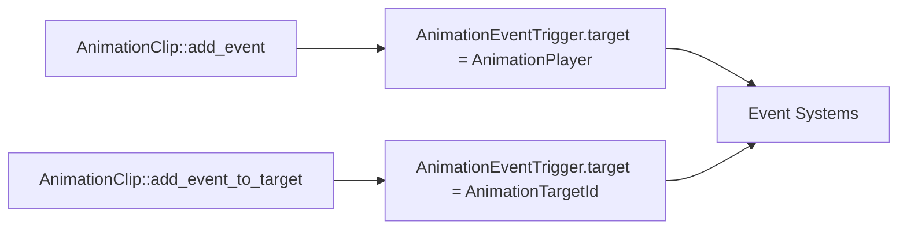

+++
title = "#21593 Rename `AnimationEventTrigger::animation_player` to `target` and fix misleading docs surrounding it"
date = "2025-10-19T00:00:00"
draft = false
template = "pull_request_page.html"
in_search_index = true

[taxonomies]
list_display = ["show"]

[extra]
current_language = "en"
available_languages = {"en" = { name = "English", url = "/pull_request/bevy/2025-10/pr-21593-en-20251019" }, "zh-cn" = { name = "中文", url = "/pull_request/bevy/2025-10/pr-21593-zh-cn-20251019" }}
labels = ["C-Docs", "A-Animation", "D-Straightforward"]
+++

# Title

## Basic Information
- **Title**: Rename `AnimationEventTrigger::animation_player` to `target` and fix misleading docs surrounding it
- **PR Link**: https://github.com/bevyengine/bevy/pull/21593
- **Author**: janhohenheim
- **Status**: MERGED
- **Labels**: C-Docs, S-Ready-For-Final-Review, A-Animation, M-Needs-Migration-Guide, D-Straightforward
- **Created**: 2025-10-18T18:30:10Z
- **Merged**: 2025-10-19T20:05:44Z
- **Merged By**: alice-i-cecile

## Description Translation
# Objective

- The current name and docs tell you this is the animation player entity. But it's not necessarily! When adding an event via `AnimationClip::add_event_to_target`, that entity actually points to the `AnimationTargetId`, not the animation player! 
  - This just caused some major confusion for me while debugging a system that was supposed to play a sound effect from a specific bone (namely a footstep from the foot).

## Solution

- Rename the field to `target`
- Change the docs to mention the nuance

## Testing

- Verified behavior in a test scene

## The Story of This Pull Request

This PR addresses a documentation and naming issue that caused real confusion during development. The author encountered a problem while debugging a footstep sound system where they expected an animation event to reference the animation player entity, but instead found it was referencing a different entity entirely.

The core issue was in the `AnimationEventTrigger` struct, which had a field named `animation_player` that suggested it always contained the animation player entity. However, this wasn't accurate - when events were added using `AnimationClip::add_event_to_target`, the entity actually referred to the `AnimationTargetId` (like a specific bone), not the animation player itself.

The solution was straightforward but important for API clarity:
1. Rename the field from `animation_player` to `target` to reflect its actual, more general purpose
2. Update documentation to clearly explain when the entity refers to the animation player versus when it refers to the animation target

In the implementation, the changes were minimal but impactful. The field rename propagated through multiple files, and the documentation updates provided crucial context for developers. The example code was also updated to use the new field name, ensuring consistency across the codebase.

The migration guide was particularly thoughtful - it explicitly calls out the behavioral difference between `AnimationClip::add_event` and `AnimationClip::add_event_to_target`, which was the root cause of the original confusion.

## Visual Representation



## Key Files Changed

### `crates/bevy_animation/src/animation_event.rs` (+12/-8)
This file contained the core structural change and documentation improvements.

**Key changes:**
- Renamed `animation_player` field to `target` in `AnimationEventTrigger`
- Updated documentation to clarify when the entity refers to the animation player vs animation target
- Added `#[derive(Debug)]` to `AnimationEventTrigger`

```rust
// Before:
pub struct AnimationEventTrigger {
    pub animation_player: Entity,
}

// After:
#[derive(Debug)]
pub struct AnimationEventTrigger {
    pub target: Entity,
}
```

### `crates/bevy_animation/src/lib.rs` (+4/-14)
Updated the event creation methods to use the new field name and structure.

```rust
// Before in add_event:
commands.trigger_with(
    event.clone(),
    AnimationEventTrigger {
        animation_player: entity,
    },
);

// After in add_event:
commands.trigger_with(event.clone(), AnimationEventTrigger { target });
```

### `examples/animation/animated_mesh_events.rs` (+1/-3)
Updated the example code to use the new field name.

```rust
// Before:
let translation = transforms.get(step.trigger().animation_player)?.translation();

// After:
let translation = transforms.get(step.trigger().target)?.translation();
```

### `release-content/migration-guides/animation-event-trigger-rename.md` (+11/-0)
Added a comprehensive migration guide explaining the change and the reasoning behind it.

## Further Reading

- [Bevy Animation System Documentation](https://bevyengine.org/learn/books/introduction/features/animation/)
- [Entity Component System (ECS) Pattern](https://en.wikipedia.org/wiki/Entity_component_system)
- [Rust API Guidelines on Naming](https://rust-lang.github.io/api-guidelines/naming.html)

# Full Code Diff
```diff
diff --git a/crates/bevy_animation/src/animation_event.rs b/crates/bevy_animation/src/animation_event.rs
index 55bf5655855a6..824defc83a85b 100644
--- a/crates/bevy_animation/src/animation_event.rs
+++ b/crates/bevy_animation/src/animation_event.rs
@@ -7,17 +7,21 @@ use bevy_ecs::{
     world::DeferredWorld,
 };
 
-/// An [`Event`] that an [`AnimationPlayer`](crate::AnimationPlayer) can trigger when playing an [`AnimationClip`](crate::AnimationClip).
-/// See [`AnimationClip::add_event`](crate::AnimationClip::add_event).
+/// An [`Event`] that an [`AnimationPlayer`](crate::AnimationPlayer) or an [`AnimationTargetId`](crate::AnimationTargetId) can trigger when playing an [`AnimationClip`](crate::AnimationClip).
+///
+/// - If you used [`AnimationClip::add_event`](crate::AnimationClip::add_event), this will be triggered by the [`AnimationPlayer`](crate::AnimationPlayer).
+/// - If you used [`AnimationClip::add_event_to_target`](crate::AnimationClip::add_event_to_target), this will be triggered by the [`AnimationTargetId`](crate::AnimationTargetId).
 ///
 /// This trait can be derived.
 pub trait AnimationEvent: Clone + for<'a> Event<Trigger<'a> = AnimationEventTrigger> {}
 
-/// The [`Trigger`] implementation for [`AnimationEvent`]. This passes in the [`AnimationPlayer`](crate::AnimationPlayer)
-/// context, and uses that to run any observers that target that entity.
+/// The [`Trigger`] implementation for [`AnimationEvent`]. This passes in either the [`AnimationPlayer`](crate::AnimationPlayer) or the [`AnimationTargetId`](crate::AnimationTargetId)
+/// context, and uses that to run any observers that target that entity. See [`AnimationEvent`] for when which entity is used.
+#[derive(Debug)]
 pub struct AnimationEventTrigger {
-    /// The [`AnimationPlayer`](crate::AnimationPlayer) where this [`AnimationEvent`] occurred.
-    pub animation_player: Entity,
+    /// The [`AnimationPlayer`](crate::AnimationPlayer) or the [`AnimationTargetId`](crate::AnimationTargetId) where this [`AnimationEvent`] occurred.
+    /// See [`AnimationEvent`] for when which entity is used.
+    pub target: Entity,
 }
 
 #[expect(
@@ -37,7 +41,7 @@ unsafe impl<E: AnimationEvent + for<'a> Event<Trigger<'a> = AnimationEventTrigge
         trigger_context: &TriggerContext,
         event: &mut E,
     ) {
-        let animation_player = self.animation_player;
+        let target = self.target;
         // SAFETY:
         // - `observers` come from `world` and match the event type `E`, enforced by the call to `trigger`
         // - the passed in event pointer comes from `event`, which is an `Event`
@@ -50,7 +54,7 @@ unsafe impl<E: AnimationEvent + for<'a> Event<Trigger<'a> = AnimationEventTrigge
                 observers,
                 event.into(),
                 self.into(),
-                animation_player,
+                target,
                 trigger_context,
             );
         }
diff --git a/crates/bevy_animation/src/lib.rs b/crates/bevy_animation/src/lib.rs
index fb81224637ac1..146ce09c36f9d 100644
--- a/crates/bevy_animation/src/lib.rs
+++ b/crates/bevy_animation/src/lib.rs
@@ -326,13 +326,8 @@ impl AnimationClip {
     pub fn add_event(&mut self, time: f32, event: impl AnimationEvent) {
         self.add_event_fn(
             time,
-            move |commands: &mut Commands, entity: Entity, _time: f32, _weight: f32| {
-                commands.trigger_with(
-                    event.clone(),
-                    AnimationEventTrigger {
-                        animation_player: entity,
-                    },
-                );
+            move |commands: &mut Commands, target: Entity, _time: f32, _weight: f32| {
+                commands.trigger_with(event.clone(), AnimationEventTrigger { target });
             },
         );
     }
@@ -352,13 +347,8 @@ impl AnimationClip {
         self.add_event_fn_to_target(
             target_id,
             time,
-            move |commands: &mut Commands, entity: Entity, _time: f32, _weight: f32| {
-                commands.trigger_with(
-                    event.clone(),
-                    AnimationEventTrigger {
-                        animation_player: entity,
-                    },
-                );
+            move |commands: &mut Commands, target: Entity, _time: f32, _weight: f32| {
+                commands.trigger_with(event.clone(), AnimationEventTrigger { target });
             },
         );
     }
diff --git a/examples/animation/animated_mesh_events.rs b/examples/animation/animated_mesh_events.rs
index 5898807cf45a3..5cb8f70ebdf3c 100644
--- a/examples/animation/animated_mesh_events.rs
+++ b/examples/animation/animated_mesh_events.rs
@@ -49,9 +49,7 @@ fn observe_on_step(
     transforms: Query<&GlobalTransform>,
     mut seeded_rng: ResMut<SeededRng>,
 ) -> Result {
-    let translation = transforms
-        .get(step.trigger().animation_player)?
-        .translation();
+    let translation = transforms.get(step.trigger().target)?.translation();
     // Spawn a bunch of particles.
     for _ in 0..14 {
         let horizontal = seeded_rng.0.random::<Dir2>() * seeded_rng.0.random_range(8.0..12.0);
diff --git a/release-content/migration-guides/animation-event-trigger-rename.md b/release-content/migration-guides/animation-event-trigger-rename.md
new file mode 100644
index 0000000000000..743bfae5ee114
--- /dev/null
+++ b/release-content/migration-guides/animation-event-trigger-rename.md
@@ -0,0 +1,11 @@
+---
+title: "`AnimationEventTrigger::animation_player` has been renamed to `AnimationEventTrigger::target`"
+pull_requests: [21593]
+---
+
+This field and its docs strongly suggested that it would point to an entity holding an `AnimationPlayer`, but that actually depends on how the event was registered.
+
+- If you used `AnimationClip::add_event`, the field really did point to the `AnimationPlayer`
+- But if you used `AnimationClip::add_event_to_target`, this field instead pointed to an `AnimationTargetId`
+
+To make this more clear, the field was renamed to `target` and the docs surrounding it improved.
```