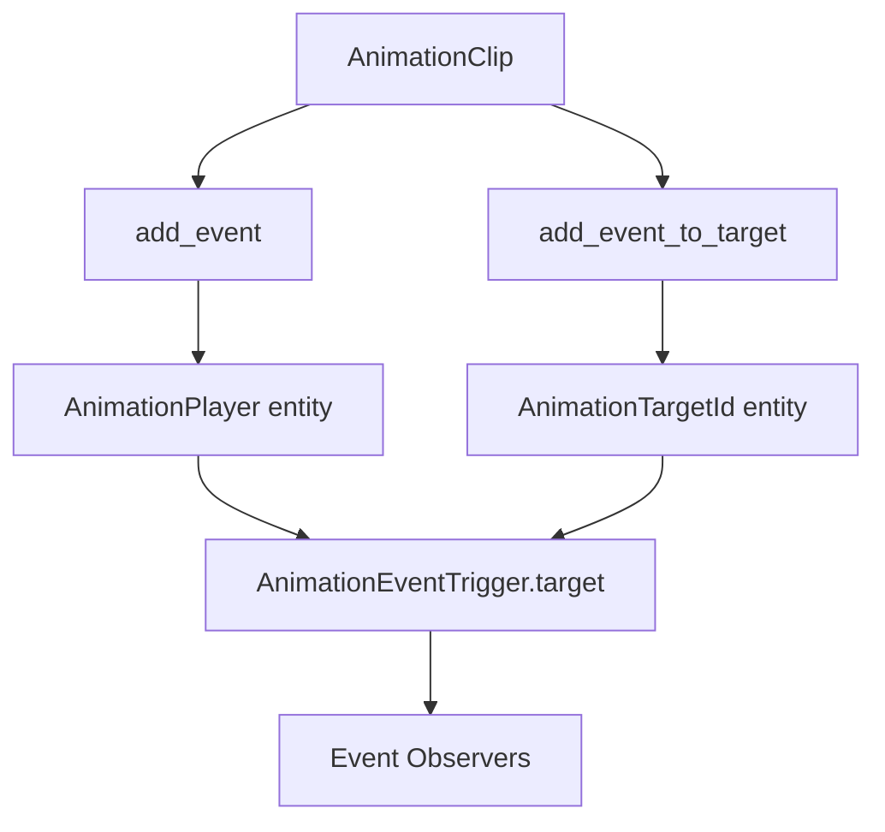

+++
title = "#21593 Rename `AnimationEventTrigger::animation_player` to `target` and fix misleading docs surrounding it"
date = "2025-10-19T00:00:00"
draft = false
template = "pull_request_page.html"
in_search_index = false

[extra]
current_language = "zh-cn"
available_languages = {"en" = { name = "English", url = "/pull_request/bevy/2025-10/pr-21593-en-20251019" }, "zh-cn" = { name = "中文", url = "/pull_request/bevy/2025-10/pr-21593-zh-cn-20251019" }}
labels = ["C-Docs", "A-Animation", "D-Straightforward"]
+++

# Title

## Basic Information
- **Title**: Rename `AnimationEventTrigger::animation_player` to `target` and fix misleading docs surrounding it
- **PR Link**: https://github.com/bevyengine/bevy/pull/21593
- **Author**: janhohenheim
- **Status**: MERGED
- **Labels**: C-Docs, S-Ready-For-Final-Review, A-Animation, M-Needs-Migration-Guide, D-Straightforward
- **Created**: 2025-10-18T18:30:10Z
- **Merged**: 2025-10-19T20:05:44Z
- **Merged By**: alice-i-cecile

## Description Translation
**目标**

- 当前的名称和文档告诉你这是动画播放器实体。但实际上不一定是！当通过 `AnimationClip::add_event_to_target` 添加事件时，该实体实际上指向的是 `AnimationTargetId`，而不是动画播放器！
  - 这在我调试一个应该从特定骨骼（即从脚部播放脚步声）播放音效的系统时，造成了严重的困惑。

**解决方案**

- 将字段重命名为 `target`
- 修改文档以说明这个细微差别

**测试**

- 在测试场景中验证了行为

## The Story of This Pull Request

这个PR源于一个实际开发中遇到的困惑问题。作者在使用Bevy的动画事件系统时发现，`AnimationEventTrigger::animation_player`字段的名称和文档存在误导性，导致调试特定功能时出现了困难。

**问题的根源**在于API设计的语义不明确。当开发者使用`AnimationClip::add_event`方法时，触发事件的实体确实是动画播放器（AnimationPlayer）。但当使用`AnimationClip::add_event_to_target`方法时，触发事件的实体实际上是动画目标ID（AnimationTargetId），这通常对应于场景中的特定骨骼或节点。这种不一致性在文档中没有明确说明，导致开发者对字段的实际含义产生误解。

**解决方案的实施**相对直接但影响广泛。首先，作者将`AnimationEventTrigger`结构体中的`animation_player`字段重命名为`target`，这个更通用的名称能够准确反映字段在不同使用场景下的实际含义。同时，更新了相关的文档注释，明确指出：
- 使用`AnimationClip::add_event`时，`target`指向`AnimationPlayer`
- 使用`AnimationClip::add_event_to_target`时，`target`指向`AnimationTargetId`

在技术实现层面，这个变更需要同步修改多个地方：
1. 结构体字段定义和文档
2. 事件触发器的实现代码
3. 动画剪辑中添加事件的方法
4. 使用该字段的示例代码

**代码层面的具体修改**展示了这个重构的连贯性。在`animation_event.rs`中，不仅字段名称改变了，相关的文档注释也进行了全面更新，明确了不同使用场景下`target`字段的实际指向。在`lib.rs`中，两个添加事件的方法（`add_event`和`add_event_to_target`）的参数名也从`entity`统一改为`target`，保持了命名的一致性。

**技术洞察**：这个PR展示了良好的API设计原则。当一个字段的名称不能准确反映其所有可能的使用场景时，及时的重命名和文档更新可以显著提高代码的可读性和可维护性。特别是对于事件系统这种可能被多个不同场景使用的组件，清晰的语义至关重要。

**影响和教训**：这个变更虽然是破坏性的（需要迁移指南），但带来的好处是显著的。它消除了API使用中的歧义，使得开发者能够更准确地理解和使用动画事件系统。这也提醒我们在设计API时，需要考虑所有可能的使用场景，确保名称和文档能够准确反映实际行为。

## Visual Representation



## Key Files Changed

### `crates/bevy_animation/src/animation_event.rs` (+12/-8)

这个文件包含了动画事件系统的核心定义。主要修改包括：

1. 更新了`AnimationEvent` trait的文档，明确说明事件可以由`AnimationPlayer`或`AnimationTargetId`触发
2. 重命名了`AnimationEventTrigger`结构体的字段并更新了相关文档

```rust
// Before:
pub struct AnimationEventTrigger {
    pub animation_player: Entity,
}

// After:
pub struct AnimationEventTrigger {
    pub target: Entity,
}
```

### `crates/bevy_animation/src/lib.rs` (+4/-14)

这个文件包含了`AnimationClip`的实现，修改了两个添加事件的方法：

```rust
// Before (add_event):
commands.trigger_with(
    event.clone(),
    AnimationEventTrigger {
        animation_player: entity,
    },
);

// After (add_event):
commands.trigger_with(event.clone(), AnimationEventTrigger { target });
```

### `examples/animation/animated_mesh_events.rs` (+1/-3)

更新了示例代码以使用新的字段名：

```rust
// Before:
let translation = transforms.get(step.trigger().animation_player)?.translation();

// After:
let translation = transforms.get(step.trigger().target)?.translation();
```

### `release-content/migration-guides/animation-event-trigger-rename.md` (+11/-0)

新增了迁移指南，解释了变更的原因和影响：

```markdown
This field and its docs strongly suggested that it would point to an entity holding an `AnimationPlayer`, but that actually depends on how the event was registered.

- If you used `AnimationClip::add_event`, the field really did point to the `AnimationPlayer`
- But if you used `AnimationClip::add_event_to_target`, this field instead pointed to an `AnimationTargetId`

To make this more clear, the field was renamed to `target` and the docs surrounding it improved.
```

## Further Reading

- [Bevy Animation System Documentation](https://docs.rs/bevy_animation/latest/bevy_animation/)
- [Bevy Events and Observers](https://docs.rs/bevy_ecs/latest/bevy_ecs/event/index.html)
- [API Design Best Practices](https://rust-lang.github.io/api-guidelines/naming.html)