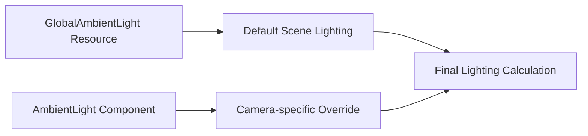

+++
title = "#21595 Split `AmbientLight` into two"
date = "2025-10-21T00:00:00"
draft = false
template = "pull_request_page.html"
in_search_index = true

[taxonomies]
list_display = ["show"]

[extra]
current_language = "en"
available_languages = {"en" = { name = "English", url = "/pull_request/bevy/2025-10/pr-21595-en-20251021" }, "zh-cn" = { name = "中文", url = "/pull_request/bevy/2025-10/pr-21595-zh-cn-20251021" }}
labels = ["A-Rendering", "C-Code-Quality", "M-Migration-Guide", "D-Straightforward"]
+++

# Title

## Basic Information
- **Title**: Split `AmbientLight` into two
- **PR Link**: https://github.com/bevyengine/bevy/pull/21595
- **Author**: Trashtalk217
- **Status**: MERGED
- **Labels**: A-Rendering, C-Code-Quality, S-Ready-For-Final-Review, M-Migration-Guide, D-Straightforward
- **Created**: 2025-10-18T21:11:36Z
- **Merged**: 2025-10-21T23:30:41Z
- **Merged By**: alice-i-cecile

## Description Translation
# Objective

For resources-as-components (#19731), structs mustn't doubly derive both `Component` and `Resource`.

## Solution

Split `AmbientLight` in two: `AmbientLight` (the resource) and `AmbientLightOverride` (the component).

## Testing

I initially made two structs `AmbientLightComponent` and `AmbientLightResource`, and replaced every mention with the relevant one to ensure that I didn't confuse the two.

## Notes

- I don't know if the names are correct. I kept the easiest name for the resource, as that's the one most often used.
- I haven't provided any conversion methods as there are already plans to replace the component variant with something else.

## The Story of This Pull Request

This PR addresses a fundamental architectural constraint in Bevy's ECS system. The core problem stemmed from the fact that structs cannot derive both `Component` and `Resource` traits under the new resources-as-components paradigm (#19731). The `AmbientLight` struct was caught in this conflict because it served dual purposes: as a global resource providing default ambient lighting, and as a component that could be attached to cameras to override the global settings.

The solution was straightforward but required careful implementation: split the single `AmbientLight` type into two separate types with distinct responsibilities. The existing `AmbientLight` became a component-only type for camera-specific overrides, while a new `GlobalAmbientLight` type was created to serve as the global resource.

The implementation approach was methodical. The developer created two temporary structs (`AmbientLightComponent` and `AmbientLightResource`) during development to ensure they didn't confuse the two types, then systematically replaced all occurrences throughout the codebase. This careful approach prevented mixing up the resource and component variants during the refactoring.

From a technical perspective, the split maintains the same functionality but with cleaner separation of concerns. The `GlobalAmbientLight` resource provides the default ambient lighting for the entire scene, while `AmbientLight` components on cameras can override these settings for specific views. This preserves the existing behavior while resolving the architectural constraint.

The changes required updates across multiple areas of the codebase:
- The core type definitions in `ambient_light.rs`
- Plugin initialization that sets up the default resource
- Rendering systems that extract and use ambient light data
- Numerous examples that previously used `AmbientLight` as a resource

One notable design decision was not providing conversion methods between the two types, as there are already plans to replace the component variant with a different approach in the future. This avoids adding temporary API surface that would need to be deprecated later.

The impact of this change is primarily architectural - it aligns the ambient light system with Bevy's evolving ECS patterns while maintaining backward compatibility through straightforward type renaming. The migration guide provides clear instructions for updating existing code.

## Visual Representation



## Key Files Changed

### `crates/bevy_light/src/ambient_light.rs` (+44/-11)
This file contains the core type definitions for both the component and resource variants. The original `AmbientLight` struct was split into two separate structs with the same fields but different trait derivations.

```rust
// Before:
#[derive(Resource, Component, Clone, Debug, Reflect)]
#[reflect(Resource, Component, Debug, Default, Clone)]
#[require(Camera)]
pub struct AmbientLight {
    // fields...
}

// After - Component variant:
#[derive(Component, Clone, Debug, Reflect)]
#[reflect(Component, Debug, Default, Clone)]
#[require(Camera)]
pub struct AmbientLight {
    pub color: Color,
    pub brightness: f32,
    pub affects_lightmapped_meshes: bool,
}

// After - Resource variant:
#[derive(Resource, Clone, Debug, Reflect)]
#[reflect(Resource, Debug, Default, Clone)]
pub struct GlobalAmbientLight {
    pub color: Color,
    pub brightness: f32,
    pub affects_lightmapped_meshes: bool,
}
```

### `crates/bevy_light/src/lib.rs` (+3/-3)
Updated the module exports and plugin initialization to use `GlobalAmbientLight` as the resource type.

```rust
// Updated exports:
pub use ambient_light::{AmbientLight, GlobalAmbientLight};

// Updated plugin initialization:
app.init_resource::<GlobalAmbientLight>()
```

### `crates/bevy_pbr/src/render/light.rs` (+10/-5)
Updated the rendering systems to handle the split types. The systems now extract `GlobalAmbientLight` as a resource and use `AmbientLight` components for camera-specific overrides.

```rust
// Updated function signature:
pub fn extract_ambient_light_resource(
    mut commands: Commands,
    main_resource: Extract<Option<Res<GlobalAmbientLight>>>,
    target_resource: Option<ResMut<GlobalAmbientLight>>,
)

// In prepare_lights system:
let ambient_light = AmbientLight {
    color: ambient_light.color,
    brightness: ambient_light.brightness,
    affects_lightmapped_meshes: ambient_light.affects_lightmapped_meshes,
};
let ambient_light = maybe_ambient_override.unwrap_or(&ambient_light);
```

### `release-content/migration-guides/ambient_light_split.md` (+30/-0)
Added a comprehensive migration guide explaining the change and providing code examples for updating existing code.

```markdown
The `AmbientLight` used to be both a component *and* a resource.
In 0.18, we've split this in two separate structs: `AmbientLight` and `GlobalAmbientLight`.
The resource `GlobalAmbientLight` is the default ambient light for the entire world and automatically added by `LightPlugin`.
Meanwhile, `AmbientLight` is a component that can be added to a `Camera` in order to override the default `GlobalAmbientLight`.
```

### `examples/3d/irradiance_volumes.rs` (+2/-2)
Typical example of updating resource usage:

```rust
// Before:
commands.insert_resource(AmbientLight {
    color: Color::WHITE,
    brightness: 0.0,
    ..default()
});

// After:
commands.insert_resource(GlobalAmbientLight {
    color: Color::WHITE,
    brightness: 0.0,
    ..default()
});
```

## Further Reading

- [Bevy Resources as Components RFC (#19731)](https://github.com/bevyengine/bevy/pull/19731) - The architectural change that motivated this PR
- [Bevy ECS Documentation](https://bevyengine.org/learn/book/ecs/) - Understanding the component vs resource distinction
- [Bevy Lighting System](https://bevyengine.org/learn/book/3d-rendering/lighting/) - Context for how ambient lighting works in Bevy