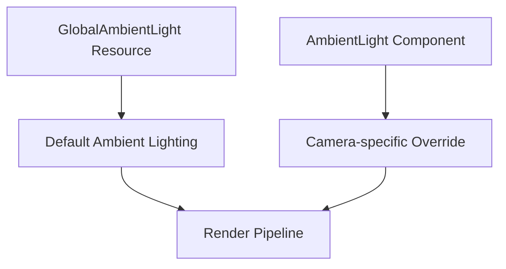

+++
title = "#21595 Split `AmbientLight` into two"
date = "2025-10-21T00:00:00"
draft = false
template = "pull_request_page.html"
in_search_index = false

[extra]
current_language = "zh-cn"
available_languages = {"en" = { name = "English", url = "/pull_request/bevy/2025-10/pr-21595-en-20251021" }, "zh-cn" = { name = "中文", url = "/pull_request/bevy/2025-10/pr-21595-zh-cn-20251021" }}
labels = ["A-Rendering", "C-Code-Quality", "M-Migration-Guide", "D-Straightforward"]
+++

# Title

## Basic Information
- **Title**: Split `AmbientLight` into two
- **PR Link**: https://github.com/bevyengine/bevy/pull/21595
- **Author**: Trashtalk217
- **Status**: MERGED
- **Labels**: A-Rendering, C-Code-Quality, S-Ready-For-Final-Review, M-Migration-Guide, D-Straightforward
- **Created**: 2025-10-18T21:11:36Z
- **Merged**: 2025-10-21T23:30:41Z
- **Merged By**: alice-i-cecile

## Description Translation
# 目标

对于资源即组件（#19731），结构体不能同时派生 `Component` 和 `Resource`。

## 解决方案

将 `AmbientLight` 拆分为两个：`AmbientLight`（资源）和 `AmbientLightOverride`（组件）。

## 测试

我最初创建了两个结构体 `AmbientLightComponent` 和 `AmbientLightResource`，并将每个引用替换为相关的那个，以确保我没有混淆两者。

## 备注

- 我不确定名称是否正确。我为资源保留了最简单的名称，因为这是最常用的。
- 我没有提供任何转换方法，因为已经有计划用其他东西替换组件变体。

## The Story of This Pull Request

这个 PR 源于 Bevy 引擎中一个重要的架构变更需求。随着"资源即组件"（resources-as-components）功能的推进（#19731），引擎需要明确区分哪些实体应该作为组件（Component），哪些应该作为资源（Resource）。在之前的实现中，`AmbientLight` 同时派生自 `Component` 和 `Resource`，这违反了新的架构原则。

开发者面临的核心问题是：环境光（ambient light）在 Bevy 中有两种使用场景。一种是作为全局资源影响整个场景，另一种是作为相机组件用于覆盖全局设置。之前的单一结构体设计无法适应新的架构要求。

解决方案采用了清晰的分层策略：将原有的 `AmbientLight` 拆分为 `GlobalAmbientLight`（资源）和 `AmbientLight`（组件）。`GlobalAmbientLight` 作为默认的全局环境光资源，由 `LightPlugin` 自动插入；而 `AmbientLight` 组件可以附加到相机上，用于覆盖全局设置。

在实现过程中，开发者采用了保守的重命名方法。他们首先创建了两个临时结构体 `AmbientLightComponent` 和 `AmbientLightResource`，然后系统地替换所有相关引用，确保没有混淆两种类型。这种方法虽然增加了中间步骤，但保证了重构的安全性。

从技术角度看，这个拆分保持了 API 的向后兼容性。原有的字段和功能都得到了保留，只是重新分配到了不同的类型中。在渲染管线中，系统会优先检查相机上是否有 `AmbientLight` 组件，如果没有则回退到使用 `GlobalAmbientLight` 资源：

```rust
let ambient_light = maybe_ambient_override.unwrap_or(&ambient_light);
```

这个实现展示了良好的软件工程实践：通过类型系统来强制实施架构约束，而不是依赖文档或约定。新的设计使得环境光的两种用途在编译时就能得到区分，减少了运行时错误的可能性。

迁移指南提供了清晰的升级路径，开发者只需要将 `AmbientLight` 资源的使用改为 `GlobalAmbientLight`，而组件用法保持不变。这种最小化的变更减少了升级的复杂性。

## Visual Representation



## Key Files Changed

### `crates/bevy_light/src/ambient_light.rs` (+44/-11)
这个文件是核心变更所在，实现了环境光的拆分：

```rust
// 新的组件类型
#[derive(Component, Clone, Debug, Reflect)]
#[reflect(Component, Debug, Default, Clone)]
#[require(Camera)]
pub struct AmbientLight {
    pub color: Color,
    pub brightness: f32,
    pub affects_lightmapped_meshes: bool,
}

// 新的资源类型
#[derive(Resource, Clone, Debug, Reflect)]
#[reflect(Resource, Debug, Default, Clone)]
pub struct GlobalAmbientLight {
    pub color: Color,
    pub brightness: f32,
    pub affects_lightmapped_meshes: bool,
}
```

### `crates/bevy_light/src/lib.rs` (+3/-3)
更新了模块导出和插件初始化：

```rust
// 更新导出
pub use ambient_light::{AmbientLight, GlobalAmbientLight};

// 更新插件初始化
app.init_resource::<GlobalAmbientLight>()
```

### `crates/bevy_pbr/src/render/light.rs` (+10/-5)
更新了渲染管线中的环境光处理：

```rust
// 更新函数签名
pub fn extract_ambient_light_resource(
    mut commands: Commands,
    main_resource: Extract<Option<Res<GlobalAmbientLight>>>,
    target_resource: Option<ResMut<GlobalAmbientLight>>,
)

// 在渲染准备阶段处理组件覆盖
let ambient_light = AmbientLight {
    color: ambient_light.color,
    brightness: ambient_light.brightness,
    affects_lightmapped_meshes: ambient_light.affects_lightmapped_meshes,
};
let ambient_light = maybe_ambient_override.unwrap_or(&ambient_light);
```

### `release-content/migration-guides/ambient_light_split.md` (+30/-0)
新增了迁移指南，提供了清晰的升级说明和代码示例。

### `examples/3d/irradiance_volumes.rs` (+2/-2)
典型的示例更新：

```rust
// 之前
commands.insert_resource(AmbientLight {
    color: Color::WHITE,
    brightness: 0.0,
    ..default()
})

// 之后  
commands.insert_resource(GlobalAmbientLight {
    color: Color::WHITE,
    brightness: 0.0,
    ..default()
})
```

## Further Reading

- [Bevy Resources and Components Documentation](https://bevyengine.org/learn/book/next/programming/resourses)
- [ECS Architecture Patterns](https://bevyengine.org/learn/book/next/ecs/introduction)
- [Rendering Pipeline in Bevy](https://bevyengine.org/learn/book/next/rendering/pipelines)