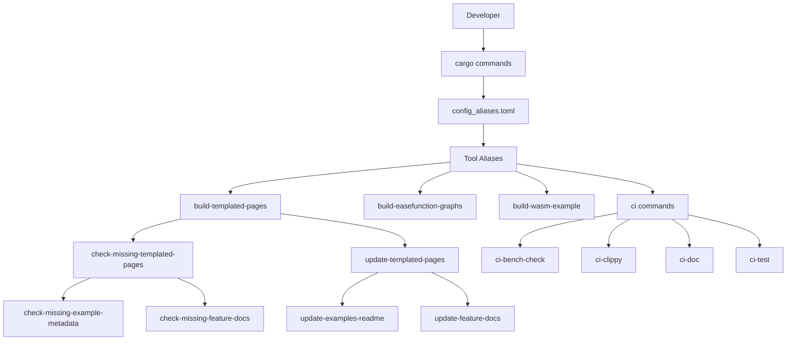

+++
title = "#21597 Create a config file for cargo aliases, so tool commands aren't so painful to type"
date = "2025-10-19T00:00:00"
draft = false
template = "pull_request_page.html"
in_search_index = true

[taxonomies]
list_display = ["show"]

[extra]
current_language = "en"
available_languages = {"en" = { name = "English", url = "/pull_request/bevy/2025-10/pr-21597-en-20251019" }, "zh-cn" = { name = "中文", url = "/pull_request/bevy/2025-10/pr-21597-zh-cn-20251019" }}
labels = ["A-Build-System", "C-Code-Quality", "D-Straightforward"]
+++

# Title
Create a config file for cargo aliases, so tool commands aren't so painful to type

## Basic Information
- **Title**: Create a config file for cargo aliases, so tool commands aren't so painful to type
- **PR Link**: https://github.com/bevyengine/bevy/pull/21597
- **Author**: LikeLakers2
- **Status**: MERGED
- **Labels**: A-Build-System, C-Code-Quality, D-Straightforward, S-Needs-Review
- **Created**: 2025-10-18T23:33:39Z
- **Merged**: 2025-10-19T10:15:06Z
- **Merged By**: mockersf

## Description Translation

# Objective
To be honest, typing tool commands suck due to just how long the commands are.

Also, what is a `ci` alias doing in a config file meant for fast builds...?

## Solution
Create a config file for cargo aliases, under `.cargo/config_aliases.toml`, with many short aliases to useful commands.

Now instead of typing `cargo run -p build-templated-pages -- update features`, you can just run `cargo update-feature-docs`. :D

## Testing
This change was tested by copying `.cargo/config_aliases.toml` to `.cargo/config.toml`, and running `cargo --list` to confirm that they showed up.

I also ran a few (but not all) of these aliases to ensure they work.

## The Story of This Pull Request

This PR addresses a common developer experience issue in large Rust projects: the verbosity of cargo commands for running internal tools and CI tasks. The core problem was straightforward - developers were spending unnecessary time and keystrokes typing out long cargo commands for routine development tasks.

The existing setup had a misplaced `ci` alias in the fast builds configuration file, which didn't logically belong there since CI commands aren't typically used during fast development builds. This organizational inconsistency highlighted the need for a more structured approach to command aliases.

The solution implemented creates a dedicated aliases configuration file that centralizes all tool command shortcuts. This approach follows the principle of separation of concerns - build optimization settings stay in the fast builds config, while command aliases get their own dedicated space. The implementation leverages Cargo's native alias system, which provides a clean, built-in way to shorten complex commands without requiring custom tooling or scripts.

The aliases are organized logically by tool category:
- `build-easefunction-graphs` for visualization tools
- `build-templated-pages` for documentation generation
- `build-wasm-example` for WebAssembly builds
- Comprehensive `ci` command aliases for various CI pipeline tasks

Each alias follows a consistent naming pattern that makes the commands intuitive and easy to remember. For example, `cargo update-feature-docs` is much more memorable and faster to type than the original `cargo run -p build-templated-pages -- update features`.

The testing approach was practical and effective - the author verified the aliases worked by copying the config file and running `cargo --list` to confirm visibility, then testing a subset of the aliases to ensure they functioned correctly. This demonstrates good engineering practice by validating both the configuration syntax and the actual command execution.

This change significantly improves developer productivity by reducing cognitive load and typing effort for common development tasks. It also establishes a scalable pattern for adding future aliases as the project grows, making it easier for new contributors to get up to speed with the project's tooling.

## Visual Representation



## Key Files Changed

### .cargo/config_aliases.toml (+41/-0)
This new file centralizes all cargo aliases for Bevy's development tools and CI commands.

```toml
# Copy this file to `config.toml` to enable several aliases to commonly-used tools.

[alias]
### Alias for the `build-easefunction-graphs` tool
build-easefunction-graphs = "run --package build-easefunction-graphs --"

### Aliases for the `build-templated-pages` tool
build-templated-pages = "run --package build-templated-pages --"

# Checks for missing data
check-missing-templated-pages = "build-templated-pages check-missing"
check-missing-example-metadata = "check-missing-templated-pages examples"
check-missing-feature-docs = "check-missing-templated-pages features"

# Updates certain templated data
update-templated-pages = "build-templated-pages update"
update-examples-readme = "update-templated-pages examples"
update-feature-docs = "update-templated-pages features"

### Alias for the `build-wasm-example` tool
build-wasm-example = "run --package build-wasm-example --"

### Aliases for the `ci` tool
ci = "run --package ci --"

# Check each file under `tools/ci/src/commands/` to see what each individual command does
ci-bench-check = "ci bench-check"
ci-clippy = "ci clippy"
ci-compile = "ci compile"
ci-compile-check = "ci compile-check"
ci-compile-fail = "ci compile-fail"
ci-doc = "ci doc"
ci-doc-check = "ci doc-check"
ci-doc-test = "ci doc-test"
ci-example-check = "ci example-check"
ci-format = "ci format"
ci-integration-test-check = "ci integration-test-check"
ci-integration-test-clean = "ci integration-test-clean"
ci-integration-test-run = "ci integration-test"
ci-lints = "ci lints"
ci-test = "ci test"
```

### .cargo/config_fast_builds.toml (+0/-5)
This file had the misplaced `ci` alias removed, cleaning up the fast builds configuration.

```toml
# Before:
# [alias]
# ci = "run --package ci --"

# After:
# (ci alias removed - now in config_aliases.toml)
```

## Further Reading

- [Cargo Configuration Documentation](https://doc.rust-lang.org/cargo/reference/config.html)
- [Cargo Aliases Guide](https://doc.rust-lang.org/cargo/reference/config.html#alias)
- [Bevy Engine Contributing Guide](https://github.com/bevyengine/bevy/blob/main/CONTRIBUTING.md)
- [Rust Workspaces Documentation](https://doc.rust-lang.org/cargo/reference/workspaces.html)