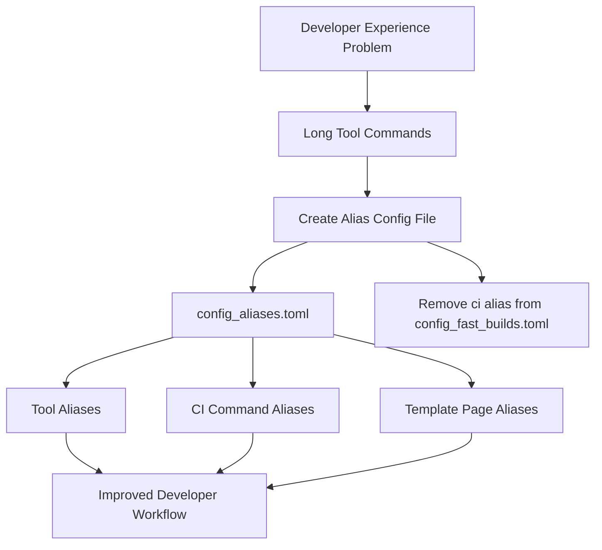

+++
title = "#21597 Create a config file for cargo aliases, so tool commands aren't so painful to type"
date = "2025-10-19T00:00:00"
draft = false
template = "pull_request_page.html"
in_search_index = false

[extra]
current_language = "zh-cn"
available_languages = {"en" = { name = "English", url = "/pull_request/bevy/2025-10/pr-21597-en-20251019" }, "zh-cn" = { name = "中文", url = "/pull_request/bevy/2025-10/pr-21597-zh-cn-20251019" }}
labels = ["A-Build-System", "C-Code-Quality", "D-Straightforward"]
+++

# Create a config file for cargo aliases, so tool commands aren't so painful to type

## Basic Information
- **Title**: Create a config file for cargo aliases, so tool commands aren't so painful to type
- **PR Link**: https://github.com/bevyengine/bevy/pull/21597
- **Author**: LikeLakers2
- **Status**: MERGED
- **Labels**: A-Build-System, C-Code-Quality, D-Straightforward, S-Needs-Review
- **Created**: 2025-10-18T23:33:39Z
- **Merged**: 2025-10-19T10:15:06Z
- **Merged By**: mockersf

## Description Translation
# 目标
说实话，输入工具命令很糟糕，因为命令太长了。

另外，一个用于快速构建的配置文件中为什么要包含 `ci` 别名？

## 解决方案
在 `.cargo/config_aliases.toml` 下创建一个 cargo 别名配置文件，包含许多有用命令的简短别名。

现在，不再需要输入 `cargo run -p build-templated-pages -- update features`，你只需要运行 `cargo update-feature-docs`。:D

## 测试
这个更改通过将 `.cargo/config_aliases.toml` 复制到 `.cargo/config.toml`，并运行 `cargo --list` 来确认它们显示出来进行了测试。

我还运行了其中一些（但不是全部）别名来确保它们工作正常。

## The Story of This Pull Request

这个 PR 源于 Bevy 项目开发过程中一个很实际的问题：工具命令太长，输入起来很麻烦。Bevy 项目使用了多个自定义工具包（如 `build-templated-pages`、`build-wasm-example`、`ci` 等），这些工具需要通过 cargo 运行，但完整的命令格式相当冗长。

开发者面临的具体问题是：每次需要使用这些工具时，都需要输入类似 `cargo run -p build-templated-pages -- update features` 这样的长命令，这不仅降低了开发效率，还增加了出错的可能性。更糟糕的是，开发者发现现有的 `config_fast_builds.toml` 文件中包含了一个 `ci` 别名，这与该文件专注于快速构建的定位不符。

解决方案采用了 Cargo 的标准功能——别名配置。Cargo 允许在 `.cargo/config.toml` 中定义 `[alias]` 部分，为常用命令创建简短的替代名称。这个 PR 的创新之处在于创建了一个专门的别名配置文件 `config_aliases.toml`，而不是直接修改主配置文件，这样用户可以根据需要选择是否启用这些别名。

实现上，这个 PR 做了两件事：首先创建了一个新的别名配置文件，包含了项目所有常用工具的简短别名；其次从快速构建配置中移除了不相关的 `ci` 别名。这种分离关注点的设计很合理——`config_fast_builds.toml` 专注于编译优化，而 `config_aliases.toml` 专注于命令便利性。

技术实现上，别名配置遵循了清晰的命名模式。对于每个工具包，都提供了相应的别名：

```toml
# 基本工具别名
build-easefunction-graphs = "run --package build-easefunction-graphs --"
build-templated-pages = "run --package build-templated-pages --"
build-wasm-example = "run --package build-wasm-example --"
ci = "run --package ci --"
```

更有价值的是，对于复杂的工具如 `build-templated-pages`，还提供了具体任务的子命令别名：

```toml
# 检查缺失数据的别名
check-missing-templated-pages = "build-templated-pages check-missing"
check-missing-example-metadata = "check-missing-templated-pages examples"
check-missing-feature-docs = "check-missing-templated-pages features"

# 更新模板页面的别名
update-templated-pages = "build-templated-pages update"
update-examples-readme = "update-templated-pages examples"
update-feature-docs = "update-templated-pages features"
```

这种分层别名的设计很巧妙，既提供了直接的工具访问，又为常用工作流创建了更便捷的快捷方式。

对于 CI 工具，PR 提供了完整的子命令别名覆盖：

```toml
ci-bench-check = "ci bench-check"
ci-clippy = "ci clippy"
ci-compile = "ci compile"
# ... 更多 CI 子命令别名
```

这种设计的工程价值在于：它显著降低了开发者的认知负担和输入成本。开发者不再需要记住复杂的包名和参数组合，只需要记住直观的任务名称如 `update-feature-docs` 或 `ci-test`。

测试策略也很务实——通过复制配置文件并运行 `cargo --list` 来验证别名是否生效，同时实际运行部分别名确保功能正常。这种测试方法既全面又高效。

从工程实践角度看，这个解决方案体现了几个优秀原则：
1. **关注点分离**：将别名配置与编译配置分离
2. **渐进式采用**：用户可以选择是否启用这些别名
3. **向后兼容**：原有的长命令仍然有效
4. **自文档化**：别名名称清晰表达了其功能

这个 PR 虽然改动不大，但对开发者体验的改善是实质性的。它展示了如何通过简单的配置优化来显著提升开发效率，是一个典型的高回报低风险改进。

## Visual Representation



## Key Files Changed

### .cargo/config_aliases.toml (+41/-0)
这是一个全新的配置文件，包含了所有工具命令的别名定义。

**关键代码片段：**
```toml
# Copy this file to `config.toml` to enable several aliases to commonly-used tools.

[alias]
### Alias for the `build-easefunction-graphs` tool
build-easefunction-graphs = "run --package build-easefunction-graphs --"

### Aliases for the `build-templated-pages` tool
build-templated-pages = "run --package build-templated-pages --"

# Checks for missing data
check-missing-templated-pages = "build-templated-pages check-missing"
check-missing-example-metadata = "check-missing-templated-pages examples"
check-missing-feature-docs = "check-missing-templated-pages features"

# Updates certain templated data
update-templated-pages = "build-templated-pages update"
update-examples-readme = "update-templated-pages examples"
update-feature-docs = "update-templated-pages features"
```

这个文件通过分层别名设计，为复杂的工具命令提供了从通用到特定的多级快捷方式。

### .cargo/config_fast_builds.toml (+0/-5)
从快速构建配置中移除了不相关的 `ci` 别名。

**修改前：**
```toml
# ... 其他配置 ...

# This enables you to run the CI tool using `cargo ci`.
# This is not enabled by default, you need to copy this file to `config.toml`.
[alias]
-ci = "run --package ci --"
```

**修改后：**
```toml
# ... 其他配置保持不变，移除了 [alias] 部分 ...
```

这个修改保持了配置文件的单一职责原则，让 `config_fast_builds.toml` 专注于编译优化。

## Further Reading

- [Cargo Configuration - Aliases](https://doc.rust-lang.org/cargo/reference/config.html#alias)：Cargo 官方文档中关于别名配置的详细说明
- [The Cargo Book - Configuration](https://doc.rust-lang.org/cargo/reference/config.html)：完整的 Cargo 配置参考
- [Bevy Engine Tools Documentation](https://github.com/bevyengine/bevy/tree/main/tools)：Bevy 项目中各种工具的详细说明

# Full Code Diff
```diff
diff --git a/.cargo/config_aliases.toml b/.cargo/config_aliases.toml
new file mode 100644
index 0000000000000..ddbe657b6b5aa
--- /dev/null
+++ b/.cargo/config_aliases.toml
@@ -0,0 +1,41 @@
+# Copy this file to `config.toml` to enable several aliases to commonly-used tools.
+
+[alias]
+### Alias for the `build-easefunction-graphs` tool
+build-easefunction-graphs = "run --package build-easefunction-graphs --"
+
+### Aliases for the `build-templated-pages` tool
+build-templated-pages = "run --package build-templated-pages --"
+
+# Checks for missing data
+check-missing-templated-pages = "build-templated-pages check-missing"
+check-missing-example-metadata = "check-missing-templated-pages examples"
+check-missing-feature-docs = "check-missing-templated-pages features"
+
+# Updates certain templated data
+update-templated-pages = "build-templated-pages update"
+update-examples-readme = "update-templated-pages examples"
+update-feature-docs = "update-templated-pages features"
+
+### Alias for the `build-wasm-example` tool
+build-wasm-example = "run --package build-wasm-example --"
+
+### Aliases for the `ci` tool
+ci = "run --package ci --"
+
+# Check each file under `tools/ci/src/commands/` to see what each individual command does
+ci-bench-check = "ci bench-check"
+ci-clippy = "ci clippy"
+ci-compile = "ci compile"
+ci-compile-check = "ci compile-check"
+ci-compile-fail = "ci compile-fail"
+ci-doc = "ci doc"
+ci-doc-check = "ci doc-check"
+ci-doc-test = "ci doc-test"
+ci-example-check = "ci example-check"
+ci-format = "ci format"
+ci-integration-test-check = "ci integration-test-check"
+ci-integration-test-clean = "ci integration-test-clean"
+ci-integration-test-run = "ci integration-test"
+ci-lints = "ci lints"
+ci-test = "ci test"
diff --git a/.cargo/config_fast_builds.toml b/.cargo/config_fast_builds.toml
index 7385858b6b3b8..f352ffd4a5153 100644
--- a/.cargo/config_fast_builds.toml
+++ b/.cargo/config_fast_builds.toml
@@ -142,8 +142,3 @@ rustflags = [
 # In most cases the gains are negligible, but if you are on macOS and have slow compile times you should see significant gains.
 # [profile.dev]
 # debug = 1
-
-# This enables you to run the CI tool using `cargo ci`.
-# This is not enabled by default, you need to copy this file to `config.toml`.
-[alias]
-ci = "run --package ci --"
```