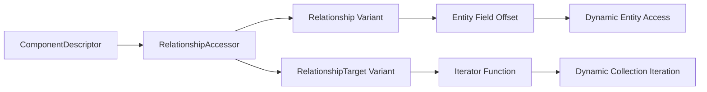

+++
title = "#21601 API for traversing `Relationship`s and `RelationshipTarget`s in dynamic contexts"
date = "2025-10-20T00:00:00"
draft = false
template = "pull_request_page.html"
in_search_index = true

[taxonomies]
list_display = ["show"]

[extra]
current_language = "en"
available_languages = {"en" = { name = "English", url = "/pull_request/bevy/2025-10/pr-21601-en-20251020" }, "zh-cn" = { name = "中文", url = "/pull_request/bevy/2025-10/pr-21601-zh-cn-20251020" }}
labels = ["C-Feature", "A-ECS", "D-Modest", "D-Unsafe"]
+++

# API for traversing `Relationship`s and `RelationshipTarget`s in dynamic contexts

## Basic Information
- **Title**: API for traversing `Relationship`s and `RelationshipTarget`s in dynamic contexts
- **PR Link**: https://github.com/bevyengine/bevy/pull/21601
- **Author**: eugineerd
- **Status**: MERGED
- **Labels**: C-Feature, A-ECS, S-Ready-For-Final-Review, X-Uncontroversial, D-Modest, D-Unsafe
- **Created**: 2025-10-19T11:34:43Z
- **Merged**: 2025-10-20T22:18:26Z
- **Merged By**: alice-i-cecile

## Description Translation
# Objective
Currently there is no way to traverse relationships in type-erased contexts or to define dynamic relationship components, which is a hole in the current relationships api.

## Solution
Introduce `RelationshipAccessor` to describe a way to get `Entity` values from any registered relationships in dynamic contexts and store it on `ComponentDescriptor`. This allows to traverse relationships without knowing their type, which is useful for working with entity hierarchies using non-default components.

## Testing
Added a simple test/example of how to use this api to traverse hierarchies in a type-erased context.

## The Story of This Pull Request

This PR addresses a significant gap in Bevy's ECS relationship system by enabling dynamic traversal of entity relationships without requiring compile-time knowledge of the relationship types. The core problem was that while Bevy's relationship system worked well for statically-typed scenarios, it lacked the necessary infrastructure for type-erased contexts.

The implementation centers around a new `RelationshipAccessor` enum that provides two modes of operation: one for `Relationship` components and another for `RelationshipTarget` components. For `Relationship` components, it stores the byte offset of the entity field, allowing dynamic access to the target entity. For `RelationshipTarget` components, it provides an iterator function that can traverse the collection of related entities.

The architecture integrates this new capability into the existing component system by adding a `relationship_accessor` field to `ComponentDescriptor`. This field is automatically populated through the `Component` trait's new `relationship_accessor()` method, which is implemented via the `#[derive(Component)]` macro for relationship types.

A key engineering decision was the use of unsafe code for the dynamic access patterns. The `RelationshipAccessor::Relationship` variant requires careful handling of memory offsets, while the `RelationshipAccessor::RelationshipTarget` variant uses function pointers that must be called with correctly typed data. The implementation includes safety comments explaining these constraints.

The solution demonstrates good separation of concerns by introducing `ComponentRelationshipAccessor` as a type-safe wrapper that ensures relationship accessors are only created for appropriate component types. This wrapper provides constructors that are only available when the component implements either `Relationship` or `RelationshipTarget`, enforcing type safety at compile time.

The testing approach includes a comprehensive example showing how to use the new API to traverse entity hierarchies dynamically. This test validates both relationship directions: from parent to children and from child to parent, demonstrating the complete functionality.

## Visual Representation



## Key Files Changed

### `crates/bevy_ecs/src/relationship/mod.rs` (+115/-0)
This file introduces the core `RelationshipAccessor` API and its type-safe wrapper:

```rust
/// This enum describes a way to access the entities of [`Relationship`] and [`RelationshipTarget`] components
/// in a type-erased context.
#[derive(Debug, Clone, Copy)]
pub enum RelationshipAccessor {
    /// This component is a [`Relationship`].
    Relationship {
        /// Offset of the field containing [`Entity`] from the base of the component.
        entity_field_offset: usize,
        /// Value of [`RelationshipTarget::LINKED_SPAWN`] for the [`Relationship::RelationshipTarget`] of this [`Relationship`].
        linked_spawn: bool,
    },
    /// This component is a [`RelationshipTarget`].
    RelationshipTarget {
        /// Function that returns an iterator over all [`Entity`]s of this [`RelationshipTarget`]'s collection.
        iter: for<'a> unsafe fn(Ptr<'a>) -> Box<dyn Iterator<Item = Entity> + 'a>,
        /// Value of [`RelationshipTarget::LINKED_SPAWN`] of this [`RelationshipTarget`].
        linked_spawn: bool,
    },
}
```

### `crates/bevy_ecs/macros/src/component.rs` (+33/-0)
The derive macro was extended to automatically generate `relationship_accessor` implementations:

```rust
let relationship_accessor = if (relationship.is_some() || relationship_target.is_some())
    && let Data::Struct(DataStruct {
        fields,
        struct_token,
        ..
    }) = &ast.data
    && let Ok(field) = relationship_field(fields, "Relationship", struct_token.span())
{
    let relationship_member = field.ident.clone().map_or(Member::from(0), Member::Named);
    if relationship.is_some() {
        quote! {
            Some(
                // Safety: we pass valid offset of a field containing Entity (obtained via offset_off!)
                unsafe {
                    #bevy_ecs_path::relationship::ComponentRelationshipAccessor::<Self>::relationship(
                        core::mem::offset_of!(Self, #relationship_member)
                    )
                }
            )
        }
    } else {
        quote! {
            Some(#bevy_ecs_path::relationship::ComponentRelationshipAccessor::<Self>::relationship_target())
        }
    }
} else {
    quote! {None}
};
```

### `crates/bevy_ecs/src/component/info.rs` (+14/-0)
Added relationship accessor storage and retrieval to component descriptors:

```rust
/// Returns [`RelationshipAccessor`] for this component if it is a [`Relationship`](crate::relationship::Relationship) or [`RelationshipTarget`](crate::relationship::RelationshipTarget) , `None` otherwise.
pub fn relationship_accessor(&self) -> Option<&RelationshipAccessor> {
    self.descriptor.relationship_accessor.as_ref()
}
```

### `crates/bevy_ecs/src/component/mod.rs` (+8/-0)
Extended the `Component` trait with relationship accessor support:

```rust
/// Returns [`ComponentRelationshipAccessor`] required for working with relationships in dynamic contexts.
///
/// If component is not a [`Relationship`](crate::relationship::Relationship) or [`RelationshipTarget`](crate::relationship::RelationshipTarget), this should return `None`.
fn relationship_accessor() -> Option<ComponentRelationshipAccessor<Self>> {
    None
}
```

### Test Example in `crates/bevy_ecs/src/relationship/mod.rs`
Added comprehensive test demonstrating dynamic hierarchy traversal:

```rust
#[test]
fn dynamically_traverse_hierarchy() {
    let mut world = World::new();
    let child_of_id = world.register_component::<ChildOf>();
    let children_id = world.register_component::<Children>();

    let parent = world.spawn_empty().id();
    let child = world.spawn_empty().id();
    world.entity_mut(child).insert(ChildOf(parent));
    world.flush();

    // Test RelationshipTarget access
    let children_ptr = world.get_by_id(parent, children_id).unwrap();
    let RelationshipAccessor::RelationshipTarget { iter, .. } = world
        .components()
        .get_info(children_id)
        .unwrap()
        .relationship_accessor()
        .unwrap()
    else {
        unreachable!()
    };
    let children: Vec<_> = unsafe { iter(children_ptr).collect() };
    assert_eq!(children, alloc::vec![child]);

    // Test Relationship access  
    let child_of_ptr = world.get_by_id(child, child_of_id).unwrap();
    let RelationshipAccessor::Relationship {
        entity_field_offset,
        ..
    } = world
        .components()
        .get_info(child_of_id)
        .unwrap()
        .relationship_accessor()
        .unwrap()
    else {
        unreachable!()
    };
    let child_of_entity: Entity =
        unsafe { *child_of_ptr.byte_add(*entity_field_offset).deref() };
    assert_eq!(child_of_entity, parent);
}
```

## Further Reading

- [Bevy ECS Relationships Documentation](https://docs.rs/bevy_ecs/latest/bevy_ecs/relationship/index.html)
- [Rust `offset_of!` Macro](https://doc.rust-lang.org/std/mem/macro.offset_of.html)
- [Type Erasure Patterns in Rust](https://doc.rust-lang.org/book/ch17-02-trait-objects.html)