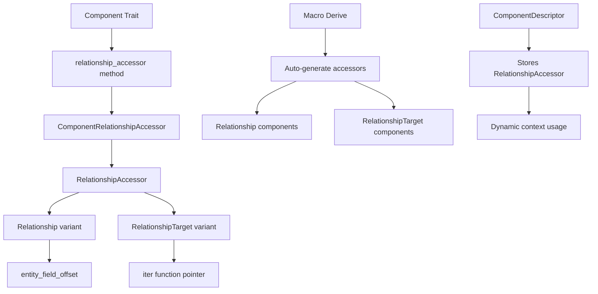

+++
title = "#21601 API for traversing `Relationship`s and `RelationshipTarget`s in dynamic contexts"
date = "2025-10-20T00:00:00"
draft = false
template = "pull_request_page.html"
in_search_index = false

[extra]
current_language = "zh-cn"
available_languages = {"en" = { name = "English", url = "/pull_request/bevy/2025-10/pr-21601-en-20251020" }, "zh-cn" = { name = "中文", url = "/pull_request/bevy/2025-10/pr-21601-zh-cn-20251020" }}
labels = ["C-Feature", "A-ECS", "D-Modest", "D-Unsafe"]
+++

# API for traversing `Relationship`s and `RelationshipTarget`s in dynamic contexts

## Basic Information
- **Title**: API for traversing `Relationship`s and `RelationshipTarget`s in dynamic contexts
- **PR Link**: https://github.com/bevyengine/bevy/pull/21601
- **Author**: eugineerd
- **Status**: MERGED
- **Labels**: C-Feature, A-ECS, S-Ready-For-Final-Review, X-Uncontroversial, D-Modest, D-Unsafe
- **Created**: 2025-10-19T11:34:43Z
- **Merged**: 2025-10-20T22:18:26Z
- **Merged By**: alice-i-cecile

## Description Translation
目前没有办法在类型擦除的上下文中遍历关系或定义动态关系组件，这是当前关系API中的一个空白。

## 解决方案
引入 `RelationshipAccessor` 来描述一种在动态上下文中从任何已注册的关系中获取 `Entity` 值的方法，并将其存储在 `ComponentDescriptor` 上。这允许在不了解关系类型的情况下遍历关系，这对于使用非默认组件处理实体层次结构非常有用。

## 测试
添加了一个简单的测试/示例，演示了如何在类型擦除的上下文中使用此API遍历层次结构。

## The Story of This Pull Request

### 问题与背景
在 Bevy ECS 的关系系统中，开发人员面临一个核心限制：无法在类型擦除的上下文中遍历关系。现有的关系API要求编译时知道具体的组件类型，这限制了在动态场景中使用关系的能力。例如，当处理用户定义的关系组件或在编辑器工具中需要通用关系遍历时，现有的静态类型系统无法满足需求。

### 解决方案方法
该PR引入了一个新的抽象层 `RelationshipAccessor`，它封装了在类型擦除上下文中访问关系数据所需的信息。这个解决方案的关键洞察是：虽然我们失去了编译时类型信息，但我们仍然可以通过存储字段偏移量和函数指针来保持对关系数据的访问能力。

### 具体实现
实现的核心是新的 `RelationshipAccessor` 枚举，它有两种变体：

```rust
pub enum RelationshipAccessor {
    Relationship {
        entity_field_offset: usize,
        linked_spawn: bool,
    },
    RelationshipTarget {
        iter: for<'a> unsafe fn(Ptr<'a>) -> Box<dyn Iterator<Item = Entity> + 'a>,
        linked_spawn: bool,
    },
}
```

对于 `Relationship` 组件，我们存储实体字段的偏移量；对于 `RelationshipTarget` 组件，我们存储一个函数指针来创建迭代器。

在组件描述符中新增了相关字段：
```rust
pub struct ComponentDescriptor {
    // ... 现有字段
    relationship_accessor: Option<RelationshipAccessor>,
}
```

组件特质也相应扩展：
```rust
pub trait Component: Send + Sync + 'static {
    // ... 现有方法
    fn relationship_accessor() -> Option<ComponentRelationshipAccessor<Self>> {
        None
    }
}
```

宏系统被更新以自动为关系组件生成访问器：
```rust
let relationship_accessor = if (relationship.is_some() || relationship_target.is_some())
    && let Data::Struct(DataStruct {
        fields,
        struct_token,
        ..
    }) = &ast.data
    && let Ok(field) = relationship_field(fields, "Relationship", struct_token.span())
{
    // 生成相应的访问器代码
};
```

### 技术洞察
这个实现展示了几个重要的工程模式：

1. **类型安全与动态访问的平衡**：通过 `ComponentRelationshipAccessor` 包装器，在静态上下文中保持类型安全，同时在动态上下文中提供必要的访问能力。

2. **零成本抽象**：对于不使用关系的组件，`relationship_accessor` 返回 `None`，不会引入运行时开销。

3. **不安全代码的合理使用**：通过明确的 safety 注释，指导调用者正确使用偏移量和函数指针。

测试案例展示了实际使用模式：
```rust
let RelationshipAccessor::RelationshipTarget { iter, .. } = world
    .components()
    .get_info(children_id)
    .unwrap()
    .relationship_accessor()
    .unwrap();
let children: Vec<_> = unsafe { iter(children_ptr).collect() };
```

### 影响与改进
这个PR填补了Bevy关系系统的一个重要空白，使得：
- 工具和编辑器可以通用地遍历实体层次结构
- 用户定义的关系组件可以在动态上下文中使用
- 为未来的动态关系查询功能奠定了基础

迁移指南明确指出，现有创建 `ComponentDescriptor` 的代码需要更新，传递 `None` 给新的 `relationship_accessor` 参数。

## Visual Representation



## Key Files Changed

### `crates/bevy_ecs/src/relationship/mod.rs` (+115/-0)
**变化描述**：添加了 `RelationshipAccessor` 和 `ComponentRelationshipAccessor` 类型，以及相应的测试。

**关键代码**：
```rust
pub enum RelationshipAccessor {
    Relationship {
        entity_field_offset: usize,
        linked_spawn: bool,
    },
    RelationshipTarget {
        iter: for<'a> unsafe fn(Ptr<'a>) -> Box<dyn Iterator<Item = Entity> + 'a>,
        linked_spawn: bool,
    },
}

pub struct ComponentRelationshipAccessor<C: ?Sized> {
    pub(crate) accessor: RelationshipAccessor,
    phantom: PhantomData<C>,
}
```

### `crates/bevy_ecs/macros/src/component.rs` (+33/-0)
**变化描述**：更新了组件派生宏，自动为关系和关系目标组件生成访问器。

**关键代码**：
```rust
fn relationship_accessor() -> Option<#bevy_ecs_path::relationship::ComponentRelationshipAccessor<Self>> {
    #relationship_accessor
}
```

### `crates/bevy_ecs/src/component/info.rs` (+14/-0)
**变化描述**：在 `ComponentDescriptor` 中添加了关系访问器字段，并提供了访问方法。

**关键代码**：
```rust
pub struct ComponentDescriptor {
    // ... 其他字段
    relationship_accessor: Option<RelationshipAccessor>,
}

pub fn relationship_accessor(&self) -> Option<&RelationshipAccessor> {
    self.descriptor.relationship_accessor.as_ref()
}
```

### `crates/bevy_ecs/src/component/mod.rs` (+8/-0)
**变化描述**：在 `Component` trait 中添加了 `relationship_accessor` 方法。

**关键代码**：
```rust
fn relationship_accessor() -> Option<ComponentRelationshipAccessor<Self>> {
    None
}
```

### `release-content/migration-guides/dynamic_relationships_api.md` (+9/-0)
**变化描述**：添加了迁移指南，说明 API 变更。

**关键内容**：
```
`ComponentDescriptor` now stores additional data for working with relationships in dynamic contexts.
This resulted in changes to `ComponentDescriptor::new_with_layout`:

- Now requires additional parameter `relationship_accessor`, which should be set to `None` for all existing code creating `ComponentDescriptors`.
```

## Further Reading

- [Bevy ECS Relationships Documentation](https://bevyengine.org/learn/advanced-topics/ecs-relationships/)
- [Rust Unsafe Code Guidelines](https://rust-lang.github.io/unsafe-code-guidelines/)
- [Type Erasure in Rust](https://doc.rust-lang.org/book/ch17-02-trait-objects.html)