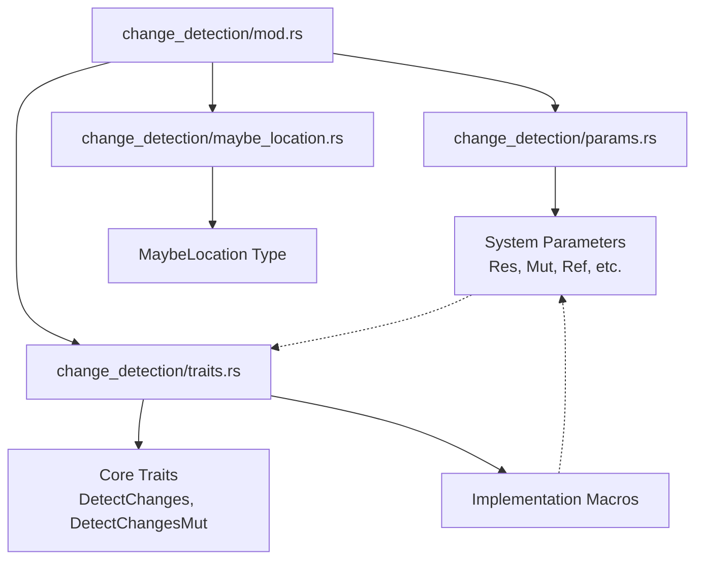

+++
title = "#21604 `change_detection` gets its own folder and split into multiple files"
date = "2025-10-20T00:00:00"
draft = false
template = "pull_request_page.html"
in_search_index = true

[taxonomies]
list_display = ["show"]

[extra]
current_language = "en"
available_languages = {"en" = { name = "English", url = "/pull_request/bevy/2025-10/pr-21604-en-20251020" }, "zh-cn" = { name = "中文", url = "/pull_request/bevy/2025-10/pr-21604-zh-cn-20251020" }}
labels = ["A-ECS", "C-Code-Quality"]
+++

# Title
`change_detection` gets its own folder and split into multiple files

## Basic Information
- **Title**: `change_detection` gets its own folder and split into multiple files
- **PR Link**: https://github.com/bevyengine/bevy/pull/21604
- **Author**: JaySpruce
- **Status**: MERGED
- **Labels**: A-ECS, C-Code-Quality, S-Ready-For-Final-Review
- **Created**: 2025-10-19T19:45:22Z
- **Merged**: 2025-10-20T04:36:32Z
- **Merged By**: alice-i-cecile

## Description Translation
**Objective**

`change_detection.rs` is a bit big at ~1900 lines and its contents are pretty varied, so it ought to be split up.

**Solution**

Split `change_detection.rs` into 4 files:
- `mod.rs`: Re-exports, some constants, testing
- `params.rs`: Change-detecting system/query parameters like `Ref` and `Res`
- `traits.rs`: The `DetectChanges` and `DetectChangesMut` traits and the macros used internally to implement those traits (and some others) for the above parameters
- `maybe_location.rs`: `MaybeLocation` and its impls

This shouldn't change anything publicly, since everything's still in the same module.

I'd also like to move `component/tick.rs` into this module, but that would break stuff, so that'll be its own PR.

## The Story of This Pull Request

The change detection module in Bevy's ECS had grown to approximately 1900 lines, containing a diverse mix of types, traits, and implementation details. This size made the file difficult to navigate and maintain, with developers needing to scroll through unrelated code to find what they needed. The module contained everything from core traits like `DetectChanges` to concrete types like `Res` and `Mut`, along with utility types like `MaybeLocation` and extensive test suites.

The solution was straightforward: split the monolithic file into logically organized smaller files. The author created a `change_detection` directory and distributed the code across four focused files:

- `mod.rs` became the module entry point with re-exports and constants
- `params.rs` focused on system parameters like `Res`, `Mut`, and `Ref`
- `traits.rs` contained the core change detection traits and implementation macros
- `maybe_location.rs` isolated the `MaybeLocation` type and its functionality

This reorganization followed established Rust patterns for module structure while maintaining the exact same public API. The key insight was grouping related functionality together - all the system parameter types now live in `params.rs`, while the traits that define their behavior are in `traits.rs`. The `MaybeLocation` type, which had a distinct purpose for tracking change locations conditionally based on compile-time features, was separated into its own file.

The implementation preserved all existing functionality through careful use of module re-exports in `mod.rs`. External code continues to import types from `bevy_ecs::change_detection` exactly as before. The internal macros (`change_detection_impl`, `change_detection_mut_impl`, etc.) were moved to `traits.rs` where they're used to implement the change detection traits for the various parameter types.

One notable aspect of this refactor is how it improved code discoverability. Developers working with system parameters can now look at `params.rs` to see all the available types and their methods, while those implementing custom change detection can focus on `traits.rs`. The test suite remained comprehensive but was moved to the module's `mod.rs` file.

The author mentioned future plans to move `component/tick.rs` into this module, but recognized this would be a breaking change requiring a separate PR. This demonstrates thoughtful incremental refactoring that maintains backward compatibility while working toward a cleaner long-term architecture.

## Visual Representation



## Key Files Changed

### `crates/bevy_ecs/src/change_detection.rs` (+0/-1882)
This file was completely removed and its contents distributed to the new module structure.

### `crates/bevy_ecs/src/change_detection/mod.rs` (+383/-0)
The new module entry point that re-exports all public types and contains module constants and test suite.

```rust
// File: crates/bevy_ecs/src/change_detection/mod.rs
mod maybe_location;
mod params;
mod traits;

pub use maybe_location::MaybeLocation;
pub use params::*;
pub use traits::{DetectChanges, DetectChangesMut};

/// The (arbitrarily chosen) minimum number of world tick increments between `check_tick` scans.
pub const CHECK_TICK_THRESHOLD: u32 = 518_400_000;

/// The maximum change tick difference that won't overflow before the next `check_tick` scan.
pub const MAX_CHANGE_AGE: u32 = u32::MAX - (2 * CHECK_TICK_THRESHOLD - 1);

#[cfg(test)]
mod tests {
    // ... comprehensive test suite moved from original file
}
```

### `crates/bevy_ecs/src/change_detection/params.rs` (+694/-0)
Contains all the system parameter types and their core implementations.

```rust
// File: crates/bevy_ecs/src/change_detection/params.rs
pub struct Res<'w, T: ?Sized + Resource> {
    pub(crate) value: &'w T,
    pub(crate) ticks: ComponentTicksRef<'w>,
}

pub struct ResMut<'w, T: ?Sized + Resource> {
    pub(crate) value: &'w mut T,
    pub(crate) ticks: ComponentTicksMut<'w>,
}

pub struct Ref<'w, T: ?Sized> {
    pub(crate) value: &'w T,
    pub(crate) ticks: ComponentTicksRef<'w>,
}

pub struct Mut<'w, T: ?Sized> {
    pub(crate) value: &'w mut T,
    pub(crate) ticks: ComponentTicksMut<'w>,
}
```

### `crates/bevy_ecs/src/change_detection/traits.rs` (+551/-0)
Contains the core change detection traits and the macros used to implement them.

```rust
// File: crates/bevy_ecs/src/change_detection/traits.rs
pub trait DetectChanges {
    fn is_added(&self) -> bool;
    fn is_changed(&self) -> bool;
    fn last_changed(&self) -> Tick;
    fn added(&self) -> Tick;
    fn changed_by(&self) -> MaybeLocation;
}

pub trait DetectChangesMut: DetectChanges {
    type Inner: ?Sized;
    fn set_changed(&mut self);
    // ... other methods
}

macro_rules! change_detection_impl {
    // Macro implementation for DetectChanges
}

macro_rules! change_detection_mut_impl {
    // Macro implementation for DetectChangesMut  
}
```

### `crates/bevy_ecs/src/change_detection/maybe_location.rs` (+291/-0)
Contains the `MaybeLocation` type which conditionally tracks change locations based on compile-time features.

```rust
// File: crates/bevy_ecs/src/change_detection/maybe_location.rs
pub struct MaybeLocation<T: ?Sized = &'static Location<'static>> {
    marker: PhantomData<T>,
    #[cfg(feature = "track_location")]
    value: T,
}

impl MaybeLocation {
    #[inline]
    #[track_caller]
    pub const fn caller() -> Self {
        MaybeLocation {
            #[cfg(feature = "track_location")]
            value: Location::caller(),
            marker: PhantomData,
        }
    }
}
```

## Further Reading

- [Rust Module System](https://doc.rust-lang.org/book/ch07-02-defining-modules-to-control-scope-and-privacy.html) - Understanding how Rust modules work
- [Bevy ECS Change Detection](https://bevy-cheatbook.github.io/programming/change-detection.html) - Official Bevy change detection documentation
- [Conditional Compilation in Rust](https://doc.rust-lang.org/reference/conditional-compilation.html) - How `#[cfg]` attributes work, used in `MaybeLocation`
- [Macros in Rust](https://doc.rust-lang.org/book/ch19-06-macros.html) - Understanding the macro system used for trait implementations