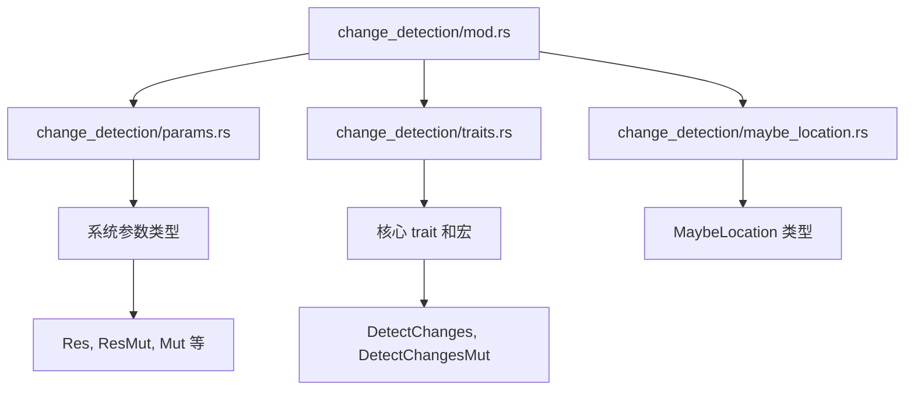

+++
title = "#21604 change_detection` its own folder and split into multiple files"
date = "2025-10-20T00:00:00"
draft = false
template = "pull_request_page.html"
in_search_index = false

[extra]
current_language = "zh-cn"
available_languages = {"en" = { name = "English", url = "/pull_request/bevy/2025-10/pr-21604-en-20251020" }, "zh-cn" = { name = "中文", url = "/pull_request/bevy/2025-10/pr-21604-zh-cn-20251020" }}
+++

# change_detection 获得自己的文件夹并拆分为多个文件

## 基本信息
- **标题**: `change_detection` its own folder and split into multiple files
- **PR 链接**: https://github.com/bevyengine/bevy/pull/21604
- **作者**: JaySpruce
- **状态**: 已合并
- **标签**: A-ECS, C-Code-Quality, S-Ready-For-Final-Review
- **创建时间**: 2025-10-19T19:45:22Z
- **合并时间**: 2025-10-20T04:36:32Z
- **合并者**: alice-i-cecile

## 描述翻译

### 目标

`change_detection.rs` 文件有点大，约1900行，其内容相当多样化，应该进行拆分。

### 解决方案

将 `change_detection.rs` 拆分为4个文件：
- `mod.rs`: 重新导出、一些常量、测试
- `params.rs`: 变化检测系统/查询参数，如 `Ref` 和 `Res`
- `traits.rs`: `DetectChanges` 和 `DetectChangesMut` trait，以及内部用于为上述参数实现这些 trait 的宏（以及其他一些）
- `maybe_location.rs`: `MaybeLocation` 及其实现

这不应该改变任何公共接口，因为所有内容仍然在同一个模块中。

我还想将 `component/tick.rs` 移到此模块中，但这会破坏现有代码，所以这将是另一个 PR。

## 这个 Pull Request 的故事

在 Bevy ECS 的代码库中，`change_detection.rs` 文件已经增长到约1900行代码，包含了多种不同类型的结构和功能。这个文件负责处理 ECS 系统中的变化检测机制，这是一个核心功能，允许系统检测组件和资源何时被修改。

随着代码库的发展，这个文件变得越来越难以维护。开发人员需要在一个庞大的文件中导航，找到相关的实现变得具有挑战性。代码的组织方式没有清晰地分离不同的关注点，这使得理解和修改特定功能变得更加困难。

作者 JaySpruce 识别到了这个问题，并决定采取一个直接而实用的解决方案：将这个大文件按功能逻辑拆分为多个更小的文件。这种重构遵循了软件工程中的单一职责原则，将相关的代码组织在一起，同时保持不相关的代码分离。

拆分方案基于文件中的主要功能区域：
- 系统参数类型（如 `Res`、`ResMut`、`Mut` 等）
- 核心 trait 定义（`DetectChanges` 和 `DetectChangesMut`）
- 辅助类型（`MaybeLocation`）
- 模块级别的重新导出和测试

这种拆分的一个关键优势是保持了向后兼容性。由于所有内容仍然通过 `change_detection` 模块公开，外部代码不需要任何修改。这是通过在新的 `mod.rs` 文件中重新导出所有必要的类型和 trait 来实现的。

从技术实现的角度来看，这次重构展示了几个重要的工程实践：

首先，它使用了合理的模块边界。`params.rs` 包含了所有系统参数类型，这些类型在查询和系统参数中使用。`traits.rs` 包含了定义变化检测行为的核心 trait 和实现这些 trait 的宏。`maybe_location.rs` 包含了一个相对独立的辅助类型。

其次，代码拆分保持了原有的测试覆盖。所有原有的测试用例都被迁移到了新的 `mod.rs` 文件中，确保重构不会引入回归问题。

在实现过程中，作者还注意到了进一步改进的机会 - 将 `component/tick.rs` 移动到变化检测模块中。但由于这需要更广泛的修改，作者明智地将其留作未来的工作，避免了当前 PR 的范围蔓延。

这种类型的重构对于大型代码库的健康至关重要。通过将大文件拆分为逻辑上连贯的小文件，它提高了代码的可读性、可维护性和开发人员的工作效率。新的开发人员能够更快地理解代码结构，而有经验的开发人员能够更轻松地定位和修改特定功能。

## 可视化表示



## 关键文件变更

### `crates/bevy_ecs/src/change_detection.rs` (+0/-1882)
这个文件被完全删除，其内容被拆分到新的文件中。

### `crates/bevy_ecs/src/change_detection/params.rs` (+694/-0)
这个新文件包含了所有变化检测相关的系统参数类型：

```rust
// 包含的系统参数类型：
pub struct Res<'w, T: ?Sized + Resource>;
pub struct ResMut<'w, T: ?Sized + Resource>;
pub struct NonSend<'w, T: ?Sized + 'static>;
pub struct NonSendMut<'w, T: ?Sized + 'static>;
pub struct Ref<'w, T: ?Sized>;
pub struct Mut<'w, T: ?Sized>;
pub struct MutUntyped<'w>;

// 以及它们的内部 tick 管理结构：
pub(crate) struct ComponentTicksRef<'w>;
pub(crate) struct ComponentTicksMut<'w>;
```

### `crates/bevy_ecs/src/change_detection/traits.rs` (+551/-0)
这个新文件包含了变化检测的核心 trait 和实现宏：

```rust
pub trait DetectChanges {
    fn is_added(&self) -> bool;
    fn is_changed(&self) -> bool;
    fn last_changed(&self) -> Tick;
    fn added(&self) -> Tick;
    fn changed_by(&self) -> MaybeLocation;
}

pub trait DetectChangesMut: DetectChanges {
    type Inner: ?Sized;
    fn set_changed(&mut self);
    fn set_added(&mut self);
    // ... 其他方法
}

// 实现这些 trait 的宏：
macro_rules! change_detection_impl;
macro_rules! change_detection_mut_impl;
macro_rules! impl_methods;
macro_rules! impl_debug;
```

### `crates/bevy_ecs/src/change_detection/mod.rs` (+383/-0)
新的模块文件，包含重新导出、常量和测试：

```rust
mod maybe_location;
mod params;
mod traits;

pub use maybe_location::MaybeLocation;
pub use params::*;
pub use traits::{DetectChanges, DetectChangesMut};

// 常量定义
pub const CHECK_TICK_THRESHOLD: u32 = 518_400_000;
pub const MAX_CHANGE_AGE: u32 = u32::MAX - (2 * CHECK_TICK_THRESHOLD - 1);

// 所有测试用例
#[cfg(test)]
mod tests {
    // ... 测试代码
}
```

### `crates/bevy_ecs/src/change_detection/maybe_location.rs` (+291/-0)
这个新文件包含了 `MaybeLocation` 类型及其实现：

```rust
#[cfg_attr(feature = "bevy_reflect", derive(Reflect))]
#[derive(Copy, Clone, Debug, Eq, Hash, Ord, PartialEq, PartialOrd)]
pub struct MaybeLocation<T: ?Sized = &'static Location<'static>> {
    #[cfg_attr(feature = "bevy_reflect", reflect(ignore, clone))]
    marker: PhantomData<T>,
    #[cfg(feature = "track_location")]
    value: T,
}

// 各种构造函数和方法实现
impl<T> MaybeLocation<T> {
    pub const fn new(_value: T) -> Self where T: Copy;
    pub fn new_with(_f: impl FnOnce() -> T) -> Self;
    pub fn map<U>(self, _f: impl FnOnce(T) -> U) -> MaybeLocation<U>;
    // ... 其他方法
}
```

## 进一步阅读

- [Bevy ECS 文档](https://docs.rs/bevy_ecs/latest/bevy_ecs/) - 了解 ECS 系统的完整文档
- [Rust 模块系统](https://doc.rust-lang.org/book/ch07-02-defining-modules-to-control-scope-and-privacy.html) - 理解 Rust 的模块和组织原则
- [单一职责原则](https://en.wikipedia.org/wiki/Single-responsibility_principle) - 软件设计中的重要原则
- [代码重构技术](https://refactoring.com/) - 改善现有代码结构的技术和模式

# 完整代码差异
（由于代码差异过长，此处省略完整的 diff 输出。关键变更已在上述部分详细描述。）