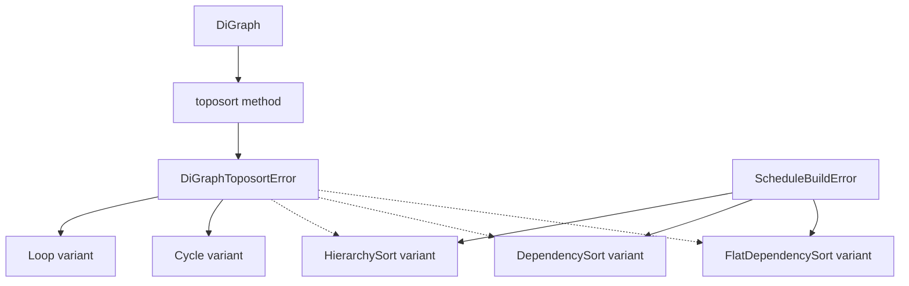

+++
title = "#21608 Move toposorting onto `DiGraph` directly, and cleanup error handling"
date = "2025-10-20T00:00:00"
draft = false
template = "pull_request_page.html"
in_search_index = true

[taxonomies]
list_display = ["show"]

[extra]
current_language = "en"
available_languages = {"en" = { name = "English", url = "/pull_request/bevy/2025-10/pr-21608-en-20251020" }, "zh-cn" = { name = "中文", url = "/pull_request/bevy/2025-10/pr-21608-zh-cn-20251020" }}
labels = ["A-ECS", "C-Code-Quality", "C-Usability", "M-Migration-Guide", "D-Modest"]
+++

# Move toposorting onto `DiGraph` directly, and cleanup error handling

## Basic Information
- **Title**: Move toposorting onto `DiGraph` directly, and cleanup error handling
- **PR Link**: https://github.com/bevyengine/bevy/pull/21608
- **Author**: ItsDoot
- **Status**: MERGED
- **Labels**: A-ECS, C-Code-Quality, C-Usability, S-Ready-For-Final-Review, M-Migration-Guide, D-Modest
- **Created**: 2025-10-20T03:32:12Z
- **Merged**: 2025-10-20T22:31:04Z
- **Merged By**: alice-i-cecile

## Description Translation
# Objective

- Part of #20115
- Since #20256, `ScheduleGraph::topsort_graph` no longer uses `self`, so let's put it directly on `DiGraph`.

## Solution

- Moved `ScheduleGraph::topsort_graph` to `DiGraph::toposort`.
- Added `DiGraphToposortError` with `Loop` and `Cycle` variants, which is wrapped to replace `ScheduleBuildError::HierarchyLoop`, `HierarchyCycle`, `DependencyLoop`, and `DependencyCycle`.
- Added `ScheduleBuildError::FlatDependencySort` variant to detect issues specifically with the flattened dependency graph.
- Removed `ReportCycles`: `DiGraph::toposort` returns an error that should be wrapped at the callsite, negating the need for this type.
- Moved `simple_cycles_in_component` onto `DiGraph` (formerly a free-floating function).

## Testing

Updated and reused current tests.

## The Story of This Pull Request

This PR addresses a code organization issue in Bevy's ECS scheduling system. The core problem was that topological sorting functionality was unnecessarily tied to `ScheduleGraph` when it could be more appropriately implemented directly on the `DiGraph` data structure.

The issue became apparent after PR #20256, where `ScheduleGraph::topsort_graph` no longer needed access to `self`. This created an opportunity to refactor and move the topological sorting logic to where it logically belongs - directly on the directed graph data structure itself.

The implementation approach involved several key changes. First, the `topsort_graph` method was moved from `ScheduleGraph` to `DiGraph` and renamed to `toposort`. This change makes the functionality more discoverable and reusable since topological sorting is a fundamental graph operation.

```rust
// Before in ScheduleGraph:
self.topsort_graph(&self.hierarchy.graph, ReportCycles::Hierarchy)

// After on DiGraph:
self.hierarchy.graph.toposort().map_err(ScheduleBuildError::HierarchySort)
```

The error handling was significantly improved by introducing a dedicated `DiGraphToposortError` type with `Loop` and `Cycle` variants. This provides more precise error information and eliminates the need for the `ReportCycles` enum, which was previously used to route errors to the appropriate `ScheduleBuildError` variant.

```rust
#[derive(Error, Debug)]
pub enum DiGraphToposortError<N: GraphNodeId> {
    #[error("self-loop detected at node `{0:?}`")]
    Loop(N),
    #[error("cycles detected: {0:?}")]
    Cycle(Vec<Vec<N>>),
}
```

The `simple_cycles_in_component` function, which implements Johnson's algorithm for finding all elementary circuits in a directed graph, was also moved from being a free function to a method on `DiGraph`. This change improves code organization by keeping graph algorithms with the graph data structure they operate on.

From a technical perspective, the topological sorting algorithm uses Tarjan's strongly connected components (SCC) algorithm to detect cycles. The implementation explicitly checks for self-loops since SCC algorithms typically don't report single-node cycles. When cycles are detected, it uses Johnson's algorithm to enumerate all simple cycles within the strongly connected components.

The impact of these changes is primarily improved code organization and clearer error handling. The topological sorting logic is now properly encapsulated within the graph data structure, making the code more maintainable and the API more intuitive. Error handling is more explicit, with clear conversion paths from graph-level errors to schedule-building errors.

## Visual Representation



## Key Files Changed

### `crates/bevy_ecs/src/schedule/graph/graph_map.rs` (+171/-2)
This file saw the most significant changes with the addition of the `toposort` method and `simple_cycles_in_component` method directly on `DiGraph`.

Key additions:
```rust
impl<N: GraphNodeId, S: BuildHasher> DiGraph<N, S> {
    pub fn toposort(&self) -> Result<Vec<N>, DiGraphToposortError<N>> {
        // Implementation of topological sort with cycle detection
    }
    
    pub fn simple_cycles_in_component(&self, scc: &[N]) -> Vec<Vec<N>> {
        // Johnson's algorithm for finding all elementary circuits
    }
}

#[derive(Error, Debug)]
pub enum DiGraphToposortError<N: GraphNodeId> {
    #[error("self-loop detected at node `{0:?}`")]
    Loop(N),
    #[error("cycles detected: {0:?}")]
    Cycle(Vec<Vec<N>>),
}
```

### `crates/bevy_ecs/src/schedule/graph/mod.rs` (+2/-111)
This file was significantly cleaned up by removing the free function `simple_cycles_in_component` and exporting the new error type.

### `crates/bevy_ecs/src/schedule/schedule.rs` (+13/-80)
The `ScheduleGraph` struct was simplified by removing the `topsort_graph` method and `ReportCycles` enum. The topological sorting is now delegated to the `DiGraph` directly.

Before:
```rust
pub fn topsort_graph<N: GraphNodeId + Into<NodeId>>(
    &self,
    graph: &DiGraph<N>,
    report: ReportCycles,
) -> Result<Vec<N>, ScheduleBuildError> {
    // Complex implementation with error routing
}
```

After (usage):
```rust
self.hierarchy.graph
    .toposort()
    .map_err(ScheduleBuildError::HierarchySort)
```

### `crates/bevy_ecs/src/schedule/error.rs` (+30/-19)
The error handling was restructured to use the new `DiGraphToposortError` type, replacing multiple specific error variants with more generic ones that wrap the graph-level errors.

### `crates/bevy_ecs/src/schedule/mod.rs` (+30/-6)
Test updates to reflect the new error types and ensure existing functionality continues to work correctly.

## Further Reading

- [Tarjan's strongly connected components algorithm](https://en.wikipedia.org/wiki/Tarjan%27s_strongly_connected_components_algorithm)
- [Johnson's algorithm for elementary cycles](https://www.cs.tufts.edu/comp/150GA/homeworks/hw1/Johnson%2075.PDF)
- [Topological sorting](https://en.wikipedia.org/wiki/Topological_sorting)
- [Bevy ECS documentation](https://bevyengine.org/learn/quick-start/ecs/)