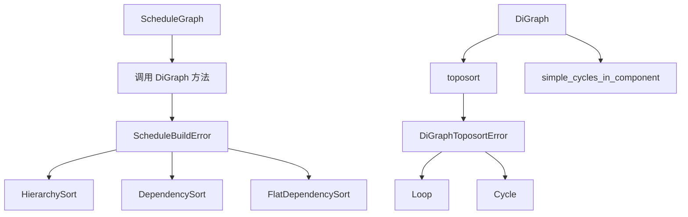

+++
title = "#21608 Move toposorting onto `DiGraph` directly, and cleanup error handling"
date = "2025-10-20T00:00:00"
draft = false
template = "pull_request_page.html"
in_search_index = false

[extra]
current_language = "zh-cn"
available_languages = {"en" = { name = "English", url = "/pull_request/bevy/2025-10/pr-21608-en-20251020" }, "zh-cn" = { name = "中文", url = "/pull_request/bevy/2025-10/pr-21608-zh-cn-20251020" }}
+++

# Move toposorting onto `DiGraph` directly, and cleanup error handling

## 基本信息
- **标题**: Move toposorting onto `DiGraph` directly, and cleanup error handling
- **PR 链接**: https://github.com/bevyengine/bevy/pull/21608
- **作者**: ItsDoot
- **状态**: 已合并
- **标签**: A-ECS, C-Code-Quality, C-Usability, S-Ready-For-Final-Review, M-Migration-Guide, D-Modest
- **创建时间**: 2025-10-20T03:32:12Z
- **合并时间**: 2025-10-20T22:31:04Z
- **合并者**: alice-i-cecile

## 描述翻译

### 目标
- 作为 #20115 的一部分
- 自从 #20256 之后，`ScheduleGraph::topsort_graph` 不再使用 `self`，所以我们将其直接放在 `DiGraph` 上。

### 解决方案
- 将 `ScheduleGraph::topsort_graph` 移动到 `DiGraph::toposort`。
- 添加 `DiGraphToposortError`，包含 `Loop` 和 `Cycle` 变体，用于替换 `ScheduleBuildError::HierarchyLoop`、`HierarchyCycle`、`DependencyLoop` 和 `DependencyCycle`。
- 添加 `ScheduleBuildError::FlatDependencySort` 变体来检测扁平依赖图的特定问题。
- 移除 `ReportCycles`：`DiGraph::toposort` 返回一个应该在调用处包装的错误，不再需要此类型。
- 将 `simple_cycles_in_component` 从自由函数改为 `DiGraph` 的方法。

### 测试
更新并重用了现有测试。

## 这个 Pull Request 的故事

这个 PR 的核心是对 Bevy ECS 调度系统中图排序功能的代码重构。故事开始于一个观察：在之前的实现中，拓扑排序功能虽然位于 `ScheduleGraph` 结构体上，但实际上它并不依赖于 `ScheduleGraph` 的任何状态。

### 问题与背景

在 PR #20256 之后，`ScheduleGraph::topsort_graph` 方法已经不再需要访问 `self` 的任何字段。这意味着这个方法本质上是一个静态方法，更适合作为 `DiGraph` 类型的直接方法。这种设计上的不一致性导致了代码组织不够清晰。

此外，错误处理也存在冗余。原来的实现有四个专门的错误变体来处理不同类型的循环检测：
- `ScheduleBuildError::HierarchyLoop`
- `ScheduleBuildError::HierarchyCycle` 
- `ScheduleBuildError::DependencyLoop`
- `ScheduleBuildError::DependencyCycle`

这些错误在本质上都是图排序失败的情况，可以统一处理。

### 解决方案方法

开发者采用了直接而有效的方法：将拓扑排序功能从 `ScheduleGraph` 下移到更基础的 `DiGraph` 类型中。这种移动遵循了面向对象设计中的"方法应该与操作的数据在一起"的原则。

同时，引入了新的错误类型 `DiGraphToposortError` 来统一处理所有图排序相关的错误，简化了错误处理逻辑。这种重构不仅改善了代码组织，还提高了代码的可重用性。

### 实现细节

主要的实现包括三个关键部分：

1. **拓扑排序方法迁移**：将 `topsort_graph` 从 `ScheduleGraph` 移动到 `DiGraph`，并重命名为 `toposort`。

```rust
// 在 DiGraph 中的新实现
pub fn toposort(&self) -> Result<Vec<N>, DiGraphToposortError<N>> {
    // 检查自环
    if let Some((node, _)) = self.all_edges().find(|(left, right)| left == right) {
        return Err(DiGraphToposortError::Loop(node));
    }

    // Tarjan 的 SCC 算法返回逆拓扑序
    let mut top_sorted_nodes = Vec::with_capacity(self.node_count());
    let mut sccs_with_cycles = Vec::new();

    for scc in self.iter_sccs() {
        top_sorted_nodes.extend_from_slice(&scc);
        if scc.len() > 1 {
            sccs_with_cycles.push(scc);
        }
    }

    if sccs_with_cycles.is_empty() {
        top_sorted_nodes.reverse();
        Ok(top_sorted_nodes)
    } else {
        let mut cycles = Vec::new();
        for scc in &sccs_with_cycles {
            cycles.append(&mut self.simple_cycles_in_component(scc));
        }
        Err(DiGraphToposortError::Cycle(cycles))
    }
}
```

2. **统一错误处理**：创建了新的错误类型来封装所有图排序错误：

```rust
#[derive(Error, Debug)]
pub enum DiGraphToposortError<N: GraphNodeId> {
    #[error("self-loop detected at node `{0:?}`")]
    Loop(N),
    #[error("cycles detected: {0:?}")]
    Cycle(Vec<Vec<N>>),
}
```

3. **算法函数整合**：将 `simple_cycles_in_component` 从自由函数改为 `DiGraph` 的方法，保持了相关功能的集中性。

### 技术洞察

这个重构展示了几个重要的软件工程原则：

**关注点分离**：将通用的图算法与特定的调度逻辑分离，使得 `DiGraph` 可以作为一个独立的、可重用的图数据结构。

**错误处理简化**：通过统一的错误类型，减少了代码重复，使得错误处理逻辑更加清晰。调用者现在只需要处理一种类型的图排序错误，而不是四种不同的变体。

**算法一致性**：`simple_cycles_in_component` 使用的 Johnson 算法是图论中寻找有向图中所有简单环的标准算法，这次重构保持了这种算法实现的完整性。

### 影响

这次重构的主要影响包括：

- **代码可维护性提升**：图相关的操作现在都集中在 `DiGraph` 类型中，使得代码更容易理解和维护。
- **错误处理更清晰**：统一的错误类型简化了调用方的错误处理逻辑。
- **向后兼容性**：虽然 API 发生了变化，但功能保持不变，现有的测试可以继续使用。

重构后的代码结构更加合理，`DiGraph` 现在包含了所有图操作的相关方法，成为一个更加自包含的数据结构。

## 可视化表示



## 关键文件变更

### `crates/bevy_ecs/src/schedule/graph/graph_map.rs` (+171/-2)
这个文件是重构的核心，包含了主要的算法实现：

1. **新增 `toposort` 方法**：将拓扑排序算法直接实现为 `DiGraph` 的方法
2. **新增 `DiGraphToposortError` 类型**：统一处理图排序错误
3. **移动 `simple_cycles_in_component`**：从自由函数改为实例方法

```rust
// 关键代码片段：新的 toposort 方法
pub fn toposort(&self) -> Result<Vec<N>, DiGraphToposortError<N>> {
    // 实现细节...
}
```

### `crates/bevy_ecs/src/schedule/graph/mod.rs` (+2/-111)
这个文件主要进行了清理工作：
- 移除了原来的 `simple_cycles_in_component` 自由函数
- 导出了新的 `DiGraphToposortError` 类型

### `crates/bevy_ecs/src/schedule/schedule.rs` (+13/-80)
这个文件反映了 API 使用的变化：
- 移除了 `ScheduleGraph::topsort_graph` 方法
- 移除了 `ReportCycles` 枚举
- 更新了调用处使用新的 API

```rust
// 之前：
self.topsort_graph(&self.hierarchy.graph, ReportCycles::Hierarchy)?;

// 之后：
self.hierarchy.graph
    .toposort()
    .map_err(ScheduleBuildError::HierarchySort)?;
```

### `crates/bevy_ecs/src/schedule/error.rs` (+30/-19)
错误处理的重大重构：
- 用新的统一错误变体替换了四个专门的错误变体
- 更新了错误处理逻辑以适应新的错误类型

```rust
// 新的错误变体
ScheduleBuildError::HierarchySort(DiGraphToposortError<NodeId>)
ScheduleBuildError::DependencySort(DiGraphToposortError<NodeId>)  
ScheduleBuildError::FlatDependencySort(DiGraphToposortError<SystemKey>)
```

### `crates/bevy_ecs/src/schedule/mod.rs` (+30/-6)
测试文件的更新，反映了错误类型的变化：

```rust
// 测试现在检查新的错误类型
assert!(matches!(
    result,
    Err(ScheduleBuildError::DependencySort(
        DiGraphToposortError::Loop(_)
    ))
));
```

## 进一步阅读

对于想要深入了解这个 PR 中涉及概念的开发者，建议参考：

1. **拓扑排序算法**：了解 DAG（有向无环图）的拓扑排序原理
2. **强连通分量**：Tarjan 算法在环检测中的应用
3. **Johnson 算法**：用于寻找有向图中所有简单环的经典算法
4. **Rust 错误处理最佳实践**：如何使用 `thiserror` 库创建用户友好的错误类型