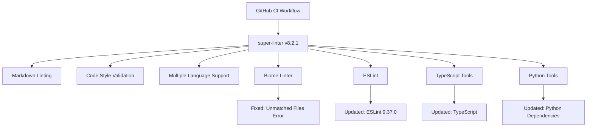

+++
title = "#21609 Bump super-linter/super-linter from 8.2.0 to 8.2.1"
date = "2025-10-28T00:00:00"
draft = false
template = "pull_request_page.html"
in_search_index = true

[taxonomies]
list_display = ["show"]

[extra]
current_language = "en"
available_languages = {"en" = { name = "English", url = "/pull_request/bevy/2025-10/pr-21609-en-20251028" }, "zh-cn" = { name = "中文", url = "/pull_request/bevy/2025-10/pr-21609-zh-cn-20251028" }}
labels = ["A-Build-System", "C-Dependencies"]
+++

# Bump super-linter/super-linter from 8.2.0 to 8.2.1

## Basic Information
- **Title**: Bump super-linter/super-linter from 8.2.0 to 8.2.1
- **PR Link**: https://github.com/bevyengine/bevy/pull/21609
- **Author**: app/dependabot
- **Status**: MERGED
- **Labels**: A-Build-System, C-Dependencies, S-Needs-Review
- **Created**: 2025-10-20T06:09:29Z
- **Merged**: 2025-10-28T22:58:17Z
- **Merged By**: mockersf

## Description Translation

Bumps [super-linter/super-linter](https://github.com/super-linter/super-linter) from 8.2.0 to 8.2.1.
<details>
<summary>Release notes</summary>
<p><em>Sourced from <a href="https://github.com/super-linter/super-linter/releases">super-linter/super-linter's releases</a>.</em></p>
<blockquote>
<h2>v8.2.1</h2>
<h2><a href="https://github.com/super-linter/super-linter/compare/v8.2.0...v8.2.1">8.2.1</a> (2025-10-15)</h2>
<h3>🐛 Bugfixes</h3>
<ul>
<li>biome ignore errors on unmatched files (<a href="https://redirect.github.com/super-linter/super-linter/issues/7089">#7089</a>) (<a href="https://github.com/super-linter/super-linter/commit/8d1cfd5ca320fa3a3cdb9718b78b71106b3867e6">8d1cfd5</a>)</li>
<li>handle pull_request_target (<a href="https://redirect.github.com/super-linter/super-linter/issues/7088">#7088</a>) (<a href="https://github.com/super-linter/super-linter/commit/188a10fdb3a991cc813af934f03c634e03c178bd">188a10f</a>)</li>
<li>handle schedule and workflow_dispatch events (<a href="https://redirect.github.com/super-linter/super-linter/issues/7098">#7098</a>) (<a href="https://github.com/super-linter/super-linter/commit/28cb079925f2c003a9781ead0eec64e8278c93df">28cb079</a>), closes <a href="https://redirect.github.com/super-linter/super-linter/issues/7095">#7095</a></li>
<li>set CONFLICT_FOUND as expected (<a href="https://redirect.github.com/super-linter/super-linter/issues/7093">#7093</a>) (<a href="https://github.com/super-linter/super-linter/commit/07cfe7eb123bd56fbd1c73d274193c488ad2e60f">07cfe7e</a>), closes <a href="https://redirect.github.com/super-linter/super-linter/issues/7092">#7092</a></li>
<li>strip workspace from the regex check path (<a href="https://redirect.github.com/super-linter/super-linter/issues/7110">#7110</a>) (<a href="https://github.com/super-linter/super-linter/commit/3b72a2d2c03b9db79296a430a534d0e6b003c8dc">3b72a2d</a>), closes <a href="https://redirect.github.com/super-linter/super-linter/issues/7086">#7086</a></li>
<li>validate DEFAULT_BRANCH when using find (<a href="https://redirect.github.com/super-linter/super-linter/issues/7119">#7119</a>) (<a href="https://github.com/super-linter/super-linter/commit/7508f4ccb749f1d5b9328aca04bfdeda2e9f8542">7508f4c</a>), closes <a href="https://redirect.github.com/super-linter/super-linter/issues/7117">#7117</a></li>
</ul>
<h3>⬆️ Dependency updates</h3>
<ul>
<li><strong>docker:</strong> bump the docker group with 2 updates (<a href="https://redirect.github.com/super-linter/super-linter/issues/7100">#7100</a>) (<a href="https://github.com/super-linter/super-linter/commit/28c568121b3f6b7167c8892e422d102bbcc8eb69">28c5681</a>)</li>
<li><strong>npm:</strong> bump eslint from 9.36.0 to 9.37.0 in /dependencies (<a href="https://redirect.github.com/super-linter/super-linter/issues/7102">#7102</a>) (<a href="https://github.com/super-linter/super-linter/commit/cf6cb1ebfa9a5acc42b8897b270b94214f0bb3cc">cf6cb1e</a>)</li>
<li><strong>npm:</strong> bump renovate from 41.132.2 to 41.136.0 in /dependencies (<a href="https://redirect.github.com/super-linter/super-linter/issues/7107">#7107</a>) (<a href="https://github.com/super-linter/super-linter/commit/495692ff75eb1cc6963c05d614e75f341d06a062">495692f</a>)</li>
<li><strong>npm:</strong> bump the eslint-plugins-configs group across 1 directory with 2 updates (<a href="https://redirect.github.com/super-linter/super-linter/issues/7101">#7101</a>) (<a href="https://github.com/super-linter/super-linter/commit/b3a735d16a56266102f0297bf4f48bc13f23aa9b">b3a735d</a>)</li>
<li><strong>npm:</strong> bump the npm group across 1 directory with 4 updates (<a href="https://redirect.github.com/super-linter/super-linter/issues/7108">#7108</a>) (<a href="https://github.com/super-linter/super-linter/commit/ce227b3ec86ae4f7d6650674ed1f37877f7f4c34">ce227b3</a>)</li>
<li><strong>npm:</strong> bump typescript (<a href="https://redirect.github.com/super-linter/super-linter/issues/7109">#7109</a>) (<a href="https://github.com/super-linter/super-linter/commit/deba11c880239ab04bcd11a8b5cde914b13db740">deba11c</a>)</li>
<li><strong>python:</strong> bump the pip group across 1 directory with 7 updates (<a href="https://redirect.github.com/super-linter/super-linter/issues/7106">#7106</a>) (<a href="https://github.com/super-linter/super-linter/commit/7c02a56ba63719acef55b8e6865582f7dc4465b2">7c02a56</a>)</li>
</ul>
<h3>🧰 Maintenance</h3>
<ul>
<li>add missing ruff variables to readme (<a href="https://redirect.github.com/super-linter/super-linter/issues/7091">#7091</a>) (<a href="https://github.com/super-linter/super-linter/commit/7daeceba58e1d1d43afdd9df96070ba6bfbc37fb">7daeceb</a>), closes <a href="https://redirect.github.com/super-linter/super-linter/issues/7099">#7099</a></li>
<li>explain who ignores VALIDATE_ALL_CODEBASE (<a href="https://redirect.github.com/super-linter/super-linter/issues/7111">#7111</a>) (<a href="https://github.com/super-linter/super-linter/commit/9150eb9b2be254146a684b5f97b10b3ed16882a9">9150eb9</a>), closes <a href="https://redirect.github.com/super-linter/super-linter/issues/7090">#7090</a></li>
<li><strong>github-actions:</strong> bump peter-evans/create-issue-from-file (<a href="https://redirect.github.com/super-linter/super-linter/issues/7103">#7103</a>) (<a href="https://github.com/super-linter/super-linter/commit/ec80a773933c4215f8450a7eeb5b617436fe7d03">ec80a77</a>)</li>
<li>update rack to 3.2.3 (<a href="https://redirect.github.com/super-linter/super-linter/issues/7136">#7136</a>) (<a href="https://github.com/super-linter/super-linter/commit/2e6ad3dff5b580a3e84c781cd9b0e3555c09414a">2e6ad3d</a>)</li>
<li>update ruby transitive dependencies (<a href="https://redirect.github.com/super-linter/super-linter/issues/7115">#7115</a>) (<a href="https://github.com/super-linter/super-linter/commit/00a71f647b0014a246a0fb34caaa0e7640e85070">00a71f6</a>)</li>
</ul>
</blockquote>
</details>
<details>
<summary>Changelog</summary>
<p><em>Sourced from <a href="https://github.com/super-linter/super-linter/blob/main/CHANGELOG.md">super-linter/super-linter's changelog</a>.</em></p>
<blockquote>
<h2><a href="https://github.com/super-linter/super-linter/compare/v8.2.0...v8.2.1">8.2.1</a> (2025-10-15)</h2>
<h3>🐛 Bugfixes</h3>
<ul>
<li>biome ignore errors on unmatched files (<a href="https://redirect.github.com/super-linter/super-linter/issues/7089">#7089</a>) (<a href="https://github.com/super-linter/super-linter/commit/8d1cfd5ca320fa3a3cdb9718b78b71106b3867e6">8d1cfd5</a>)</li>
<li>handle pull_request_target (<a href="https://redirect.github.com/super-linter/super-linter/issues/7088">#7088</a>) (<a href="https://github.com/super-linter/super-linter/commit/188a10fdb3a991cc813af934f03c634e03c178bd">188a10f</a>)</li>
<li>handle schedule and workflow_dispatch events (<a href="https://redirect.github.com/super-linter/super-linter/issues/7098">#7098</a>) (<a href="https://github.com/super-linter/super-linter/commit/28cb079925f2c003a9781ead0eec64e8278c93df">28cb079</a>), closes <a href="https://redirect.github.com/super-linter/super-linter/issues/7095">#7095</a></li>
<li>set CONFLICT_FOUND as expected (<a href="https://redirect.github.com/super-linter/super-linter/issues/7093">#7093</a>) (<a href="https://github.com/super-linter/super-linter/commit/07cfe7eb123bd56fbd1c73d274193c488ad2e60f">07cfe7e</a>), closes <a href="https://redirect.github.com/super-linter/super-linter/issues/7092">#7092</a></li>
<li>strip workspace from the regex check path (<a href="https://redirect.github.com/super-linter/super-linter/issues/7110">#7110</a>) (<a href="https://github.com/super-linter/super-linter/commit/3b72a2d2c03b9db79296a430a534d0e6b003c8dc">3b72a2d</a>), closes <a href="https://redirect.github.com/super-linter/super-linter/issues/7086">#7086</a></li>
<li>validate DEFAULT_BRANCH when using find (<a href="https://redirect.github.com/super-linter/super-linter/issues/7119">#7119</a>) (<a href="https://github.com/super-linter/super-linter/commit/7508f4ccb749f1d5b9328aca04bfdeda2e9f8542">7508f4c</a>), closes <a href="https://redirect.github.com/super-linter/super-linter/issues/7117">#7117</a></li>
</ul>
<h3>⬆️ Dependency updates</h3>
<ul>
<li><strong>docker:</strong> bump the docker group with 2 updates (<a href="https://redirect.github.com/super-linter/super-linter/issues/7100">#7100</a>) (<a href="https://github.com/super-linter/super-linter/commit/28c568121b3f6b7167c8892e422d102bbcc8eb69">28c5681</a>)</li>
<li><strong>npm:</strong> bump eslint from 9.36.0 to 9.37.0 in /dependencies (<a href="https://redirect.github.com/super-linter/super-linter/issues/7102">#7102</a>) (<a href="https://github.com/super-linter/super-linter/commit/cf6cb1ebfa9a5acc42b8897b270b94214f0bb3cc">cf6cb1e</a>)</li>
<li><strong>npm:</strong> bump renovate from 41.132.2 to 41.136.0 in /dependencies (<a href="https://redirect.github.com/super-linter/super-linter/issues/7107">#7107</a>) (<a href="https://github.com/super-linter/super-linter/commit/495692ff75eb1cc6963c05d614e75f341d06a062">495692f</a>)</li>
<li><strong>npm:</strong> bump the eslint-plugins-configs group across 1 directory with 2 updates (<a href="https://redirect.github.com/super-linter/super-linter/issues/7101">#7101</a>) (<a href="https://github.com/super-linter/super-linter/commit/b3a735d16a56266102f0297bf4f48bc13f23aa9b">b3a735d</a>)</li>
<li><strong>npm:</strong> bump the npm group across 1 directory with 4 updates (<a href="https://redirect.github.com/super-linter/super-linter/issues/7108">#7108</a>) (<a href="https://github.com/super-linter/super-linter/commit/ce227b3ec86ae4f7d6650674ed1f37877f7f4c34">ce227b3</a>)</li>
<li><strong>npm:</strong> bump typescript (<a href="https://redirect.github.com/super-linter/super-linter/issues/7109">#7109</a>) (<a href="https://github.com/super-linter/super-linter/commit/deba11c880239ab04bcd11a8b5cde914b13db740">deba11c</a>)</li>
<li><strong>python:</strong> bump the pip group across 1 directory with 7 updates (<a href="https://redirect.github.com/super-linter/super-linter/issues/7106">#7106</a>) (<a href="https://github.com/super-linter/super-linter/commit/7c02a56ba63719acef55b8e6865582f7dc4465b2">7c02a56</a>)</li>
</ul>
<h3>🧰 Maintenance</h3>
<ul>
<li>add missing ruff variables to readme (<a href="https://redirect.github.com/super-linter/super-linter/issues/7091">#7091</a>) (<a href="https://github.com/super-linter/super-linter/commit/7daeceba58e1d1d43afdd9df96070ba6bfbc37fb">7daeceb</a>), closes <a href="https://redirect.github.com/super-linter/super-linter/issues/7099">#7099</a></li>
<li>explain who ignores VALIDATE_ALL_CODEBASE (<a href="https://redirect.github.com/super-linter/super-linter/issues/7111">#7111</a>) (<a href="https://github.com/super-linter/super-linter/commit/9150eb9b2be254146a684b5f97b10b3ed16882a9">9150eb9</a>), closes <a href="https://redirect.github.com/super-linter/super-linter/issues/7090">#7090</a></li>
<li><strong>github-actions:</strong> bump peter-evans/create-issue-from-file (<a href="https://redirect.github.com/super-linter/super-linter/issues/7103">#7103</a>) (<a href="https://github.com/super-linter/super-linter/commit/ec80a773933c4215f8450a7eeb5b617436fe7d03">ec80a77</a>)</li>
<li>update rack to 3.2.3 (<a href="https://redirect.github.com/super-linter/super-linter/issues/7136">#7136</a>) (<a href="https://github.com/super-linter/super-linter/commit/2e6ad3dff5b580a3e84c781cd9b0e3555c09414a">2e6ad3d</a>)</li>
<li>update ruby transitive dependencies (<a href="https://redirect.github.com/super-linter/super-linter/issues/7115">#7115</a>) (<a href="https://github.com/super-linter/super-linter/commit/00a71f647b0014a246a0fb34caaa0e7640e85070">00a71f6</a>)</li>
</ul>
</blockquote>
</details>
<details>
<summary>Commits</summary>
<ul>
<li><a href="https://github.com/super-linter/super-linter/commit/2bdd90ed3262e023ac84bf8fe35dc480721fc1f2"><code>2bdd90e</code></a> chore(main): release 8.2.1 (<a href="https://redirect.github.com/super-linter/super-linter/issues/7094">#7094</a>)</li>
<li><a href="https://github.com/super-linter/super-linter/commit/51e00ddd747163eace0c6c457a14ba3fab178581"><code>51e00dd</code></a> chore: use powershell from dotnet sdk image (<a href="https://redirect.github.com/super-linter/super-linter/issues/7141">#7141</a>)</li>
<li><a href="https://github.com/super-linter/super-linter/commit/2e6ad3dff5b580a3e84c781cd9b0e3555c09414a"><code>2e6ad3d</code></a> chore: update rack to 3.2.3 (<a href="https://redirect.github.com/super-linter/super-linter/issues/7136">#7136</a>)</li>
<li><a href="https://github.com/super-linter/super-linter/commit/7508f4ccb749f1d5b9328aca04bfdeda2e9f8542"><code>7508f4c</code></a> fix: validate DEFAULT_BRANCH when using find (<a href="https://redirect.github.com/super-linter/super-linter/issues/7119">#7119</a>)</li>
<li><a href="https://github.com/super-linter/super-linter/commit/cf6cb1ebfa9a5acc42b8897b270b94214f0bb3cc"><code>cf6cb1e</code></a> deps(npm): bump eslint from 9.36.0 to 9.37.0 in /dependencies (<a href="https://redirect.github.com/super-linter/super-linter/issues/7102">#7102</a>)</li>
<li><a href="https://github.com/super-linter/super-linter/commit/495692ff75eb1cc6963c05d614e75f341d06a062"><code>495692f</code></a> deps(npm): bump renovate from 41.132.2 to 41.136.0 in /dependencies (<a href="https://redirect.github.com/super-linter/super-linter/issues/7107">#7107</a>)</li>
<li><a href="https://github.com/super-linter/super-linter/commit/deba11c880239ab04bcd11a8b5cde914b13db740"><code>deba11c</code></a> deps(npm): bump typescript (<a href="https://redirect.github.com/super-linter/super-linter/issues/7109">#7109</a>)</li>
<li><a href="https://github.com/super-linter/super-linter/commit/28c568121b3f6b7167c8892e422d102bbcc8eb69"><code>28c5681</code></a> deps(docker): bump the docker group with 2 updates (<a href="https://redirect.github.com/super-linter/super-linter/issues/7100">#7100</a>)</li>
<li><a href="https://github.com/super-linter/super-linter/commit/b3a735d16a56266102f0297bf4f48bc13f23aa9b"><code>b3a735d</code></a> deps(npm): bump the eslint-plugins-configs group across 1 directory with 2 up...</li>
<li><a href="https://github.com/super-linter/super-linter/commit/ec80a773933c4215f8450a7eeb5b617436fe7d03"><code>ec80a77</code></a> ci(github-actions): bump peter-evans/create-issue-from-file (<a href="https://redirect.github.com/super-linter/super-linter/issues/7103">#7103</a>)</li>
<li>Additional commits viewable in <a href="https://github.com/super-linter/super-linter/compare/v8.2.0...v8.2.1">compare view</a></li>
</ul>
</details>
<br />


[](https://docs.github.com/en/github/managing-security-vulnerabilities/about-dependabot-security-updates#about-compatibility-scores)

Dependabot will resolve any conflicts with this PR as long as you don't alter it yourself. You can also trigger a rebase manually by commenting `@dependabot rebase`.

[//]: # (dependabot-automerge-start)
[//]: # (dependabot-automerge-end)

---

<details>
<summary>Dependabot commands and options</summary>
<br />

You can trigger Dependabot actions by commenting on this PR:
- `@dependabot rebase` will rebase this PR
- `@dependabot recreate` will recreate this PR, overwriting any edits that have been made to it
- `@dependabot merge` will merge this PR after your CI passes on it
- `@dependabot squash and merge` will squash and merge this PR after your CI passes on it
- `@dependabot cancel merge` will cancel a previously requested merge and block automerging
- `@dependabot reopen` will reopen this PR if it is closed
- `@dependabot close` will close this PR and stop Dependabot recreating it. You can achieve the same result by closing it manually
- `@dependabot show <dependency name> ignore conditions` will show all of the ignore conditions of the specified dependency
- `@dependabot ignore this major version` will close this PR and stop Dependabot creating any more for this major version (unless you reopen the PR or upgrade to it yourself)
- `@dependabot ignore this minor version` will close this PR and stop Dependabot creating any more for this minor version (unless you reopen the PR or upgrade to it yourself)
- `@dependabot ignore this dependency` will close this PR and stop Dependabot creating any more for this dependency (unless you reopen the PR or upgrade to it yourself)


</details>

## The Story of This Pull Request

This PR represents a routine but important dependency maintenance task in the Bevy engine's continuous integration pipeline. The change updates the super-linter GitHub Action from version 8.2.0 to 8.2.1, bringing several bug fixes and improvements to the project's code quality enforcement system.

The super-linter is a critical component in Bevy's development workflow, responsible for automatically analyzing code changes for style consistency, potential issues, and adherence to project standards. As a large open-source project with multiple contributors, maintaining consistent code quality across the codebase is essential for long-term maintainability and developer productivity.

The update from 8.2.0 to 8.2.1 addresses several important issues that could affect the reliability of the linting process. Key bug fixes include improved handling of different GitHub event types (`pull_request_target`, `schedule`, and `workflow_dispatch`), better error handling for the Biome linter when encountering unmatched files, and proper setting of the `CONFLICT_FOUND` status variable. These fixes ensure that the linter behaves consistently across different workflow triggers and provides accurate feedback to developers.

The version bump also includes dependency updates for various linters within the super-linter ecosystem, including ESLint, TypeScript, and several Python packages. These updates bring the latest improvements and bug fixes from the underlying linting tools, ensuring that Bevy benefits from the most current static analysis capabilities.

The implementation approach is straightforward - a single-line change in the CI workflow configuration file that updates the version reference. This minimal change demonstrates the value of using versioned GitHub Actions, as it allows the project to benefit from upstream improvements without requiring extensive modifications to the existing workflow configuration.

## Visual Representation



## Key Files Changed

### `.github/workflows/ci.yml` (+1/-1)

This is the only file modified in this PR, containing the GitHub Actions workflow configuration for Bevy's continuous integration pipeline.

**Change Summary:**
The PR updates the super-linter version from 8.2.0 to 8.2.1 in the "Run Markdown Lint" job step.

**Code Diff:**
```yaml
# File: .github/workflows/ci.yml
# Before:
      - name: Run Markdown Lint
        uses: super-linter/super-linter/slim@v8.2.0

# After:
      - name: Run Markdown Lint
        uses: super-linter/super-linter/slim@v8.2.1
```

**Context:**
This change is located within the CI workflow configuration that runs automated linting on Markdown files. The workflow uses the "slim" variant of super-linter, which is optimized for faster execution by including only essential linters. The update ensures that Bevy benefits from the latest bug fixes and improvements in the super-linter toolchain while maintaining the same workflow configuration and behavior.

## Further Reading

- [super-linter GitHub Repository](https://github.com/super-linter/super-linter) - Official documentation and source code
- [GitHub Actions Documentation](https://docs.github.com/en/actions) - Comprehensive guide to GitHub Actions workflows
- [Dependabot Documentation](https://docs.github.com/en/code-security/dependabot) - Automated dependency management for GitHub projects
- [Bevy Engine CI Documentation](https://bevyengine.org/learn/book/contributing/ci/) - Bevy's continuous integration practices

# Full Code Diff
```
diff --git a/.github/workflows/ci.yml b/.github/workflows/ci.yml
index e5d007e03fd88..d9b34869dc5b3 100644
--- a/.github/workflows/ci.yml
+++ b/.github/workflows/ci.yml
@@ -304,7 +304,7 @@ jobs:
           # Full git history is needed to get a proper list of changed files within `super-linter`
           fetch-depth: 0
       - name: Run Markdown Lint
-        uses: super-linter/super-linter/slim@v8.2.0
+        uses: super-linter/super-linter/slim@v8.2.1
         env:
           MULTI_STATUS: false
           VALIDATE_ALL_CODEBASE: false
```