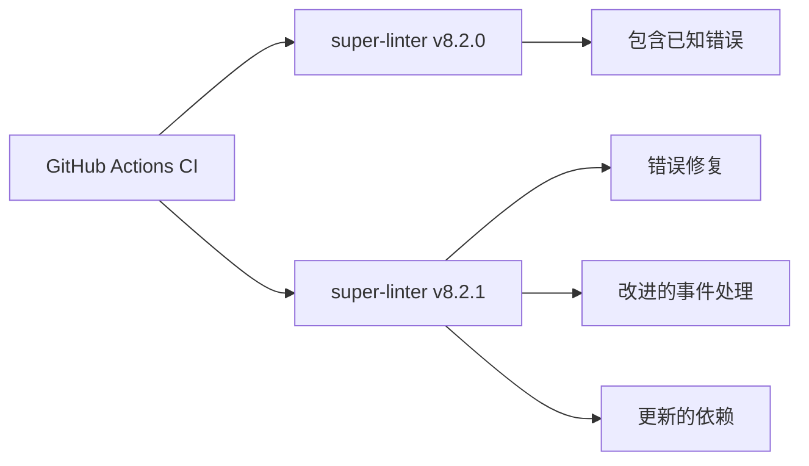

+++
title = "#21609 Bump super-linter/super-linter from 8.2.0 to 8.2.1"
date = "2025-10-28T00:00:00"
draft = false
template = "pull_request_page.html"
in_search_index = false

[extra]
current_language = "zh-cn"
available_languages = {"en" = { name = "English", url = "/pull_request/bevy/2025-10/pr-21609-en-20251028" }, "zh-cn" = { name = "中文", url = "/pull_request/bevy/2025-10/pr-21609-zh-cn-20251028" }}
labels = ["A-Build-System", "C-Dependencies"]
+++

# Bump super-linter/super-linter from 8.2.0 to 8.2.1

## Basic Information
- **Title**: Bump super-linter/super-linter from 8.2.0 to 8.2.1
- **PR Link**: https://github.com/bevyengine/bevy/pull/21609
- **Author**: app/dependabot
- **Status**: MERGED
- **Labels**: A-Build-System, C-Dependencies, S-Needs-Review
- **Created**: 2025-10-20T06:09:29Z
- **Merged**: 2025-10-28T22:58:17Z
- **Merged By**: mockersf

## 描述翻译
将 super-linter/super-linter 从 8.2.0 升级到 8.2.1。
<details>
<summary>发布说明</summary>
<p><em>来源自 <a href="https://github.com/super-linter/super-linter/releases">super-linter/super-linter 的发布页面</a>。</em></p>
<blockquote>
<h2>v8.2.1</h2>
<h2><a href="https://github.com/super-linter/super-linter/compare/v8.2.0...v8.2.1">8.2.1</a> (2025-10-15)</h2>
<h3>🐛 错误修复</h3>
<ul>
<li>biome 忽略未匹配文件的错误 (<a href="https://redirect.github.com/super-linter/super-linter/issues/7089">#7089</a>) (<a href="https://github.com/super-linter/super-linter/commit/8d1cfd5ca320fa3a3cdb9718b78b71106b3867e6">8d1cfd5</a>)</li>
<li>处理 pull_request_target (<a href="https://redirect.github.com/super-linter/super-linter/issues/7088">#7088</a>) (<a href="https://github.com/super-linter/super-linter/commit/188a10fdb3a991cc813af934f03c634e03c178bd">188a10f</a>)</li>
<li>处理 schedule 和 workflow_dispatch 事件 (<a href="https://redirect.github.com/super-linter/super-linter/issues/7098">#7098</a>) (<a href="https://github.com/super-linter/super-linter/commit/28cb079925f2c003a9781ead0eec64e8278c93df">28cb079</a>), 关闭 <a href="https://redirect.github.com/super-linter/super-linter/issues/7095">#7095</a></li>
<li>按预期设置 CONFLICT_FOUND (<a href="https://redirect.github.com/super-linter/super-linter/issues/7093">#7093</a>) (<a href="https://github.com/super-linter/super-linter/commit/07cfe7eb123bd56fbd1c73d274193c488ad2e60f">07cfe7e</a>), 关闭 <a href="https://redirect.github.com/super-linter/super-linter/issues/7092">#7092</a></li>
<li>从正则表达式检查路径中去除工作空间 (<a href="https://redirect.github.com/super-linter/super-linter/issues/7110">#7110</a>) (<a href="https://github.com/super-linter/super-linter/commit/3b72a2d2c03b9db79296a430a534d0e6b003c8dc">3b72a2d</a>), 关闭 <a href="https://redirect.github.com/super-linter/super-linter/issues/7086">#7086</a></li>
<li>在使用 find 时验证 DEFAULT_BRANCH (<a href="https://redirect.github.com/super-linter/super-linter/issues/7119">#7119</a>) (<a href="https://github.com/super-linter/super-linter/commit/7508f4ccb749f1d5b9328aca04bfdeda2e9f8542">7508f4c</a>), 关闭 <a href="https://redirect.github.com/super-linter/super-linter/issues/7117">#7117</a></li>
</ul>
<h3>⬆️ 依赖更新</h3>
<ul>
<li><strong>docker:</strong> 使用 2 个更新来升级 docker 组 (<a href="https://redirect.github.com/super-linter/super-linter/issues/7100">#7100</a>) (<a href="https://github.com/super-linter/super-linter/commit/28c568121b3f6b7167c8892e422d102bbcc8eb69">28c5681</a>)</li>
<li><strong>npm:</strong> 在 /dependencies 中将 eslint 从 9.36.0 升级到 9.37.0 (<a href="https://redirect.github.com/super-linter/super-linter/issues/7102">#7102</a>) (<a href="https://github.com/super-linter/super-linter/commit/cf6cb1ebfa9a5acc42b8897b270b94214f0bb3cc">cf6cb1e</a>)</li>
<li><strong>npm:</strong> 在 /dependencies 中将 renovate 从 41.132.2 升级到 41.136.0 (<a href="https://redirect.github.com/super-linter/super-linter/issues/7107">#7107</a>) (<a href="https://github.com/super-linter/super-linter/commit/495692ff75eb1cc6963c05d614e75f341d06a062">495692f</a>)</li>
<li><strong>npm:</strong> 在 1 个目录中使用 2 个更新来升级 eslint-plugins-configs 组 (<a href="https://redirect.github.com/super-linter/super-linter/issues/7101">#7101</a>) (<a href="https://github.com/super-linter/super-linter/commit/b3a735d16a56266102f0297bf4f48bc13f23aa9b">b3a735d</a>)</li>
<li><strong>npm:</strong> 在 1 个目录中使用 4 个更新来升级 npm 组 (<a href="https://redirect.github.com/super-linter/super-linter/issues/7108">#7108</a>) (<a href="https://github.com/super-linter/super-linter/commit/ce227b3ec86ae4f7d6650674ed1f37877f7f4c34">ce227b3</a>)</li>
<li><strong>npm:</strong> 升级 typescript (<a href="https://redirect.github.com/super-linter/super-linter/issues/7109">#7109</a>) (<a href="https://github.com/super-linter/super-linter/commit/deba11c880239ab04bcd11a8b5cde914b13db740">deba11c</a>)</li>
<li><strong>python:</strong> 在 1 个目录中使用 7 个更新来升级 pip 组 (<a href="https://redirect.github.com/super-linter/super-linter/issues/7106">#7106</a>) (<a href="https://github.com/super-linter/super-linter/commit/7c02a56ba63719acef55b8e6865582f7dc4465b2">7c02a56</a>)</li>
</ul>
<h3>🧰 维护</h3>
<ul>
<li>在 readme 中添加缺失的 ruff 变量 (<a href="https://redirect.github.com/super-linter/super-linter/issues/7091">#7091</a>) (<a href="https://github.com/super-linter/super-linter/commit/7daeceba58e1d1d43afdd9df96070ba6bfbc37fb">7daeceb</a>), 关闭 <a href="https://redirect.github.com/super-linter/super-linter/issues/7099">#7099</a></li>
<li>解释谁忽略 VALIDATE_ALL_CODEBASE (<a href="https://redirect.github.com/super-linter/super-linter/issues/7111">#7111</a>) (<a href="https://github.com/super-linter/super-linter/commit/9150eb9b2be254146a684b5f97b10b3ed16882a9">9150eb9</a>), 关闭 <a href="https://redirect.github.com/super-linter/super-linter/issues/7090">#7090</a></li>
<li><strong>github-actions:</strong> 升级 peter-evans/create-issue-from-file (<a href="https://redirect.github.com/super-linter/super-linter/issues/7103">#7103</a>) (<a href="https://github.com/super-linter/super-linter/commit/ec80a773933c4215f8450a7eeb5b617436fe7d03">ec80a77</a>)</li>
<li>将 rack 更新到 3.2.3 (<a href="https://redirect.github.com/super-linter/super-linter/issues/7136">#7136</a>) (<a href="https://github.com/super-linter/super-linter/commit/2e6ad3dff5b580a3e84c781cd9b0e3555c09414a">2e6ad3d</a>)</li>
<li>更新 ruby 传递依赖 (<a href="https://redirect.github.com/super-linter/super-linter/issues/7115">#7115</a>) (<a href="https://github.com/super-linter/super-linter/commit/00a71f647b0014a246a0fb34caaa0e7640e85070">00a71f6</a>)</li>
</ul>
</blockquote>
</details>
<details>
<summary>变更日志</summary>
<p><em>来源自 <a href="https://github.com/super-linter/super-linter/blob/main/CHANGELOG.md">super-linter/super-linter 的变更日志</a>。</em></p>
<blockquote>
<h2><a href="https://github.com/super-linter/super-linter/compare/v8.2.0...v8.2.1">8.2.1</a> (2025-10-15)</h2>
<h3>🐛 错误修复</h3>
<ul>
<li>biome 忽略未匹配文件的错误 (<a href="https://redirect.github.com/super-linter/super-linter/issues/7089">#7089</a>) (<a href="https://github.com/super-linter/super-linter/commit/8d1cfd5ca320fa3a3cdb9718b78b71106b3867e6">8d1cfd5</a>)</li>
<li>处理 pull_request_target (<a href="https://redirect.github.com/super-linter/super-linter/issues/7088">#7088</a>) (<a href="https://github.com/super-linter/super-linter/commit/188a10fdb3a991cc813af934f03c634e03c178bd">188a10f</a>)</li>
<li>处理 schedule 和 workflow_dispatch 事件 (<a href="https://redirect.github.com/super-linter/super-linter/issues/7098">#7098</a>) (<a href="https://github.com/super-linter/super-linter/commit/28cb079925f2c003a9781ead0eec64e8278c93df">28cb079</a>), 关闭 <a href="https://redirect.github.com/super-linter/super-linter/issues/7095">#7095</a></li>
<li>按预期设置 CONFLICT_FOUND (<a href="https://redirect.github.com/super-linter/super-linter/issues/7093">#7093</a>) (<a href="https://github.com/super-linter/super-linter/commit/07cfe7eb123bd56fbd1c73d274193c488ad2e60f">07cfe7e</a>), 关闭 <a href="https://redirect.github.com/super-linter/super-linter/issues/7092">#7092</a></li>
<li>从正则表达式检查路径中去除工作空间 (<a href="https://redirect.github.com/super-linter/super-linter/issues/7110">#7110</a>) (<a href="https://github.com/super-linter/super-linter/commit/3b72a2d2c03b9db79296a430a534d0e6b003c8dc">3b72a2d</a>), 关闭 <a href="https://redirect.github.com/super-linter/super-linter/issues/7086">#7086</a></li>
<li>在使用 find 时验证 DEFAULT_BRANCH (<a href="https://redirect.github.com/super-linter/super-linter/issues/7119">#7119</a>) (<a href="https://github.com/super-linter/super-linter/commit/7508f4ccb749f1d5b9328aca04bfdeda2e9f8542">7508f4c</a>), 关闭 <a href="https://redirect.github.com/super-linter/super-linter/issues/7117">#7117</a></li>
</ul>
<h3>⬆️ 依赖更新</h3>
<ul>
<li><strong>docker:</strong> 使用 2 个更新来升级 docker 组 (<a href="https://redirect.github.com/super-linter/super-linter/issues/7100">#7100</a>) (<a href="https://github.com/super-linter/super-linter/commit/28c568121b3f6b7167c8892e422d102bbcc8eb69">28c5681</a>)</li>
<li><strong>npm:</strong> 在 /dependencies 中将 eslint 从 9.36.0 升级到 9.37.0 (<a href="https://redirect.github.com/super-linter/super-linter/issues/7102">#7102</a>) (<a href="https://github.com/super-linter/super-linter/commit/cf6cb1ebfa9a5acc42b8897b270b94214f0bb3cc">cf6cb1e</a>)</li>
<li><strong>npm:</strong> 在 /dependencies 中将 renovate 从 41.132.2 升级到 41.136.0 (<a href="https://redirect.github.com/super-linter/super-linter/issues/7107">#7107</a>) (<a href="https://github.com/super-linter/super-linter/commit/495692ff75eb1cc6963c05d614e75f341d06a062">495692f</a>)</li>
<li><strong>npm:</strong> 在 1 个目录中使用 2 个更新来升级 eslint-plugins-configs 组 (<a href="https://redirect.github.com/super-linter/super-linter/issues/7101">#7101</a>) (<a href="https://github.com/super-linter/super-linter/commit/b3a735d16a56266102f0297bf4f48bc13f23aa9b">b3a735d</a>)</li>
<li><strong>npm:</strong> 在 1 个目录中使用 4 个更新来升级 npm 组 (<a href="https://redirect.github.com/super-linter/super-linter/issues/7108">#7108</a>) (<a href="https://github.com/super-linter/super-linter/commit/ce227b3ec86ae4f7d6650674ed1f37877f7f4c34">ce227b3</a>)</li>
<li><strong>npm:</strong> 升级 typescript (<a href="https://redirect.github.com/super-linter/super-linter/issues/7109">#7109</a>) (<a href="https://github.com/super-linter/super-linter/commit/deba11c880239ab04bcd11a8b5cde914b13db740">deba11c</a>)</li>
<li><strong>python:</strong> 在 1 个目录中使用 7 个更新来升级 pip 组 (<a href="https://redirect.github.com/super-linter/super-linter/issues/7106">#7106</a>) (<a href="https://github.com/super-linter/super-linter/commit/7c02a56ba63719acef55b8e6865582f7dc4465b2">7c02a56</a>)</li>
</ul>
<h3>🧰 维护</h3>
<ul>
<li>在 readme 中添加缺失的 ruff 变量 (<a href="https://redirect.github.com/super-linter/super-linter/issues/7091">#7091</a>) (<a href="https://github.com/super-linter/super-linter/commit/7daeceba58e1d1d43afdd9df96070ba6bfbc37fb">7daeceb</a>), 关闭 <a href="https://redirect.github.com/super-linter/super-linter/issues/7099">#7099</a></li>
<li>解释谁忽略 VALIDATE_ALL_CODEBASE (<a href="https://redirect.github.com/super-linter/super-linter/issues/7111">#7111</a>) (<a href="https://github.com/super-linter/super-linter/commit/9150eb9b2be254146a684b5f97b10b3ed16882a9">9150eb9</a>), 关闭 <a href="https://redirect.github.com/super-linter/super-linter/issues/7090">#7090</a></li>
<li><strong>github-actions:</strong> 升级 peter-evans/create-issue-from-file (<a href="https://redirect.github.com/super-linter/super-linter/issues/7103">#7103</a>) (<a href="https://github.com/super-linter/super-linter/commit/ec80a773933c4215f8450a7eeb5b617436fe7d03">ec80a77</a>)</li>
<li>将 rack 更新到 3.2.3 (<a href="https://redirect.github.com/super-linter/super-linter/issues/7136">#7136</a>) (<a href="https://github.com/super-linter/super-linter/commit/2e6ad3dff5b580a3e84c781cd9b0e3555c09414a">2e6ad3d</a>)</li>
<li>更新 ruby 传递依赖 (<a href="https://redirect.github.com/super-linter/super-linter/issues/7115">#7115</a>) (<a href="https://github.com/super-linter/super-linter/commit/00a71f647b0014a246a0fb34caaa0e7640e85070">00a71f6</a>)</li>
</ul>
</blockquote>
</details>
<details>
<summary>提交</summary>
<ul>
<li><a href="https://github.com/super-linter/super-linter/commit/2bdd90ed3262e023ac84bf8fe35dc480721fc1f2"><code>2bdd90e</code></a> chore(main): 发布 8.2.1 (<a href="https://redirect.github.com/super-linter/super-linter/issues/7094">#7094</a>)</li>
<li><a href="https://github.com/super-linter/super-linter/commit/51e00ddd747163eace0c6c457a14ba3fab178581"><code>51e00dd</code></a> chore: 使用来自 dotnet sdk 镜像的 powershell (<a href="https://redirect.github.com/super-linter/super-linter/issues/7141">#7141</a>)</li>
<li><a href="https://github.com/super-linter/super-linter/commit/2e6ad3dff5b580a3e84c781cd9b0e3555c09414a"><code>2e6ad3d</code></a> chore: 将 rack 更新到 3.2.3 (<a href="https://redirect.github.com/super-linter/super-linter/issues/7136">#7136</a>)</li>
<li><a href="https://github.com/super-linter/super-linter/commit/7508f4ccb749f1d5b9328aca04bfdeda2e9f8542"><code>7508f4c</code></a> fix: 在使用 find 时验证 DEFAULT_BRANCH (<a href="https://redirect.github.com/super-linter/super-linter/issues/7119">#7119</a>)</li>
<li><a href="https://github.com/super-linter/super-linter/commit/cf6cb1ebfa9a5acc42b8897b270b94214f0bb3cc"><code>cf6cb1e</code></a> deps(npm): 在 /dependencies 中将 eslint 从 9.36.0 升级到 9.37.0 (<a href="https://redirect.github.com/super-linter/super-linter/issues/7102">#7102</a>)</li>
<li><a href="https://github.com/super-linter/super-linter/commit/495692ff75eb1cc6963c05d614e75f341d06a062"><code>495692f</code></a> deps(npm): 在 /dependencies 中将 renovate 从 41.132.2 升级到 41.136.0 (<a href="https://redirect.github.com/super-linter/super-linter/issues/7107">#7107</a>)</li>
<li><a href="https://github.com/super-linter/super-linter/commit/deba11c880239ab04bcd11a8b5cde914b13db740"><code>deba11c</code></a> deps(npm): 升级 typescript (<a href="https://redirect.github.com/super-linter/super-linter/issues/7109">#7109</a>)</li>
<li><a href="https://github.com/super-linter/super-linter/commit/28c568121b3f6b7167c8892e422d102bbcc8eb69"><code>28c5681</code></a> deps(docker): 使用 2 个更新来升级 docker 组 (<a href="https://redirect.github.com/super-linter/super-linter/issues/7100">#7100</a>)</li>
<li><a href="https://github.com/super-linter/super-linter/commit/b3a735d16a56266102f0297bf4f48bc13f23aa9b"><code>b3a735d</code></a> deps(npm): 在 1 个目录中使用 2 个更新来升级 eslint-plugins-configs 组...</li>
<li><a href="https://github.com/super-linter/super-linter/commit/ec80a773933c4215f8450a7eeb5b617436fe7d03"><code>ec80a77</code></a> ci(github-actions): 升级 peter-evans/create-issue-from-file (<a href="https://redirect.github.com/super-linter/super-linter/issues/7103">#7103</a>)</li>
<li>更多提交可在 <a href="https://github.com/super-linter/super-linter/compare/v8.2.0...v8.2.1">比较视图</a> 中查看</li>
</ul>
</details>
<br />


[](https://docs.github.com/en/github/managing-security-vulnerabilities/about-dependabot-security-updates#about-compatibility-scores)

只要您不自行修改，Dependabot 将解决与此 PR 的任何冲突。您也可以通过评论 `@dependabot rebase` 手动触发 rebase。

[//]: # (dependabot-automerge-start)
[//]: # (dependabot-automerge-end)

---

<details>
<summary>Dependabot 命令和选项</summary>
<br />

您可以通过在此 PR 上评论来触发 Dependabot 操作：
- `@dependabot rebase` 将 rebase 此 PR
- `@dependabot recreate` 将重新创建此 PR，覆盖对其进行的任何编辑
- `@dependabot merge` 将在您的 CI 通过后合并此 PR
- `@dependabot squash and merge` 将在您的 CI 通过后 squash 并合并此 PR
- `@dependabot cancel merge` 将取消先前请求的合并并阻止自动合并
- `@dependabot reopen` 将重新打开此 PR（如果已关闭）
- `@dependabot close` 将关闭此 PR 并停止 Dependabot 重新创建它。您可以通过手动关闭它来实现相同的结果
- `@dependabot show <dependency name> ignore conditions` 将显示指定依赖项的所有忽略条件
- `@dependabot ignore this major version` 将关闭此 PR 并停止 Dependabot 为此主要版本创建任何更多 PR（除非您重新打开 PR 或自行升级到该版本）
- `@dependabot ignore this minor version` 将关闭此 PR 并停止 Dependabot 为此次要版本创建任何更多 PR（除非您重新打开 PR 或自行升级到该版本）
- `@dependabot ignore this dependency` 将关闭此 PR 并停止 Dependabot 为此依赖项创建任何更多 PR（除非您重新打开 PR 或自行升级到该版本）


</details>

## 这个 Pull Request 的故事

这个 PR 是一个典型的依赖管理更新，由 Dependabot 自动创建。核心问题是保持 CI 系统中使用的 super-linter 工具处于最新状态，以获取最新的错误修复和功能改进。

### 背景与问题

在软件开发项目中，持续集成 (CI) 工具链的维护是一个重要但容易被忽视的方面。Bevy 引擎使用 super-linter 作为其 CI 流程的一部分，负责在代码提交时执行代码质量检查。当 super-linter 发布新版本时，项目需要及时更新以获取：

- 错误修复：解决现有版本中的已知问题
- 新功能：改进的 linting 能力
- 安全更新：修补潜在的安全漏洞
- 依赖更新：保持底层依赖的最新状态

### 解决方案方法

这个 PR 采用了最直接的方法：将 super-linter 从 8.2.0 版本升级到 8.2.1 版本。这是一个小版本更新，主要包含错误修复而非破坏性变更，因此风险较低。

### 具体实现

实现非常简单，只涉及 CI 配置文件中一个版本号的修改：

```yaml
# 文件：.github/workflows/ci.yml
# 修改前：
uses: super-linter/super-linter/slim@v8.2.0

# 修改后：
uses: super-linter/super-linter/slim@v8.2.1
```

这个变更虽然微小，但包含了 super-linter 8.2.1 版本中的多个重要修复：

1. **Biome linter 修复**：解决了在未匹配文件时 Biome 工具的错误处理问题
2. **GitHub 事件处理**：改进了对 `pull_request_target`、`schedule` 和 `workflow_dispatch` 事件的处理
3. **路径处理修复**：修正了正则表达式检查路径中的工作空间处理
4. **分支验证**：在使用 find 命令时正确验证默认分支

### 技术洞察

这个更新展示了现代软件开发中依赖管理的最佳实践：

- **自动化依赖更新**：Dependabot 自动检测并创建更新 PR
- **小版本策略**：优先更新小版本以最小化破坏性变更的风险
- **持续集成维护**：保持 CI 工具链的更新确保代码质量检查的准确性和可靠性

### 影响与收益

这个更新为 Bevy 项目带来了以下具体好处：

1. **更可靠的代码检查**：修复的 Biome 错误处理确保 linting 过程不会因为文件匹配问题而失败
2. **更好的事件支持**：改进的 GitHub 事件处理使 CI 流程在各种触发条件下都能正常工作
3. **更新的依赖安全**：包含的 Docker、npm 和 Python 依赖更新修补了已知的安全漏洞
4. **维护性改进**：文档更新和配置变量完善提高了工具的可维护性

## 可视化表示



## 关键文件变更

**`.github/workflows/ci.yml`** (+1/-1)

这是此 PR 中唯一修改的文件，包含了对 super-linter 版本的更新：

```yaml
# 修改前第 307 行：
        uses: super-linter/super-linter/slim@v8.2.0

# 修改后第 307 行：
        uses: super-linter/super-linter/slim@v8.2.1
```

这个变更位于 CI 工作流的 Markdown Lint 任务中，确保代码质量检查使用最新版本的 linter 工具。

## 进一步阅读

- [GitHub Actions 官方文档](https://docs.github.com/en/actions)
- [super-linter 项目页面](https://github.com/super-linter/super-linter)
- [Dependabot 自动化依赖管理](https://docs.github.com/en/code-security/dependabot)
- [持续集成最佳实践](https://docs.github.com/en/actions/learn-github-actions)