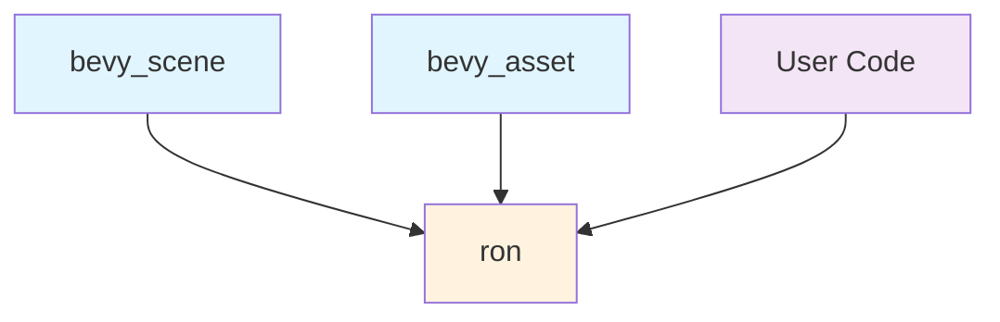

+++
title = "#21611 Remove `ron` re-export from `bevy_scene` and `bevy_asset`"
date = "2025-10-21T00:00:00"
draft = false
template = "pull_request_page.html"
in_search_index = true

[taxonomies]
list_display = ["show"]

[extra]
current_language = "en"
available_languages = {"en" = { name = "English", url = "/pull_request/bevy/2025-10/pr-21611-en-20251021" }, "zh-cn" = { name = "中文", url = "/pull_request/bevy/2025-10/pr-21611-zh-cn-20251021" }}
labels = ["C-Usability", "A-Scenes", "X-Contentious"]
+++

# Remove `ron` re-export from `bevy_scene` and `bevy_asset`

## Basic Information
- **Title**: Remove `ron` re-export from `bevy_scene` and `bevy_asset`
- **PR Link**: https://github.com/bevyengine/bevy/pull/21611
- **Author**: WaterWhisperer
- **Status**: MERGED
- **Labels**: C-Usability, S-Ready-For-Final-Review, A-Scenes, X-Contentious
- **Created**: 2025-10-20T06:16:35Z
- **Merged**: 2025-10-21T02:25:04Z
- **Merged By**: alice-i-cecile

## Description Translation
# Objective

As discussed in #19285, Bevy has reused the same conceptual names for multiple types across different crates, creating confusion for autocomplete tooling and users. This PR addresses one of those conflicts by removing the `ron` re-export from `bevy_scene` and `bevy_asset`

## Solution

- Removed `pub use bevy_asset::ron;` from `bevy_scene::lib` and `pub use ron;` from `bevy_asset::lib`
- Updated `crates/bevy_scene/Cargo.toml`
- Updated all internal references to use `ron` directly:
  - `crates/bevy_scene/src/dynamic_scene.rs`
  - `crates/bevy_scene/src/scene_loader.rs`
  - `crates/bevy_scene/src/serde.rs` (including doc examples and tests)

## Testing

- `cargo check --workspace` - all checks pass
- `cargo test -p bevy_scene` - tests pass (4 pre-existing test failures unrelated to this change)
-  `cargo test -p bevy_asset` - tests pass
- `cargo clippy` - no new warnings


## The Story of This Pull Request

This PR addresses a common problem in large codebases: naming conflicts that create confusion for both developers and tooling. The issue stemmed from Bevy re-exporting the `ron` crate (Rusty Object Notation) through multiple public modules, specifically `bevy_scene` and `bevy_asset`.

The core problem was that when developers used auto-completion in their IDEs or tried to import `ron` functionality, they would encounter multiple import paths that appeared identical but pointed to the same underlying dependency. This created unnecessary cognitive overhead and made the API surface more complex than it needed to be.

The solution approach was straightforward but required careful implementation: remove the re-exports entirely and require direct dependency on `ron` where needed. This aligns with Rust's philosophy of explicit dependencies and reduces the "magic" in the import system. The implementation involved several coordinated changes across multiple files to ensure consistency.

In the implementation, the developer first removed the public re-exports from both `bevy_scene` and `bevy_asset` library files. This was the primary change that would affect external users. The `bevy_scene` crate then needed to explicitly declare `ron` as a direct dependency in its `Cargo.toml` file, since it could no longer rely on the re-export from `bevy_asset`.

The most substantial part of the work involved updating all internal usage of the re-exported `ron` to use direct imports instead. This affected several key files in the scene system:

- `dynamic_scene.rs` removed the conditional import of `ron` through the crate
- `scene_loader.rs` removed its `use crate::ron` import
- `serde.rs` updated both its documentation examples and test code to use `ron` directly

One important technical insight from this change is how it improves the developer experience. By removing the indirection, developers working with scene serialization can now clearly see that they're using the `ron` crate directly, which makes dependency tracking more transparent and reduces confusion about where functionality originates.

The impact of this change is primarily on code clarity and maintainability. While it's a breaking change for users who were relying on the re-exports, the migration path is straightforward: users simply need to add `ron` as a direct dependency to their `Cargo.toml` and update their import statements. The PR author thoughtfully included a migration guide to help users navigate this transition.

From an architectural perspective, this change reduces coupling between crates and makes dependencies more explicit. The `bevy_scene` crate now clearly declares its dependency on `ron` rather than hiding it behind `bevy_asset`, which makes the dependency graph more accurate and easier to understand.

## Visual Representation



## Key Files Changed

### `crates/bevy_scene/src/lib.rs`
**Change**: Removed the re-export of `ron` from `bevy_asset`
```rust
// Before:
/// Rusty Object Notation, a crate used to serialize and deserialize bevy scenes.
pub use bevy_asset::ron;

// After:
// (re-export removed entirely)
```

### `crates/bevy_asset/src/lib.rs`
**Change**: Removed the direct re-export of `ron`
```rust
// Before:
/// Rusty Object Notation, a crate used to serialize and deserialize bevy assets.
pub use ron;

// After:
// (re-export removed entirely)
```

### `crates/bevy_scene/Cargo.toml`
**Change**: Added explicit dependency on `ron` crate
```toml
# Before:
# No direct ron dependency

# After:
ron = { version = "0.11", default-features = false, optional = true }
```

### `crates/bevy_scene/src/serde.rs`
**Change**: Updated imports and documentation to use `ron` directly
```rust
// Before (in doc example):
// let ron_string = bevy_scene::ron::ser::to_string(&scene_serializer);

// After:
// let ron_string = ron::ser::to_string(&scene_serializer);

// Before (in test imports):
// use crate::ron;

// After:
// use ron;
```

### `crates/bevy_scene/src/dynamic_scene.rs`
**Change**: Removed conditional import of `ron` through crate
```rust
// Before:
#[cfg(feature = "serialize")]
use {
    crate::{ron, serde::SceneSerializer},
    bevy_reflect::TypeRegistry,
    serde::Serialize,
};

// After:
#[cfg(feature = "serialize")]
use {crate::serde::SceneSerializer, bevy_reflect::TypeRegistry, serde::Serialize};
```

### `release-content/migration-guides/remove_ron_reexport.md`
**Change**: Added migration guide for users affected by this change
```markdown
The `ron` crate is no longer re-exported from `bevy_scene` or `bevy_asset`. This was done to reduce naming conflicts and improve API clarity.

If you were importing `ron` through `bevy_scene` or `bevy_asset`, you should now add `ron` as a direct dependency to your project.

This change only affects code that was explicitly importing the `ron` module. All internal scene serialization and deserialization functionality remains unchanged.
```

## Further Reading

- [Rust Documentation on Re-exports](https://doc.rust-lang.org/reference/items/use-declarations.html#use-visibility)
- [Bevy Engine GitHub Repository](https://github.com/bevyengine/bevy)
- [RON (Rusty Object Notation) Documentation](https://docs.rs/ron/latest/ron/)
- [Cargo Documentation on Dependencies](https://doc.rust-lang.org/cargo/reference/specifying-dependencies.html)