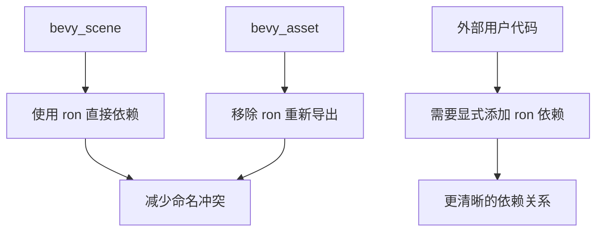

+++
title = "#21611 Remove `ron` re-export from `bevy_scene` and `bevy_asset"
date = "2025-10-21T00:00:00"
draft = false
template = "pull_request_page.html"
in_search_index = false

[extra]
current_language = "zh-cn"
available_languages = {"en" = { name = "English", url = "/pull_request/bevy/2025-10/pr-21611-en-20251021" }, "zh-cn" = { name = "中文", url = "/pull_request/bevy/2025-10/pr-21611-zh-cn-20251021" }}
+++

# Remove `ron` re-export from `bevy_scene` and `bevy_asset`

## 基本信息
- **标题**: Remove `ron` re-export from `bevy_scene` and `bevy_asset`
- **PR 链接**: https://github.com/bevyengine/bevy/pull/21611
- **作者**: WaterWhisperer
- **状态**: 已合并
- **标签**: C-Usability, S-Ready-For-Final-Review, A-Scenes, X-Contentious
- **创建时间**: 2025-10-20T06:16:35Z
- **合并时间**: 2025-10-21T02:25:04Z
- **合并者**: alice-i-cecile

## 描述翻译

# 目标

如 #19285 中讨论的，Bevy 在不同的 crate 中重用了相同的概念名称用于多种类型，这给自动完成工具和用户造成了混淆。本 PR 通过移除 `bevy_scene` 和 `bevy_asset` 中的 `ron` 重新导出来解决其中一个冲突。

## 解决方案

- 从 `bevy_scene::lib` 中移除 `pub use bevy_asset::ron;`，从 `bevy_asset::lib` 中移除 `pub use ron;`
- 更新 `crates/bevy_scene/Cargo.toml`
- 更新所有内部引用以直接使用 `ron`：
  - `crates/bevy_scene/src/dynamic_scene.rs`
  - `crates/bevy_scene/src/scene_loader.rs`
  - `crates/bevy_scene/src/serde.rs`（包括文档示例和测试）

## 测试

- `cargo check --workspace` - 所有检查通过
- `cargo test -p bevy_scene` - 测试通过（4个与此更改无关的现有测试失败）
- `cargo test -p bevy_asset` - 测试通过
- `cargo clippy` - 无新警告

## 这个 Pull Request 的故事

这个 PR 解决了一个在大型 Rust 项目中常见的命名空间污染问题。Bevy 引擎在多个 crate 中重新导出了 `ron` crate，这导致了开发工具中的自动完成冲突和用户混淆。

问题的根源在于 `bevy_scene` 和 `bevy_asset` 都通过重新导出的方式暴露了 `ron` crate。当开发者尝试导入 `ron` 时，IDE 的自动完成会显示多个来源的相同名称，不清楚应该选择哪一个。这在 #19285 中被识别为一个更广泛的命名冲突问题的一部分。

解决方案采用了直接的方法：完全移除这些重新导出。这个决定基于一个重要的观察 - 实际上很少有外部代码需要直接访问这些重新导出的 `ron` 模块。大多数场景序列化操作都是通过 Bevy 的高级 API 处理的，而不是直接操作 RON 格式。

在实现层面，这个更改涉及三个主要部分：

首先，从两个 crate 的 lib.rs 文件中移除了重新导出语句：

```rust
// 从 bevy_scene/src/lib.rs 移除
- pub use bevy_asset::ron;

// 从 bevy_asset/src/lib.rs 移除  
- pub use ron;
```

其次，更新了 Cargo.toml 配置，将 `ron` 从重新导出改为直接依赖：

```toml
# 在 bevy_scene/Cargo.toml 中添加
ron = { version = "0.11", default-features = false, optional = true }
```

第三，更新了所有内部使用点，从使用重新导出的路径改为直接使用 `ron`：

```rust
// 在 dynamic_scene.rs 中
- use {crate::{ron, serde::SceneSerializer}, bevy_reflect::TypeRegistry, serde::Serialize};
+ use {crate::serde::SceneSerializer, bevy_reflect::TypeRegistry, serde::Serialize};

// 在 serde.rs 的文档示例中
- let ron_string = bevy_scene::ron::ser::to_string(&scene_serializer);
+ let ron_string = ron::ser::to_string(&scene_serializer);
```

这个更改展示了 Rust 生态系统中的一个重要最佳实践：避免不必要的重新导出，特别是对于外部依赖。重新导出应该主要用于创建更符合人体工程学的 API，而不是简单地传递外部依赖。

从技术债务的角度看，这个 PR 清理了 API 表面，使依赖关系更加明确。开发者现在需要显式地在自己的 Cargo.toml 中添加 `ron` 依赖，如果他们需要直接使用 RON 序列化功能。这提供了更好的依赖管理和更清晰的边界。

这个更改是向后不兼容的，因此 PR 包含了迁移指南，指导受影响的用户如何更新他们的代码。这种处理方式展示了 Bevy 团队对破坏性更改的负责任态度。

## 可视化表示



## 关键文件更改

### `release-content/migration-guides/remove_ron_reexport.md` (+10/-0)
这个新文件提供了迁移指南，指导用户如何处理这个破坏性更改。

```markdown
---
title: Remove ron re-export from bevy_scene and bevy_asset
pull_requests: [21611]
---

The `ron` crate is no longer re-exported from `bevy_scene` or `bevy_asset`. This was done to reduce naming conflicts and improve API clarity.

If you were importing `ron` through `bevy_scene` or `bevy_asset`, you should now add `ron` as a direct dependency to your project.

This change only affects code that was explicitly importing the `ron` module. All internal scene serialization and deserialization functionality remains unchanged.
```

### `crates/bevy_scene/src/lib.rs` (+0/-3)
移除了 `ron` 的重新导出，简化了公共 API。

```rust
// 移除的行：
- /// Rusty Object Notation, a crate used to serialize and deserialize bevy scenes.
- pub use bevy_asset::ron;
```

### `crates/bevy_asset/src/lib.rs` (+0/-2)
移除了 `ron` 的重新导出。

```rust
// 移除的行：
- /// Rusty Object Notation, a crate used to serialize and deserialize bevy assets.
- pub use ron;
```

### `crates/bevy_scene/src/dynamic_scene.rs` (+1/-5)
更新了导入语句，从使用重新导出的 `ron` 改为直接使用。

```rust
// 之前：
- use {
-     crate::{ron, serde::SceneSerializer},
-     bevy_reflect::TypeRegistry,
-     serde::Serialize,
- };

// 之后：
+ use {crate::serde::SceneSerializer, bevy_reflect::TypeRegistry, serde::Serialize};
```

### `crates/bevy_scene/src/serde.rs` (+2/-2)
更新了文档示例和测试代码，直接使用 `ron` crate。

```rust
// 在文档示例中：
- let ron_string = bevy_scene::ron::ser::to_string(&scene_serializer);
+ let ron_string = ron::ser::to_string(&scene_serializer);

// 在测试中：
- use crate::ron;
+ use ron;
```

## 进一步阅读

- [Rust 重新导出指南](https://doc.rust-lang.org/reference/items/use-declarations.html#use-visibility)
- [Bevy 场景系统文档](https://bevyengine.org/learn/books/0.12/programming/scenes)
- [RON (Rusty Object Notation) crate](https://crates.io/crates/ron)
- [相关 issue #19285: 命名冲突问题](https://github.com/bevyengine/bevy/issues/19285)