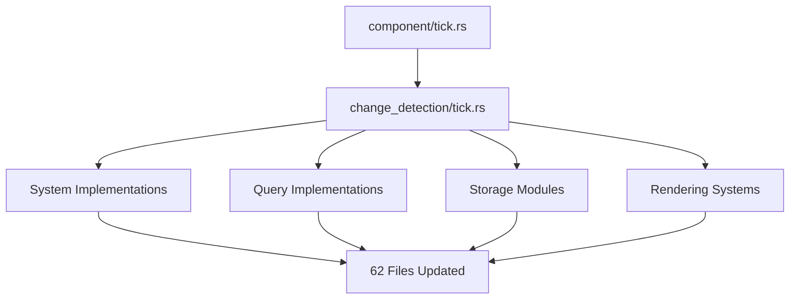

+++
title = "#21613 Move `tick.rs` into `change_detection` module"
date = "2025-10-20T00:00:00"
draft = false
template = "pull_request_page.html"
in_search_index = true

[taxonomies]
list_display = ["show"]

[extra]
current_language = "en"
available_languages = {"en" = { name = "English", url = "/pull_request/bevy/2025-10/pr-21613-en-20251020" }, "zh-cn" = { name = "中文", url = "/pull_request/bevy/2025-10/pr-21613-zh-cn-20251020" }}
labels = ["D-Trivial", "A-ECS", "C-Code-Quality", "M-Migration-Guide"]
+++

# Move `tick.rs` into `change_detection` module

## Basic Information
- **Title**: Move `tick.rs` into `change_detection` module
- **PR Link**: https://github.com/bevyengine/bevy/pull/21613
- **Author**: JaySpruce
- **Status**: MERGED
- **Labels**: D-Trivial, A-ECS, C-Code-Quality, S-Ready-For-Final-Review, M-Migration-Guide
- **Created**: 2025-10-20T16:49:29Z
- **Merged**: 2025-10-20T22:31:04Z
- **Merged By**: alice-i-cecile

## Description Translation
Follow-up to #21604.

`Tick` and friends should be in the `change_detection` module, not `component`.

## The Story of This Pull Request

This PR addresses a straightforward but important code organization issue in Bevy's ECS (Entity Component System). The core problem was that tick-related types - specifically `Tick`, `ComponentTicks`, `ComponentTickCells`, and `CheckChangeTicks` - were incorrectly placed in the `component` module when they logically belong in the `change_detection` module.

The issue stemmed from the fact that these types are fundamentally about tracking changes over time rather than being core component types themselves. Ticks are used throughout Bevy's change detection system to determine when components have been modified, added, or removed. By placing them in the `component` module, the codebase had a conceptual inconsistency that made the architecture harder to understand.

The solution approach was direct and mechanical: move the `tick.rs` file from `src/component/tick.rs` to `src/change_detection/tick.rs` and update all import statements throughout the codebase. This required modifying 62 files across the Bevy codebase, demonstrating how widely these tick types are used.

The implementation involved two main changes. First, the physical file movement:

```rust
// File: crates/bevy_ecs/src/change_detection/mod.rs
// Before:
mod maybe_location;
mod params;
mod traits;

// After:
mod maybe_location;
mod params;
mod tick;
mod traits;

pub use tick::*;
```

Second, updating import statements across the entire codebase. For example:

```rust
// Before:
use bevy_ecs::component::{ComponentTicks, Tick};

// After:
use bevy_ecs::change_detection::{ComponentTicks, Tick};
```

This change required updating imports in various system types, query implementations, storage modules, and rendering systems. The consistency of the change across the codebase shows that the tick types are primarily used in change detection contexts rather than general component operations.

From a technical perspective, this refactor improves code organization by grouping related functionality together. Change detection logic now has all its relevant types in one module, making the system easier to understand and maintain. The tick types are used to track when changes occur by comparing current tick values against stored ones, which is fundamentally a change detection concern rather than a component concern.

The impact of this change is primarily on code organization and developer experience. It doesn't change any functionality or performance characteristics, but it makes the codebase more intuitive. Developers working with change detection can now find all related types in one place, and the conceptual model of the ECS becomes clearer.

The PR also includes updates to the migration guide, ensuring that developers are aware of the import changes when upgrading their code:

```markdown
The following types have been moved from the `component` module to the `change_detection` module:
- `Tick`
- `ComponentTicks`
- `ComponentTickCells`
- `CheckChangeTicks`
```

This change demonstrates an important principle in software architecture: grouping related functionality together improves maintainability and reduces cognitive load. While the change itself is simple, it reflects ongoing efforts to refine Bevy's ECS architecture for clarity and consistency.

## Visual Representation



## Key Files Changed

### `crates/bevy_ecs/src/change_detection/mod.rs` (+5/-3)
This file now includes and re-exports the tick module, making tick types available as part of the change_detection module's public API.

```rust
// Key changes:
mod maybe_location;
mod params;
mod tick;        // Added
mod traits;

pub use tick::*; // Added to re-export tick types
```

### `crates/bevy_ecs/src/component/mod.rs` (+0/-4)
The component module no longer includes or exports tick-related types, as they've been moved to their logical home.

```rust
// Before:
mod tick;
pub use tick::*;

// After:
// tick module and exports removed
```

### `crates/bevy_ecs/src/world/mod.rs` (+6/-4)
Updated imports to reflect the new module location for tick types.

```rust
// Example import change:
// Before:
use crate::component::{CheckChangeTicks, ComponentTicks, Tick};

// After:
use crate::change_detection::{CheckChangeTicks, ComponentTicks, Tick};
```

### `release-content/migration-guides/change_detection_refactors.md` (+11/-3)
Updated migration guide to document the module changes for developers.

```markdown
The following types have been moved from the `component` module to the `change_detection` module:
- `Tick`
- `ComponentTicks`
- `ComponentTickCells`
- `CheckChangeTicks`
```

### `crates/bevy_ecs/src/storage/table/mod.rs` (+4/-4)
Updated storage table implementation to use the correct imports for tick types used in change tracking.

```rust
// Before:
use crate::component::{CheckChangeTicks, ComponentTicks, Tick};

// After:
use crate::change_detection::{CheckChangeTicks, ComponentTicks, Tick};
```

## Further Reading

- [Bevy ECS Change Detection Documentation](https://bevyengine.org/learn/advanced-topics/change-detection/)
- [Entity Component System Pattern](https://en.wikipedia.org/wiki/Entity_component_system)
- [Rust Module System](https://doc.rust-lang.org/book/ch07-02-defining-modules-to-control-scope-and-privacy.html)