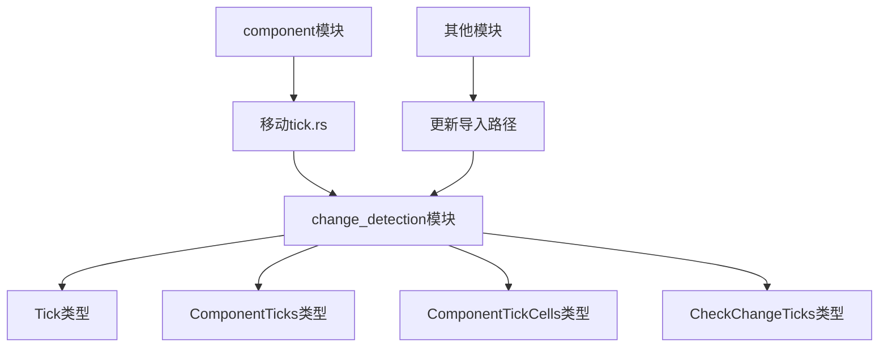

+++
title = "#21613 Move `tick.rs` into `change_detection` module"
date = "2025-10-20T00:00:00"
draft = false
template = "pull_request_page.html"
in_search_index = false

[extra]
current_language = "zh-cn"
available_languages = {"en" = { name = "English", url = "/pull_request/bevy/2025-10/pr-21613-en-20251020" }, "zh-cn" = { name = "中文", url = "/pull_request/bevy/2025-10/pr-21613-zh-cn-20251020" }}
labels = ["D-Trivial", "A-ECS", "C-Code-Quality", "M-Migration-Guide"]
+++

# Move `tick.rs` into `change_detection` module

## Basic Information
- **Title**: Move `tick.rs` into `change_detection` module
- **PR Link**: https://github.com/bevyengine/bevy/pull/21613
- **Author**: JaySpruce
- **Status**: MERGED
- **Labels**: D-Trivial, A-ECS, C-Code-Quality, S-Ready-For-Final-Review, M-Migration-Guide
- **Created**: 2025-10-20T16:49:29Z
- **Merged**: 2025-10-20T22:31:04Z
- **Merged By**: alice-i-cecile

## Description Translation
这是 #21604 的后续工作。

`Tick` 及其相关类型应该位于 `change_detection` 模块中，而不是 `component` 模块。

## The Story of This Pull Request

这个PR主要解决了一个代码组织问题：将与变更检测（change detection）紧密相关的类型从`component`模块移动到更合适的`change_detection`模块中。

### 问题背景

在Bevy的ECS架构中，变更检测是一个核心机制，用于跟踪组件和资源的变化。然而，与变更检测直接相关的关键类型（如`Tick`、`ComponentTicks`、`ComponentTickCells`和`CheckChangeTicks`）之前被放置在`component`模块中。这种组织方式在概念上不够清晰，因为这些类型的主要职责是支持变更检测逻辑，而不是定义组件本身。

### 解决方案

开发者采用了直接的重构方法：将`tick.rs`文件从`crates/bevy_ecs/src/component`目录移动到`crates/bevy_ecs/src/change_detection`目录，并更新所有相关的导入语句。这是一个纯粹的结构性变更，不涉及任何功能逻辑的修改。

### 实现细节

这次重构影响了代码库中的62个文件，主要涉及导入路径的更新。关键的技术实现包括：

1. **文件移动**：将`tick.rs`从`component`模块移动到`change_detection`模块
2. **模块导出更新**：在`change_detection/mod.rs`中添加对tick模块的导出
3. **导入路径更新**：将所有相关的导入从`bevy_ecs::component::Tick`改为`bevy_ecs::change_detection::Tick`

例如，在`crates/bevy_ecs/src/change_detection/mod.rs`中的关键变更：

```rust
// 添加tick模块的导出
pub use tick::*;

// 在测试代码中更新导入
use crate::change_detection::{
    ComponentTicks, ComponentTicksMut, MaybeLocation, Mut, NonSendMut, Ref, ResMut, Tick,
    CHECK_TICK_THRESHOLD, MAX_CHANGE_AGE,
};
```

### 技术洞察

这种模块重组体现了良好的软件工程实践：

- **关注点分离**：将变更检测相关的逻辑集中在一个模块中，使代码结构更加清晰
- **概念一致性**：`Tick`类型主要用于跟踪变更时间点，与变更检测的概念更匹配
- **维护性提升**：相关的功能被组织在一起，便于未来的维护和扩展

### 影响分析

这个变更是一个破坏性变更（breaking change），因为它修改了公共API的导入路径。因此，PR包含了相应的迁移指南更新，指导用户如何更新他们的代码。

## Visual Representation



## Key Files Changed

### `release-content/migration-guides/change_detection_refactors.md` (+11/-3)
- 更新迁移指南，记录类型移动的变更
- 明确列出从`component`模块移动到`change_detection`模块的所有类型

```markdown
- `Tick`
- `ComponentTicks`
- `ComponentTickCells`
- `CheckChangeTicks`
```

### `crates/bevy_ecs/src/change_detection/mod.rs` (+5/-3)
- 导出tick模块中的类型
- 更新测试代码中的导入路径

```rust
// 添加tick模块导出
pub use tick::*;

// 更新测试导入
use crate::change_detection::{
    ComponentTicks, ComponentTicksMut, MaybeLocation, Mut, NonSendMut, Ref, ResMut, Tick,
    CHECK_TICK_THRESHOLD, MAX_CHANGE_AGE,
};
```

### `crates/bevy_ecs/src/component/mod.rs` (+0/-1)
- 移除对tick模块的导出

```rust
// 移除这行
pub use tick::*;
```

### `crates/bevy_ecs/src/storage/table/mod.rs` (+4/-4)
- 更新导入路径以使用新的模块位置

```rust
// 之前
use crate::component::{CheckChangeTicks, ComponentId, ComponentInfo, ComponentTicks, Components, Tick};

// 之后
use crate::change_detection::{CheckChangeTicks, ComponentTicks, MaybeLocation, Tick};
use crate::component::{ComponentId, ComponentInfo, Components};
```

### `crates/bevy_ecs/src/storage/resource.rs` (+4/-3)
- 重新组织导入，将变更检测相关的类型集中导入

```rust
// 之前
use crate::change_detection::{ComponentTicksMut, MaybeLocation, MutUntyped};
use crate::component::{
    CheckChangeTicks, ComponentId, ComponentTickCells, ComponentTicks, Components, Tick,
};

// 之后
use crate::change_detection::{
    CheckChangeTicks, ComponentTickCells, ComponentTicks, ComponentTicksMut, MaybeLocation,
    MutUntyped, Tick,
};
use crate::component::{ComponentId, Components};
```

## Further Reading

- [Bevy ECS Change Detection Documentation](https://bevyengine.org/learn/advanced-topics/change-detection/)
- [PR #21604](https://github.com/bevyengine/bevy/pull/21604) - 这个PR的前驱工作
- [Bevy Module Organization Best Practices](https://github.com/bevyengine/bevy/blob/main/CODE_STYLE.md)