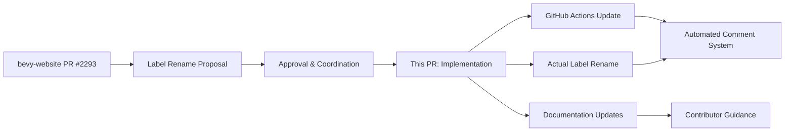

+++
title = "#21614 Rename M-Needs- labels"
date = "2025-10-20T00:00:00"
draft = false
template = "pull_request_page.html"
in_search_index = true

[taxonomies]
list_display = ["show"]

[extra]
current_language = "en"
available_languages = {"en" = { name = "English", url = "/pull_request/bevy/2025-10/pr-21614-en-20251020" }, "zh-cn" = { name = "中文", url = "/pull_request/bevy/2025-10/pr-21614-zh-cn-20251020" }}
labels = ["D-Trivial", "A-Meta"]
+++

# Title
Rename M-Needs- labels

## Basic Information
- **Title**: Rename M-Needs- labels
- **PR Link**: https://github.com/bevyengine/bevy/pull/21614
- **Author**: alice-i-cecile
- **Status**: MERGED
- **Labels**: D-Trivial, A-Meta, S-Ready-For-Final-Review, X-Uncontroversial
- **Created**: 2025-10-20T17:15:38Z
- **Merged**: 2025-10-20T18:05:04Z
- **Merged By**: alice-i-cecile

## Description Translation
https://github.com/bevyengine/bevy-website/pull/2293 proposed a rename of our `M-Needs-Release-Note` and `M-Needs-Migration-Guide` labels for improved clarity.

This has been approved, so I'm merging that PR.

This repo lists these labels in a few places for automation / contributor help, and they need to be updated.

## Solution

Grep for these like @bd103 told me to in https://github.com/bevyengine/bevy-website/pull/2293#issuecomment-3422121003

## Follow-up work

Once this PR is merged I'll actually rename the label.

## The Story of This Pull Request

This PR addresses a straightforward but important metadata cleanup task in the Bevy project's issue and pull request labeling system. The core issue was that the existing labels `M-Needs-Release-Note` and `M-Needs-Migration-Guide` contained redundant wording - the "Needs-" prefix was unnecessary since the labels themselves inherently indicate requirements.

The change originated from a separate PR in the bevy-website repository (#2293) where the label renaming was proposed and approved. This PR serves as the implementation phase, updating all references to these labels within the main Bevy repository to maintain consistency across the project's automation and documentation systems.

The technical approach was pragmatic and efficient: the author used grep to locate all instances of the old label names across the codebase. This method ensured comprehensive coverage without manual searching, reducing the risk of missing references that could break automation workflows.

The implementation involved updating three key areas. First, the GitHub Actions workflow file that triggers automated comments when labels are applied needed condition updates to match the new label names. Second, documentation files that guide contributors through the release process required updates to reflect the current label naming conventions. These documentation updates are particularly important because they serve as the primary reference for contributors who receive these labels on their PRs.

The changes are minimal but critical for maintaining the project's automation integrity. When a PR receives a `M-Migration-Guide` or `M-Release-Note` label, GitHub Actions workflows automatically post helpful comments to guide contributors through the required documentation processes. If the label names in the workflow conditions don't match the actual labels being applied, this automation would silently fail.

One notable aspect of this change is the table formatting adjustment in `migration_guides.md`. While not directly related to the label rename, this incidental cleanup improves the markdown table's readability and consistency with the project's formatting standards.

The PR demonstrates good open source maintenance practices: coordinated changes across related repositories, comprehensive search for all references, and clear separation between proposal (in bevy-website) and implementation (in bevy). The rapid merge timeline (under one hour) reflects the straightforward nature of the changes and the clear consensus established in the prior discussion.

## Visual Representation



## Key Files Changed

### 1. `.github/workflows/action-on-PR-labeled.yml`
This GitHub Actions workflow automatically posts comments when specific labels are applied to PRs.

**Key changes:**
```yaml
# Before:
if: github.event.label.name == 'M-Needs-Migration-Guide'

# After:  
if: github.event.label.name == 'M-Migration-Guide'
```

```yaml
# Before:
if: github.event.label.name == 'M-Needs-Release-Note'

# After:
if: github.event.label.name == 'M-Release-Note'
```

### 2. `release-content/migration_guides.md`
Documentation that guides contributors through writing migration guides when their PR contains breaking changes.

**Key changes:**
```markdown
# Before:
Hi! Did someone add `M-Needs-Migration-Guide` to your PR? If so, you're in the right place.

# After:
Hi! Did someone add `M-Migration-Guide` to your PR? If so, you're in the right place.
```

Additionally, a markdown table was reformatted for better readability:
```markdown
# Before:
|Item|0.15 Path|0.16 Path|
|-|-|-|
|`Foo`|`bar::foo`|`baz`|

# After:
| Item  | 0.15 Path  | 0.16 Path |
| ----- | ---------- | --------- |
| `Foo` | `bar::foo` | `baz`     |
```

### 3. `release-content/release_notes.md`
Documentation that guides contributors through writing release notes for significant changes.

**Key changes:**
```markdown
# Before:
Hi! Did someone add `M-Needs-Release-Note` to your PR? If so, you're in the right place.

# After:
Hi! Did someone add `M-Release-Note` to your PR? If so, you're in the right place.
```

## Further Reading

- [GitHub Actions Workflow Syntax](https://docs.github.com/en/actions/using-workflows/workflow-syntax-for-github-actions)
- [Bevy's Contributing Guidelines](https://github.com/bevyengine/bevy/blob/main/CONTRIBUTING.md)
- [GitHub Labels Documentation](https://docs.github.com/en/issues/using-labels-and-milestones-to-track-work/managing-labels)