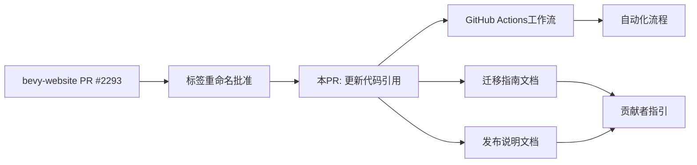

+++
title = "#21614 Rename M-Needs- labels"
date = "2025-10-20T00:00:00"
draft = false
template = "pull_request_page.html"
in_search_index = false

[extra]
current_language = "zh-cn"
available_languages = {"en" = { name = "English", url = "/pull_request/bevy/2025-10/pr-21614-en-20251020" }, "zh-cn" = { name = "中文", url = "/pull_request/bevy/2025-10/pr-21614-zh-cn-20251020" }}
+++

# 标签重命名：提升项目管理清晰度的技术调整

## 基本信息
- **标题**: Rename M-Needs- labels
- **PR 链接**: https://github.com/bevyengine/bevy/pull/21614
- **作者**: alice-i-cecile
- **状态**: 已合并
- **标签**: D-Trivial, A-Meta, S-Ready-For-Final-Review, X-Uncontroversial
- **创建时间**: 2025-10-20T17:15:38Z
- **合并时间**: 2025-10-20T18:05:04Z
- **合并者**: alice-i-cecile

## 描述翻译
### 目标

https://github.com/bevyengine/bevy-website/pull/2293 提议重命名我们的 `M-Needs-Release-Note` 和 `M-Needs-Migration-Guide` 标签以提高清晰度。

该提议已获批准，因此我正在合并该 PR。

此仓库在几个地方列出了这些标签用于自动化/贡献者帮助，需要更新它们。

### 解决方案

按照 @bd103 在 https://github.com/bevyengine/bevy-website/pull/2293#issuecomment-3422121003 中告诉我的那样，使用 grep 查找这些标签。

### 后续工作

此 PR 合并后，我将实际重命名标签。

## 本次 Pull Request 的技术历程

这个 PR 的核心是一个简单的维护性任务：更新代码库中对两个特定标签的引用，使其与之前在 bevy-website 仓库中批准的标签重命名保持一致。

问题的根源在于项目管理标签的命名约定需要优化。原来的标签名称 `M-Needs-Release-Note` 和 `M-Needs-Migration-Guide` 包含了冗余的 "Needs" 前缀，这在语义上不够简洁。通过简化为 `M-Release-Note` 和 `M-Migration-Guide`，标签名称变得更加直接和易于理解，同时保持了原有的分类结构。

从技术实现角度看，这个修改采用了最简单直接的方法：使用 grep 搜索所有相关的引用点。这种方法在涉及多个文件的小范围修改时非常有效，能够确保不会遗漏任何需要更新的地方。开发者遵循了同事的建议，体现了团队协作的良好实践。

修改主要涉及三个关键区域：
1. GitHub Actions 工作流文件 - 确保自动化流程能正确识别新标签
2. 迁移指南文档 - 更新贡献者文档中的标签引用
3. 发布说明文档 - 同样更新相关文档引用

在 GitHub Actions 工作流中，修改的是条件判断逻辑。原来的工作流会在 PR 被标记为特定标签时触发相应的评论操作，现在需要更新这些条件以匹配新的标签名称。这是一个关键的自动化流程更新，如果遗漏将导致工作流失效。

文档部分的修改虽然简单，但对于贡献者体验很重要。当新贡献者看到这些标签被添加到他们的 PR 时，他们会查阅这些文档，因此保持文档与实际标签名称的一致性至关重要。

从工程角度看，这个 PR 展示了良好的维护实践：当某个约定发生变化时，及时更新所有相关的引用点。这种一致性维护虽然看起来简单，但对于大型项目的长期健康至关重要。

## 可视化关系



## 关键文件变更

### `.github/workflows/action-on-PR-labeled.yml` (+2/-2)
这个文件包含了 GitHub Actions 工作流配置，用于在 PR 被标记特定标签时自动执行操作。

```yaml
# 修改前:
if: github.event.label.name == 'M-Needs-Migration-Guide'

# 修改后:
if: github.event.label.name == 'M-Migration-Guide'
```

```yaml
# 修改前:
if: github.event.label.name == 'M-Needs-Release-Note'

# 修改后:
if: github.event.label.name == 'M-Release-Note'
```

这些更改确保自动化工作流能够正确识别新的标签名称。

### `release-content/migration_guides.md` (+4/-4)
这是迁移指南的说明文档，指导贡献者如何编写迁移指南。

```markdown
# 修改前:
Hi! Did someone add `M-Needs-Migration-Guide` to your PR? If so, you're in the right place.

# 修改后:
Hi! Did someone add `M-Migration-Guide` to your PR? If so, you're in the right place.
```

同时还包括了表格格式的微调，使 Markdown 表格更加规范。

### `release-content/release_notes.md` (+1/-1)
发布说明流程文档，同样更新了标签引用。

```markdown
# 修改前:
Hi! Did someone add `M-Needs-Release-Note` to your PR? If so, you're in the right place.

# 修改后:
Hi! Did someone add `M-Release-Note` to your PR? If so, you're in the right place.
```

## 完整代码差异

```diff
diff --git a/.github/workflows/action-on-PR-labeled.yml b/.github/workflows/action-on-PR-labeled.yml
index 1d477101c65a7..be569aa5b4d53 100644
--- a/.github/workflows/action-on-PR-labeled.yml
+++ b/.github/workflows/action-on-PR-labeled.yml
@@ -14,7 +14,7 @@ permissions:
 jobs:
   comment-on-migration-guide-label:
     runs-on: ubuntu-latest
-    if: github.event.label.name == 'M-Needs-Migration-Guide'
+    if: github.event.label.name == 'M-Migration-Guide'
     steps:
       - uses: actions/checkout@v5
         with:
@@ -44,7 +44,7 @@ jobs:
             })
   comment-on-release-note-label:
     runs-on: ubuntu-latest
-    if: github.event.label.name == 'M-Needs-Release-Note'
+    if: github.event.label.name == 'M-Release-Note'
     steps:
       - uses: actions/checkout@v5
         with:
diff --git a/release-content/migration_guides.md b/release-content/migration_guides.md
index df95ce2070daa..40d607a132bd7 100644
--- a/release-content/migration_guides.md
+++ b/release-content/migration_guides.md
@@ -1,6 +1,6 @@
 # Bevy's Migration Guide Process
 
-Hi! Did someone add `M-Needs-Migration-Guide` to your PR? If so, you're in the right place.
+Hi! Did someone add `M-Migration-Guide` to your PR? If so, you're in the right place.
 Let's talk about how this process works.
 
 When we make breaking changes to Bevy, we need to communicate them to users so their libraries and applications can be moved to the new Bevy version.
@@ -97,6 +97,6 @@ Keep it short and sweet:
   
   **Relocations**
   
-  |Item|0.15 Path|0.16 Path|
-  |-|-|-|
-  |`Foo`|`bar::foo`|`baz`|
+  | Item  | 0.15 Path  | 0.16 Path |
+  | ----- | ---------- | --------- |
+  | `Foo` | `bar::foo` | `baz`     |
diff --git a/release-content/release_notes.md b/release-content/release_notes.md
index 009155d55419b..9a7bdfbd461b6 100644
--- a/release-content/release_notes.md
+++ b/release-content/release_notes.md
@@ -1,6 +1,6 @@
 # Bevy's Release Notes Process
 
-Hi! Did someone add `M-Needs-Release-Note` to your PR? If so, you're in the right place.
+Hi! Did someone add `M-Release-Note` to your PR? If so, you're in the right place.
 Let's talk about how this process works.
 
 When we make high-impact changes to Bevy, we need to communicate them to users (and potential users!).
```

## 延伸阅读

- [GitHub Actions 官方文档](https://docs.github.com/en/actions) - 了解工作流配置
- [Bevy 项目管理指南](https://github.com/bevyengine/bevy/blob/main/docs/contributing.md) - 了解 Bevy 的贡献流程
- [语义化版本控制](https://semver.org/) - 理解版本管理和迁移指南的重要性