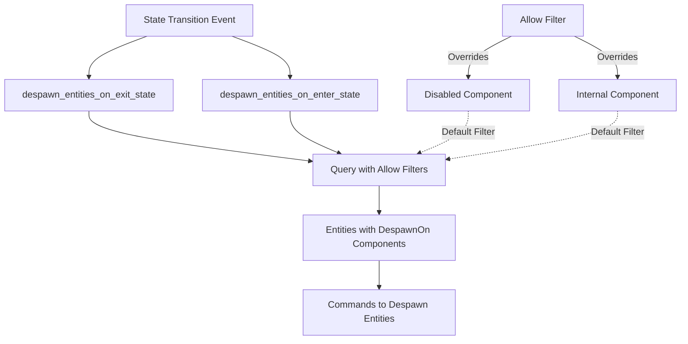

+++
title = "#21616 Fix `DespawnOn` not upholding invariants on entities with default filters"
date = "2025-10-20T00:00:00"
draft = false
template = "pull_request_page.html"
in_search_index = true

[taxonomies]
list_display = ["show"]

[extra]
current_language = "en"
available_languages = {"en" = { name = "English", url = "/pull_request/bevy/2025-10/pr-21616-en-20251020" }, "zh-cn" = { name = "中文", url = "/pull_request/bevy/2025-10/pr-21616-zh-cn-20251020" }}
labels = ["C-Bug", "A-ECS", "X-Contentious", "D-Straightforward", "A-States"]
+++

# Title

## Basic Information
- **Title**: Fix `DespawnOn` not upholding invariants on entities with default filters
- **PR Link**: https://github.com/bevyengine/bevy/pull/21616
- **Author**: janhohenheim
- **Status**: MERGED
- **Labels**: C-Bug, A-ECS, S-Ready-For-Final-Review, X-Contentious, D-Straightforward, A-States
- **Created**: 2025-10-20T18:11:36Z
- **Merged**: 2025-10-20T22:31:04Z
- **Merged By**: alice-i-cecile

## Description Translation
**Objective**

- Fixes #21579
- Fixes https://github.com/bevyengine/bevy/issues/20167

**Solution**

- Allow at least the engine-internal default filters until we have #21615

**Testing**

- None. I think this is trivial enough.

## The Story of This Pull Request

This PR addresses a subtle but important issue in Bevy's entity state management system. The problem centered around the `DespawnOnExit` and `DespawnOnEnter` systems, which handle automatic entity cleanup during state transitions in the ECS (Entity Component System).

The core issue was that these systems were using queries that didn't account for Bevy's default filtering behavior. In Bevy's ECS, certain components like `Disabled` and `Internal` are filtered out by default in queries. However, the `DespawnOn` systems needed to process all entities with their respective components, regardless of these default filters.

The problem manifested when entities with `Disabled` or `Internal` components also had `DespawnOnExit` or `DespawnOnEnter` components. These entities weren't being properly despawned during state transitions because the default filters were excluding them from the query results.

The solution approach was straightforward but required understanding Bevy's query filtering system. The developer modified the query parameters to explicitly allow entities with `Disabled` and `Internal` components by using the `Allow` filter. This tells Bevy's query system to include entities that would normally be filtered out by default.

The implementation involved updating two query signatures in the `state_scoped.rs` file. Both the `despawn_entities_on_exit_state` and `despawn_entities_on_enter_state` functions now include explicit `Allow<Disabled>` and `Allow<Internal>` filters in their query parameters.

This fix is considered a temporary solution, as indicated by the TODO comment referencing issue #21615. The ideal long-term solution would be to use an `AllowAll` filter once it becomes available, which would provide a cleaner and more maintainable approach.

The impact of this change is that entities with `DespawnOn` components will now be properly despawned regardless of whether they also have `Disabled` or `Internal` components. This maintains the expected behavior and prevents potential memory leaks or incorrect entity state management.

## Visual Representation



## Key Files Changed

**File: `crates/bevy_state/src/state_scoped.rs`** (+6/-2)

This file contains the core logic for state-scoped entity management. The changes modify the query systems that handle entity despawning during state transitions.

**Key Changes:**

1. **Updated Query Signatures**: Both `despawn_entities_on_exit_state` and `despawn_entities_on_enter_state` functions now include explicit `Allow` filters.

```rust
// Before:
query: Query<(Entity, &DespawnOnExit<S>)>,

// After:
// TODO: Use `AllowAll` once it exists: https://github.com/bevyengine/bevy/issues/21615
query: Query<(Entity, &DespawnOnExit<S>), (Allow<Disabled>, Allow<Internal>)>,
```

```rust
// Before:
query: Query<(Entity, &DespawnOnEnter<S>)>,

// After:
// TODO: Use `AllowAll` once it exists: https://github.com/bevyengine/bevy/issues/21615
query: Query<(Entity, &DespawnOnEnter<S>), (Allow<Disabled>, Allow<Internal>)>,
```

2. **Added Import Statements**: The changes required importing additional types from Bevy's ECS module:

```rust
use bevy_ecs::{
    component::Component,
    entity::Entity,
    entity_disabling::{Disabled, Internal},
    message::MessageReader,
    query::Allow,
    system::{Commands, Query},
};
```

These changes ensure that entities with `DespawnOn` components are properly processed during state transitions, even when they also have components that are normally filtered out by default query behavior.

## Further Reading

- [Bevy ECS Queries Documentation](https://bevyengine.org/learn/quick-start/ecs/queries/)
- [Bevy States and State Transitions](https://bevyengine.org/learn/quick-start/states/)
- [Bevy Entity Component System Overview](https://bevyengine.org/learn/quick-start/ecs/)
- [GitHub Issue #21615 - AllowAll filter implementation](https://github.com/bevyengine/bevy/issues/21615)

# Full Code Diff
```diff
diff --git a/crates/bevy_state/src/state_scoped.rs b/crates/bevy_state/src/state_scoped.rs
index a7d47b050861b..1dc59461bffaa 100644
--- a/crates/bevy_state/src/state_scoped.rs
+++ b/crates/bevy_state/src/state_scoped.rs
@@ -3,7 +3,9 @@ use bevy_ecs::reflect::ReflectComponent;
 use bevy_ecs::{
     component::Component,
     entity::Entity,
+    entity_disabling::{Disabled, Internal},
     message::MessageReader,
+    query::Allow,
     system::{Commands, Query},
 };
 #[cfg(feature = "bevy_reflect")]
@@ -72,7 +74,8 @@ pub type StateScoped<S> = DespawnOnExit<S>;
 pub fn despawn_entities_on_exit_state<S: States>(
     mut commands: Commands,
     mut transitions: MessageReader<StateTransitionEvent<S>>,
-    query: Query<(Entity, &DespawnOnExit<S>)>,
+    // TODO: Use `AllowAll` once it exists: https://github.com/bevyengine/bevy/issues/21615
+    query: Query<(Entity, &DespawnOnExit<S>), (Allow<Disabled>, Allow<Internal>)>,
 ) {
     // We use the latest event, because state machine internals generate at most 1
     // transition event (per type) each frame. No event means no change happened
@@ -138,7 +141,8 @@ pub struct DespawnOnEnter<S: States>(pub S);
 pub fn despawn_entities_on_enter_state<S: States>(
     mut commands: Commands,
     mut transitions: MessageReader<StateTransitionEvent<S>>,
-    query: Query<(Entity, &DespawnOnEnter<S>)>,
+    // TODO: Use `AllowAll` once it exists: https://github.com/bevyengine/bevy/issues/21615
+    query: Query<(Entity, &DespawnOnEnter<S>), (Allow<Disabled>, Allow<Internal>)>,
 ) {
     // We use the latest event, because state machine internals generate at most 1
     // transition event (per type) each frame. No event means no change happened
```