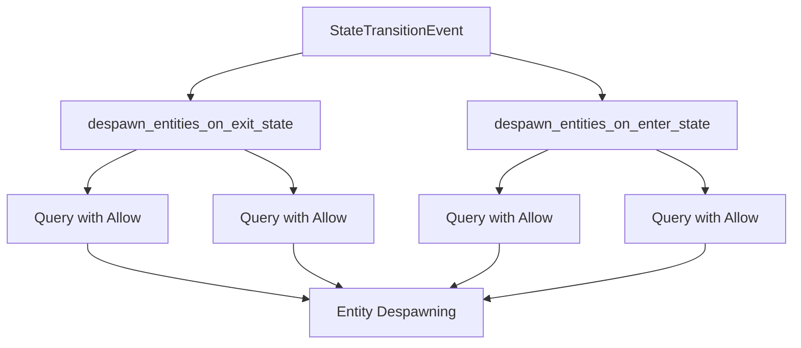

+++
title = "#21616 Fix `DespawnOn` not upholding invariants on entities with default filters"
date = "2025-10-20T00:00:00"
draft = false
template = "pull_request_page.html"
in_search_index = false

[extra]
current_language = "zh-cn"
available_languages = {"en" = { name = "English", url = "/pull_request/bevy/2025-10/pr-21616-en-20251020" }, "zh-cn" = { name = "中文", url = "/pull_request/bevy/2025-10/pr-21616-zh-cn-20251020" }}
labels = ["C-Bug", "A-ECS", "X-Contentious", "D-Straightforward", "A-States"]
+++

# Title
Fix `DespawnOn` not upholding invariants on entities with default filters

## Basic Information
- **Title**: Fix `DespawnOn` not upholding invariants on entities with default filters
- **PR Link**: https://github.com/bevyengine/bevy/pull/21616
- **Author**: janhohenheim
- **Status**: MERGED
- **Labels**: C-Bug, A-ECS, S-Ready-For-Final-Review, X-Contentious, D-Straightforward, A-States
- **Created**: 2025-10-20T18:11:36Z
- **Merged**: 2025-10-20T22:31:04Z
- **Merged By**: alice-i-cecile

## Description Translation
### 目标
- 修复 #21579
- 修复 https://github.com/bevyengine/bevy/issues/20167

### 解决方案
- 在 #21615 实现之前，至少允许引擎内部的默认过滤器

### 测试
- 无。我认为这个修改足够简单明了。

## The Story of This Pull Request

这个PR解决了一个在Bevy ECS系统中关于实体状态管理的边界情况问题。问题的核心在于`DespawnOnExit`和`DespawnOnEnter`组件在处理带有默认过滤器的实体时，没有正确维护系统的不变量。

**问题根源**在于这两个系统使用的查询没有考虑Bevy的默认查询过滤器。在Bevy ECS中，查询默认会排除带有`Disabled`或`Internal`组件的实体，但`DespawnOn`系统的查询没有明确允许这些过滤器，导致在某些情况下实体无法按预期被销毁。

开发者采用了**最小化修改**的策略来解决这个问题。在`despawn_entities_on_exit_state`和`despawn_entities_on_enter_state`两个系统中，为查询添加了明确的过滤器：

```rust
// 修改前：
query: Query<(Entity, &DespawnOnExit<S>)>

// 修改后：  
query: Query<(Entity, &DespawnOnExit<S>), (Allow<Disabled>, Allow<Internal>)>
```

这个修改确保了即使实体带有`Disabled`或`Internal`组件，只要它们有`DespawnOnExit`或`DespawnOnEnter`组件，就会在状态切换时被正确处理。

**技术实现上**，开发者使用了`Allow`过滤器来显式允许特定的默认过滤器。这是一个临时解决方案，代码中的TODO注释表明，未来计划使用更通用的`AllowAll`过滤器（在#21615中实现）来替代当前的实现。

这个修复的**工程意义**在于它维护了系统边界的一致性。`DespawnOn`组件的行为应该是明确的：当相关状态发生变化时，标记了这些组件的实体应该被销毁，无论它们是否带有其他特定的组件标记。

## Visual Representation



## Key Files Changed

### `crates/bevy_state/src/state_scoped.rs` (+6/-2)

这个文件包含了状态作用域实体管理的核心逻辑。主要修改在两个系统函数中增加了查询过滤器。

**关键修改：**

```rust
// 在 despawn_entities_on_exit_state 系统中：
// 修改前：
query: Query<(Entity, &DespawnOnExit<S>)>

// 修改后：
query: Query<(Entity, &DespawnOnExit<S>), (Allow<Disabled>, Allow<Internal>)>

// 在 despawn_entities_on_enter_state 系统中：
// 修改前：
query: Query<(Entity, &DespawnOnEnter<S>)>

// 修改后：  
query: Query<(Entity, &DespawnOnEnter<S>), (Allow<Disabled>, Allow<Internal>)>
```

**修改说明：**
- 添加了`Allow<Disabled>`和`Allow<Internal>`过滤器，确保查询能够访问带有这些组件的实体
- 添加了TODO注释，表明这是一个临时解决方案，等待#21615的实现
- 保持了原有系统的核心逻辑不变，只修改了查询的过滤器条件

这些修改确保了状态切换时实体销毁行为的正确性，特别是对于那些带有默认过滤器组件的实体。

## Further Reading

- [Bevy ECS Query Documentation](https://docs.rs/bevy_ecs/latest/bevy_ecs/system/struct.Query.html)
- [Bevy States and State Transitions](https://bevy-cheatbook.github.io/programming/states.html)
- [Entity Disabling in Bevy ECS](https://docs.rs/bevy_ecs/latest/bevy_ecs/entity_disabling/index.html)

# Full Code Diff
```diff
diff --git a/crates/bevy_state/src/state_scoped.rs b/crates/bevy_state/src/state_scoped.rs
index a7d47b050861b..1dc59461bffaa 100644
--- a/crates/bevy_state/src/state_scoped.rs
+++ b/crates/bevy_state/src/state_scoped.rs
@@ -3,7 +3,9 @@ use bevy_ecs::reflect::ReflectComponent;
 use bevy_ecs::{
     component::Component,
     entity::Entity,
+    entity_disabling::{Disabled, Internal},
     message::MessageReader,
+    query::Allow,
     system::{Commands, Query},
 };
 #[cfg(feature = "bevy_reflect")]
@@ -72,7 +74,8 @@ pub type StateScoped<S> = DespawnOnExit<S>;
 pub fn despawn_entities_on_exit_state<S: States>(
     mut commands: Commands,
     mut transitions: MessageReader<StateTransitionEvent<S>>,
-    query: Query<(Entity, &DespawnOnExit<S>)>,
+    // TODO: Use `AllowAll` once it exists: https://github.com/bevyengine/bevy/issues/21615
+    query: Query<(Entity, &DespawnOnExit<S>), (Allow<Disabled>, Allow<Internal>)>,
 ) {
     // We use the latest event, because state machine internals generate at most 1
     // transition event (per type) each frame. No event means no change happened
@@ -138,7 +141,8 @@ pub struct DespawnOnEnter<S: States>(pub S);
 pub fn despawn_entities_on_enter_state<S: States>(
     mut commands: Commands,
     mut transitions: MessageReader<StateTransitionEvent<S>>,
-    query: Query<(Entity, &DespawnOnEnter<S>)>,
+    // TODO: Use `AllowAll` once it exists: https://github.com/bevyengine/bevy/issues/21615
+    query: Query<(Entity, &DespawnOnEnter<S>), (Allow<Disabled>, Allow<Internal>)>,
 ) {
     // We use the latest event, because state machine internals generate at most 1
     // transition event (per type) each frame. No event means no change happened
```