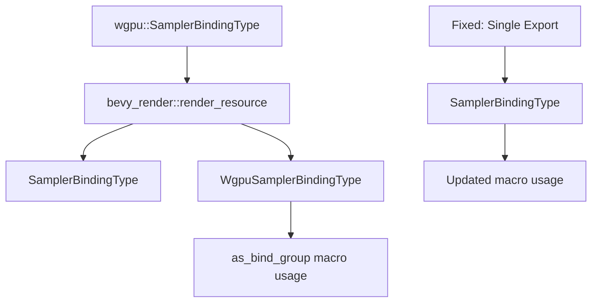

+++
title = "#21618 dont re-export SamplerBindingType twice for no reason"
date = "2025-10-21T00:00:00"
draft = false
template = "pull_request_page.html"
in_search_index = true

[taxonomies]
list_display = ["show"]

[extra]
current_language = "en"
available_languages = {"en" = { name = "English", url = "/pull_request/bevy/2025-10/pr-21618-en-20251021" }, "zh-cn" = { name = "中文", url = "/pull_request/bevy/2025-10/pr-21618-zh-cn-20251021" }}
labels = ["D-Trivial", "A-Rendering", "C-Code-Quality"]
+++

# Title
dont re-export SamplerBindingType twice for no reason

## Basic Information
- **Title**: dont re-export SamplerBindingType twice for no reason
- **PR Link**: https://github.com/bevyengine/bevy/pull/21618
- **Author**: atlv24
- **Status**: MERGED
- **Labels**: D-Trivial, A-Rendering, C-Code-Quality, S-Ready-For-Final-Review
- **Created**: 2025-10-21T02:02:37Z
- **Merged**: 2025-10-21T08:37:13Z
- **Merged By**: mockersf

## Description Translation
# Objective

- dont re-export SamplerBindingType twice for no reason

## Solution

- dont re-export SamplerBindingType twice for no reason

## Testing

- ci

## The Story of This Pull Request

This PR addresses a straightforward code quality issue in the Bevy renderer module - the unnecessary duplication of type exports. The problem was discovered during routine code maintenance when the author noticed that `SamplerBindingType` was being re-exported under two different names in the same module.

In the `bevy_render/src/render_resource/mod.rs` file, the code was importing `SamplerBindingType` from the `wgpu` crate and then re-exporting it twice: once as `SamplerBindingType` and once as `WgpuSamplerBindingType`. This created an alias that served no practical purpose but added cognitive overhead for developers working with the codebase.

The duplication had a ripple effect throughout the codebase. In the `bevy_render/macros/src/as_bind_group.rs` file, the procedural macro was using the aliased version `WgpuSamplerBindingType::Filtering` instead of the standard `SamplerBindingType::Filtering`. This meant that if someone tried to remove the duplicate export, it would break the macro code.

The solution involved two coordinated changes. First, the duplicate export was removed from the module's re-export list. Second, the macro code was updated to reference the standard `SamplerBindingType` instead of the alias. This approach maintained API consistency while eliminating unnecessary complexity.

From an engineering perspective, this change demonstrates good code hygiene practices. Removing duplicate exports reduces the surface area of the public API, making it easier for developers to understand what types are available and how to use them. It also prevents potential confusion where developers might wonder about the difference between `SamplerBindingType` and `WgpuSamplerBindingType` when in reality they refer to the exact same type.

The change is minimal and focused, affecting only two files with simple modifications. This makes it low-risk while providing clear benefits for code maintainability. The fact that it passed CI testing without issues confirms that the changes don't break existing functionality while successfully eliminating the redundancy.

## Visual Representation



## Key Files Changed

### `crates/bevy_render/src/render_resource/mod.rs`
This file contained the duplicate export that was removed. The change eliminates the unnecessary alias while maintaining the same functionality.

```rust
// Before:
pub use wgpu::{
    SamplerBindingType,
    SamplerBindingType as WgpuSamplerBindingType,
    // ... other imports
};

// After:
pub use wgpu::{
    SamplerBindingType,
    // ... other imports (without the duplicate)
};
```

### `crates/bevy_render/macros/src/as_bind_group.rs`
This file was updated to use the standard `SamplerBindingType` instead of the aliased version, ensuring consistency across the codebase.

```rust
// Before:
#render_path::render_resource::WgpuSamplerBindingType::Filtering,

// After:
#render_path::render_resource::SamplerBindingType::Filtering,
```

## Further Reading

- [Rust Module System and Re-exports](https://doc.rust-lang.org/book/ch07-02-defining-modules-to-control-scope-and-privacy.html)
- [Bevy Rendering Documentation](https://bevyengine.org/learn/quick-start/getting-started/systems/)
- [wgpu SamplerBindingType Documentation](https://docs.rs/wgpu/latest/wgpu/enum.SamplerBindingType.html)

# Full Code Diff
```diff
diff --git a/crates/bevy_render/macros/src/as_bind_group.rs b/crates/bevy_render/macros/src/as_bind_group.rs
index ee11aae4f9b59..4b89e6bc87076 100644
--- a/crates/bevy_render/macros/src/as_bind_group.rs
+++ b/crates/bevy_render/macros/src/as_bind_group.rs
@@ -716,7 +716,7 @@ pub fn derive_as_bind_group(ast: syn::DeriveInput) -> Result<TokenStream> {
                             #binding_index,
                             #render_path::render_resource::OwnedBindingResource::Sampler(
                                 // TODO: Support other types.
-                                #render_path::render_resource::WgpuSamplerBindingType::Filtering,
+                                #render_path::render_resource::SamplerBindingType::Filtering,
                                 {
                                 let handle: Option<&#asset_path::Handle<#image_path::Image>> = (&self.#field_name).into();
                                 if let Some(handle) = handle {
diff --git a/crates/bevy_render/src/render_resource/mod.rs b/crates/bevy_render/src/render_resource/mod.rs
index 2d8ddabf2dbf6..0d431b5ac4ed8 100644
--- a/crates/bevy_render/src/render_resource/mod.rs
+++ b/crates/bevy_render/src/render_resource/mod.rs
@@ -54,13 +54,12 @@ pub use wgpu::{
     PollType, PolygonMode, PrimitiveState, PrimitiveTopology, PushConstantRange,
     RenderPassColorAttachment, RenderPassDepthStencilAttachment, RenderPassDescriptor,
     RenderPipelineDescriptor as RawRenderPipelineDescriptor, Sampler as WgpuSampler,
-    SamplerBindingType, SamplerBindingType as WgpuSamplerBindingType, SamplerDescriptor,
-    ShaderModule, ShaderModuleDescriptor, ShaderSource, ShaderStages, StencilFaceState,
-    StencilOperation, StencilState, StorageTextureAccess, StoreOp, TexelCopyBufferInfo,
-    TexelCopyBufferLayout, TexelCopyTextureInfo, TextureAspect, TextureDescriptor,
-    TextureDimension, TextureFormat, TextureFormatFeatureFlags, TextureFormatFeatures,
-    TextureSampleType, TextureUsages, TextureView as WgpuTextureView, TextureViewDescriptor,
-    TextureViewDimension, Tlas, TlasInstance, VertexAttribute,
+    SamplerBindingType, SamplerDescriptor, ShaderModule, ShaderModuleDescriptor, ShaderSource,
+    ShaderStages, StencilFaceState, StencilOperation, StencilState, StorageTextureAccess, StoreOp,
+    TexelCopyBufferInfo, TexelCopyBufferLayout, TexelCopyTextureInfo, TextureAspect,
+    TextureDescriptor, TextureDimension, TextureFormat, TextureFormatFeatureFlags,
+    TextureFormatFeatures, TextureSampleType, TextureUsages, TextureView as WgpuTextureView,
+    TextureViewDescriptor, TextureViewDimension, Tlas, TlasInstance, VertexAttribute,
     VertexBufferLayout as RawVertexBufferLayout, VertexFormat, VertexState as RawVertexState,
     VertexStepMode, COPY_BUFFER_ALIGNMENT,
 };
```