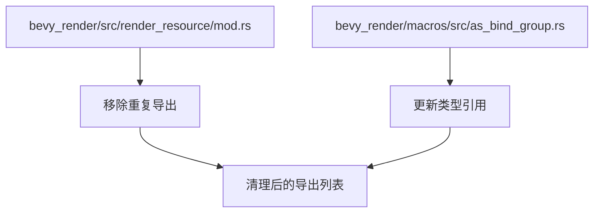

+++
title = "#21618 dont re-export SamplerBindingType twice for no reason"
date = "2025-10-21T00:00:00"
draft = false
template = "pull_request_page.html"
in_search_index = false

[extra]
current_language = "zh-cn"
available_languages = {"en" = { name = "English", url = "/pull_request/bevy/2025-10/pr-21618-en-20251021" }, "zh-cn" = { name = "中文", url = "/pull_request/bevy/2025-10/pr-21618-zh-cn-20251021" }}
labels = ["D-Trivial", "A-Rendering", "C-Code-Quality"]
+++

# dont re-export SamplerBindingType twice for no reason

## Basic Information
- **Title**: dont re-export SamplerBindingType twice for no reason
- **PR Link**: https://github.com/bevyengine/bevy/pull/21618
- **Author**: atlv24
- **Status**: MERGED
- **Labels**: D-Trivial, A-Rendering, C-Code-Quality, S-Ready-For-Final-Review
- **Created**: 2025-10-21T02:02:37Z
- **Merged**: 2025-10-21T08:37:13Z
- **Merged By**: mockersf

## Description Translation
**目标**

- 没有理由地重复导出 SamplerBindingType

**解决方案**

- 没有理由地重复导出 SamplerBindingType

**测试**

- ci

## The Story of This Pull Request

这个PR解决了一个简单的代码质量问题：在Bevy渲染系统中重复导出了`SamplerBindingType`类型。问题出现在`bevy_render` crate的导出声明中，同一个类型被导出了两次，一次是直接导出，另一次是通过别名`WgpuSamplerBindingType`导出。

在原始代码中，`crates/bevy_render/src/render_resource/mod.rs`文件中有这样一行导出语句：

```rust
// 修改前：
SamplerBindingType, SamplerBindingType as WgpuSamplerBindingType, SamplerDescriptor,
```

这里可以看到，`SamplerBindingType`被导出了两次：一次是原名，一次是作为`WgpuSamplerBindingType`别名。这种重复导出没有任何技术上的必要性，只会增加代码的冗余和潜在的混淆。

这个问题的根源在于代码演进过程中可能的历史遗留问题。当开发者添加新的功能或重构代码时，有时会保留旧的导出方式以确保向后兼容，但忘记在适当的时候清理掉冗余的导出。

修复方案很直接：移除重复的导出别名。在修改后的代码中：

```rust
// 修改后：
SamplerBindingType, SamplerDescriptor,
```

同时，由于移除了`WgpuSamplerBindingType`别名，还需要更新代码中唯一使用这个别名的地方。在`crates/bevy_render/macros/src/as_bind_group.rs`文件中，有一处使用了`WgpuSamplerBindingType::Filtering`，需要改为直接使用`SamplerBindingType::Filtering`：

```rust
// 修改前：
#render_path::render_resource::WgpuSamplerBindingType::Filtering,

// 修改后：
#render_path::render_resource::SamplerBindingType::Filtering,
```

这个修改虽然简单，但体现了良好的代码维护实践。在大型项目如Bevy中，保持导出的简洁性和一致性很重要，因为：

1. **减少认知负担**：开发者不需要记住多个别名指向同一个类型
2. **提高代码可读性**：统一的命名约定让代码更易于理解
3. **避免潜在的冲突**：减少因别名导致的命名空间污染

从技术角度看，`SamplerBindingType`是WebGPU API中的一个重要类型，用于定义采样器在着色器中的绑定方式。在渲染管线中，采样器用于控制纹理的采样行为（如过滤模式、寻址模式等）。保持这个类型导出的简洁性有助于维护渲染系统的清晰架构。

这个PR被标记为"D-Trivial"（琐碎修改）和"C-Code-Quality"（代码质量），准确反映了其性质。虽然修改规模很小，但对维护代码库的健康状态有积极意义。

## Visual Representation



## Key Files Changed

### 1. `crates/bevy_render/src/render_resource/mod.rs` (+6/-7)

这个文件是渲染资源模块的主要导出文件，负责重新导出WebGPU相关的类型。

**关键修改：**
```rust
// 修改前：
pub use wgpu::{
    // ... 其他导出 ...
    SamplerBindingType, SamplerBindingType as WgpuSamplerBindingType, SamplerDescriptor,
    // ... 其他导出 ...
};

// 修改后：
pub use wgpu::{
    // ... 其他导出 ...
    SamplerBindingType, SamplerDescriptor,
    // ... 其他导出 ...
};
```

**修改说明：**
- 移除了`SamplerBindingType as WgpuSamplerBindingType`的重复导出
- 保持其他所有导出不变
- 减少了7行代码，增加了6行（可能是由于格式调整）

### 2. `crates/bevy_render/macros/src/as_bind_group.rs` (+1/-1)

这个文件包含了派生宏的实现，用于自动生成绑定组相关的代码。

**关键修改：**
```rust
// 修改前：
#render_path::render_resource::WgpuSamplerBindingType::Filtering,

// 修改后：
#render_path::render_resource::SamplerBindingType::Filtering,
```

**修改说明：**
- 将`WgpuSamplerBindingType::Filtering`改为`SamplerBindingType::Filtering`
- 这是对上面导出修改的配套更新
- 使用了相同的枚举值`Filtering`，只是类型名称发生了变化

## Further Reading

- [Rust模块系统和use声明](https://doc.rust-lang.org/book/ch07-02-defining-modules-to-control-scope-and-privacy.html)
- [WebGPU SamplerBindingType文档](https://gpuweb.github.io/gpuweb/#enumdef-gpusamplerbindingtype)
- [Bevy渲染系统架构](https://bevy-cheatbook.github.io/programming/rendering.html)

# Full Code Diff
```diff
diff --git a/crates/bevy_render/macros/src/as_bind_group.rs b/crates/bevy_render/macros/src/as_bind_group.rs
index ee11aae4f9b59..4b89e6bc87076 100644
--- a/crates/bevy_render/macros/src/as_bind_group.rs
+++ b/crates/bevy_render/macros/src/as_bind_group.rs
@@ -716,7 +716,7 @@ pub fn derive_as_bind_group(ast: syn::DeriveInput) -> Result<TokenStream> {
                             #binding_index,
                             #render_path::render_resource::OwnedBindingResource::Sampler(
                                 // TODO: Support other types.
-                                #render_path::render_resource::WgpuSamplerBindingType::Filtering,
+                                #render_path::render_resource::SamplerBindingType::Filtering,
                                 {
                                 let handle: Option<&#asset_path::Handle<#image_path::Image>> = (&self.#field_name).into();
                                 if let Some(handle) = handle {
diff --git a/crates/bevy_render/src/render_resource/mod.rs b/crates/bevy_render/src/render_resource/mod.rs
index 2d8ddabf2dbf6..0d431b5ac4ed8 100644
--- a/crates/bevy_render/src/render_resource/mod.rs
+++ b/crates/bevy_render/src/render_resource/mod.rs
@@ -54,13 +54,12 @@ pub use wgpu::{
     PollType, PolygonMode, PrimitiveState, PrimitiveTopology, PushConstantRange,
     RenderPassColorAttachment, RenderPassDepthStencilAttachment, RenderPassDescriptor,
     RenderPipelineDescriptor as RawRenderPipelineDescriptor, Sampler as WgpuSampler,
-    SamplerBindingType, SamplerBindingType as WgpuSamplerBindingType, SamplerDescriptor,
-    ShaderModule, ShaderModuleDescriptor, ShaderSource, ShaderStages, StencilFaceState,
-    StencilOperation, StencilState, StorageTextureAccess, StoreOp, TexelCopyBufferInfo,
-    TexelCopyBufferLayout, TexelCopyTextureInfo, TextureAspect, TextureDescriptor,
-    TextureDimension, TextureFormat, TextureFormatFeatureFlags, TextureFormatFeatures,
-    TextureSampleType, TextureUsages, TextureView as WgpuTextureView, TextureViewDescriptor,
-    TextureViewDimension, Tlas, TlasInstance, VertexAttribute,
+    SamplerBindingType, SamplerDescriptor, ShaderModule, ShaderModuleDescriptor, ShaderSource,
+    ShaderStages, StencilFaceState, StencilOperation, StencilState, StorageTextureAccess, StoreOp,
+    TexelCopyBufferInfo, TexelCopyBufferLayout, TexelCopyTextureInfo, TextureAspect,
+    TextureDescriptor, TextureDimension, TextureFormat, TextureFormatFeatureFlags,
+    TextureFormatFeatures, TextureSampleType, TextureUsages, TextureView as WgpuTextureView,
+    TextureViewDescriptor, TextureViewDimension, Tlas, TlasInstance, VertexAttribute,
     VertexBufferLayout as RawVertexBufferLayout, VertexFormat, VertexState as RawVertexState,
     VertexStepMode, COPY_BUFFER_ALIGNMENT,
 };
```