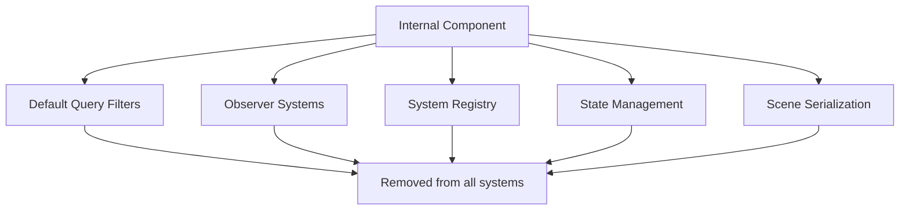

+++
title = "#21623 Remove `Internal` component"
date = "2025-10-22T00:00:00"
draft = false
template = "pull_request_page.html"
in_search_index = true

[taxonomies]
list_display = ["show"]

[extra]
current_language = "en"
available_languages = {"en" = { name = "English", url = "/pull_request/bevy/2025-10/pr-21623-en-20251022" }, "zh-cn" = { name = "中文", url = "/pull_request/bevy/2025-10/pr-21623-zh-cn-20251022" }}
labels = ["A-ECS", "C-Usability", "M-Migration-Guide", "X-Blessed"]
+++

# Remove `Internal` component

## Basic Information
- **Title**: Remove `Internal` component
- **PR Link**: https://github.com/bevyengine/bevy/pull/21623
- **Author**: alice-i-cecile
- **Status**: MERGED
- **Labels**: A-ECS, C-Usability, S-Ready-For-Final-Review, M-Migration-Guide, X-Blessed
- **Created**: 2025-10-21T18:24:18Z
- **Merged**: 2025-10-22T18:30:08Z
- **Merged By**: alice-i-cecile

## Description Translation
# Objective

Despite initially advocating for its inclusion in #20204, I've been increasingly unconvinced by the edge cases and user-facing complexity and surprise that `Internal` brings.

Accidental queries are quite hard to write, and the entitiy-inspector concerns are really a UX problem for each tool to solve that `Internal` doesn't help with.

@cart feels similarly: as a result I'm marking this PR as X-Blessed.

Closes #21363.

## Solution

- Remove `Internal` as a type.
- Follow the compiler errors to remove all references.
- Write a migration guide.

## The Story of This Pull Request

This PR represents a pragmatic reversal of a previous design decision. The `Internal` component was originally introduced in PR #20204 as a way to mark entities that were internal to the Bevy engine, hiding them from user queries by default. The intent was to prevent users from accidentally modifying engine internals and to provide a unified way for entity inspectors to distinguish between user-facing and internal entities.

However, in practice, the `Internal` component introduced more problems than it solved. The author notes that "accidental queries are quite hard to write," suggesting that the protection it provided was minimal. More importantly, it added user-facing complexity and surprising behavior that didn't align well with how developers actually work with the ECS system.

The core issue was that entity categorization and visibility concerns are fundamentally UX problems that should be handled by individual tools rather than being baked into the core ECS framework. Tools like entity inspectors can implement their own filtering logic based on component patterns or other heuristics, without requiring a special marker component.

The implementation approach was straightforward: completely remove the `Internal` component type and follow the compiler errors to update all references throughout the codebase. This included removing it from default query filters, observer systems, and state management systems.

One key insight from this change is that simplicity often trumps protection mechanisms in API design. While the original intent of protecting users from themselves was well-meaning, the practical reality was that it created friction without providing meaningful safety benefits. The ECS query system is already explicit enough that accidental modification of internal entities is unlikely, and when it does occur, the consequences are typically immediately apparent.

The removal also simplifies several systems that previously needed to account for `Internal` entities in their queries. For example, state transition systems and scene serialization no longer need special handling to include or exclude internal entities.

## Visual Representation



## Key Files Changed

### `crates/bevy_ecs/src/entity_disabling.rs` (+1/-44)

This file saw the most significant changes, removing the `Internal` component definition and its registration from the default query filters.

**Before:**
```rust
/// A marker component for internal entities.
#[derive(Component, Clone, Debug, Default)]
#[cfg_attr(
    feature = "bevy_reflect",
    derive(Reflect),
    reflect(Component),
    reflect(Debug, Clone, Default)
)]
// This component is registered as a disabling component during World::bootstrap
pub struct Internal;

impl FromWorld for DefaultQueryFilters {
    fn from_world(world: &mut World) -> Self {
        let mut filters = DefaultQueryFilters::empty();
        let disabled_component_id = world.register_component::<Disabled>();
        filters.register_disabling_component(disabled_component_id);
        let internal_component_id = world.register_component::<Internal>();
        filters.register_disabling_component(internal_component_id);
        filters
    }
}
```

**After:**
```rust
impl FromWorld for DefaultQueryFilters {
    fn from_world(world: &mut World) -> Self {
        let mut filters = DefaultQueryFilters::empty();
        let disabled_component_id = world.register_component::<Disabled>();
        filters.register_disabling_component(disabled_component_id);
        filters
    }
}
```

### `crates/bevy_ecs/src/observer/distributed_storage.rs` (+1/-11)

Removed the requirement for `Internal` component in observer entities.

**Before:**
```rust
fn register_required_components(
    _component_id: ComponentId,
    required_components: &mut RequiredComponentsRegistrator,
) {
    required_components.register_required(Internal::default);
}
```

**After:**
*(Function completely removed)*

### `crates/bevy_ecs/src/system/system_registry.rs` (+1/-8)

Updated the `RegisteredSystem` component to no longer require the `Internal` component.

**Before:**
```rust
#[derive(Component)]
#[require(SystemIdMarker = SystemIdMarker::typed_system_id_marker::<I, O>(), Internal)]
pub(crate) struct RegisteredSystem<I, O> {
```

**After:**
```rust
#[derive(Component)]
#[require(SystemIdMarker = SystemIdMarker::typed_system_id_marker::<I, O>())]
pub(crate) struct RegisteredSystem<I, O> {
```

### `crates/bevy_state/src/state_scoped.rs` (+2/-4)

Simplified state transition queries by removing the `Allow<Internal>` filter.

**Before:**
```rust
query: Query<(Entity, &DespawnOnExit<S>), (Allow<Disabled>, Allow<Internal>)>,
```

**After:**
```rust
query: Query<(Entity, &DespawnOnExit<S>), Allow<Disabled>>,
```

### `release-content/migration-guides/internal_disabling_component_removed.md` (+20/-0)

Added comprehensive migration guide explaining the removal and providing guidance for updating code.

## Further Reading

- [Original PR #20204 that introduced the Internal component](https://github.com/bevyengine/bevy/pull/20204)
- [Issue #21363 that this PR closes](https://github.com/bevyengine/bevy/issues/21363)
- [Bevy ECS documentation on query filters](https://docs.rs/bevy_ecs/latest/bevy_ecs/query/struct.Query.html)
- [Bevy's component system documentation](https://bevyengine.org/learn/book/ecs/components/)