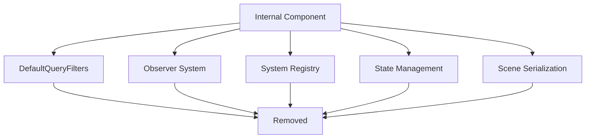

+++
title = "#21623 Remove `Internal` component"
date = "2025-10-22T00:00:00"
draft = false
template = "pull_request_page.html"
in_search_index = false

[extra]
current_language = "zh-cn"
available_languages = {"en" = { name = "English", url = "/pull_request/bevy/2025-10/pr-21623-en-20251022" }, "zh-cn" = { name = "中文", url = "/pull_request/bevy/2025-10/pr-21623-zh-cn-20251022" }}
labels = ["A-ECS", "C-Usability", "M-Migration-Guide", "X-Blessed"]
+++

# Remove `Internal` component

## Basic Information
- **Title**: Remove `Internal` component
- **PR Link**: https://github.com/bevyengine/bevy/pull/21623
- **Author**: alice-i-cecile
- **Status**: MERGED
- **Labels**: A-ECS, C-Usability, S-Ready-For-Final-Review, M-Migration-Guide, X-Blessed
- **Created**: 2025-10-21T18:24:18Z
- **Merged**: 2025-10-22T18:30:08Z
- **Merged By**: alice-i-cecile

## Description Translation
# 目标

尽管最初在 #20204 中主张包含它，但我越来越不相信 `Internal` 带来的边界情况和面向用户的复杂性和意外性。

意外的查询很难编写，实体检查器的问题实际上是每个工具需要解决的 UX 问题，而 `Internal` 对此没有帮助。

@cart 有类似的感觉：因此我将此 PR 标记为 X-Blessed。

关闭 #21363。

## 解决方案

- 移除 `Internal` 类型。
- 按照编译器错误移除所有引用。
- 编写迁移指南。

## The Story of This Pull Request

这个 PR 源于对 `Internal` 组件的重新评估。作者最初在 PR #20204 中主张引入这个组件，但经过实际使用后发现它带来的问题比解决的问题更多。

**问题的根源**在于 `Internal` 组件试图通过技术手段解决 UX 问题。该组件被设计为标记引擎内部实体，使它们默认在查询中隐藏，避免用户意外修改或依赖这些实现细节。然而在实践中，这种设计产生了几个问题：

1. 意外的查询实际上很难编写，因为用户通常不会意外地查询到内部实体
2. 实体检查器的显示问题应该由各个工具自行解决，而不是通过统一的组件标记
3. 增加了代码复杂性和用户困惑，却没有显著提高系统的健壮性

**解决方案的实施**采用了直接彻底的方式：完全移除 `Internal` 组件及其所有引用。这个改变影响到了多个系统模块：

在 ECS 核心中，移除了 `Internal` 组件的定义和注册逻辑。之前 `DefaultQueryFilters` 在初始化时会自动注册 `Disabled` 和 `Internal` 两个组件：

```rust
// Before in entity_disabling.rs:
let disabled_component_id = world.register_component::<Disabled>();
filters.register_disabling_component(disabled_component_id);
let internal_component_id = world.register_component::<Internal>();
filters.register_disabling_component(internal_component_id);

// After:
let disabled_component_id = world.register_component::<Disabled>();
filters.register_disabling_component(disabled_component_id);
```

**观察者系统**也需要相应调整。之前 `Observer` 组件在注册时会要求 `Internal` 组件：

```rust
// Removed from distributed_storage.rs:
fn register_required_components(
    _component_id: ComponentId,
    required_components: &mut RequiredComponentsRegistrator,
) {
    required_components.register_required(Internal::default);
}
```

**系统注册**相关的组件定义也进行了简化。`RegisteredSystem` 组件不再需要 `Internal` 标记：

```rust
// Before in system_registry.rs:
#[require(SystemIdMarker = SystemIdMarker::typed_system_id_marker::<I, O>(), Internal)]

// After:
#[require(SystemIdMarker = SystemIdMarker::typed_system_id_marker::<I, O>())]
```

**状态管理**系统中的查询也得到了简化。之前需要同时允许 `Disabled` 和 `Internal` 组件：

```rust
// Before in state_scoped.rs:
query: Query<(Entity, &DespawnOnExit<S>), (Allow<Disabled>, Allow<Internal>)>

// After:
query: Query<(Entity, &DespawnOnExit<S>), Allow<Disabled>>
```

**测试代码**也需要更新以反映这些变化。之前专门测试内部实体行为的测试被移除，因为现在内部实体不再被特殊对待：

```rust
// Removed test from entity_disabling.rs:
#[test]
fn internal_entities() {
    // ... 测试内部实体行为的代码
}
```

**场景序列化**相关的代码也进行了调整，不再需要特别过滤内部实体：

```rust
// Before in bevy_scene/src/lib.rs:
let entities: Vec<Entity> = scene
    .world
    .query_filtered::<Entity, Allow<Internal>>()
    .iter(&scene.world)
    .collect();

// After:
let entities: Vec<Entity> = scene.world.query::<Entity>().iter(&scene.world).collect();
```

这个改变体现了重要的工程原则：**当抽象带来的复杂性超过其价值时，应该考虑移除它**。`Internal` 组件试图解决的是工具层面的 UX 问题，但却在核心 ECS 系统中增加了复杂性和使用门槛。

**技术洞察**：这个 PR 展示了 API 设计的权衡。虽然隐藏实现细节是良好的软件工程实践，但过度工程化可能会带来不必要的复杂性。更好的做法是让各个工具根据自身需求实现实体分类逻辑，而不是在核心系统中强制实施统一的分类机制。

**影响**：这个改变简化了 Bevy ECS 的使用，减少了用户需要理解的概念数量。现在开发者可以更直接地与实体系统交互，而不需要担心内部实体的特殊处理规则。

## Visual Representation



## Key Files Changed

### `crates/bevy_ecs/src/entity_disabling.rs` (+1/-44)
**变更描述**：移除了 `Internal` 组件的核心定义和相关逻辑
```rust
// 移除的代码：
/// A marker component for internal entities.
#[derive(Component, Clone, Debug, Default)]
#[cfg_attr(
    feature = "bevy_reflect",
    derive(Reflect),
    reflect(Component),
    reflect(Debug, Clone, Default)
)]
pub struct Internal;

// 在 DefaultQueryFilters 初始化中移除了 Internal 注册
let internal_component_id = world.register_component::<Internal>();
filters.register_disabling_component(internal_component_id);
```

### `release-content/migration-guides/internal_disabling_component_removed.md` (+20/-0)
**变更描述**：新增迁移指南，解释移除原因和迁移步骤
```markdown
---
title: "`Internal` has been removed"
pull_requests: [ 21623 ]
---

The `Internal` component, previously added as a required component to both one-shot systems and observer entities has been removed.

You can remove all references to it: these entities are no longer hidden by default query filters.
```

### `crates/bevy_ecs/src/observer/distributed_storage.rs` (+1/-11)
**变更描述**：移除了 Observer 组件对 Internal 的依赖
```rust
// 移除的方法：
fn register_required_components(
    _component_id: ComponentId,
    required_components: &mut RequiredComponentsRegistrator,
) {
    required_components.register_required(Internal::default);
}
```

### `crates/bevy_ecs/src/system/system_registry.rs` (+1/-8)
**变更描述**：简化了 RegisteredSystem 组件的定义
```rust
// Before:
#[require(SystemIdMarker = SystemIdMarker::typed_system_id_marker::<I, O>(), Internal)]

// After:  
#[require(SystemIdMarker = SystemIdMarker::typed_system_id_marker::<I, O>())]
```

### `crates/bevy_state/src/state_scoped.rs` (+2/-4)
**变更描述**：简化了状态管理系统的查询条件
```rust
// Before:
query: Query<(Entity, &DespawnOnExit<S>), (Allow<Disabled>, Allow<Internal>)>

// After:
query: Query<(Entity, &DespawnOnExit<S>), Allow<Disabled>>
```

## Further Reading

- [Original PR #20204 that introduced Internal component](https://github.com/bevyengine/bevy/pull/20204)
- [Bevy ECS Architecture documentation](https://bevyengine.org/learn/advanced-topics/ecs-architecture/)
- [Entity Component System pattern](https://en.wikipedia.org/wiki/Entity_component_system)